# Changesets

This directory contains [changesets](https://github.com/changesets/changesets) for version management.

## Creating a Changeset

When you make changes that should be published, create a changeset:

```bash
pnpm changeset
```

Follow the prompts to:
1. Select which packages have changed
2. Choose the version bump type (major/minor/patch)
3. Write a summary of the changes

## Version Bump Guidelines

| Type    | When to Use                           | Example           |
|---------|---------------------------------------|-------------------|
| major   | Breaking changes                      | 1.0.0 → 2.0.0     |
| minor   | New features (backward compatible)    | 1.0.0 → 1.1.0     |
| patch   | Bug fixes (backward compatible)       | 1.0.0 → 1.0.1     |

## Workflow

```mermaid
%%{init: {
  'theme': 'base',
  'themeVariables': {
    'primaryColor': '#f8fafc',
    'primaryTextColor': '#1e293b',
    'primaryBorderColor': '#334155',
    'lineColor': '#475569',
    'c0': '#f8fafc',
    'c1': '#f1f5f9',
    'c2': '#e2e8f0',
    'c3': '#cbd5e1'
  }
}}%%
flowchart LR
    A[🔨 Make Changes] --> B[📝 Create Changeset]
    B --> C[📤 Push to Main]
    C --> D[🤖 Bot Creates PR]
    D --> E[✅ Merge PR]
    E --> F[🚀 Auto Publish]
    
    classDef devNode fill:#eff6ff,stroke:#2563eb,stroke-width:2px,color:#1f2937
    classDef automatedNode fill:#f0fdf4,stroke:#16a34a,stroke-width:2px,color:#1f2937
    
    class A,B,C devNode
    class D,E,F automatedNode
```



## Example Changeset File

```markdown
---
"@forge-js/eslint-plugin-llm-optimized": minor
"@forge-js/eslint-plugin-utils": patch
---

Add new rule: no-circular-dependencies

- Detects circular dependencies in imports
- Provides auto-fix capabilities
- Updates utils to support new rule
```

