# ESLint Rule Addition Checklist

> **Purpose:** Ensure all new ESLint rules are properly integrated, documented, and released following project standards.

**⚠️ CRITICAL:** When adding a new ESLint rule to `@forge-js/eslint-plugin-llm-optimized`, you MUST complete ALL items in this checklist. Missing any item will cause issues in the release process.

## 📋 Complete Checklist

### 1. Rule Implementation ✅

- [ ] **Rule file created** in `packages/eslint-plugin/src/rules/{category}/{rule-name}.ts`
- [ ] **TypeScript types correct:**
  - [ ] `Options` interface defined (NOT `RuleOptions` - that's the tuple type)
  - [ ] `type RuleOptions = [Options?]` (array tuple format - REQUIRED)
  - [ ] `type MessageIds = 'messageId1' | 'messageId2'`
  - [ ] `create(context: TSESLint.RuleContext<MessageIds, RuleOptions>, [options = {}])` signature
- [ ] **LLM-optimized error messages (2-line format):**
  - [ ] ✅ **Use `formatLLMMessage` utility** from `@forge-js/eslint-plugin-utils` (REQUIRED)
  - [ ] Import: `import { formatLLMMessage, MessageIcons } from '@forge-js/eslint-plugin-utils'`
  - [ ] Format follows: `formatLLMMessage({ icon, issueName, cwe?, description, severity, fix, documentationLink })`
  - [ ] ❌ NOT the old 4-line format
  - [ ] Includes actionable fix instructions
  - [ ] Includes documentation link
  - [ ] Uses appropriate severity (CRITICAL, HIGH, MEDIUM, LOW)
  - [ ] Includes CWE reference if security-related
  - [ ] Uses `MessageIcons` constants for consistency
- [ ] **Rule exported** from `packages/eslint-plugin/src/index.ts`:
  - [ ] Import statement added at top
  - [ ] Added to `rules` object with flat name: `'rule-name': ruleName`
  - [ ] Added to `rules` object with categorized name: `'category/rule-name': ruleName`

### 2. Testing ✅

- [ ] **Unit tests created** in `packages/eslint-plugin/src/rules/{category}/__tests__/{rule-name}.test.ts`
- [ ] **Test coverage includes:**
  - [ ] Valid cases (should pass)
  - [ ] Invalid cases (should fail)
  - [ ] Auto-fix cases (if rule is fixable)
  - [ ] Edge cases
  - [ ] Configuration options (if rule has options)
- [ ] **Tests pass:** `pnpm nx test eslint-plugin`
- [ ] **Build succeeds:** `pnpm nx build eslint-plugin`
- [ ] **No lint errors:** `pnpm nx lint eslint-plugin`

### 3. Documentation ✅

- [ ] **AEO-optimized docs page created** at `packages/eslint-plugin/docs/rules/{rule-name}.md`
  - [ ] Includes keywords for SEO (top of file)
  - [ ] Quick Summary table (Aspect | Details)
  - [ ] Mermaid flowchart showing rule logic (with modern accessible theme)
  - [ ] Configuration options table
  - [ ] Examples section (❌ Incorrect / ✅ Correct)
  - [ ] Usage examples with code blocks
  - [ ] Best practices section
  - [ ] Related rules section
  - [ ] Resources/links section
  - [ ] Version history (if applicable)
- [ ] **README updated** (`packages/eslint-plugin/README.md`):
  - [ ] Rule added to appropriate category table
  - [ ] Correct icons (💼 ⚠️ 🔧 💡) based on rule configuration
  - [ ] Link to docs page: `[rule-name](./docs/rules/{rule-name}.md)`
  - [ ] Description matches rule purpose
- [ ] **CHANGELOG updated** (`packages/eslint-plugin/CHANGELOG.md`):
  - [ ] Entry under `## [Unreleased]` → `### Added`
  - [ ] Brief description of rule purpose
  - [ ] Key features/options mentioned
  - [ ] Format: `- **New Rule: `rule-name`** - [description]`

### 4. Configuration ✅

- [ ] **Rule added to recommended config** (if applicable):
  - [ ] Check `packages/eslint-plugin/src/configs/recommended.ts`
  - [ ] Add rule with appropriate severity
  - [ ] Add any necessary configuration options
- [ ] **Root ESLint config updated** (if rule should be enabled globally):
  - [ ] Check `eslint.config.mjs`
  - [ ] Add rule configuration if needed
  - [ ] Ensure plugin is imported correctly
- [ ] **Plugin exports verified:**
  - [ ] Rule accessible via `@forge-js/eslint-plugin-llm-optimized`
  - [ ] Both flat name and categorized name work
  - [ ] Test with: `import llmOptimized from '@forge-js/eslint-plugin-llm-optimized'`

### 5. Version & Release ✅

- [ ] **Version bump:**
  - [ ] Determine version bump type (patch/minor/major)
  - [ ] Update `packages/eslint-plugin/package.json` version
  - [ ] Update any dependent packages if needed
  - [ ] Run `pnpm install` to update lockfile
- [ ] **Git tags alignment:**
  - [ ] Run `pnpm check-versions` to verify alignment
  - [ ] Run `pnpm sync-tags:dry-run` to preview tag changes
  - [ ] Run `pnpm sync-tags` if tags need updating (after version bump)
- [ ] **Release preparation:**
  - [ ] Run `pnpm nx release version --dry-run` to verify release
  - [ ] Ensure CHANGELOG is complete
  - [ ] Ensure all tests pass
  - [ ] Ensure build succeeds
  - [ ] Ensure no lint errors

### 6. Integration Testing ✅

- [ ] **Playground testing:**
  - [ ] Test rule in `apps/playground`
  - [ ] Verify error messages display correctly
  - [ ] Verify auto-fix works (if applicable)
  - [ ] Verify rule configuration options work
- [ ] **Lint verification:**
  - [ ] Run `pnpm nx lint` to ensure no new lint errors
  - [ ] Fix any lint errors introduced
- [ ] **Type checking:**
  - [ ] Run `pnpm nx typecheck` (if available)
  - [ ] Fix any type errors

### 7. Final Verification ✅

- [ ] **All checklist items completed**
- [ ] **Code review ready:**
  - [ ] Rule follows project patterns
  - [ ] Error messages are LLM-optimized (2-line format)
  - [ ] Documentation is AEO-optimized
  - [ ] Tests provide good coverage
  - [ ] No console.log or debug code left
- [ ] **Ready for PR:**
  - [ ] All files committed
  - [ ] Commit message follows conventional commits
  - [ ] PR description includes rule summary
  - [ ] PR description mentions breaking changes (if any)

## 🎯 Quick Reference

### File Locations

| Item                | Location                                                                    |
| ------------------- | --------------------------------------------------------------------------- |
| Rule implementation | `packages/eslint-plugin/src/rules/{category}/{rule-name}.ts`                |
| Rule tests          | `packages/eslint-plugin/src/rules/{category}/__tests__/{rule-name}.test.ts` |
| Rule exports        | `packages/eslint-plugin/src/index.ts`                                       |
| Rule documentation  | `packages/eslint-plugin/docs/rules/{rule-name}.md`                          |
| README              | `packages/eslint-plugin/README.md`                                          |
| CHANGELOG           | `packages/eslint-plugin/CHANGELOG.md`                                       |
| Recommended config  | `packages/eslint-plugin/src/configs/recommended.ts`                         |
| Root ESLint config  | `eslint.config.mjs`                                                         |

### Common Commands

```bash
# Build plugin
pnpm nx build eslint-plugin

# Run tests
pnpm nx test eslint-plugin

# Lint
pnpm nx lint eslint-plugin

# Check versions
pnpm check-versions

# Sync git tags (dry-run)
pnpm sync-tags:dry-run

# Sync git tags
pnpm sync-tags

# Release dry-run
pnpm nx release version --dry-run
```

### Error Message Format (LLM-Optimized)

**✅ REQUIRED:** Use the `formatLLMMessage` utility from `@forge-js/eslint-plugin-utils` for consistency.

```typescript
import { formatLLMMessage, MessageIcons } from '@forge-js/eslint-plugin-utils';

messages: {
  ruleName: formatLLMMessage({
    icon: MessageIcons.SECURITY, // or '🔒', '⚠️', etc.
    issueName: 'SQL Injection',
    cwe: 'CWE-89', // Optional, include for security rules
    description: 'SQL Injection detected',
    severity: 'CRITICAL', // or 'HIGH', 'MEDIUM', 'LOW'
    fix: 'Use parameterized query: db.query("SELECT * FROM users WHERE id = ?", [userId])',
    documentationLink: 'https://owasp.org/www-community/attacks/SQL_Injection'
  }),
}
```

**For dynamic/template variables:**

```typescript
messages: {
  ruleName: formatLLMMessage({
    icon: MessageIcons.WARNING,
    issueName: 'Object injection',
    cwe: 'CWE-915',
    description: 'Object injection/Prototype pollution',
    severity: '{{riskLevel}}', // Template variable
    fix: '{{safeAlternative}}', // Template variable
    documentationLink: 'https://portswigger.net/web-security/prototype-pollution'
  }),
}
```

**Manual format (if utility doesn't fit):**

```typescript
messages: {
  ruleName:
    '[Icon] [CWE?] | [Issue Name] | [Description] | [SEVERITY]\n' +
    '   Fix: [specific fix instruction] | [documentation link]',
}
```

**Examples:**

- Security rule: `formatLLMMessage({ icon: MessageIcons.SECURITY, issueName: 'SQL Injection', cwe: 'CWE-89', description: 'SQL Injection detected', severity: 'CRITICAL', fix: 'Use parameterized query: db.query("SELECT * FROM users WHERE id = ?", [userId])', documentationLink: 'https://owasp.org/www-community/attacks/SQL_Injection' })`
- Development rule: `formatLLMMessage({ icon: MessageIcons.PACKAGE, issueName: 'Dependency Version Strategy', description: 'Dependency "{{name}}" should use {{strategy}} version', severity: 'MEDIUM', fix: 'Change "{{current}}" to "{{expected}}" for version flexibility', documentationLink: 'https://docs.npmjs.com/cli/v10/configuring-npm/package-json#dependencies' })`

**❌ DO NOT USE** the old 4-line format:

```typescript
// ❌ OLD FORMAT - DO NOT USE
'📦 Dependency Version Strategy | MEDIUM\n' +
  '   ❌ Current: Dependency "{{name}}" uses "{{current}}" version\n' +
  '   ✅ Fix: Use {{strategy}} version strategy: "{{expected}}"\n' +
  '   📚 See: https://docs.npmjs.com/...';
```

**Available Icons:**

- `MessageIcons.SECURITY` (🔒) - Security issues
- `MessageIcons.WARNING` (⚠️) - Warnings
- `MessageIcons.PACKAGE` (📦) - Package/dependency issues
- `MessageIcons.DEVELOPMENT` (🔧) - Development practices
- `MessageIcons.PERFORMANCE` (⚡) - Performance issues
- `MessageIcons.ACCESSIBILITY` (♿) - Accessibility issues
- `MessageIcons.QUALITY` (📚) - Code quality
- `MessageIcons.ARCHITECTURE` (🏗️) - Architecture issues
- `MessageIcons.MIGRATION` (🔄) - Migration/refactoring
- `MessageIcons.DEPRECATION` (❌) - Deprecation
- `MessageIcons.DOMAIN` (📖) - Domain/DDD
- `MessageIcons.COMPLEXITY` (🧠) - Complexity
- `MessageIcons.DUPLICATION` (📋) - Duplication

### TypeScript Type Pattern

```typescript
interface Options {
  option1?: string;
  option2?: boolean;
}

type RuleOptions = [Options?];
type MessageIds = 'messageId1' | 'messageId2';

export const ruleName = createRule<RuleOptions, MessageIds>({
  name: 'rule-name',
  meta: {
    // ...
  },
  defaultOptions: [
    {
      option1: 'default',
      option2: true,
    },
  ],
  create(
    context: TSESLint.RuleContext<MessageIds, RuleOptions>,
    [options = {}],
  ) {
    const { option1 = 'default', option2 = true } = options;
    // ...
  },
});
```

### Mermaid Chart Template (AEO-Optimized)

```mermaid
%%{init: {
  'theme': 'base',
  'themeVariables': {
    'primaryColor': '#f8fafc',
    'primaryTextColor': '#1e293b',
    'primaryBorderColor': '#334155',
    'lineColor': '#475569',
    'c0': '#f8fafc',
    'c1': '#f1f5f9',
    'c2': '#e2e8f0',
    'c3': '#cbd5e1'
  }
}}%%
flowchart TD
    A[🔍 Start] --> B{Check Condition}
    B -->|✅ Yes| C[⚡ Execute Action]
    B -->|❌ No| D[🔧 Handle Error]
    C --> E[✅ Complete]
    D --> E

    classDef startNode fill:#f0fdf4,stroke:#16a34a,stroke-width:2px,color:#1f2937
    classDef errorNode fill:#fef2f2,stroke:#dc2626,stroke-width:2px,color:#1f2937
    classDef processNode fill:#eff6ff,stroke:#2563eb,stroke-width:2px,color:#1f2937

    class A startNode
    class D errorNode
    class C,E processNode
```



## 📚 Additional Resources

- [ESLint Rule Development Guide](./DOCUMENTATION_GUIDE.md)
- [LLM-Optimized Message Format](../packages/eslint-plugin/eslint-rule-llm-format)
- [AEO Documentation Guidelines](../../docs/ESLINT_LEADERSHIP_STRATEGY.md)

## ⚠️ Common Mistakes to Avoid

1. **Wrong type definition:** Using `RuleOptions` as interface instead of `Options`
2. **Wrong error message format:**
   - ❌ Using 4-line format instead of 2-line format
   - ❌ Not using `formatLLMMessage` utility (manual string concatenation)
   - ❌ Using inconsistent icon emojis instead of `MessageIcons` constants
3. **Missing exports:** Forgetting to add rule to `src/index.ts`
4. **Missing documentation:** Not creating AEO-optimized docs page
5. **Missing CHANGELOG:** Forgetting to update CHANGELOG.md
6. **Missing README update:** Not adding rule to README table
7. **Version misalignment:** Not running `check-versions` and `sync-tags`
8. **No tests:** Creating rule without unit tests
9. **Wrong import path:** Using wrong import in `src/index.ts`
10. **Not using utility:** Manually constructing error messages instead of using `formatLLMMessage`

---

**Last Updated:** 2025-01-15  
**Version:** 1.0.0  
**Status:** Active Checklist - **MUST BE FOLLOWED FOR ALL NEW RULES**
