# Publishing Guide

## 📦 Package Publishing Setup

This monorepo uses **Nx Release** for automated package publishing to npm.

### Available Packages

| Package                 | NPM Name                                | Description                            |
| ----------------------- | --------------------------------------- | -------------------------------------- |
| **eslint-plugin**       | `@forge-js/eslint-plugin-llm-optimized` | ESLint plugin with LLM-optimized rules |
| **eslint-plugin-utils** | `@forge-js/eslint-plugin-utils`         | Utilities for creating ESLint plugins  |
| **cli**                 | `@forge-js/cli`                         | CLI tool for monorepo management       |

---

## 🚀 Local Publishing

### Prerequisites

```bash
# Login to npm
npm login
```

### Publish Individual Packages

```bash
# Publish ESLint plugin
pnpm publish:plugin

# Publish ESLint utils
pnpm publish:utils

# Publish CLI
pnpm publish:cli
```

### Publish All Packages

```bash
# Build and publish everything
pnpm publish:all
```

### Using Nx Release

```bash
# Dry run to see what will happen
pnpm release:dry-run

# First release (sets initial version)
pnpm release:first

# Standard release (version + publish)
pnpm release

# Version only (skip publish)
pnpm release:version

# Publish only (after versioning locally)
pnpm release:publish
```

---

## 🤖 CI/CD Publishing

### GitHub Actions Workflows

#### 1. **CI Pipeline** (`.github/workflows/ci.yml`)

Runs on every push and PR:

- ✅ Lint all packages
- ✅ Build all packages
- ✅ Test all packages

#### 2. **Publish Pipeline** (`.github/workflows/publish.yml`)

Triggers on git tags:

- `v*.*.*` - Publish all packages
- `eslint-plugin@*` - Publish eslint-plugin only
- `eslint-plugin-utils@*` - Publish utils only
- `cli@*` - Publish CLI only

### Setup NPM Token in GitHub

1. **Generate NPM Token**

   ```bash
   npm token create --type automation
   ```

2. **Add to GitHub Secrets**

   - Go to: `Settings` → `Secrets and variables` → `Actions`
   - Create new secret: `NPM_TOKEN`
   - Paste your npm token

3. **Trigger Release**

   ```bash
   # Tag and push
   git tag v1.0.0
   git push origin v1.0.0

   # Or use Nx Release
   pnpm release --skip-publish
   git push --follow-tags
   ```

---

## 📋 Release Workflow

### Mermaid Flow

```mermaid
%%{init: {
  'theme': 'base',
  'themeVariables': {
    'primaryColor': '#f8fafc',
    'primaryTextColor': '#1e293b',
    'primaryBorderColor': '#334155',
    'lineColor': '#475569',
    'c0': '#f8fafc',
    'c1': '#f1f5f9',
    'c2': '#e2e8f0',
    'c3': '#cbd5e1'
  }
}}%%
flowchart TD
    A[🚀 Start Release] --> B{Local or CI?}

    B -->|Local| C[pnpm release:dry-run]
    C --> D[Review changes]
    D --> E[pnpm release]
    E --> F[📦 Build packages]
    F --> G[🏷️ Create git tag]
    G --> H[📤 Publish to npm]

    B -->|CI| I[Create git tag]
    I --> J[git push --tags]
    J --> K[🤖 GitHub Actions triggers]
    K --> L[📦 Build packages]
    L --> M[📤 Publish to npm]

    H --> N[✅ Published!]
    M --> N

    classDef startNode fill:#f0fdf4,stroke:#16a34a,stroke-width:2px,color:#1f2937
    classDef processNode fill:#eff6ff,stroke:#2563eb,stroke-width:2px,color:#1f2937
    classDef endNode fill:#fef3c7,stroke:#f59e0b,stroke-width:2px,color:#1f2937

    class A startNode
    class C,D,E,F,G,H,I,J,K,L,M processNode
    class N endNode
```



### Step-by-Step

#### Option 1: Automated (Recommended)

```bash
# 1. Commit your changes
git add .
git commit -m "feat: new awesome feature"

# 2. Run Nx Release (handles versioning + publishing)
pnpm release

# This will:
# - Bump version based on commits
# - Update package.json files
# - Generate/update CHANGELOG.md
# - Create git tag
# - Publish to npm
```

#### Option 2: Version Locally, Publish in CI

```bash
# 1. Version locally
pnpm release:version

# 2. Commit and push with tags
git push --follow-tags

# 3. GitHub Actions publishes automatically
```

#### Option 3: Manual Individual Package

```bash
# Build first
pnpm nx build eslint-plugin

# Publish
pnpm publish:plugin
```

---

## 🔧 Configuration

### NX Release Config (`nx.json`)

```json
{
  "release": {
    "projects": ["packages/*"],
    "version": {
      "conventionalCommits": true,
      "currentVersionResolver": "git-tag"
    },
    "changelog": {
      "git": {
        "commit": true,
        "tag": true
      },
      "workspaceChangelog": {
        "createRelease": "github"
      }
    }
  }
}
```

### Package Access

All packages are published as **public** under the `@forge-js` scope.

---

## 🛠️ Troubleshooting

| Issue              | Solution                                                             |
| ------------------ | -------------------------------------------------------------------- |
| **403 Forbidden**  | Verify npm login: `npm whoami`                                       |
| **Package exists** | Bump version or use `--tag` for prerelease                           |
| **Build fails**    | Run `pnpm nx reset` to clear cache                                   |
| **Tag exists**     | Delete tag: `git tag -d v1.0.0 && git push origin :refs/tags/v1.0.0` |

### Check Package Status

```bash
# View on npm
npm view @forge-js/eslint-plugin-llm-optimized

# List versions
npm view @forge-js/eslint-plugin-llm-optimized versions

# Test install
npm install @forge-js/eslint-plugin-llm-optimized
```

---

## 📚 Additional Commands

```bash
# Build all packages
pnpm nx run-many -t build --all

# Test publishing locally (uses verdaccio)
pnpm nx local-registry

# View dependency graph
pnpm nx graph

# Show affected packages
pnpm nx affected:graph
```

---

## 🔗 Resources

- [Nx Release Documentation](https://nx.dev/recipes/nx-release)
- [npm Publishing Guide](https://docs.npmjs.com/packages-and-modules/contributing-packages-to-the-registry)
- [Conventional Commits](https://www.conventionalcommits.org/)
