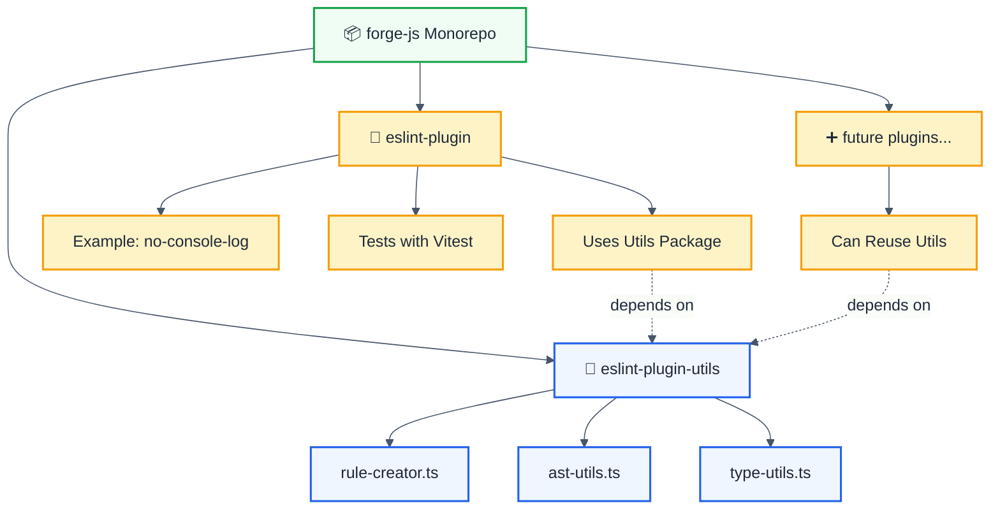
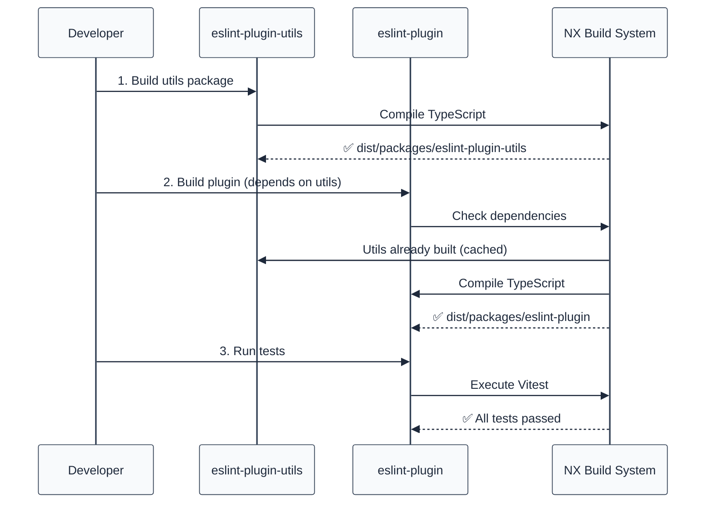

# ESLint Plugin Infrastructure - Project Summary

## Overview

This monorepo provides a solid, TypeScript-based infrastructure for creating ESLint plugins, heavily inspired by [typescript-eslint](https://github.com/typescript-eslint/typescript-eslint)'s architecture.

## Architecture



## Package Structure

| Package                                 | Purpose                            | Status            |
| --------------------------------------- | ---------------------------------- | ----------------- |
| `@forge-js/eslint-plugin-utils`         | Shared utilities for rule creation | ✅ Built & Tested |
| `@forge-js/eslint-plugin-llm-optimized` | Example ESLint plugin using utils  | ✅ Built & Tested |

## Key Features

### 1. Shared Utils Package (`@forge-js/eslint-plugin-utils`)

Provides reusable utilities for creating ESLint plugins:

| Module           | Exports                           | Purpose                               |
| ---------------- | --------------------------------- | ------------------------------------- |
| **rule-creator** | `createRuleCreator`, `createRule` | Factory for creating well-typed rules |
| **ast-utils**    | 15+ helper functions              | AST traversal and node checking       |
| **type-utils**   | 15+ type helpers                  | TypeScript type-aware linting         |

#### AST Utilities

- `isNodeOfType` - Type guards for AST nodes
- `isFunctionNode` - Check function nodes
- `isCallExpression` - Check call expressions
- `isMemberExpression` - Check member access (e.g., `console.log`)
- `getIdentifierName` - Extract identifier names
- And more...

#### Type Utilities

- `getParserServices` - Access TypeScript compiler
- `getTypeOfNode` - Get TypeScript type of node
- `isStringType`, `isNumberType`, `isBooleanType` - Type checking
- `isArrayType`, `isPromiseType` - Complex type checking
- `isNullableType`, `isAnyType`, `isUnknownType` - Special types
- And more...

### 2. Plugin Package (`@forge-js/eslint-plugin-llm-optimized`)

Example plugin demonstrating the infrastructure:

```typescript
import { createRuleCreator } from '@forge-js/eslint-plugin-utils';

const createRule = createRuleCreator(
  (name) => `https://github.com/my-org/docs/rules/${name}.md`
);

export const noConsoleLog = createRule({
  name: 'no-console-log',
  meta: {
    /* ... */
  },
  create(context) {
    /* ... */
  },
});
```

## Build System

### NX Monorepo Configuration

| Feature               | Status       | Details                   |
| --------------------- | ------------ | ------------------------- |
| ⚡ Task Caching       | ✅ Enabled   | Speeds up repeated builds |
| 🔄 Task Orchestration | ✅ Enabled   | Parallel builds           |
| 📊 Dependency Graph   | ✅ Available | `pnpm nx graph`           |
| 🎯 Affected Commands  | ✅ Ready     | Test only what changed    |

### Build Commands

```bash
# Build all packages
pnpm nx run-many --target=build --all

# Build specific package
pnpm nx build eslint-plugin-utils
pnpm nx build eslint-plugin

# Build with dependencies
pnpm nx build eslint-plugin --with-deps

# Watch mode
pnpm nx build eslint-plugin-utils --watch
```

### Test Commands

```bash
# Run tests for a package
pnpm nx test eslint-plugin

# Run all tests
pnpm nx run-many --target=test --all
```

## Compatibility Matrix

| Dependency                | Version            | Notes                         |
| ------------------------- | ------------------ | ----------------------------- |
| ESLint                    | ^8.0.0 \|\| ^9.0.0 | Both major versions supported |
| TypeScript                | >=4.0.0            | Latest recommended            |
| @typescript-eslint/parser | >=6.0.0            | For type-aware rules          |
| @typescript-eslint/utils  | ^8.46.2            | Core utilities                |
| Node.js                   | >=16.0.0           | Via package manager           |

## Creating New ESLint Plugins

### Step 1: Generate New Plugin Package

```bash
pnpm nx generate @nx/js:library my-plugin \
  --directory=packages/my-plugin \
  --buildable \
  --publishable \
  --importPath=@forge-js/my-plugin \
  --bundler=tsc
```

### Step 2: Add Utils Dependency

```bash
cd packages/my-plugin
pnpm add @forge-js/eslint-plugin-utils@workspace:*
```

### Step 3: Create Rules

```typescript
// packages/my-plugin/src/rules/my-rule.ts
import {
  createRuleCreator,
  isCallExpression,
} from '@forge-js/eslint-plugin-utils';

const createRule = createRuleCreator(
  (name) => `https://github.com/my-org/my-plugin/docs/rules/${name}.md`
);

export const myRule = createRule({
  name: 'my-rule',
  meta: {
    type: 'problem',
    docs: {
      description: 'My custom rule description',
      recommended: 'recommended',
    },
    messages: {
      myMessage: 'Custom violation message',
    },
    schema: [],
  },
  defaultOptions: [],
  create(context) {
    return {
      CallExpression(node) {
        if (isCallExpression(node, 'dangerousFunction')) {
          context.report({
            node,
            messageId: 'myMessage',
          });
        }
      },
    };
  },
});
```

### Step 4: Export Plugin

```typescript
// packages/my-plugin/src/index.ts
import { myRule } from './rules/my-rule';

export const rules = {
  'my-rule': myRule,
};

export const plugin = {
  meta: {
    name: '@forge-js/my-plugin',
    version: '1.0.0',
  },
  rules,
};

export default plugin;
```

## Directory Structure

```
forge-js/
├── packages/
│   ├── eslint-plugin-utils/          # Shared utilities
│   │   ├── src/
│   │   │   ├── rule-creator.ts       # Rule factory
│   │   │   ├── ast-utils.ts          # AST helpers
│   │   │   ├── type-utils.ts         # Type helpers
│   │   │   └── index.ts              # Main export
│   │   ├── package.json
│   │   ├── project.json              # NX config
│   │   └── tsconfig.lib.json
│   │
│   └── eslint-plugin/                # Example plugin
│       ├── src/
│       │   ├── rules/
│       │   │   └── no-console-log.ts
│       │   ├── tests/
│       │   │   └── no-console-log.test.ts
│       │   ├── utils/
│       │   │   └── create-rule.ts
│       │   └── index.ts
│       ├── docs/
│       │   └── rules/
│       │       └── no-console-log.md
│       ├── package.json
│       ├── project.json
│       ├── vitest.config.ts
│       └── tsconfig.lib.json
│
├── nx.json                           # NX workspace config
├── pnpm-workspace.yaml               # pnpm workspace config
├── tsconfig.base.json                # Base TypeScript config
└── package.json                      # Root package.json
```

## Workflow Example



## Benefits of This Architecture

| Benefit              | Description                                  |
| -------------------- | -------------------------------------------- |
| 🔄 **Reusability**   | Utils package shared across multiple plugins |
| 🏗️ **Consistency**   | All plugins use same patterns and utilities  |
| ⚡ **Performance**   | NX caching speeds up builds significantly    |
| 📦 **Scalability**   | Easy to add new plugins without duplication  |
| 🎯 **Type Safety**   | Full TypeScript support with strict types    |
| 🧪 **Testability**   | Built-in test infrastructure with Vitest     |
| 📚 **Documentation** | Standardized documentation patterns          |

## Next Steps

1. **Add More Rules** - Create additional rules in the plugin package
2. **Create New Plugins** - Generate new plugin packages following the pattern
3. **Publish Packages** - Configure npm publishing via NX release
4. **CI/CD Integration** - Set up GitHub Actions with NX workflows
5. **Documentation Site** - Create docs website for all rules

## References

- [typescript-eslint Documentation](https://typescript-eslint.io/)
- [ESLint Plugin Development](https://eslint.org/docs/latest/extend/plugins)
- [NX Monorepo Guide](https://nx.dev/)
- [Vitest Documentation](https://vitest.dev/)

## License

MIT © Ofri Peretz
