# CI/CD Pipeline Documentation

## Overview

This repository uses a comprehensive CI/CD setup with GitHub Actions, optimized for NX monorepos and using Changesets for version management.

## Workflows

| Workflow                                          | Trigger  | Purpose                | Status    |
| ------------------------------------------------- | -------- | ---------------------- | --------- |
| [`ci-pr.yml`](../.github/workflows/ci-pr.yml)     | Push, PR | Continuous Integration | ✅ Active |
| [`release.yml`](../.github/workflows/release.yml) | Manual   | Automated Releases     | ✅ Active |
| [`lint-pr.yml`](../.github/workflows/lint-pr.yml) | PR, Push | Workflow Linting       | ✅ Active |

**📌 Note:** These workflows use [GitHub Environments](./ENVIRONMENTS.md) for environment-specific controls (development, staging, production). See [`ENVIRONMENTS.md`](./ENVIRONMENTS.md) for details.

## CI Pipeline Architecture

```mermaid
%%{init: {
  'theme': 'base',
  'themeVariables': {
    'primaryColor': '#f8fafc',
    'primaryTextColor': '#1e293b',
    'primaryBorderColor': '#334155',
    'lineColor': '#475569',
    'c0': '#f8fafc',
    'c1': '#f1f5f9',
    'c2': '#e2e8f0',
    'c3': '#cbd5e1'
  }
}}%%
flowchart TD
    A[📤 Push/PR] --> B{CI Workflow}
    B --> C[🔍 Lint Affected]
    B --> D[🧪 Test Affected]
    B --> E[🏗️ Build Affected]

    C --> F[NX Cloud Cache]
    D --> F
    E --> F

    F --> G{All Pass?}
    G -->|✅ Yes| H[✅ Success]
    G -->|❌ No| I[❌ Fail PR]

    classDef successNode fill:#f0fdf4,stroke:#16a34a,stroke-width:2px,color:#1f2937
    classDef errorNode fill:#fef2f2,stroke:#dc2626,stroke-width:2px,color:#1f2937
    classDef processNode fill:#eff6ff,stroke:#2563eb,stroke-width:2px,color:#1f2937

    class H successNode
    class I errorNode
    class C,D,E,F processNode
```



## Release Pipeline Architecture

```mermaid
%%{init: {
  'theme': 'base',
  'themeVariables': {
    'primaryColor': '#f8fafc',
    'primaryTextColor': '#1e293b',
    'primaryBorderColor': '#334155',
    'lineColor': '#475569',
    'c0': '#f8fafc',
    'c1': '#f1f5f9',
    'c2': '#e2e8f0',
    'c3': '#cbd5e1'
  }
}}%%
flowchart TD
    A[📝 Merge Changeset PR] --> B[🏗️ Build All Packages]
    B --> C[🔍 Detect Version Type]
    C --> D{Version Type}

    D -->|Stable| E[📦 Publish with 'latest' tag]
    D -->|Alpha| F[📦 Publish with 'alpha' tag]
    D -->|Beta| G[📦 Publish with 'beta' tag]
    D -->|RC| H[📦 Publish with 'rc' tag]
    D -->|Canary| I[📦 Publish with 'canary' tag]

    E --> J[🏷️ Create Git Tag]
    F --> J
    G --> J
    H --> J
    I --> J

    J --> K[📝 Create GitHub Release]
    K --> L[✅ Complete]

    classDef stableNode fill:#f0fdf4,stroke:#16a34a,stroke-width:2px,color:#1f2937
    classDef prereleaseNode fill:#fef3c7,stroke:#f59e0b,stroke-width:2px,color:#1f2937
    classDef successNode fill:#eff6ff,stroke:#2563eb,stroke-width:2px,color:#1f2937

    class E,L stableNode
    class F,G,H,I prereleaseNode
    class J,K successNode
```



## GitHub Actions Best Practices Implemented

### ✅ Security

| Practice            | Implementation                         | Reference                                                                                                                         |
| ------------------- | -------------------------------------- | --------------------------------------------------------------------------------------------------------------------------------- |
| Minimal permissions | `permissions:` specified for each job  | [GitHub Docs](https://docs.github.com/en/actions/security-guides/automatic-token-authentication#permissions-for-the-github_token) |
| Credential handling | `persist-credentials: false` in CI     | [Checkout Action](https://github.com/actions/checkout#usage)                                                                      |
| Secret management   | Secrets only in env vars, never logged | [GitHub Docs](https://docs.github.com/en/actions/security-guides/encrypted-secrets)                                               |
| Provenance          | `--provenance` flag on npm publish     | [NPM Docs](https://docs.npmjs.com/generating-provenance-statements)                                                               |

### ✅ Performance

| Practice              | Implementation                     | Benefit                 |
| --------------------- | ---------------------------------- | ----------------------- |
| Concurrency control   | Workflow and job-level concurrency | Prevents duplicate runs |
| NX Cloud caching      | Distributed task execution         | Speeds up CI by ~70%    |
| Agent parallelization | 3 agents for distributed tasks     | Faster builds           |
| Shallow clones        | `fetch-depth: 0` only when needed  | Faster checkouts        |

### ✅ Reliability

| Practice          | Implementation                | Benefit                    |
| ----------------- | ----------------------------- | -------------------------- |
| Version pinning   | `@v4` for actions             | Predictable behavior       |
| Conditional steps | `if:` conditions              | Fail-safe execution        |
| Validation        | Version format checks         | Prevents publishing errors |
| Dry run mode      | Manual publish dry-run option | Test before publish        |

### ✅ Maintainability

| Practice               | Implementation               | Benefit                          |
| ---------------------- | ---------------------------- | -------------------------------- |
| YAML schema validation | Schema comments in workflows | Editor autocomplete & validation |
| Workflow linting       | actionlint in CI             | Catch errors early               |
| Clear naming           | Emoji + descriptive names    | Easy to understand logs          |
| Documentation          | This file + inline comments  | Easier onboarding                |

## Required Secrets

Configure these secrets in GitHub Settings → Secrets and variables → Actions:

| Secret                  | Purpose          | Required For                                        | How to Get                                                                                             |
| ----------------------- | ---------------- | --------------------------------------------------- | ------------------------------------------------------------------------------------------------------ |
| `NPM_TOKEN`             | Publish to NPM   | release.yml, publish-manual.yml, canary-release.yml | [Create NPM token](https://docs.npmjs.com/creating-and-viewing-access-tokens) with publish permissions |
| `GITHUB_TOKEN`          | Automatic        | All workflows                                       | Auto-provided by GitHub Actions                                                                        |
| `NX_CLOUD_ACCESS_TOKEN` | NX Cloud caching | ci.yml (optional)                                   | [Create NX Cloud workspace](https://nx.app/)                                                           |
| `CODECOV_TOKEN`         | Codecov uploads  | ci.yml, check-coverage.yml                          | [Get token from Codecov](https://codecov.io/account/integration/github) (free for open source)         |

## Optional: NX Cloud Setup

For maximum CI performance, set up NX Cloud:

1. Visit [https://nx.app/](https://nx.app/)
2. Connect your repository
3. Copy the access token
4. Add as `NX_CLOUD_ACCESS_TOKEN` secret in GitHub

**Performance Impact:**

- Without NX Cloud: ~5-10 minutes CI time
- With NX Cloud: ~1-2 minutes CI time (cached)
- Agents: Parallel execution across 3 runners

## Coverage Integration with Codecov

### Overview

This project uses **Codecov** for comprehensive code coverage tracking. Coverage reports are uploaded automatically from two workflows:

1. **Every PR** (`ci.yml` + `check-coverage.yml`) - Real-time feedback on coverage changes
2. **Per-PR basis** - Codecov shows diff coverage (new code coverage impact)

### Setup

1. Visit [https://codecov.io/](https://codecov.io/) and sign in with GitHub
2. Select your repository (automatically detected for public repos)
3. Get your `CODECOV_TOKEN` from [Account Settings → Integration](https://codecov.io/account/integration/github)
4. Add as `CODECOV_TOKEN` secret in GitHub Settings → Secrets and variables → Actions

### Workflows

```mermaid
%%{init: {
  'theme': 'base',
  'themeVariables': {
    'primaryColor': '#f8fafc',
    'primaryTextColor': '#1e293b',
    'primaryBorderColor': '#334155',
    'lineColor': '#475569'
  }
}}%%
flowchart TD
    A["📤 PR Submitted"] --> B["CI: Lint/Build/Test"]
    A --> C["📊 Check Coverage"]

    B --> D{Both Pass?}
    C --> D

    D -->|✅| E["📤 Upload to Codecov<br/>Parallel execution"]
    D -->|❌| F["❌ Blocks PR"]

    E --> G["🎯 Codecov Reports<br/>Dashboard + PR Comments"]
    G --> H["📝 Merge PR"]
    F --> H

    classDef successNode fill:#f0fdf4,stroke:#16a34a,stroke-width:2px
    classDef processNode fill:#eff6ff,stroke:#2563eb,stroke-width:2px

    class E,G successNode
    class B,C processNode
```



### What You Get

| Feature            | Coverage                                                                                                                        |
| ------------------ | ------------------------------------------------------------------------------------------------------------------------------- |
| 🔴 Line coverage % | Tracked per PR and overall                                                                                                      |
| 🔵 Branch coverage | Included in reports                                                                                                             |
| 🟢 Coverage trends | Historical graphs on Codecov dashboard                                                                                          |
| 📈 Diff coverage   | Shows coverage impact of your changes                                                                                           |
| 📝 PR comments     | Auto-comments with coverage summary                                                                                             |
| 🎯 Badges          | Add to README: `[](https://codecov.io/gh/YOUR_ORG/forge-js)` |

### Accessing Reports

- **Codecov Dashboard:** [https://codecov.io/gh/YOUR_ORG/forge-js](https://codecov.io/gh/YOUR_ORG/forge-js)
- **PR Comments:** Each PR gets an automatic comment with coverage metrics
- **Badge:** Add to README for CI status visibility

### Configuration

Both workflows run Codecov uploads in **parallel** with other post-test actions:

**ci.yml** (`main` branch):

- Runs after tests complete
- Executes concurrently with cache diagnostics
- Flag: `unittests`

**check-coverage.yml** (`pull_request` trigger):

- Runs after coverage analysis
- Executes concurrently with PR comments
- Flag: `pr-checks`
- Verbose mode enabled for debugging

Both use `fail_ci_if_error: false` to prevent external service outages from blocking your CI pipeline.

## Workflow Linting

We use [actionlint](https://github.com/rhysd/actionlint) to validate workflows:

```bash
# Install actionlint (macOS)
brew install actionlint

# Run locally
actionlint

# Run with auto-fix (some issues)
actionlint -color
```

### VSCode Extensions

Install recommended extensions for best experience:

```bash
# Open VSCode
code .

# Install extensions (when prompted)
# - redhat.vscode-yaml
# - github.vscode-github-actions
# - ms-vscode.gh-actions-validation
```

## Common Tasks

### Create a New Release

```bash
# 1. Make changes
# 2. Create changeset
pnpm changeset

# 3. Commit and push
git add .
git commit -m "feat: add new feature"
git push

# 4. Changesets bot creates PR automatically
# 5. Review and merge PR → automatic publish
```

### Publish Canary Version

```bash
# Automatic: Every push to main triggers canary release
git push origin main

# Or manual via GitHub Actions:
# Actions → Canary Release → Run workflow
```

### Manual Publish with Specific Tag

```bash
# Via GitHub Actions UI:
# 1. Actions → Manual Publish → Run workflow
# 2. Enter tag: @forge-js/eslint-plugin-llm-optimized@1.0.0
# 3. Select npm-tag: latest, next, beta, alpha, rc, canary
# 4. Optionally enable dry-run
# 5. Run workflow
```

### Pre-release Management

```bash
# Enter pre-release mode (e.g., alpha)
pnpm release:enter alpha

# Create changesets as normal
pnpm changeset

# Version packages (adds -alpha.0 suffix)
pnpm changeset version

# Commit and push
git add .
git commit -m "chore: alpha release"
git push

# Exit pre-release mode when done
pnpm release:exit
```

## Debugging Workflows

### View Workflow Runs

```bash
# Using GitHub CLI
gh run list --workflow=ci.yml
gh run view <run-id> --log
```

### Test Workflows Locally

```bash
# Install act (runs GitHub Actions locally)
brew install act

# Run a workflow
act -W .github/workflows/ci.yml

# Run with secrets
act -W .github/workflows/ci.yml -s NPM_TOKEN=xxxxx
```

## Monitoring & Alerts

### Workflow Status Badge

Add to README.md:

```markdown
[](https://github.com/YOUR_ORG/forge-js/actions/workflows/ci.yml)
```

### Failed Workflow Notifications

Configure in GitHub Settings → Notifications:

- Watch releases only
- Custom: Workflow runs (failures only)

## Troubleshooting

### CI Fails with "permission denied"

**Cause:** Insufficient GITHUB_TOKEN permissions

**Fix:** Check `permissions:` in workflow file

### Publish Fails with "401 Unauthorized"

**Cause:** Invalid or expired NPM_TOKEN

**Fix:**

1. Create new token at npmjs.com
2. Update `NPM_TOKEN` secret in GitHub
3. Re-run workflow

### NX Affected Shows All Projects

**Cause:** `fetch-depth: 0` not set

**Fix:** Already configured in ci.yml

### Canary Version Not Published

**Cause:** Already published or network error

**Fix:** Check workflow logs, verify NPM_TOKEN

## Performance Metrics

With NX Cloud (estimated):

| Metric    | Without Cache | With Cache    | Improvement     |
| --------- | ------------- | ------------- | --------------- |
| Lint      | ~45s          | ~5s           | 90% faster      |
| Test      | ~2min         | ~15s          | 87% faster      |
| Build     | ~1.5min       | ~10s          | 89% faster      |
| **Total** | **~4-5min**   | **~30s-1min** | **~80% faster** |

## References

- [GitHub Actions Docs](https://docs.github.com/en/actions)
- [NX Cloud Docs](https://nx.dev/ci/intro/ci-with-nx)
- [Changesets Docs](https://github.com/changesets/changesets)
- [actionlint](https://github.com/rhysd/actionlint)
- [NPM Distribution Tags](./NPM_DISTRIBUTION_TAGS.md)

## Support

For issues with CI/CD:

1. Check workflow logs in GitHub Actions tab
2. Review this documentation
3. Check [GitHub Actions Status](https://www.githubstatus.com/)
4. Open an issue in the repository
