# 📦 Release & Publish Guide

## Overview

This guide explains how versioning, releasing, and publishing works in the forge-js monorepo using **Nx Release**.

## 🎯 How Nx Determines What to Release

### **Automatic Detection Based on Git History**

Nx analyzes your git commits to determine which packages have changed and need to be released:

```mermaid
%%{init: {
  'theme': 'base',
  'themeVariables': {
    'primaryColor': '#f8fafc',
    'primaryTextColor': '#1e293b',
    'primaryBorderColor': '#334155',
    'lineColor': '#475569',
    'actorBkg': '#f1f5f9',
    'actorBorder': '#334155',
    'actorTextColor': '#1e293b',
    'signalColor': '#1e293b',
    'signalTextColor': '#1e293b',
    'activationBorderColor': '#2563eb',
    'activationBkgColor': '#dbeafe',
    'sequenceNumberColor': '#1e293b',
    'noteBorderColor': '#334155',
    'noteBkgColor': '#fef3c7',
    'noteTextColor': '#1e293b'
  }
}}%%
sequenceDiagram
    participant Dev as 👨‍💻 Developer
    participant Nx as 🔍 Nx Release
    participant Git as 📝 Git
    participant NPM as 📦 NPM

    Dev->>Git: Edits packages/eslint-plugin/src/rules/...
    Dev->>Git: Commits: "feat: add new rule"

    Dev->>Nx: pnpm nx release --dry-run
    Nx->>Git: Check commits since last release
    Nx->>Git: Analyze changed files

    Note over Nx: Detects changes in:<br/>- packages/eslint-plugin/<br/>- packages/eslint-plugin-utils/ (dependency)

    Nx->>Nx: Analyze conventional commits
    Note over Nx: feat: = MINOR bump

    Nx->>Dev: Preview:<br/>@forge-js/eslint-plugin: 1.2.3 → 1.3.0<br/>@forge-js/eslint-plugin-utils: 1.0.1 → 1.0.2

    Dev->>Nx: pnpm nx release --skip-publish
    Nx->>Git: Update package.json files
    Nx->>Git: Generate CHANGELOG.md
    Nx->>Git: Commit + Tag

    Dev->>Git: git push && git push --tags
    Git->>NPM: GitHub Actions publishes
```



### **Detection Rules**

| Scenario                                | What Gets Released                                   | Example                      |
| --------------------------------------- | ---------------------------------------------------- | ---------------------------- |
| Changed `packages/eslint-plugin/`       | `@forge-js/eslint-plugin` only                       | You edit a rule file         |
| Changed `packages/eslint-plugin-utils/` | `@forge-js/eslint-plugin-utils` + dependent packages | You update type utils        |
| Changed both packages                   | Both packages independently                          | You update multiple packages |
| No changes                              | ❌ Nothing released                                  | Only docs or tests changed   |

### **Your Configuration**

```json
"release": {
  "projects": ["packages/*"],
  "releaseTagPattern": "{projectName}@{version}"
}
```

**This means:**

- ✅ **Independent versioning**: Each package has its own version
- ✅ **Automatic detection**: Nx scans `packages/*` for changes
- ✅ **Smart tagging**: Tags are like `eslint-plugin@1.2.3`, `cli@2.0.1`

## 🔍 How Version Bump is Determined

### **Conventional Commits Analysis**

Nx reads your git commit messages to determine the version bump:

```mermaid
%%{init: {
  'theme': 'base',
  'themeVariables': {
    'primaryColor': '#f8fafc',
    'primaryTextColor': '#1e293b',
    'primaryBorderColor': '#334155',
    'lineColor': '#475569',
    'c0': '#f8fafc',
    'c1': '#f1f5f9',
    'c2': '#e2e8f0',
    'c3': '#cbd5e1'
  }
}}%%
flowchart TD
    A[Last Release: v1.2.3] --> B[Analyze Commits]

    B --> C{Has BREAKING<br/>CHANGE or !?}
    C -->|✅ Yes| D[💥 MAJOR<br/>v2.0.0]
    C -->|❌ No| E{Has feat:?}

    E -->|✅ Yes| F[✨ MINOR<br/>v1.3.0]
    E -->|❌ No| G{Has fix:<br/>or perf:?}

    G -->|✅ Yes| H[🔧 PATCH<br/>v1.2.4]
    G -->|❌ No| I[⏭️ No Release]

    D --> J[📝 Update package.json<br/>📋 Generate CHANGELOG<br/>💾 Git commit<br/>🏷️ Git tag]
    F --> J
    H --> J

    classDef majorNode fill:#fef2f2,stroke:#dc2626,stroke-width:2px,color:#1f2937
    classDef minorNode fill:#eff6ff,stroke:#2563eb,stroke-width:2px,color:#1f2937
    classDef patchNode fill:#f0fdf4,stroke:#16a34a,stroke-width:2px,color:#1f2937

    class D majorNode
    class F minorNode
    class H patchNode
```



### **Commit Type Reference**

| Commit Format                 | Version Bump                | Example                         | Use Case         |
| ----------------------------- | --------------------------- | ------------------------------- | ---------------- |
| `feat: description`           | **MINOR** (`1.0.0 → 1.1.0`) | `feat: add no-console-log rule` | New features     |
| `fix: description`            | **PATCH** (`1.0.0 → 1.0.1`) | `fix: handle null values`       | Bug fixes        |
| `perf: description`           | **PATCH** (`1.0.0 → 1.0.1`) | `perf: optimize parser`         | Performance      |
| `feat!: description`          | **MAJOR** (`1.0.0 → 2.0.0`) | `feat!: change API format`      | Breaking changes |
| `fix!: description`           | **MAJOR** (`1.0.0 → 2.0.0`) | `fix!: correct behavior`        | Breaking fixes   |
| With body: `BREAKING CHANGE:` | **MAJOR** (`1.0.0 → 2.0.0`) | See example below               | Breaking changes |
| `chore:`, `docs:`, `test:`    | **No release**              | `chore: update deps`            | Maintenance      |
| Non-conventional              | **⚠️ Ignored**              | `fixed bug`                     | Not recommended! |

### **Breaking Change Example**

```bash
git commit -m "feat: update configuration format

BREAKING CHANGE: Configuration now requires 'rules' object instead of flat structure.
Before: { noConsole: true }
After: { rules: { noConsole: true } }"
```

## 📝 Complete Release Workflow

### **Method 1: Automatic (Recommended for Production)**

```bash
# Step 1: Preview what will be released
pnpm nx release --dry-run

# Output shows:
# ✓ @forge-js/eslint-plugin: 1.2.3 → 1.3.0 (MINOR)
# ✓ @forge-js/eslint-plugin-utils: 1.0.1 → 1.0.2 (PATCH)

# Step 2: Create version, changelog, commit, and tag
pnpm nx release --skip-publish

# This automatically:
# ✓ Updates package.json files
# ✓ Generates/updates CHANGELOG.md
# ✓ Creates git commit: "chore(release): version 1.3.0"
# ✓ Creates git tags: "eslint-plugin@1.3.0", "eslint-plugin-utils@1.0.2"

# Step 3: Push to trigger automatic publishing
git push && git push --tags

# Step 4: GitHub Actions automatically publishes to NPM
# ✓ Published with "latest" dist tag
```

### **Method 2: Manual Version Override**

When you want to force a specific version bump:

```bash
# Force MAJOR bump (1.0.0 → 2.0.0)
pnpm nx release major --skip-publish
git push && git push --tags

# Force MINOR bump (1.0.0 → 1.1.0)
pnpm nx release minor --skip-publish
git push && git push --tags

# Force PATCH bump (1.0.0 → 1.0.1)
pnpm nx release patch --skip-publish
git push && git push --tags
```

### **Method 3: Manual Workflow Dispatch (For Pre-releases)**

For beta, rc, or other dist tags:

1. Go to **GitHub Actions** → **Manual Publish**
2. Click **Run workflow**
3. Configure:

| Option       | Value                   | Result                                                   |
| ------------ | ----------------------- | -------------------------------------------------------- |
| **Dist tag** | `latest`                | Production release                                       |
| **Dist tag** | `beta`                  | Beta testing: `pnpm add @forge-js/eslint-plugin@beta`    |
| **Dist tag** | `rc`                    | Release candidate: `pnpm add @forge-js/eslint-plugin@rc` |
| **Dist tag** | `next`                  | Next major: `pnpm add @forge-js/eslint-plugin@next`      |
| **Version**  | `auto`                  | Use conventional commits                                 |
| **Version**  | `major`/`minor`/`patch` | Force specific bump                                      |
| **Dry run**  | `true`                  | Preview only, don't publish                              |

## 🎯 Release Specific Packages

### **Release Single Package**

```bash
# Preview
pnpm nx release --projects=@forge-js/eslint-plugin --dry-run

# Release
pnpm nx release --projects=@forge-js/eslint-plugin --skip-publish
git push && git push --tags
```

### **Release Multiple Packages**

```bash
# Preview
pnpm nx release --projects=@forge-js/eslint-plugin,@forge-js/cli --dry-run

# Release
pnpm nx release --projects=@forge-js/eslint-plugin,@forge-js/cli --skip-publish
git push && git push --tags
```

### **Release All Changed Packages (Default)**

```bash
# Nx automatically detects what changed
pnpm nx release --dry-run
pnpm nx release --skip-publish
git push && git push --tags
```

## 🔗 Package Dependencies

### **How Nx Handles Internal Dependencies**

When `@forge-js/eslint-plugin` depends on `@forge-js/eslint-plugin-utils`:

```mermaid
%%{init: {
  'theme': 'base',
  'themeVariables': {
    'primaryColor': '#f8fafc',
    'primaryTextColor': '#1e293b',
    'primaryBorderColor': '#334155',
    'lineColor': '#475569',
    'c0': '#f8fafc',
    'c1': '#f1f5f9',
    'c2': '#e2e8f0',
    'c3': '#cbd5e1'
  }
}}%%
flowchart LR
    A[eslint-plugin-utils<br/>v1.0.0] -->|depends on| B[eslint-plugin<br/>v1.2.3]

    C[You change utils] --> D[utils: 1.0.0 → 1.0.1]
    D --> E[plugin dependency updated:<br/>^1.0.1]
    E --> F[plugin: 1.2.3 → 1.2.4]

    classDef changedNode fill:#eff6ff,stroke:#2563eb,stroke-width:2px,color:#1f2937
    class D,E,F changedNode
```



Your configuration:

```json
"updateInternalDependencies": "patch"
```

**This means:**

- ✅ If you change `eslint-plugin-utils`, it gets a version bump
- ✅ `eslint-plugin` automatically gets a PATCH bump to use the new version
- ✅ No manual intervention needed!

## 📋 What Gets Created During Release

### **Files Modified**

```bash
pnpm nx release --skip-publish
```

**Creates/Updates:**

```
packages/eslint-plugin/
  ├── package.json              # ✏️ Version updated: "1.2.3" → "1.3.0"
  └── CHANGELOG.md              # 📝 New entries added

packages/eslint-plugin-utils/
  ├── package.json              # ✏️ Version updated: "1.0.1" → "1.0.2"
  └── CHANGELOG.md              # 📝 New entries added

CHANGELOG.md                    # 📝 Workspace-level changelog
```

**Git Operations:**

```bash
# Git commit created
commit abc123def456
Author: Your Name <your@email.com>
Date:   Wed Oct 29 2025

    chore(release): version 1.3.0

# Git tags created
eslint-plugin@1.3.0
eslint-plugin-utils@1.0.2
```

### **CHANGELOG.md Format**

```markdown
## 1.3.0 (2025-10-29)

### Features

- add no-console-log rule ([abc1234](https://github.com/ofri-peretz/forge-js/commit/abc1234))

### Bug Fixes

- handle null values in parser ([def5678](https://github.com/ofri-peretz/forge-js/commit/def5678))
```

## 🚀 GitHub Actions Workflows

### **Automatic Publish (Tag-based)**

**File:** `.github/workflows/publish.yml`

**Triggers:** When you push tags matching `*@*.*.*`

```bash
# You do:
git push --tags

# GitHub Actions does:
1. ✓ Checkout code
2. ✓ Install dependencies
3. ✓ Build packages
4. ✓ Publish to NPM with "latest" tag
5. ✓ Create GitHub Release
```

### **Manual Publish (Workflow Dispatch)**

**File:** `.github/workflows/publish-manual.yml`

**Triggers:** Manual button click in GitHub Actions

**Features:**

- Choose dist tag: `latest`, `beta`, `rc`, `next`, `alpha`, `canary`
- Choose version strategy: `auto`, `major`, `minor`, `patch`, etc.
- Dry run mode to preview

## 🎯 Common Scenarios

### **Scenario 1: Bug Fix in One Package**

```bash
# Your commits
git log --oneline
a1b2c3d fix: handle edge case in parser
  ↳ Changed: packages/eslint-plugin/src/rules/parser.ts

# Preview
pnpm nx release --dry-run
# Output: @forge-js/eslint-plugin: 1.2.3 → 1.2.4 (PATCH)

# Release
pnpm nx release --skip-publish
git push && git push --tags

# Result: Only eslint-plugin published as v1.2.4
```

### **Scenario 2: New Feature in Utils (Affects Multiple Packages)**

```bash
# Your commits
git log --oneline
a1b2c3d feat: add type inference utilities
  ↳ Changed: packages/eslint-plugin-utils/src/type-utils.ts

# Preview
pnpm nx release --dry-run
# Output:
#   @forge-js/eslint-plugin-utils: 1.0.1 → 1.1.0 (MINOR - feat)
#   @forge-js/eslint-plugin: 1.2.3 → 1.2.4 (PATCH - dependency update)
#   @forge-js/cli: 1.0.0 → 1.0.1 (PATCH - dependency update)

# Release
pnpm nx release --skip-publish
git push && git push --tags

# Result: All three packages published with updated versions
```

### **Scenario 3: Breaking Change**

```bash
# Your commits
git log --oneline
a1b2c3d feat!: change rule configuration format
  ↳ Changed: packages/eslint-plugin/src/rules/config.ts

# Preview
pnpm nx release --dry-run
# Output: @forge-js/eslint-plugin: 1.2.3 → 2.0.0 (MAJOR)

# Release
pnpm nx release --skip-publish
git push && git push --tags

# Result: eslint-plugin published as v2.0.0
```

### **Scenario 4: Beta Release**

```bash
# Option A: Use manual workflow
# Go to GitHub Actions → Manual Publish
# Select: dist-tag=beta, version=preminor

# Option B: Command line
pnpm nx release preminor --preid=beta --skip-publish
# Version: 1.2.3 → 1.3.0-beta.0

git push && git push --tags

# Users install with:
pnpm add @forge-js/eslint-plugin@beta
```

## ⚠️ Important Notes

### **Non-Conventional Commits Are Ignored**

```bash
# These commits won't trigger releases:
git commit -m "fixed bug"           # ❌ Not conventional
git commit -m "added feature"       # ❌ Not conventional
git commit -m "update"              # ❌ Not conventional

# Use these instead:
git commit -m "fix: resolve bug"    # ✅ Conventional
git commit -m "feat: add feature"   # ✅ Conventional
git commit -m "chore: update deps"  # ✅ Conventional (no release)
```

**If you have non-conventional commits, force a version:**

```bash
pnpm nx release patch --skip-publish
```

### **Always Preview First**

```bash
# ALWAYS run dry-run before actual release
pnpm nx release --dry-run

# Check output carefully:
# - Are the version bumps correct?
# - Are the right packages included?
# - Is the changelog accurate?
```

### **Commit Messages Are Public**

Your commit messages appear in:

- ✅ CHANGELOG.md files
- ✅ NPM package pages
- ✅ GitHub releases

Write clear, professional messages!

## 🔍 Troubleshooting

### **Problem: "No changes detected"**

```bash
❌ ERROR: No changes were detected to create a new version
```

**Causes:**

- No conventional commits since last release
- Only `chore:`, `docs:`, or `test:` commits
- Non-conventional commit messages

**Solutions:**

```bash
# Force a version bump
pnpm nx release patch --skip-publish

# Or create a conventional commit
git commit --allow-empty -m "chore: trigger release"
```

### **Problem: Wrong version bump**

```bash
# Expected PATCH, got MINOR
```

**Cause:** A `feat:` commit exists

**Solution:** Review commits or force specific version:

```bash
pnpm nx release patch --skip-publish
```

### **Problem: Package not included**

```bash
# Expected package to release, but it didn't
```

**Causes:**

- No changes in that package directory
- Only changed files outside `packages/`

**Solution:** Make a change or force release:

```bash
pnpm nx release --projects=@forge-js/package-name --skip-publish
```

## 📊 Quick Reference

### **Common Commands**

```bash
# Preview what will be released
pnpm nx release --dry-run

# Create release (don't publish yet)
pnpm nx release --skip-publish

# Force specific version
pnpm nx release major|minor|patch --skip-publish

# Release specific package
pnpm nx release --projects=@forge-js/eslint-plugin --skip-publish

# Push and trigger publish
git push && git push --tags

# Just publish (if version already created)
pnpm nx release publish
```

### **Conventional Commit Cheat Sheet**

```bash
# New feature (MINOR)
git commit -m "feat: add new rule for detecting patterns"

# Bug fix (PATCH)
git commit -m "fix: handle null values correctly"

# Breaking change (MAJOR)
git commit -m "feat!: change configuration format"

# Performance (PATCH)
git commit -m "perf: optimize rule execution"

# No release
git commit -m "chore: update dependencies"
git commit -m "docs: update README"
git commit -m "test: add unit tests"
```

## 🎓 Summary

1. **Nx automatically detects** what packages changed based on git history
2. **Conventional commits determine** the version bump (major/minor/patch)
3. **Independent versioning** means each package has its own version
4. **Dependencies are updated** automatically when internal packages change
5. **Always preview first** with `--dry-run`
6. **Two publishing methods**: automatic (tags) or manual (workflow dispatch)
7. **Non-conventional commits are ignored** - use commitlint to enforce format

Now you have Husky set up to enforce conventional commits, preventing accidental non-conventional messages! 🎉
