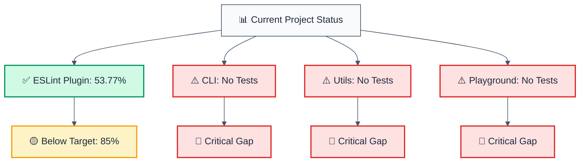

# 📊 Code Coverage Analysis Report

**Generated:** November 3, 2025  
**Project:** forge-js (Monorepo)  
**Status:** 🔴 Coverage Below Targets (Needs Improvement)

---

## 🎯 Executive Summary



---

## 📈 Coverage by Component

| Component | Current | Target | Gap | Status | Priority |
|-----------|---------|--------|-----|--------|----------|
| 🔧 ESLint Plugin | **53.77%** | 85% | -31.23% | 🟡 Below | 🔥 HIGH |
| 📦 CLI | **0%** | 75% | -75% | 🔴 Critical | 🔥 CRITICAL |
| 🛠️ Utils | **0%** | 80% | -80% | 🔴 Critical | 🔥 CRITICAL |
| 🎮 Playground | **0%** | 60% | -60% | 🔴 Critical | 🟠 Medium |

**Total Coverage Deficit:** 246.23 percentage points

---

## 🔍 ESLint Plugin Detailed Analysis (53.77%)

### Coverage Breakdown by Category

| Category | File | Lines | Statements | Branches | Functions | Status |
|----------|------|-------|-----------|----------|-----------|--------|
| 🏗️ Architecture | `no-circular-dependencies.ts` | 33% | 32.86% | 29.91% | 38.46% | 🔴 Critical |
| 🏗️ Architecture | `no-internal-modules.ts` | 98.5% | 93.42% | 81.81% | 100% | ✅ Excellent |
| 📝 Development | `no-console-log.ts` | 82.89% | 79.01% | 67.94% | 100% | 🟡 Good |
| 🔒 Security | `detect-eval-with-expression.ts` | 72.34% | 70.83% | 67.14% | 77.77% | 🟡 Good |
| 🛠️ Utils | `create-rule.ts` | 100% | 100% | 100% | 100% | ✅ Excellent |
| 🛠️ Utils | `llm-context.ts` | 3.44% | 3.33% | 5.88% | 12.5% | 🔴 Critical |

### Top Priority: Low Coverage Areas

#### 1️⃣ **CRITICAL: `llm-context.ts` (3.44% coverage)**

**Problem:** This utility file has almost no test coverage

```
File: packages/eslint-plugin/src/utils/llm-context.ts
├── Lines:      3.44% (mostly untested)
├── Functions:  12.5% (only 1 of 8 functions tested)
├── Branches:   5.88% (almost no edge cases covered)
└── Impact:     6 exported utilities not tested
```

**Missing Tests for:**
- `generateLLMContext()` - Core LLM helper
- `formatLLMMessage()` - Message formatting  
- `calculateComplexity()` - Complexity calculation
- `extractFunctionSignature()` - Signature parsing
- `containsSecurityKeywords()` - Keyword detection

**Action Items:**
```bash
# Create: packages/eslint-plugin/src/utils/llm-context.test.ts
# Add tests for all 6 untested functions
# Target: 90%+ coverage
```

#### 2️⃣ **CRITICAL: `no-circular-dependencies.ts` (32.86% coverage)**

**Problem:** Most of the circular dependency logic is untested

```
File: packages/eslint-plugin/src/rules/architecture/no-circular-dependencies.ts
├── Lines:      32.86%
├── Branches:   29.91% (edge cases missing)
├── Functions:  38.46% (many helper functions untested)
├── Uncovered:  Lines 17-67, 85-696 (major sections)
└── Test Files: 4 passed (81 tests total)
```

**Uncovered Lines:**
```typescript
// 17-67: Module resolution setup
// 85-696: Circular dependency detection logic
// Includes: file handling, import analysis, cycle detection
```

**Untested Logic:**
- Circular dependency detection algorithms
- File resolution strategies
- Module path handling
- Error messages and fixes
- Multiple fix strategies

**Action Items:**
```bash
# File: packages/eslint-plugin/src/tests/no-circular-dependencies.test.ts
# Add tests for:
# - Complex circular patterns (A→B→C→A)
# - Different module formats (ESM, CJS)
# - Edge cases in dependency resolution
# Target: 85%+ coverage
```

---

## ❌ Missing Test Files (0% Coverage)

### 🔴 **CLI Package: 0% Coverage**

**Status:** No test target configured

```
packages/cli/
├── project.json       ← No "test" target
├── vitest.config.mts  ← Created but not running
├── src/
│   ├── index.ts       ← Not tested
│   ├── commands/
│   │   ├── release.ts ← Not tested
│   │   ├── publish.ts ← Not tested
│   │   └── prerelease.ts ← Not tested
│   └── ...
└── No real test files ← ❌ MISSING
```

**Solution:**
1. Add `test` target to `project.json`:
```json
"test": {
  "executor": "nx:run-commands",
  "options": {
    "command": "vitest run --coverage"
  }
}
```

2. Create test files with real tests:
```bash
packages/cli/src/commands/release.test.ts
packages/cli/src/commands/publish.test.ts
packages/cli/src/commands/prerelease.test.ts
```

**Target:** 75% project coverage (policy)

---

### 🔴 **ESLint Plugin Utils: 0% Coverage**

**Status:** No test target configured

```
packages/eslint-plugin-utils/
├── project.json       ← No "test" target
├── vitest.config.mts  ← Created but not running
├── src/
│   ├── index.ts       ← Not tested
│   ├── ast-utils.ts   ← Core utilities (not tested)
│   ├── rule-creator.ts ← Not tested
│   └── type-utils.ts  ← Not tested
└── No real test files ← ❌ MISSING
```

**Solution:**
1. Add `test` target to `project.json`
2. Create test files for all utilities:
```bash
packages/eslint-plugin-utils/src/ast-utils.test.ts
packages/eslint-plugin-utils/src/rule-creator.test.ts
packages/eslint-plugin-utils/src/type-utils.test.ts
```

**Target:** 80% project coverage (policy)

---

### 🔴 **Playground App: 0% Coverage**

**Status:** No test configuration

```
apps/playground/
├── project.json       ← No "test" target
├── vitest.config.ts   ← Doesn't exist
├── src/
│   ├── app/           ← React components (not tested)
│   └── main.tsx       ← Entry point (not tested)
└── No test files      ← ❌ MISSING
```

**Solution:**
1. Create `vitest.config.ts`
2. Add test configuration
3. Create test files:
```bash
apps/playground/src/app/app.test.tsx
```

**Target:** 60% project coverage (policy - lower for playground)

---

## 🎯 Coverage Gaps by Priority

### 🔥 CRITICAL (P0) - Must Fix

| Item | Gap | Impact | Effort |
|------|-----|--------|--------|
| `llm-context.ts` tests | 96.56% | High | 2-3 hours |
| CLI package tests | 75% | High | 4-6 hours |
| Utils package tests | 80% | High | 3-5 hours |
| `no-circular-dependencies.ts` tests | 52.14% | Medium | 3-4 hours |

### 🟠 HIGH (P1) - Important

| Item | Gap | Impact | Effort |
|------|-----|--------|--------|
| `no-console-log.ts` branch coverage | 32.06% | Medium | 1-2 hours |
| `detect-eval-with-expression.ts` coverage | 27.66% | Medium | 2-3 hours |

### 🟡 MEDIUM (P2) - Nice to Have

| Item | Gap | Impact | Effort |
|------|-----|--------|--------|
| Playground app tests | 60% | Low | 2-3 hours |
| Branch coverage improvements | Various | Low | 1-2 hours |

---

## 📊 Component-Specific Recommendations

### ESLint Plugin Package

#### File: `packages/eslint-plugin/src/utils/llm-context.ts`

```typescript
// Current: 3.44% coverage
// Target: 90%+ coverage

// ADD TESTS FOR:
export function generateLLMContext(rules: RuleConfig[]): string
export function formatLLMMessage(input: string): string
export function calculateComplexity(code: string): number
export function extractFunctionSignature(code: string): string
export function containsSecurityKeywords(code: string): boolean

// Test scenario ideas:
// 1. Test with empty input
// 2. Test with complex security rules
// 3. Test with various code patterns
// 4. Test edge cases (null, undefined, empty strings)
// 5. Test security keyword detection with variants
```

#### File: `packages/eslint-plugin/src/rules/architecture/no-circular-dependencies.ts`

```typescript
// Current: 32.86% coverage
// Target: 85%+ coverage

// ADD TESTS FOR UNCOVERED SECTIONS:
// - Lines 17-67: Initial module resolution logic
// - Lines 85-696: Complex circular detection algorithms
// - Multiple edge cases in dependency resolution
// - Error message generation and formatting

// Test scenario ideas:
// 1. Three-way circular dependencies (A→B→C→A)
// 2. Self-circular dependencies (A→A)
// 3. Hidden circular dependencies through exports
// 4. Monorepo package cross-dependencies
// 5. Type-only imports that don't create cycles
```

---

## 🛠️ Implementation Roadmap

### Week 1: Setup & CLI Tests
- [ ] Add test targets to CLI and Utils `project.json`
- [ ] Create test files for CLI commands (4-6 hours)
- [ ] Achieve 75% coverage on CLI

### Week 2: Utils Tests
- [ ] Create tests for Utils package (3-5 hours)
- [ ] Add LLM context utility tests (2-3 hours)
- [ ] Achieve 80% coverage on Utils

### Week 3: ESLint Plugin Improvements
- [ ] Add missing `llm-context.ts` tests (2-3 hours)
- [ ] Improve `no-circular-dependencies.ts` (3-4 hours)
- [ ] Improve branch coverage for other rules (2-3 hours)
- [ ] Target: 85% project coverage

### Week 4: Playground & Polish
- [ ] Add test configuration for Playground (1 hour)
- [ ] Create basic component tests (2-3 hours)
- [ ] Achieve 60% coverage on Playground
- [ ] Final validation and documentation

---

## 📋 Quick Start: Fixing Low Coverage

### 1. Add Missing Test Targets

**CLI Package:**
```json
{
  "name": "cli",
  "targets": {
    "test": {
      "executor": "nx:run-commands",
      "options": {
        "command": "vitest run --coverage"
      }
    }
  }
}
```

**Utils Package:**
```json
{
  "name": "eslint-plugin-utils",
  "targets": {
    "test": {
      "executor": "nx:run-commands",
      "options": {
        "command": "vitest run --coverage"
      }
    }
  }
}
```

### 2. Create Test Files

```bash
# Critical: LLM Context Utils
touch packages/eslint-plugin/src/utils/llm-context.test.ts

# Critical: CLI Commands
touch packages/cli/src/commands/release.test.ts
touch packages/cli/src/commands/publish.test.ts
touch packages/cli/src/commands/prerelease.test.ts

# Critical: Utils
touch packages/eslint-plugin-utils/src/ast-utils.test.ts
touch packages/eslint-plugin-utils/src/rule-creator.test.ts
touch packages/eslint-plugin-utils/src/type-utils.test.ts
```

### 3. Run Tests & Verify Coverage

```bash
# Run all tests with coverage
pnpm nx run-many -t test --all --coverage

# Run specific package
cd packages/cli && pnpm vitest run --coverage
```

---

## ✅ Success Criteria

### Project-Level Targets

```
Current:     53.77% (ESLint Plugin only)
Target:      80% (repository-wide)
Gap:         26.23 percentage points
```

### By Component

| Component | Current | Target | Status |
|-----------|---------|--------|--------|
| ESLint Plugin | 53.77% | 85% | ❌ -31.23% |
| CLI | 0% | 75% | ❌ -75% |
| Utils | 0% | 80% | ❌ -80% |
| Playground | 0% | 60% | ❌ -60% |

### Branch Coverage Improvements Needed

- `no-console-log.ts`: 67.94% → 90%+ (22.06% improvement)
- `detect-eval-with-expression.ts`: 67.14% → 85%+ (17.86% improvement)
- `no-circular-dependencies.ts`: 29.91% → 75%+ (45.09% improvement)

---

## 📚 Testing Resources

### Test file examples to review:
- `packages/eslint-plugin/src/tests/no-console-log.test.ts` (82.89% coverage)
- `packages/eslint-plugin/src/tests/no-internal-modules.test.ts` (98.5% coverage - excellent model)

### Key testing patterns:
1. **Setup/Teardown:** Use beforeEach/afterEach for common test setup
2. **Edge Cases:** Test with null, undefined, empty, and extreme values
3. **Branch Coverage:** Ensure all conditional paths are tested
4. **Error Cases:** Test failure scenarios and error handling

---

## 🎯 Action Items Summary

- [ ] **URGENT:** Add test targets to `packages/cli/project.json` and `packages/eslint-plugin-utils/project.json`
- [ ] **URGENT:** Create `llm-context.test.ts` - 96.56% gap (CRITICAL)
- [ ] **HIGH:** Create CLI command tests - 75% gap (CRITICAL)
- [ ] **HIGH:** Create Utils package tests - 80% gap (CRITICAL)
- [ ] **HIGH:** Expand `no-circular-dependencies.test.ts` - 52.14% gap
- [ ] **MEDIUM:** Improve branch coverage in development/security rules
- [ ] **LOW:** Add Playground app tests - 60% gap

**Total Effort Estimate:** 20-30 hours  
**Timeline:** 3-4 weeks (with parallel work)
