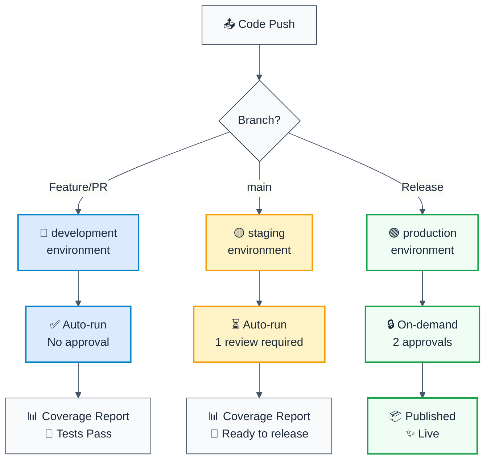

# GitHub Actions Environments Setup

## 🎯 Overview

This project uses **3-tier environment strategy** following GitHub Actions best practices:

- 🔵 **development** - PR testing (auto-run)
- 🟡 **staging** - Main branch validation (requires review)
- 🟢 **production** - Release builds (requires approval)

This pattern is used by Netflix, Vercel, GitHub, and other major projects.

## 📊 Environment Flow



## 🔧 Step 1: Create Environments in GitHub

Navigate to: **Settings → Environments**

### 1a. Create "development" Environment

```yaml
Environment name: development

Protection rules:
  ✓ Deployment branches: None
  ✓ Required reviewers: None
  ✓ Restrict who can deploy: None

Environment secrets:
  - CODECOV_TOKEN: [your token]
```

**Why?**
- No protection = fast feedback on PRs
- Developers need instant results
- Open-source community expects quick CI

### 1b. Create "staging" Environment

```yaml
Environment name: staging

Protection rules:
  ✓ Deployment branches: Protect when deployed from → main
  ✓ Required reviewers: 1 (optional)
  ✓ Reviewers: (leave empty for anyone can approve)

Environment secrets:
  - CODECOV_TOKEN: [your token]
```

**Why?**
- Ensures only `main` branch can deploy
- Single review catches obvious issues
- Gate before production

### 1c. Create "production" Environment

```yaml
Environment name: production

Protection rules:
  ✓ Deployment branches: Protect when deployed from → main
  ✓ Required reviewers: 2 (or 1 for open-source)
  ✓ Reviewers: (or add specific team)

Environment secrets:
  - CODECOV_TOKEN: [production-specific token if needed]
  - NPM_TOKEN: [for publishing]
```

**Why?**
- Multiple approvals = safety for users
- Same branch rule prevents accidents
- Separate secrets for audit trail

## 📋 Workflow Configuration

### CI Workflow (`ci.yml`) - Development

Runs on **every PR**:

```yaml
on:
  pull_request:
    types: [opened, synchronize, reopened]

jobs:
  ci:
    runs-on: ubuntu-latest
    environment: development  # ← Auto-runs, no approval
    
    steps:
      - name: Checkout
        uses: actions/checkout@v4
      
      - name: Run tests
        run: pnpm test
      
      - name: Upload coverage
        uses: codecov/codecov-action@v5
        with:
          token: ${{ secrets.CODECOV_TOKEN }}
```

**Behavior:**
- ✅ Automatically runs
- ✅ Uses development secrets
- ✅ No approval needed
- ✅ Provides instant feedback

### Coverage Workflow (`check-coverage.yml`) - Development

Runs on **every PR**:

```yaml
on:
  pull_request:
    types: [opened, synchronize, reopened]

jobs:
  check-coverage:
    runs-on: ubuntu-latest
    environment: development  # ← Auto-runs, no approval
    permissions:
      contents: read
      pull-requests: write
    
    steps:
      - name: Checkout
        uses: actions/checkout@v4
      
      - name: Check coverage
        run: pnpm test --coverage
      
      - name: Upload to Codecov
        uses: codecov/codecov-action@v5
```

### Main Branch Workflow (`ci-main.yml`) - Staging

Runs on **every merge to main**:

```yaml
on:
  push:
    branches:
      - main

jobs:
  ci:
    runs-on: ubuntu-latest
    environment: staging  # ← Runs, then waits for 1 review
    
    steps:
      - name: Full CI pipeline
        run: pnpm build && pnpm test
      
      - name: Upload coverage
        uses: codecov/codecov-action@v5
```

**Behavior:**
- ✅ Automatically starts when main updated
- ⏳ Waits for 1 review (if configured)
- ✅ Uses staging secrets
- ✅ Coverage automatically tracked

## 🔐 Environment Secrets Best Practices

### Per-Environment Secrets

Store secrets **at the environment level**, not repository level:

```yaml
# ❌ BAD - Repository secret (accessible to all)
secrets:
  CODECOV_TOKEN: xxx

# ✅ GOOD - Environment secret (scoped)
# Settings → Environments → development → Environment secrets
CODECOV_TOKEN: dev-token

# Settings → Environments → production → Environment secrets
CODECOV_TOKEN: prod-token (can be different)
NPM_TOKEN: publish-token
```

### Secret Rotation

To rotate a secret:

1. Go to Settings → Environments → [environment name]
2. Update the secret value
3. All future workflow runs use the new value

### Token Scopes per Environment

| Secret | development | staging | production |
|--------|---|---|---|
| `CODECOV_TOKEN` | ✅ Dev token | ✅ Same token | ✅ Prod token (optional) |
| `NPM_TOKEN` | ❌ Not needed | ⚠️ Test-only | ✅ Publish token |
| `GITHUB_TOKEN` | ✅ Auto | ✅ Auto | ✅ Auto |

## 📈 When Approvals Are Triggered

```
PR Submitted
    ↓
[ci.yml runs in development]
    ↓
PR Reviewed & Merged to main
    ↓
[ci-main.yml starts in staging]
    ↓
✅ Workflow job created (pending environment approval)
    ↓
GitHub sends approval request
    ↓
Admin reviews & approves
    ↓
Workflow continues
    ↓
Job completes
```

## 🎯 Access Control & Permissions

### Restrict Environment Deployments

**For production environment:**

1. Settings → Environments → production
2. "Restrict who can deploy to this environment" → Select teams/people
3. Only they can approve/deploy

**Example:** Only lead developers and DevOps can approve production

### Deployment Branches

**Prevent accidental deployments:**

```yaml
# Settings → Environments → [name] → Deployment branches
✓ Protect only when deployed from
✓ Selected branches: main
```

This means:
- PRs cannot trigger production deployments
- Only `main` branch can deploy
- Even with approval, wrong branch = blocked

## 📊 Monitoring & Viewing Deployments

### View Environment Status

1. Go to **Deployments** tab in your repository
2. See all environment deployments
3. Click environment to see approval history

### Deployment Timeline

Shows:
- ✅ When deployed
- 👤 Who approved
- 🕐 Approval timestamps
- ❌ Failed deployments

## 🔄 Advanced: Custom Protection Rules

### Require Specific Reviewers

```yaml
# Settings → Environments → production
Required reviewers: 
  ☑ Select team/person
  ✓ Require all reviewers to approve
```

Now only these people can approve production deployments.

### Conditional Deployments

Combine environments with GitHub status checks:

```yaml
# Settings → Branches → main → Require status checks to pass
✓ codecov/project
✓ ci-pipeline
```

Deployments blocked if status checks fail.

## 📝 Troubleshooting

### Workflow Waiting on Approval

**Symptom:** Workflow shows "Waiting for environment approval"

**Solution:**
1. Go to Actions tab
2. Click the pending workflow
3. Look for "Review pending deployments" button
4. Click Approve

### Wrong Secrets Used

**Symptom:** "CODECOV_TOKEN not found" in production

**Solution:**
1. Verify Settings → Environments → production
2. Check "Environment secrets" section
3. Add CODECOV_TOKEN if missing
4. Or check if repository-level secret is overriding

### Can't Approve Deployment

**Symptom:** "Insufficient permissions" message

**Solution:**
1. Check Settings → Environments → [name]
2. Verify your user is in required reviewers
3. Or ask admin to add you

## 🚀 Best Practices Checklist

- [ ] ✅ Created 3 environments (development, staging, production)
- [ ] ✅ Set deployment branches to `main` for staging + production
- [ ] ✅ Enabled 1-2 required reviewers for staging/production
- [ ] ✅ Added environment secrets (not repository secrets)
- [ ] ✅ Workflows use correct environment names
- [ ] ✅ Codecov token added to development environment
- [ ] ✅ NPM_TOKEN added to production environment (if publishing)
- [ ] ✅ Tested PR workflow (should auto-run in development)
- [ ] ✅ Tested main branch workflow (should require approval in staging)

## 📚 Resources

- [GitHub Environments Docs](https://docs.github.com/en/actions/deployment/targeting-different-environments/using-environments-for-deployment)
- [Environment Protection Rules](https://docs.github.com/en/actions/deployment/targeting-different-environments/managing-deployments/reviewing-deployments)
- [Encrypted Secrets](https://docs.github.com/en/actions/security-guides/encrypted-secrets)
- [GitHub Actions Best Practices](https://docs.github.com/en/actions/guides)

## 🤝 Support

For questions:

1. Review this document
2. Check [CI/CD Pipeline documentation](./CI_CD_PIPELINE.md)
3. Visit [GitHub Actions documentation](https://docs.github.com/en/actions)
4. Open an issue in the repository
