# NPM Distribution Tags Guide

## Overview

This project uses npm distribution tags to manage different release channels, allowing users to opt into different stability levels.

## Distribution Tags

| Tag      | Purpose                        | Version Format     | Stability | Auto-published |
|----------|--------------------------------|--------------------|-----------|----------------|
| `latest` | Stable production releases     | `1.0.0`            | ✅ Stable  | ✅ Yes         |
| `next`   | Pre-release versions           | `1.0.0-next.1`     | ⚠️ Beta    | ✅ Yes         |
| `beta`   | Beta testing                   | `1.0.0-beta.1`     | ⚠️ Beta    | ✅ Yes         |
| `alpha`  | Alpha testing                  | `1.0.0-alpha.1`    | ⚠️ Alpha   | ✅ Yes         |
| `rc`     | Release candidates             | `1.0.0-rc.1`       | ✅ Stable  | ✅ Yes         |
| `canary` | Bleeding edge (every commit)   | `1.0.0-canary.*`   | ⚠️ Unstable| ✅ Yes         |

## Release Flow

```mermaid
%%{init: {
  'theme': 'base',
  'themeVariables': {
    'primaryColor': '#f8fafc',
    'primaryTextColor': '#1e293b',
    'primaryBorderColor': '#334155',
    'lineColor': '#475569',
    'c0': '#f8fafc',
    'c1': '#f1f5f9',
    'c2': '#e2e8f0',
    'c3': '#cbd5e1'
  }
}}%%
flowchart TD
    A[🔨 Development] --> B{Release Type?}
    
    B -->|Canary| C[🐤 Auto-publish on Push]
    B -->|Pre-release| D[📝 Changesets + Pre-mode]
    B -->|Stable| E[📝 Changesets Normal]
    
    C --> F[canary tag]
    D --> G{Pre-release Type}
    E --> H[latest tag]
    
    G -->|Alpha| I[alpha tag]
    G -->|Beta| J[beta tag]
    G -->|RC| K[rc tag]
    G -->|Next| L[next tag]
    
    classDef stableNode fill:#f0fdf4,stroke:#16a34a,stroke-width:2px,color:#1f2937
    classDef unstableNode fill:#fef2f2,stroke:#dc2626,stroke-width:2px,color:#1f2937
    classDef betaNode fill:#fef3c7,stroke:#f59e0b,stroke-width:2px,color:#1f2937
    
    class H,K stableNode
    class F,I unstableNode
    class J,L betaNode
```



## Installation Examples

### Latest (Stable)
```bash
npm install @forge-js/eslint-plugin-llm-optimized
# or explicitly
npm install @forge-js/eslint-plugin-llm-optimized@latest
```

### Canary (Bleeding Edge)
```bash
npm install @forge-js/eslint-plugin-llm-optimized@canary
```

### Beta Testing
```bash
npm install @forge-js/eslint-plugin-llm-optimized@beta
```

### Alpha Testing
```bash
npm install @forge-js/eslint-plugin-llm-optimized@alpha
```

### Release Candidate
```bash
npm install @forge-js/eslint-plugin-llm-optimized@rc
```

### Next Major Version
```bash
npm install @forge-js/eslint-plugin-llm-optimized@next
```

## Publishing Workflows

### 1. Stable Release (latest)

```bash
# Create changeset
pnpm changeset

# Select packages and bump type (major/minor/patch)
# Commit and push

# Changesets bot will create a PR
# Merge PR → automatic publish with 'latest' tag
```

### 2. Pre-release (alpha/beta/rc/next)

```bash
# Enter pre-release mode
pnpm release:enter alpha  # or beta, rc, next

# Create changesets as normal
pnpm changeset

# Version packages
pnpm changeset version

# Review and commit
git add .
git commit -m "chore: version alpha release"
git push

# Publish happens automatically via CI
# Or manually via GitHub Actions workflow

# Exit pre-release mode when done
pnpm release:exit
```

### 3. Canary Release (automatic)

- **Automatic**: Every push to `main` branch triggers a canary release
- **Manual**: Trigger via GitHub Actions workflow
- No changesets needed
- Version format: `1.0.0-canary.20231027.abc1234`

### 4. Manual Publish (any tag)

Use GitHub Actions "Manual Publish" workflow:

1. Go to Actions → Manual Publish
2. Enter tag: `@forge-js/eslint-plugin-llm-optimized@1.0.0`
3. Select npm-tag: `latest`, `next`, `beta`, `alpha`, `rc`, `canary`
4. Run workflow

## Tag Selection Logic

The `release-publish.js` script automatically determines the correct tag:

| Version Pattern       | Detected Tag |
|-----------------------|--------------|
| `1.0.0`               | `latest`     |
| `1.0.0-alpha.1`       | `alpha`      |
| `1.0.0-beta.2`        | `beta`       |
| `1.0.0-rc.1`          | `rc`         |
| `1.0.0-next.3`        | `next`       |
| `1.0.0-canary.abc123` | `canary`     |

## Versioning Strategy

### Semantic Versioning

| Type  | Use Case                     | Example       |
|-------|------------------------------|---------------|
| Major | Breaking changes             | `1.0.0 → 2.0.0` |
| Minor | New features (backward compatible) | `1.0.0 → 1.1.0` |
| Patch | Bug fixes                    | `1.0.0 → 1.0.1` |

### Pre-release Versioning

```bash
# First alpha
1.0.0-alpha.0

# Subsequent alphas
1.0.0-alpha.1
1.0.0-alpha.2

# Move to beta
1.0.0-beta.0
1.0.0-beta.1

# Release candidate
1.0.0-rc.0
1.0.0-rc.1

# Stable release
1.0.0
```

## Best Practices

### When to Use Each Tag

#### latest (Stable)
- ✅ Production-ready code
- ✅ All tests passing
- ✅ Documentation complete
- ✅ Breaking changes documented

#### next
- ✅ Preview of next major version
- ✅ Feature complete
- ⚠️ May have breaking changes

#### beta
- ✅ Feature complete
- ⚠️ May have bugs
- ⚠️ API may change slightly

#### alpha
- ⚠️ Early development
- ⚠️ Unstable API
- ⚠️ Expect breaking changes

#### rc (Release Candidate)
- ✅ Stable, ready for final testing
- ✅ No new features
- ✅ Only critical bug fixes

#### canary
- ⚠️ Bleeding edge
- ⚠️ Untested
- ⚠️ May be broken

## CI/CD Integration

### Automated Workflows

| Workflow            | Trigger                  | Publishes To |
|---------------------|--------------------------|--------------|
| `release.yml`       | Push to main (with changeset) | Auto-detected tag |
| `canary-release.yml`| Push to main             | `canary`     |
| `publish-manual.yml`| Manual trigger           | User-selected|

### GitHub Secrets Required

| Secret            | Purpose                |
|-------------------|------------------------|
| `NPM_TOKEN`       | Publishing to npm      |
| `GITHUB_TOKEN`    | Creating releases/tags |

## Troubleshooting

### Wrong Tag Published

```bash
# Fix the tag on npm
npm dist-tag add @forge-js/eslint-plugin-llm-optimized@1.0.0 latest
npm dist-tag rm @forge-js/eslint-plugin-llm-optimized wrong-tag
```

### View Current Tags

```bash
npm dist-tag ls @forge-js/eslint-plugin-llm-optimized
```

### Check Published Versions

```bash
npm view @forge-js/eslint-plugin-llm-optimized versions
```

## Examples

### Publishing Alpha Version

```bash
# Enter alpha mode
pnpm release:enter alpha

# Make changes and create changeset
pnpm changeset
# Select packages: eslint-plugin
# Select bump: minor
# Summary: "Add new rule for circular dependency detection"

# Version the packages
pnpm changeset version
# Creates: 1.0.0-alpha.0

# Commit and push
git add .
git commit -m "feat: add circular dependency rule (alpha)"
git push

# CI publishes with 'alpha' tag automatically
```

### Graduating from Beta to Stable

```bash
# Exit pre-release mode
pnpm release:exit

# Version as stable
pnpm changeset version
# Updates: 1.0.0-beta.5 → 1.0.0

# Commit and push
git add .
git commit -m "chore: release v1.0.0"
git push

# CI publishes with 'latest' tag
```

## Summary

✅ **Use `latest` for production**  
⚠️ **Use `beta`/`rc` for pre-release testing**  
🔬 **Use `alpha` for experimental features**  
🐤 **Use `canary` for bleeding edge**  
🚀 **Use `next` for major version previews**

