# NX Release vs Changesets - Modern Approach for 2025

## ✅ Recommendation: Use NX Release

Based on the latest documentation from NX (2025), **NX Release is now the recommended approach** over Changesets for NX monorepos.

## Why NX Release?

| Feature                  | NX Release                | Changesets          |
| ------------------------ | ------------------------- | ------------------- |
| **Native Integration**   | ✅ Built into NX          | ⚠️ Third-party tool |
| **Versioning**           | ✅ Automatic + Manual     | ✅ Manual via files |
| **Conventional Commits** | ✅ Built-in support       | ❌ Requires plugins |
| **Performance**          | ✅ NX caching             | ⚠️ No caching       |
| **Distribution Tags**    | ✅ Built-in               | ⚠️ Manual scripting |
| **Pre-releases**         | ✅ Full support           | ✅ Full support     |
| **Dry Run**              | ✅ Built-in (`--dry-run`) | ✅ Supported        |
| **CI/CD Optimization**   | ✅ Optimized for NX Cloud | ⚠️ Generic          |
| **Docker Support**       | ✅ Built-in               | ❌ Not supported    |
| **Programmatic API**     | ✅ Full TypeScript API    | ⚠️ Limited          |

## NX Release Workflow

```mermaid
%%{init: {
  'theme': 'base',
  'themeVariables': {
    'primaryColor': '#f8fafc',
    'primaryTextColor': '#1e293b',
    'primaryBorderColor': '#334155',
    'lineColor': '#475569'
  }
}}%%
flowchart TD
    A[🔨 Make Changes] --> B[📤 Push to Main]
    B --> C{Conventional Commits?}
    C -->|✅ Yes| D[🤖 Auto Version Detection]
    C -->|❌ No| E[📝 Manual Version Input]
    D --> F[📊 Update Versions]
    E --> F
    F --> G[📝 Generate Changelogs]
    G --> H[🏷️ Git Tag]
    H --> I[📦 Publish NPM]
    I --> J[🎉 GitHub Release]
```



## Quick Start with NX Release

### 1. Initial Setup

```json
// nx.json
{
  "release": {
    "projects": ["packages/*"],
    "version": {
      "conventionalCommits": true,
      "preVersionCommand": "npx nx run-many -t build"
    },
    "changelog": {
      "git": {
        "commit": true,
        "tag": true
      },
      "workspaceChangelog": {
        "createRelease": "github"
      }
    }
  }
}
```

### 2. Common Commands

```bash
# Dry run (recommended first)
nx release --dry-run

# Interactive release
nx release

# First release
nx release --first-release

# Specific version
nx release --version=minor

# Skip publishing (CI will handle it)
nx release --skip-publish

# Publish only (in CI)
nx release publish
```

### 3. Pre-release Support

```bash
# Alpha release
nx release --version=prerelease --preid=alpha

# Beta release
nx release --version=prerelease --preid=beta

# RC release
nx release --version=prerelease --preid=rc
```

## Distribution Tags (Automatic)

NX Release automatically handles npm distribution tags based on version:

| Version         | Tag      | Command                    |
| --------------- | -------- | -------------------------- |
| `1.0.0`         | `latest` | `nx release`               |
| `1.0.0-alpha.0` | `alpha`  | `nx release --preid=alpha` |
| `1.0.0-beta.1`  | `beta`   | `nx release --preid=beta`  |
| `1.0.0-rc.2`    | `rc`     | `nx release --preid=rc`    |

## CI/CD Integration

### GitHub Actions

```yaml
name: Release

on:
  push:
    branches:
      - main

jobs:
  release:
    runs-on: ubuntu-latest
    permissions:
      contents: write
      id-token: write
    steps:
      - uses: actions/checkout@v4
        with:
          fetch-depth: 0

      - name: Setup Node.js
        uses: actions/setup-node@v4
        with:
          node-version: 20
          registry-url: 'https://registry.npmjs.org'

      - name: Install dependencies
        run: pnpm install --frozen-lockfile

      - name: Release
        run: nx release
        env:
          NODE_AUTH_TOKEN: ${{ secrets.NPM_TOKEN }}
          NPM_CONFIG_PROVENANCE: true
```

## Programmatic API (Advanced)

```typescript
import { releaseVersion, releaseChangelog, releasePublish } from 'nx/release';

async function customRelease() {
  // Version packages
  const { workspaceVersion, projectsVersionData } = await releaseVersion({
    specifier: 'minor',
    dryRun: false,
    verbose: true,
  });

  // Generate changelogs
  await releaseChangelog({
    versionData: projectsVersionData,
    version: workspaceVersion,
    dryRun: false,
    verbose: true,
  });

  // Publish
  const results = await releasePublish({
    dryRun: false,
    verbose: true,
    versionData: projectsVersionData,
  });

  return results;
}
```

## Migration from Changesets

If you're using Changesets, migration is straightforward:

1. **Remove Changesets dependencies**

   ```bash
   pnpm remove @changesets/cli
   rm -rf .changeset/
   ```

2. **Configure NX Release** (see above)

3. **Update CI/CD workflows**

   - Replace `changeset version` with `nx release --skip-publish`
   - Replace `changeset publish` with `nx release publish`

4. **Update scripts in package.json**
   ```json
   {
     "scripts": {
       "release": "nx release",
       "release:dry-run": "nx release --dry-run",
       "release:publish": "nx release publish"
     }
   }
   ```

## Best Practices

### ✅ Use Conventional Commits

```bash
feat: add new feature (minor bump)
fix: resolve bug (patch bump)
feat!: breaking change (major bump)
```

### ✅ Always Dry Run First

```bash
nx release --dry-run
```

### ✅ Automate in CI/CD

Don't manually version/publish - let CI handle it.

### ✅ Use Provenance

Enable npm provenance for security:

```yaml
env:
  NPM_CONFIG_PROVENANCE: true
```

### ✅ Separate Version from Publish

```bash
# Locally
nx release --skip-publish

# In CI
nx release publish
```

## Troubleshooting

### Issue: Version not detected

**Solution**: Ensure conventional commits or specify version explicitly

```bash
nx release --version=1.2.3
```

### Issue: Publish fails

**Solution**: Check NPM_TOKEN and registry configuration

```bash
npm config get registry
npm whoami
```

### Issue: Wrong tag used

**Solution**: NX automatically determines tags. For custom tags, use programmatic API.

## Resources

- [NX Release Docs](https://nx.dev/features/manage-releases)
- [NX Release API](https://nx.dev/nx-api/nx/documents/release)
- [Conventional Commits](https://www.conventionalcommits.org/)

## Summary

**For 2025 and beyond, NX Release is the recommended approach** for managing releases in NX monorepos. It provides:

✅ Better integration with NX ecosystem  
✅ Native conventional commits support  
✅ Automatic distribution tag management  
✅ Built-in CI/CD optimization  
✅ Full TypeScript programmatic API  
✅ Docker support (bonus)

**Changesets is still valid** for non-NX monorepos or if you need its specific workflow, but NX Release is now the modern standard for NX workspaces.
