# 📦 Release Process

> This document explains how packages are released using Nx Release with GitHub Actions automation.

## Overview

All packages in this monorepo are released using **Nx Release** with **Semantic Versioning** (SemVer). Releases are automated via GitHub Actions and follow conventional commits.

**Active Packages:**
- `@forge-js/eslint-plugin-llm-optimized` (packages/eslint-plugin)
- `@interlace/eslint-devkit` (packages/eslint-plugin-utils)

## Release Process Flow

```mermaid
%%{init: {
  'theme': 'base',
  'themeVariables': {
    'primaryColor': '#f8fafc',
    'primaryTextColor': '#1e293b',
    'primaryBorderColor': '#334155',
    'lineColor': '#475569'
  }
}}%%
flowchart LR
    A["👤 Developer<br/>Conventional Commit"] -->|git push| B["🔄 GitHub<br/>Workflow Trigger"]
    B -->|pnpm nx release| C["📊 Version<br/>Detection"]
    C -->|Bump| D["📝 Update<br/>package.json<br/>CHANGELOG.md"]
    D -->|Create| E["🏷️ Git Tag<br/>& Commit"]
    E -->|Push| F["📦 NPM<br/>Publish"]
    F --> G["✅ Release<br/>Complete"]
    
    style A fill:#f0fdf4,stroke:#16a34a,stroke-width:2px
    style B fill:#dbeafe,stroke:#2563eb,stroke-width:2px
    style C fill:#fef3c7,stroke:#ca8a04,stroke-width:2px
    style F fill:#f8fafc,stroke:#334155,stroke-width:2px
    style G fill:#dcfce7,stroke:#15803d,stroke-width:2px
```



## Semantic Versioning Guide

| Commit Type | Version Bump | Example |
|------------|--------------|---------|
| `fix:` | Patch (0.2.1 → **0.2.2**) | Bug fixes, patches |
| `feat:` | Minor (0.2.1 → **0.3.0**) | New features |
| `BREAKING CHANGE:` | Major (0.2.1 → **1.0.0**) | Incompatible changes |
| `refactor:`, `docs:`, `chore:` | ❌ No bump | Code improvements only |

### Commit Format

```bash
# Standard commit format (triggers version bump)
git commit -m "type(scope): description"

# Examples
git commit -m "fix: correct null check in validator"
git commit -m "feat: add new rule for security"
git commit -m "docs: update README"                   # No bump
```

## Manual Release (Local)

For testing or manual releases:

```bash
# Preview changes (safe, no side effects)
pnpm nx release --dry-run

# Execute release
pnpm nx release

# Release specific package
pnpm nx release --projects=eslint-plugin

# Force specific version bump
pnpm nx release --version=patch
pnpm nx release --version=minor
pnpm nx release --version=major
```

## GitHub Actions (Automated)

**Recommended approach** - Automated releases via GitHub Actions.

### Setup Requirements

The workflow requires:
- NPM authentication token in `NPM_TOKEN` secret
- GitHub token with write access (auto-generated `GITHUB_TOKEN`)
- Branch protection rules configured

### Workflow Trigger

Releases are triggered automatically when:
1. Conventional commits are pushed to main branch
2. GitHub Actions workflow detects commit types
3. Version bump is calculated
4. Packages are built and published

### Status Check

```bash
# Check workflow status
pnpm ci:status

# Trigger workflow manually (if needed)
pnpm ci:trigger
```

## Release Configuration

All release settings are in `nx.json`:

```json
{
  "release": {
    "projects": [
      "packages/eslint-plugin",
      "packages/eslint-plugin-utils"
    ],
    "projectsRelationship": "independent",
    "git": {
      "commit": true,
      "commitArgs": "--no-verify",
      "commitMessage": "chore(release): {version}",
      "tag": true,
      "tagMessage": "chore(release): {version}"
    },
    "version": {
      "conventionalCommits": true,
      "preVersionCommand": "pnpm nx run-many -t build --projects=eslint-plugin,eslint-plugin-utils",
      "generatorOptions": {
        "currentVersionResolver": "git-tag",
        "specifierSource": "conventional-commits"
      }
    },
    "changelog": {
      "projectChangelogs": true,
      "workspaceChangelog": {
        "createRelease": "github"
      }
    }
  }
}
```

## Publishing Configuration

### .npmrc (Root)

```ini
# Root .npmrc - Safe to commit
@forge-js:registry=https://registry.npmjs.org/
registry=https://registry.npmjs.org/
```

### .npmrc (Packages)

Each package has a `publishConfig` in `package.json`:

```json
{
  "publishConfig": {
    "access": "public"
  }
}
```

## What Happens During Release

```
1. ✅ Version Detection
   └─ Reads latest git tag: @forge-js/eslint-plugin@0.2.1
   └─ Scans commits since tag
   └─ Detects: fix:, feat:, BREAKING CHANGE:

2. 📊 Version Calculation
   └─ Determines next version based on commit types
   └─ Example: fix: commits → patch bump

3. 📝 Update Files
   └─ package.json: version incremented
   └─ CHANGELOG.md: auto-generated with entry
   └─ Git commit created: chore(release): 0.2.2

4. 🏷️ Create Git Tag
   └─ Tag format: {projectName}@{version}
   └─ Example: @forge-js/eslint-plugin@0.2.2

5. 📦 Publish to NPM
   └─ Packages built before publishing
   └─ Published with public access
   └─ Available immediately on npmjs.org

6. 🔄 Push to GitHub
   └─ New commits and tags pushed
   └─ GitHub Release created (if enabled)
```

## Troubleshooting

### "No changes detected"

**Cause:** No conventional commits since last tag  
**Solution:** Make a commit with proper format:
```bash
git commit -m "fix: description" 
```

### Version Mismatch Errors

**Cause:** package.json version ≠ latest git tag  
**Solution:** Let Nx manage versions, don't edit manually

### Failed Publication

**Cause:** Missing NPM token or permission issue  
**Solution:** 
- Check `NPM_TOKEN` secret in GitHub
- Verify package access is public
- Check npm account permissions

## Best Practices

### ✅ DO

- ✅ Use conventional commit format
- ✅ Keep commits focused on single feature/fix
- ✅ Let Nx calculate versions automatically
- ✅ Use `--dry-run` before releasing
- ✅ Test locally before pushing

### ❌ DON'T

- ❌ Manually edit package.json versions
- ❌ Create git tags manually
- ❌ Use non-conventional commit formats
- ❌ Mix versioning strategies
- ❌ Push before verifying commits

## Quick Reference

```bash
# Common commands
pnpm nx release                    # Release with auto-detection
pnpm nx release --dry-run         # Preview only
pnpm nx release --projects=pkg    # Single package

# CI/CD commands
pnpm ci:status                    # Check workflow status
pnpm ci:trigger                   # Manually trigger workflow

# Build before release (automatic during release)
pnpm nx run-many -t build --all
```

## Related Files

- `nx.json` - Release configuration
- `.npmrc` - NPM registry settings
- `CHANGELOG.md` - Workspace changelog
- `.github/workflows/` - GitHub Actions workflows

## Resources

- **Conventional Commits**: https://www.conventionalcommits.org/
- **Semantic Versioning**: https://semver.org/
- **Nx Release**: https://nx.dev/recipes/manage-monorepos/release-process
- **NPM Publishing**: https://docs.npmjs.com/cli/publish

---

**Status**: Ready for automated GitHub Actions integration  
**Last Updated**: 2025-11-02
