# 🔍 Release Workflow Issues Analysis

## Problem Summary

The `release.yml` workflow has two main issues:

1. **"Too Hard"** - Runs everything in one monolithic job without early validation
2. **No Early Failure Detection** - Doesn't check prerequisites before starting expensive operations

## Root Causes

### Issue 1: Monolithic Release Job

The current workflow structure:

```mermaid
%%{init: {
  'theme': 'base',
  'themeVariables': {
    'primaryColor': '#f8fafc',
    'primaryTextColor': '#1e293b',
    'primaryBorderColor': '#334155',
    'lineColor': '#475569',
    'sectionBkColor': '#e2e8f0',
    'altSectionBkColor': '#cbd5e1',
    'gridColor': '#94a3b8'
  }
}}%%
flowchart TD
    A[🚀 Start Release] --> B{CI Validation?}
    B -->|Yes| C[✅ Run Tests & Build]
    B -->|No| D[⏭️ Skip]
    C --> E[📝 Prepare Version]
    D --> E
    E --> F[🚀 Publish Packages]
    F --> G{Success?}
    G -->|❌ Fail| H[💥 Entire Workflow Fails]
    G -->|✅ Success| I[✨ Done]

    style H fill:#fee2e2,stroke:#dc2626,stroke-width:3px,color:#1e293b
    style E fill:#fef3c7,stroke:#f59e0b,stroke-width:2px,color:#1e293b
    style F fill:#fee2e2,stroke:#dc2626,stroke-width:2px,color:#1e293b
```



**Problems:**

- If publishing fails, you've already committed version changes to git
- No way to preview what will be published before committing
- Can't retry publishing without re-running the entire workflow
- Version changes are committed even if publish fails

### Issue 2: No Pre-Flight Checks

The workflow doesn't validate prerequisites before starting:

| Check                          | Current Status        | Impact                                |
| ------------------------------ | --------------------- | ------------------------------------- |
| **Changes to release?**        | ❌ Not checked        | May try to publish unchanged packages |
| **NPM authentication**         | ❌ Not validated      | Fails late after version commit       |
| **Package already published?** | ❌ Not checked        | Fails with "version exists" error     |
| **Build will succeed?**        | ⚠️ Only if CI enabled | May fail during preReleaseCommand     |
| **Git state clean?**           | ❌ Not checked        | May have uncommitted changes          |
| **Version strategy valid?**    | ❌ Not validated      | May produce invalid versions          |

## Common Failure Scenarios

### Scenario 1: Package Already Published

**What happens:**

1. Workflow runs version preparation ✅
2. Commits version changes to git ✅
3. Tries to publish → **FAILS** ❌
4. Git is now in a bad state (version committed but not published)

**Error:**

```
npm ERR! code E403
npm ERR! 403 Forbidden - PUT https://registry.npmjs.org/@forge-js%2feslint-plugin
npm ERR! You cannot publish over the previously published versions
```

### Scenario 2: NPM Authentication Failure

**What happens:**

1. Workflow runs version preparation ✅
2. Commits version changes ✅
3. Tries to publish → **FAILS** ❌ (no auth token or invalid token)

**Error:**

```
npm ERR! code ENEEDAUTH
npm ERR! need auth This command requires you to be logged in.
```

### Scenario 3: No Changes to Release

**What happens:**

1. Workflow runs version preparation
2. Nx detects no changes → **FAILS** or does nothing
3. Workflow continues anyway → **FAILS** later

**Error:**

```
No changes detected. Nothing to release.
```

### Scenario 4: Build Failure During preReleaseCommand

**What happens:**

1. Version preparation succeeds ✅
2. Git commit created ✅
3. `preReleaseCommand` runs build → **FAILS** ❌
4. Publish never happens, but version is committed

**Error:**

```
Error: Command failed: pnpm nx run-many -t build
```

## Proposed Solutions

### Solution 1: Add Pre-Flight Validation Job

Add a new job that runs **before** any changes are made:

```yaml
pre-flight-checks:
  name: 🔍 Pre-Flight Checks
  runs-on: ubuntu-latest
  steps:
    - name: Check for changes
      run: |
        # Check if there are any changes to release
        pnpm nx release --dry-run || echo "No changes detected"

    - name: Validate NPM authentication
      run: |
        npm whoami || exit 1

    - name: Check if packages already published
      run: |
        # Check each package's version against NPM
        # Fail if version already exists

    - name: Validate git state
      run: |
        git status --porcelain
        # Fail if uncommitted changes
```

### Solution 2: Split Release into Separate Jobs

Separate version preparation from publishing:

```mermaid
%%{init: {
  'theme': 'base',
  'themeVariables': {
    'primaryColor': '#f8fafc',
    'primaryTextColor': '#1e293b',
    'primaryBorderColor': '#334155',
    'lineColor': '#475569',
    'sectionBkColor': '#e2e8f0',
    'altSectionBkColor': '#cbd5e1',
    'gridColor': '#94a3b8'
  }
}}%%
flowchart TD
    A[🚀 Start Release] --> B[🔍 Pre-Flight Checks]
    B --> C{All Checks Pass?}
    C -->|❌ No| D[💥 Fail Early]
    C -->|✅ Yes| E[✅ CI Validation]
    E --> F[📝 Prepare Version]
    F --> G[📋 Create PR]
    G --> H[👤 Manual Review]
    H --> I[✅ Approve PR]
    I --> J[🚀 Publish Packages]
    J --> K{Success?}
    K -->|❌ No| L[🔄 Retry Publish Only]
    K -->|✅ Yes| M[✨ Done]

    style D fill:#fee2e2,stroke:#dc2626,stroke-width:3px,color:#1e293b
    style B fill:#dbeafe,stroke:#2563eb,stroke-width:2px,color:#1e293b
    style J fill:#fef3c7,stroke:#f59e0b,stroke-width:2px,color:#1e293b
    style L fill:#dbeafe,stroke:#2563eb,stroke-width:2px,color:#1e293b
```



### Solution 3: Add Dry-Run by Default

Make dry-run the default, require explicit confirmation for real release:

```yaml
inputs:
  dry-run:
    description: 'Dry run: preview changes without modifying git or NPM'
    required: false
    type: boolean
    default: true # ← Changed from false
```

### Solution 4: Add Validation Step Before Publish

Add explicit validation in the publish step:

```yaml
- name: 🔍 Validate Before Publish
  run: |
    # Check NPM authentication
    npm whoami || (echo "❌ NPM authentication failed" && exit 1)

    # Check if packages are already published
    for package in $(pnpm nx show projects --json | jq -r '.[]'); do
      version=$(jq -r '.version' packages/$package/package.json)
      if npm view @forge-js/$package@$version version 2>/dev/null; then
        echo "❌ Package $package@$version already published"
        exit 1
      fi
    done

    echo "✅ All pre-publish checks passed"
```

## Recommended Workflow Structure

### Option A: Two-Phase Release (Recommended)

**Phase 1: Prepare (Creates PR)**

- Pre-flight checks
- CI validation
- Version preparation
- Create PR with changes

**Phase 2: Publish (After PR Merge)**

- Validate PR was merged
- Publish to NPM
- Can retry if publish fails

### Option B: Enhanced Single Workflow

Keep single workflow but add:

1. Pre-flight validation job (runs first)
2. Better error messages
3. Ability to skip steps
4. Retry mechanism for publish step

## Implementation Priority

| Priority | Feature               | Impact | Effort |
| -------- | --------------------- | ------ | ------ |
| 🔥 P0    | Pre-flight checks     | High   | Low    |
| 🔥 P0    | Better error messages | High   | Low    |
| ⚡ P1    | Split prepare/publish | High   | Medium |
| 📌 P2    | Retry mechanism       | Medium | Medium |
| 💤 P3    | Two-phase release     | Low    | High   |

## Quick Wins

These can be implemented immediately:

1. ✅ **Add release dry-run to CI** - **IMPLEMENTED** ✅
   - Validates release process during PR CI
   - Catches issues before they reach release workflow
   - See `.github/workflows/ci-pr.yml` for implementation
2. **Add NPM auth check** before publish step
3. **Add "no changes" detection** before version prep
4. **Add package version check** before publish
5. **Improve error messages** with actionable guidance
6. **Add workflow summary** showing what will be published

## ✅ Implemented Solution: CI Release Validation

### What Was Added

A new step in the CI workflow (`.github/workflows/ci-pr.yml`) that runs `nx release version --dry-run` to validate the release process before merging PRs.

### How It Works

```mermaid
%%{init: {
  'theme': 'base',
  'themeVariables': {
    'primaryColor': '#f8fafc',
    'primaryTextColor': '#1e293b',
    'primaryBorderColor': '#334155',
    'lineColor': '#475569',
    'sectionBkColor': '#e2e8f0',
    'altSectionBkColor': '#cbd5e1',
    'gridColor': '#94a3b8'
  }
}}%%
flowchart TD
    A[📝 PR Created] --> B[🧪 Run Tests]
    B --> C[🏗️ Build Packages]
    C --> D[🔍 Release Dry-Run]
    D --> E{Validation Pass?}
    E -->|❌ Fail| F[💥 CI Fails - Block Merge]
    E -->|✅ Pass| G[✅ CI Passes - Allow Merge]
    E -->|ℹ️ No Changes| G

    style D fill:#dbeafe,stroke:#2563eb,stroke-width:2px,color:#1e293b
    style F fill:#fee2e2,stroke:#dc2626,stroke-width:3px,color:#1e293b
    style G fill:#d1fae5,stroke:#059669,stroke-width:2px,color:#1e293b
```



### What It Catches

| Issue                                   | How It's Caught                    | Impact                      |
| --------------------------------------- | ---------------------------------- | --------------------------- |
| **Build failures in preVersionCommand** | Dry-run executes preVersionCommand | ❌ CI fails, prevents merge |
| **Invalid version calculations**        | Nx validates version strategy      | ❌ CI fails, prevents merge |
| **Package version conflicts**           | Nx checks against git tags         | ❌ CI fails, prevents merge |
| **Git state issues**                    | Nx validates git repository        | ❌ CI fails, prevents merge |
| **No changes to release**               | Detected but not an error          | ℹ️ Info only (OK for PRs)   |

### Benefits

1. **Early Detection** - Catch release issues during PR validation, not during release
2. **Prevent Bad Merges** - Block PRs that would cause release failures
3. **Clear Feedback** - CI logs show exactly what would be released
4. **No Side Effects** - Dry-run doesn't modify git or NPM
5. **Fast Feedback** - Developers know immediately if release will work

### Example CI Output

```
═══════════════════════════════════════════════════════════════
🔍 Release Validation (Dry-Run)
═══════════════════════════════════════════════════════════════

Running release dry-run to validate release process...
This checks if a release would succeed without making any changes.

📝 Validating version calculation and preVersionCommand build...
✅ Version calculation validated

📦 Packages that would be released:
@forge-js/eslint-plugin: 1.2.3 → 1.3.0
@forge-js/eslint-plugin-utils: 1.0.1 → 1.0.2

✅ Release validation passed!
   The release workflow should succeed when run.
```

### When It Fails

If the release validation fails, CI will fail and the PR cannot be merged until the issue is fixed:

```
❌ Release validation failed!

This means the release workflow would fail. Common issues:
  - Build failures during preVersionCommand
  - Invalid version strategy
  - Package version conflicts
  - Git state issues

Review the output above for details.
```

## Example: Improved Workflow

```yaml
jobs:
  pre-flight:
    name: 🔍 Pre-Flight Checks
    runs-on: ubuntu-latest
    steps:
      - uses: actions/checkout@v5
      - uses: pnpm/action-setup@v4
      - uses: actions/setup-node@v6
        with:
          registry-url: https://registry.npmjs.org/
      - run: pnpm install --frozen-lockfile

      - name: Check for changes
        id: changes
        run: |
          pnpm nx release --dry-run > /tmp/release-preview.txt || true
          if grep -q "No changes detected" /tmp/release-preview.txt; then
            echo "has_changes=false" >> $GITHUB_OUTPUT
            echo "❌ No changes to release"
            exit 1
          else
            echo "has_changes=true" >> $GITHUB_OUTPUT
            echo "✅ Changes detected"
          fi

      - name: Validate NPM auth
        run: |
          npm whoami || (echo "❌ NPM authentication failed. Check NPM_TOKEN secret." && exit 1)
          echo "✅ NPM authentication valid"

      - name: Check git state
        run: |
          if [ -n "$(git status --porcelain)" ]; then
            echo "❌ Uncommitted changes detected. Commit or stash before releasing."
            exit 1
          fi
          echo "✅ Git state clean"

  release:
    needs: pre-flight
    # ... rest of workflow
```

## Next Steps

1. ✅ Review this analysis
2. 🔧 Implement pre-flight checks (P0)
3. 📝 Update workflow with better error handling
4. 🧪 Test with dry-run scenarios
5. 📚 Update documentation

---

**Last Updated:** 2025-11-15  
**Status:** Analysis Complete - Ready for Implementation
