# Reviewdog Integration - Inline Linting Feedback

## 🎯 Overview

**reviewdog** is a GitHub Actions tool that automatically comments on PRs with linting issues. Instead of making developers check CI logs, issues appear inline on the code that needs fixing.

```mermaid
%%{init: {
  'theme': 'base',
  'themeVariables': {
    'primaryColor': '#f8fafc',
    'primaryTextColor': '#1e293b',
    'primaryBorderColor': '#334155',
    'lineColor': '#475569'
  }
}}%%
flowchart TD
    A["📤 PR Pushed"] --> B["🔍 ESLint Runs<br/>Finds Issues"]
    
    B --> C{Has Issues?}
    
    C -->|Yes| D["📝 reviewdog<br/>Reads Results"]
    C -->|No| E["✅ All Good"]
    
    D --> F["💬 Creates Inline<br/>PR Comments"]
    
    F --> G["Developer sees:<br/>Line X: Issue Type<br/>💡 Suggestion<br/>📚 Docs Link"]
    
    G --> H["🖱️ Click Suggest<br/>or Click Link"]
    
    H --> I["✨ Fixed!"]
    
    classDef processNode fill:#eff6ff,stroke:#2563eb,stroke-width:2px
    classDef successNode fill:#f0fdf4,stroke:#16a34a,stroke-width:2px
    classDef userNode fill:#fef3c7,stroke:#f59e0b,stroke-width:2px
    
    class B,D,F processNode
    class E,I successNode
    class G,H userNode
```



## 📊 Developer Experience Comparison

### ❌ WITHOUT reviewdog

```
1. Push PR
2. CI runs ESLint
3. CI fails ❌
4. Click "Actions" tab
5. Scroll through logs
6. Find: "Line 45: no-console-log"
7. Go back to code
8. Navigate to line 45
9. Fix issue
10. Push again
```

**Time to fix: 3-5 minutes** ⏱️

### ✅ WITH reviewdog

```
1. Push PR
2. CI runs ESLint
3. reviewdog comments inline
4. See issue on PR: "Line 45: no-console-log"
5. Click "Suggest fix"
6. Commit suggestion
```

**Time to fix: 30 seconds** ⚡

## 🎯 How It Works

### Flow Diagram

```
ESLint runs (in ci.yml)
    ↓
Outputs JSON format issues
    ↓
reviewdog action reads JSON
    ↓
Parses each issue:
  - File name
  - Line number
  - Column
  - Message
  - Rule name
    ↓
Groups by file
    ↓
Creates PR comments inline
    ↓
Developer sees on code
```

### Example PR Comment

When reviewdog finds issues, they appear as:

```
src/rules/security/no-sql-injection.ts

┌─────────────────────────────────────────────────┐
│ Line 45                                         │
├─────────────────────────────────────────────────┤
│ no-console-log                                  │
│ Unexpected console statement                   │
│                                                 │
│ ✨ Auto-fixable                                │
│ 📚 Learn more: https://eslint.org/docs/...    │
│                                                 │
│ [Suggest] [View on Codecov] [Open Rules]       │
└─────────────────────────────────────────────────┘
```

## 🔧 Configuration in ci.yml

The reviewdog action is configured as:

```yaml
- name: 📝 Lint Review Comments (PR only)
  if: github.event_name == 'pull_request'
  uses: reviewdog/action-eslint@v1
  with:
    github_token: ${{ secrets.GITHUB_TOKEN }}
    eslint_args: '--format=json --max-warnings=0'
    level: 'warning'
    reporter: 'github-pr-review'
  continue-on-error: true
```

### Configuration Explained

| Setting | Value | Purpose |
|---------|-------|---------|
| `if:` | `github.event_name == 'pull_request'` | Only run on PRs |
| `uses:` | `reviewdog/action-eslint@v1` | Official reviewdog ESLint action |
| `github_token:` | `${{ secrets.GITHUB_TOKEN }}` | Authenticate with GitHub |
| `eslint_args:` | `--format=json` | Output JSON for parsing |
| `level:` | `warning` | Report warnings + errors |
| `reporter:` | `github-pr-review` | Inline PR comments |
| `continue-on-error:` | `true` | Don't fail CI if reviewdog has issues |

## 🎯 When It Runs

| Trigger | Runs? | Why |
|---------|-------|-----|
| PR opened | ✅ Yes | Immediate feedback |
| PR updated | ✅ Yes | Comments update automatically |
| Merge to main | ❌ No | `if: github.event_name == 'pull_request'` |
| Manual dispatch | ❌ No | Same condition |

## 💡 Features

### 1. Inline Comments

Issues appear directly on the code line:

```javascript
// Line 45 in your PR
console.log('debug');  // ← reviewdog comments here
↑ Unexpected console statement
```

### 2. Grouped by File

All issues in one file = one comment (not one per issue)

```
src/utils/helpers.ts

Line 12: no-console-log
Line 34: prefer-const
Line 56: no-unused-vars

(3 issues found)
```

### 3. Auto-Fixable Issues Marked

```
Line 45: prefer-const
  let x = 5;
  ↑ use const instead
  
  ✨ This is auto-fixable with --fix
```

### 4. Links to Documentation

```
Learn more: https://eslint.org/docs/rules/no-console-log
```

### 5. Suggestion Button

For auto-fixable issues, GitHub shows:
```
[Suggest] button
  ↓
Auto-applies fix
  ↓
Developer commits
```

## 🚀 Reporter Options

You can change how reviewdog reports issues:

### Option 1: Inline PR Comments (Current) ⭐ **Recommended**

```yaml
reporter: 'github-pr-review'
```

**Appearance:** Comments directly on code
**Best for:** Visual, immediate feedback

### Option 2: GitHub Checks

```yaml
reporter: 'github-check'
```

**Appearance:** Checks tab, not inline
**Best for:** CI summary view

### Option 3: PR Status Check

```yaml
reporter: 'github-pr-check'
```

**Appearance:** Checks on PR + status
**Best for:** Strict enforcement

## 🔐 Permissions Required

reviewdog needs:
- ✅ `GITHUB_TOKEN` (auto-provided) - to comment on PRs
- ✅ `pull-requests: write` - to create comments
- ✅ `contents: read` - to read files

Your ci.yml already has default permissions that allow this.

## 📈 Benefits for Your Project

| Benefit | Impact |
|---------|--------|
| **Better PR experience** | Contributors see issues immediately |
| **Reduced back-and-forth** | No "push fixes and rerun CI" cycles |
| **Educational** | Links to docs help developers learn ESLint rules |
| **Visual feedback** | See issue in context, not in logs |
| **Community standard** | Used by React, Next.js, Vue, etc. |
| **Saves time** | Reviewers don't have to explain issues |

## 🎯 Best Practices with reviewdog

### 1. Use with Strict ESLint

Combine with your ESLint configuration for maximum value:

```javascript
// .eslintrc.js
module.exports = {
  extends: ['eslint:recommended'],
  rules: {
    'no-console': 'warn',      // ← reviewdog will comment
    'prefer-const': 'error',   // ← reviewdog will comment
  }
}
```

### 2. Run Before Build

Current ci.yml flow is perfect:
```
Lint → reviewdog comments → Build → Test
```

This gives feedback before time is spent on build/test.

### 3. Combine with Check-Coverage

Together they provide:
- 📝 **reviewdog** - Code quality issues (per line)
- 📊 **check-coverage** - Coverage analysis (per package)

### 4. Allow Warnings

Current config:
```yaml
level: 'warning'  # Reports both warnings AND errors
```

This is good - catch everything, but don't block.

## 📚 Learning Resources

- [reviewdog GitHub](https://github.com/reviewdog/reviewdog)
- [reviewdog ESLint Action](https://github.com/reviewdog/action-eslint)
- [ESLint Rules Docs](https://eslint.org/docs/rules/)

## 🤝 Contributing

When contributors see reviewdog comments:

1. They understand exactly what the issue is
2. They see where it's located
3. They can learn the rule from the docs link
4. They can auto-apply fixes where available

This makes your project more contributor-friendly! 🎉

## 📝 Troubleshooting

### Comments Not Appearing

**Check:**
1. Is it a PR? (reviewdog only runs on PRs)
2. Are there actual ESLint issues?
3. Check the action logs for errors

### Too Many Comments

**Solution:**
Adjust ESLint rules or use `max-warnings`:

```yaml
eslint_args: '--format=json --max-warnings=5'
```

### Comments on Old Lines

reviewdog updates comments as code changes - this is normal.

### Want to Disable for Specific PR

Add to commit message:
```
[skip ci]  # Skips entire workflow
```

---

## Summary

✅ **reviewdog is highly recommended because:**
- Improves developer experience significantly
- Reduces time to fix issues
- Educational (links to docs)
- Industry standard (used by major projects)
- Zero additional setup (already integrated)
- Helps retain contributors (friendly feedback)

This is a **best practice addition** that makes your open-source project even more welcoming! 🌟
