# GitHub Actions Workflows Guide

## 🎯 Overview

This project uses a well-organized set of workflows following GitHub Actions best practices:

```mermaid
%%{init: {
  'theme': 'base',
  'themeVariables': {
    'primaryColor': '#f8fafc',
    'primaryTextColor': '#1e293b',
    'primaryBorderColor': '#334155',
    'lineColor': '#475569'
  }
}}%%
flowchart TD
    A["Code Changes"] --> B{Type?}
    
    B -->|PR or main push| C["🔵 CI Workflow<br/>ci.yml"]
    B -->|PR coverage| D["📊 Coverage Workflow<br/>coverage.yml"]
    B -->|Merge to main| E["📦 Release Workflows<br/>release.yml, etc"]
    B -->|Dependencies| F["🔗 Dependency Checks<br/>check-dependencies.yml"]
    B -->|Workflows| G["🚀 YAML Linting<br/>lint-workflows.yml"]
    
    C --> H["✅ Lint, Build, Test<br/>Dynamic environments"]
    D --> I["📈 Coverage analysis<br/>PR comments"]
    E --> J["🏷️ Auto-release & publish"]
    
    classDef ciNode fill:#dbeafe,stroke:#0284c7,stroke-width:2px
    classDef releaseNode fill:#f0fdf4,stroke:#16a34a,stroke-width:2px
    classDef utilNode fill:#f3f4f6,stroke:#6b7280,stroke-width:2px
    
    class C,H ciNode
    class D,I ciNode
    class E,J releaseNode
    class F,G utilNode
```



## 📋 Workflow Inventory

### 🔵 Continuous Integration Workflows

#### **ci.yml** - Main CI Pipeline (CONSOLIDATED)

**Purpose:** Unified CI that handles both PR and main branch testing

**Triggers:**
```yaml
on:
  pull_request:
    types: [opened, synchronize, reopened]
  push:
    branches: [main]
  workflow_dispatch:  # Manual trigger
```

**Environment Selection:**
- 🔵 **development** environment if triggered by PR
- 🟡 **staging** environment if pushed to main

**What It Does:**
- ✅ Lint with ESLint
- ✅ Build with TypeScript
- ✅ Test with Vitest
- ✅ Upload coverage to Codecov
- ✅ Print diagnostics

**Run Time:** ~3-5 minutes (cached)

**Example Logs:**
```
Trigger: pull_request
Environment: development
Branch: refs/pull/123/merge

✅ Lint passed
✅ Build passed
✅ Tests passed (85% coverage)
📤 Coverage uploaded to Codecov
```

---

#### **check-coverage.yml** - Coverage Analysis (PR Only)

**Purpose:** Detailed PR-specific coverage analysis with comments

**Triggers:**
```yaml
on:
  pull_request:
    types: [opened, synchronize, reopened]
```

**Environment:** 🔵 **development**

**What It Does:**
- 🧪 Runs full test suite with coverage
- 📊 Analyzes coverage reports
- 📝 Comments on PR with results
- 📤 Uploads to Codecov
- 🎯 Checks coverage thresholds

**Run Time:** ~2-3 minutes

**Example PR Comment:**
```
📊 Code Coverage Analysis

### Coverage Results:
✅ **@forge-js/eslint-plugin**: Coverage 92%
✅ **@forge-js/cli**: Coverage 88%
⚠️ **@interlace/eslint-devkit**: Coverage 45% (< 50% threshold)

Action Required: Some packages have coverage below 50%. 
Please add tests to improve coverage.
```

---

### 📦 Release Workflows

#### **release.yml** - Automated Release (Main Branch Only)

**Purpose:** Auto-publish when changesets PR is merged

**Triggers:**
```yaml
on:
  push:
    branches: [main]
```

**What It Does:**
- 📝 Detects version changes from changesets
- 🏗️ Builds all packages
- 📦 Publishes to NPM
- 🏷️ Creates GitHub release
- 📊 Includes coverage data

**Run Time:** ~2-3 minutes

---

#### **publish-manual.yml** - Manual Publishing

**Purpose:** Manually publish specific versions

**Triggers:**
```yaml
on:
  workflow_dispatch:
    inputs:
      tag:        # e.g., @forge-js/eslint-plugin@1.0.0
      npm-tag:    # latest, next, beta, alpha, rc, canary
      dry-run:    # true/false
```

**What It Does:**
- 🔧 Allows custom version publishing
- 🧪 Optional dry-run mode
- 🎯 Specific npm tag selection

**Run Time:** ~1-2 minutes

---

#### **canary-release.yml** - Canary Builds

**Purpose:** Auto-publish canary versions on every main push

**Triggers:**
```yaml
on:
  push:
    branches: [main]
```

**What It Does:**
- 🚀 Publishes canary versions
- 📦 Available for testing
- 🔄 Runs every push to main

**Example:** `@forge-js/eslint-plugin@2.0.0-canary.123`

---

#### **prepare-release.yml** - Pre-Release Prep

**Purpose:** Prepare release environment and validation

**Triggers:**
```yaml
on:
  workflow_dispatch:
```

**What It Does:**
- ✅ Validates all packages
- 🔍 Checks for breaking changes
- 📋 Generates release notes

---

### 🔗 Utility Workflows

#### **check-dependencies.yml** - Dependency Verification

**Purpose:** Verify dependencies and security

**Triggers:**
```yaml
on:
  pull_request:
  push:
    branches: [main]
```

**What It Does:**
- 🔍 Checks for outdated dependencies
- 🔒 Security vulnerability scanning
- 📊 Reports issues

---

#### **lint-workflows.yml** - Workflow YAML Linting

**Purpose:** Validate GitHub Actions workflow syntax

**Triggers:**
```yaml
on:
  pull_request:
  push:
    branches: [main]
```

**What It Does:**
- ✅ Validates workflow YAML syntax
- ✅ Checks action versions
- ✅ Reports issues

---

## 🎯 Workflow Selection Guide

### "I pushed a PR, what runs?"

```
1. ci.yml (development env)
   └─ Lint → 📝 Review Comments → Build → Test → Coverage upload
   
2. check-coverage.yml (development env)
   └─ Detailed coverage → PR comment
   
3. check-dependencies.yml
   └─ Dependency checks
   
4. lint-workflows.yml
   └─ YAML validation
```

### "I merged to main, what runs?"

```
1. ci.yml (staging env)
   └─ Lint → Build → Test → Coverage upload
   
2. canary-release.yml
   └─ Publish canary version
   
3. check-dependencies.yml
   └─ Dependency checks
```

### "I want to release a new version"

**Option A: Automatic (Recommended)**
```
1. Create changeset
   pnpm changeset

2. Commit and push

3. Changesets bot creates PR

4. Merge PR → release.yml runs automatically
```

**Option B: Manual**
```
1. Go to Actions → publish-manual.yml

2. Run workflow with parameters:
   - tag: @forge-js/eslint-plugin@1.0.0
   - npm-tag: latest
   - dry-run: false

3. Workflow publishes
```

---

## 🔧 Environment Switching in CI

The main `ci.yml` uses conditional logic to select environments:

```yaml
environment: ${{ github.event_name == 'pull_request' && 'development' || 'staging' }}
```

**Logic:**
```
If triggered by pull_request
  ↓
  Use 'development' environment
  ✅ Auto-run, no approval
  ✅ Fast feedback
  
Else (push to main)
  ↓
  Use 'staging' environment
  ⏳ May require approval
  ✅ Validation gate
```

**Codecov Flags:**
```yaml
flags: ${{ github.event_name == 'pull_request' && 'pr' || 'main' }}
```

This creates separate coverage tracks:
- 🔵 `pr` - PR-specific coverage reports
- 🟡 `main` - Main branch coverage history

---

## 📊 Execution Order & Concurrency

### PR Workflows (Run in Parallel)
```
PR Submitted
    ├─ ci.yml (starts immediately)
    ├─ check-coverage.yml (starts immediately)
    ├─ check-dependencies.yml (starts immediately)
    └─ lint-workflows.yml (starts immediately)
    
All must pass before merge allowed
```

### Main Branch Workflows (Sequential)
```
Merge to main
    ├─ ci.yml runs & completes
    ├─ canary-release.yml waits (or runs in parallel)
    └─ check-dependencies.yml runs
```

### Concurrency Control
```yaml
concurrency:
  group: ${{ github.workflow }}-${{ github.ref }}
  cancel-in-progress: true
```

**Effect:**
- Only one run per workflow per branch at a time
- New push cancels previous run
- Saves CI quota and runner hours

---

## 🚀 Performance Optimizations

### 1. Incremental Builds (NX)
```yaml
pnpm nx run-many -t lint --all --parallel=4
```
- Only tests changed packages
- ~70% faster with NX Cloud

### 2. Multi-Layer Caching
- pnpm store cache
- pnpm virtual store cache
- TypeScript build cache
- ESLint cache
- Vitest cache

**Result:** 80% faster with caches

### 3. Parallel Execution
```yaml
parallel=4  # Run 4 tasks simultaneously
```

**Typical Times:**
- First run: 4-5 minutes
- Cached run: 30-60 seconds

---

## 🔐 Environment & Secrets

### Environment Secrets per Stage

| Secret | development | staging | production |
|--------|---|---|---|
| `CODECOV_TOKEN` | ✅ Dev token | ✅ Same | ✅ Prod token |
| `NPM_TOKEN` | ❌ N/A | ⚠️ Optional | ✅ Publish token |
| `GITHUB_TOKEN` | ✅ Auto | ✅ Auto | ✅ Auto |

### Accessing Environment Secrets

```yaml
# Development environment
token: ${{ secrets.CODECOV_TOKEN }}  # Uses dev-specific token

# Staging environment
token: ${{ secrets.CODECOV_TOKEN }}  # Uses staging token

# Production environment
token: ${{ secrets.NPM_TOKEN }}      # Uses prod token
```

---

## 📝 Troubleshooting

### Workflow Not Running

**Check:**
1. Is the file in `.github/workflows/`?
2. Is the YAML syntax valid? (check lint-workflows.yml)
3. Does the trigger match? (on: pull_request, push, etc.)
4. Are all required environments created?

### Workflow Running but Slow

**Optimize:**
1. Check if caches are being hit
2. Consider reducing parallel processes
3. Check NX Cloud status
4. Review runner availability

### Coverage Not Uploading

**Check:**
1. Is `CODECOV_TOKEN` set in environment secrets?
2. Does `coverage-final.json` exist?
3. Are tests running with `--coverage`?
4. Check Codecov status: https://status.codecov.io/

### Approval Stuck

**Check:**
1. Is the environment protection rule configured?
2. Are required reviewers available?
3. Check Actions tab for "Review pending deployments" button

---

## 🎯 Best Practices Checklist

- [ ] ✅ One consolidated CI workflow (ci.yml)
- [ ] ✅ Environment switching based on trigger
- [ ] ✅ Separate coverage workflow for detailed analysis
- [ ] ✅ Release workflows separate from CI
- [ ] ✅ All workflows have clear purposes
- [ ] ✅ Concurrency control enabled
- [ ] ✅ Multi-layer caching configured
- [ ] ✅ Environment secrets properly scoped
- [ ] ✅ Codecov flags differentiate between PR/main

---

## 📚 Related Documentation

- [CI/CD Pipeline Details](./CI_CD_PIPELINE.md)
- [Codecov Integration](./CODECOV_SETUP.md)
- [GitHub Environments Setup](./ENVIRONMENTS.md)
- [GitHub Actions Docs](https://docs.github.com/en/actions)

---

## 🤝 Support

For questions about specific workflows:

1. Check this guide
2. Review the workflow file comments
3. Check GitHub Actions logs
4. Open an issue in the repository
