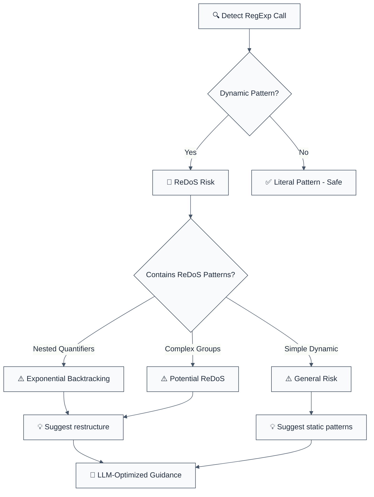

# detect-non-literal-regexp

> **Keywords:** ReDoS, CWE-400, security, ESLint rule, regular expression denial of service, RegExp, regex injection, performance, auto-fix, LLM-optimized, code security

Detects `RegExp(variable)`, which might allow an attacker to DOS your server with a long-running regular expression. This rule is part of [`@forge-js/eslint-plugin-llm-optimized`](https://www.npmjs.com/package/@forge-js/eslint-plugin-llm-optimized) and provides LLM-optimized error messages with fix suggestions.

**🚨 Security rule** | **💡 Provides LLM-optimized guidance** | **⚠️ Set to error in `recommended`**

## Quick Summary

| Aspect | Details |
|--------|---------|
| **CWE Reference** | CWE-400 (ReDoS - Regular Expression Denial of Service) |
| **Severity** | High (performance/security issue) |
| **Auto-Fix** | ⚠️ Suggests fixes (manual application) |
| **Category** | Security |
| **ESLint MCP** | ✅ Optimized for ESLint MCP integration |
| **Best For** | Applications processing user input with regex, validation libraries |

## Rule Details

This rule detects dangerous use of RegExp constructor with dynamic patterns that can lead to Regular Expression Denial of Service (ReDoS) attacks.



## Error Message Format

```
🚨 Security: ReDoS Vulnerability | new RegExp(userPattern) | src/validation.ts:67
📊 Risk Level: HIGH (CWE-400: Uncontrolled Resource Consumption)
🔍 Issue: ReDoS allows server resource exhaustion
💡 Safe Alternative: Pre-defined RegExp constants
🔧 Refactoring Steps:
   1. Create a whitelist of allowed regex patterns
   2. Use object lookup: PATTERNS[userChoice]
   3. If dynamic needed: escape input with regex escaping function
   4. Add pattern length validation
   5. Consider using a safe regex library
⏱️  Estimated effort: 15-20 minutes
🔗 Security Impact: Prevents server DoS attacks
```

## Configuration

| Option | Type | Default | Description |
|--------|------|---------|-------------|
| `allowLiterals` | `boolean` | `false` | Allow literal string regex patterns |
| `additionalPatterns` | `string[]` | `[]` | Additional RegExp creation patterns |
| `maxPatternLength` | `number` | `100` | Maximum allowed pattern length |

## Examples

### ❌ Incorrect

```typescript
// ReDoS - CRITICAL risk
new RegExp(userInput); // Attacker can cause exponential backtracking

// Complex dynamic patterns - HIGH risk
RegExp(`^${userPattern}$`); // Unvalidated pattern construction

// ReDoS in literal regex - MEDIUM risk
/(a+)+b/.test(input); // Nested quantifiers cause backtracking
```

### ✅ Correct

```typescript
// Pre-defined patterns
const PATTERNS = {
  email: /^[a-zA-Z0-9._%+-]+@[a-zA-Z0-9.-]+\.[a-zA-Z]{2,}$/,
  phone: /^\+?[\d\s\-\(\)]+$/,
  url: /^https?:\/\/[^\s/$.?#].[^\s]*$/i
};

// Safe usage
if (PATTERNS[userChoice]) {
  const result = PATTERNS[userChoice].test(input);
}

// Dynamic with escaping
function escapeRegex(string: string): string {
  return string.replace(/[.*+?^${}()|[\]\\]/g, '\\$&');
}

const safePattern = new RegExp(`^${escapeRegex(userInput)}$`);

// Length validation
if (userPattern.length > 100) {
  throw new Error('Pattern too long');
}
```

## ReDoS Prevention

### Understanding ReDoS

```javascript
// ❌ Vulnerable: Nested quantifiers
/(a+)+b/.test('aaaaaaaaaaaaaab'); // Exponential backtracking

// ✅ Safe: Restructure
/a+b/.test('aaaaaaaaaaaaaab'); // Linear time
```

### Safe Alternatives

1. **Pre-defined Patterns**
   ```typescript
   const SAFE_PATTERNS = {
     email: /^[a-zA-Z0-9._%+-]+@[a-zA-Z0-9.-]+\.[a-zA-Z]{2,}$/,
     uuid: /^[0-9a-f]{8}-[0-9a-f]{4}-[0-9a-f]{4}-[0-9a-f]{4}-[0-9a-f]{12}$/i
   };
   ```

2. **Input Escaping**
   ```typescript
   function escapeRegex(string: string): string {
     return string.replace(/[.*+?^${}()|[\]\\]/g, '\\$&');
   }
   ```

3. **Safe Libraries**
   ```typescript
   import safeRegex from 'safe-regex';
   if (safeRegex(userPattern)) {
     new RegExp(userPattern);
   }
   ```

## Common ReDoS Patterns

| Pattern | Risk | Example | Safe Alternative |
|---------|------|---------|------------------|
| `(a+)+` | Critical | `/(a+)+b/` | `/a+b/` |
| `(a*)*` | Critical | `/(a*)*b/` | `/a*b/` |
| `(a\|b)*` | High | Complex alternations | Simplify |
| `.*` | Medium | Greedy matching | Be specific |

## Migration Guide

### Phase 1: Discovery
```javascript
{
  rules: {
    '@forge-js/detect-non-literal-regexp': 'warn'
  }
}
```

### Phase 2: Replace Dynamic Construction
```typescript
// Replace dynamic RegExp
new RegExp(userInput) → PATTERNS[userChoice]

// Add escaping for necessary dynamic patterns
new RegExp(escapeRegex(userInput))
```

### Phase 3: Test Performance
```typescript
// Test with potentially malicious inputs
const maliciousInputs = [
  'a'.repeat(10000) + 'b',  // Triggers backtracking
  '(a+)+b'.repeat(1000),    // Complex patterns
  '[a-z]*'.repeat(100)      // Nested quantifiers
];
```

## Comparison with Alternatives

| Feature | detect-non-literal-regexp | eslint-plugin-security | eslint-plugin-sonarjs |
|---------|---------------------------|------------------------|----------------------|
| **ReDoS Detection** | ✅ Yes | ⚠️ Limited | ⚠️ Limited |
| **CWE Reference** | ✅ CWE-400 included | ⚠️ Limited | ⚠️ Limited |
| **LLM-Optimized** | ✅ Yes | ❌ No | ❌ No |
| **ESLint MCP** | ✅ Optimized | ❌ No | ❌ No |
| **Fix Suggestions** | ✅ Detailed | ⚠️ Basic | ⚠️ Basic |

## Related Rules

- [`detect-eval-with-expression`](./detect-eval-with-expression.md) - Prevents code injection via eval()
- [`detect-child-process`](./detect-child-process.md) - Prevents command injection
- [`detect-non-literal-fs-filename`](./detect-non-literal-fs-filename.md) - Prevents path traversal
- [`detect-object-injection`](./detect-object-injection.md) - Prevents prototype pollution

## Further Reading

- **[OWASP ReDoS Attacks](https://owasp.org/www-community/attacks/Regular_expression_Denial_of_Service_-_ReDoS)** - ReDoS attack guide
- **[Safe Regex Library](https://github.com/substack/safe-regex)** - Safe regex patterns
- **[CWE-400: Uncontrolled Resource Consumption](https://cwe.mitre.org/data/definitions/400.html)** - Official CWE entry
- **[ESLint MCP Setup](https://eslint.org/docs/latest/use/mcp)** - Enable AI assistant integration
