# no-document-cookie

> **Keywords:** document.cookie, Cookie Store API, cookies, browser storage, security, XSS prevention, ESLint rule, LLM-optimized

Prevents direct usage of `document.cookie` and encourages the use of the Cookie Store API or cookie libraries. This rule is part of [`@forge-js/eslint-plugin-llm-optimized`](https://www.npmjs.com/package/@forge-js/eslint-plugin-llm-optimized) and provides LLM-optimized error messages.

## Quick Summary

| Aspect         | Details                                                              |
| -------------- | -------------------------------------------------------------------- |
| **Severity**   | Warning (security)                                                   |
| **Auto-Fix**   | ❌ No (requires manual refactoring)                                  |
| **Category**   | Security                                                             |
| **ESLint MCP** | ✅ Optimized for ESLint MCP integration                              |
| **Best For**   | Modern web applications, secure cookie management                    |

## Rule Details

```mermaid
%%{init: {
  'theme': 'base',
  'themeVariables': {
    'primaryColor': '#f8fafc',
    'primaryTextColor': '#1e293b',
    'primaryBorderColor': '#334155',
    'lineColor': '#475569',
    'c0': '#f8fafc',
    'c1': '#f1f5f9',
    'c2': '#e2e8f0',
    'c3': '#cbd5e1'
  }
}}%%
flowchart TD
    A[🔍 Detect document.cookie] --> B{Which Operation?}
    B -->|Reading| C{allowReading?}
    B -->|Writing| D[⚠️ Report: Use Cookie Store API]
    
    C -->|✅ Yes| E[✅ Pass]
    C -->|❌ No| F[⚠️ Report: Use Cookie Store API]
    
    classDef startNode fill:#f0fdf4,stroke:#16a34a,stroke-width:2px,color:#1f2937
    classDef errorNode fill:#fef2f2,stroke:#dc2626,stroke-width:2px,color:#1f2937
    classDef processNode fill:#eff6ff,stroke:#2563eb,stroke-width:2px,color:#1f2937
    
    class A startNode
    class D,F errorNode
    class E processNode
```



### Why This Matters

| Issue                   | Impact                          | Solution                  |
| ----------------------- | ------------------------------- | ------------------------- |
| 🔐 **Security**         | XSS attacks can steal cookies   | Use HttpOnly cookies      |
| 🧩 **Parsing**          | Manual string parsing is error-prone | Cookie Store API       |
| 📊 **Performance**      | Synchronous blocking operation  | Async Cookie Store API    |
| 🔧 **Maintainability**  | Complex cookie manipulation code | Use cookie libraries     |

## Configuration

| Option         | Type      | Default | Description                              |
| -------------- | --------- | ------- | ---------------------------------------- |
| `allowReading` | `boolean` | `true`  | Allow reading from `document.cookie`     |

## Examples

### ❌ Incorrect

```javascript
// Writing to document.cookie
document.cookie = "user=john; expires=Fri, 31 Dec 2025 23:59:59 GMT";

// Setting multiple cookies
document.cookie = "theme=dark";
document.cookie = "lang=en";

// Deleting a cookie
document.cookie = "user=; expires=Thu, 01 Jan 1970 00:00:00 GMT";
```

### ✅ Correct

```javascript
// Using Cookie Store API (modern browsers)
await cookieStore.set("user", "john");
await cookieStore.delete("user");

// Using js-cookie library
import Cookies from 'js-cookie';
Cookies.set('user', 'john', { expires: 365 });
Cookies.remove('user');

// Using universal-cookie
import Cookies from 'universal-cookie';
const cookies = new Cookies();
cookies.set('user', 'john', { path: '/' });
```

## Configuration Examples

### Basic Usage (Default - Allow Reading)

```javascript
{
  rules: {
    '@forge-js/no-document-cookie': 'error'
  }
}
```

### Strict Mode (Block All Access)

```javascript
{
  rules: {
    '@forge-js/no-document-cookie': ['error', {
      allowReading: false
    }]
  }
}
```

### Warning Mode for Migration

```javascript
{
  rules: {
    '@forge-js/no-document-cookie': ['warn', {
      allowReading: true
    }]
  }
}
```

## Migration Guide

### document.cookie to Cookie Store API

| document.cookie Pattern                    | Cookie Store API Equivalent              |
| ------------------------------------------ | ---------------------------------------- |
| `document.cookie = "key=value"`            | `await cookieStore.set("key", "value")`  |
| `const cookies = document.cookie`          | `await cookieStore.getAll()`             |
| `document.cookie = "key=; max-age=0"`      | `await cookieStore.delete("key")`        |

### Example Migration

```javascript
// ❌ Before: document.cookie
function setUserCookie(userId) {
  document.cookie = `user=${userId}; path=/; secure; samesite=strict`;
}

function getUserCookie() {
  const match = document.cookie.match(/user=([^;]+)/);
  return match ? match[1] : null;
}

// ✅ After: Cookie Store API
async function setUserCookie(userId) {
  await cookieStore.set({
    name: 'user',
    value: userId,
    path: '/',
    secure: true,
    sameSite: 'strict'
  });
}

async function getUserCookie() {
  const cookie = await cookieStore.get('user');
  return cookie?.value ?? null;
}
```

## When Not To Use

| Scenario                    | Recommendation                              |
| --------------------------- | ------------------------------------------- |
| 🏛️ **Legacy browsers**      | Cookie Store API not supported everywhere   |
| 📦 **Server-side parsing**  | Reading cookies on server is different      |
| 🔄 **Quick debugging**      | Consider using `allowReading: true`         |

## Browser Support

| Browser         | Cookie Store API | Recommendation                  |
| --------------- | ---------------- | ------------------------------- |
| Chrome 87+      | ✅ Yes           | Use Cookie Store API            |
| Edge 87+        | ✅ Yes           | Use Cookie Store API            |
| Firefox         | ❌ No            | Use js-cookie or universal-cookie |
| Safari          | ❌ No            | Use js-cookie or universal-cookie |

## Related Rules

- [`no-insecure-cookie-settings`](./no-insecure-cookie-settings.md) - Enforce secure cookie settings

## Further Reading

- **[Cookie Store API](https://developer.mozilla.org/en-US/docs/Web/API/Cookie_Store_API)** - MDN documentation
- **[js-cookie](https://github.com/js-cookie/js-cookie)** - Popular cookie library
- **[HttpOnly Cookies](https://owasp.org/www-community/HttpOnly)** - OWASP security guide
- **[ESLint MCP Setup](https://eslint.org/docs/latest/use/mcp)** - Enable AI assistant integration

