# no-unescaped-url-parameter

> **Keywords:** URL encoding, CWE-79, security, ESLint rule, URL parameters, encodeURIComponent, URLSearchParams, XSS, open redirect, auto-fix, LLM-optimized, code security

Detects unescaped URL parameters that can lead to Cross-Site Scripting (XSS) or open redirect vulnerabilities. This rule is part of [`@forge-js/eslint-plugin-llm-optimized`](https://www.npmjs.com/package/@forge-js/eslint-plugin-llm-optimized) and provides LLM-optimized error messages that AI assistants can automatically fix.

⚠️ This rule **_warns_** by default in the `recommended` config.

## Quick Summary

| Aspect            | Details                                                                          |
| ----------------- | -------------------------------------------------------------------------------- |
| **CWE Reference** | CWE-79 (Cross-site Scripting)                                                   |
| **Severity**      | High (security vulnerability)                                                   |
| **Auto-Fix**      | ✅ Yes (suggests encodeURIComponent or URLSearchParams)                           |
| **Category**      | Security                                                                         |
| **ESLint MCP**    | ✅ Optimized for ESLint MCP integration                                          |
| **Best For**      | All web applications constructing URLs, API clients, redirect handlers            |

## Rule Details

Unescaped URL parameters can allow attackers to inject malicious code or manipulate URLs for phishing attacks. This rule detects URL construction patterns where user input is directly concatenated or interpolated without proper encoding.

### Why This Matters

| Issue                 | Impact                              | Solution                   |
| --------------------- | ----------------------------------- | -------------------------- |
| 🔒 **Security**       | XSS attacks via URL parameters      | Use encodeURIComponent      |
| 🐛 **Open Redirect**  | Phishing attacks via redirect URLs  | Validate and encode URLs    |
| 🔐 **Data Integrity** | Malformed URLs can break functionality | URLSearchParams            |
| 📊 **Compliance**     | Violates security best practices     | Always encode URL parameters |

## Detection Patterns

The rule detects:

- **Template literals**: URL construction with unescaped user input in template strings
- **String concatenation**: URL construction using `+` operator with unescaped parameters
- **User input patterns**: `req.query`, `req.params`, `userInput`, `searchParams`

## Examples

### ❌ Incorrect

```typescript
// Unescaped in template literal
const url = `https://example.com?q=${req.query.q}`; // ❌ XSS vulnerability

// Unescaped in string concatenation
const url = 'https://example.com?search=' + userInput; // ❌ XSS vulnerability

// Unescaped route parameters
const url = `https://example.com/user/${req.params.id}`; // ❌ Open redirect risk

// Unescaped Next.js searchParams
const url = `https://example.com?redirect=${searchParams.get('url')}`; // ❌ Open redirect
```

### ✅ Correct

```typescript
// Using encodeURIComponent
const url = `https://example.com?q=${encodeURIComponent(req.query.q)}`; // ✅ Safe

// Using URLSearchParams
const params = new URLSearchParams({ q: req.query.q });
const url = `https://example.com?${params}`; // ✅ Safe

// Encoding in string concatenation
const url = 'https://example.com?search=' + encodeURIComponent(userInput); // ✅ Safe

// Encoding route parameters
const url = `https://example.com/user/${encodeURIComponent(req.params.id)}`; // ✅ Safe

// Using URLSearchParams for multiple parameters
const params = new URLSearchParams({
  q: searchParams.get('q'),
  page: searchParams.get('page'),
});
const url = `https://example.com?${params}`; // ✅ Safe
```

## Configuration

```javascript
{
  rules: {
    '@forge-js/llm-optimized/no-unescaped-url-parameter': ['error', {
      allowInTests: false,                    // Allow in test files
      trustedLibraries: ['url', 'querystring'], // Trusted URL construction libraries
      ignorePatterns: []                     // Additional safe patterns to ignore
    }]
  }
}
```

## Options

| Option              | Type       | Default                | Description                                    |
| ------------------- | ---------- | ---------------------- | ---------------------------------------------- |
| `allowInTests`      | `boolean`  | `false`                | Allow unescaped URL parameters in test files  |
| `trustedLibraries`  | `string[]` | `['url', 'querystring']` | Trusted URL construction libraries to recognize |
| `ignorePatterns`    | `string[]` | `[]`                   | Additional safe patterns to ignore              |

## Rule Logic Flow

```mermaid
%%{init: {
  'theme': 'base',
  'themeVariables': {
    'primaryColor': '#f8fafc',
    'primaryTextColor': '#1e293b',
    'primaryBorderColor': '#334155',
    'lineColor': '#475569',
    'c0': '#f8fafc',
    'c1': '#f1f5f9',
    'c2': '#e2e8f0',
    'c3': '#cbd5e1'
  }
}}%%
flowchart TD
    A[🔍 TemplateLiteral/BinaryExpression Found] --> B{In Test File?}
    B -->|Yes & allowInTests| C[✅ Skip]
    B -->|No| D{Matches Ignore Pattern?}
    D -->|Yes| C
    D -->|No| E{Is URL Construction?}
    E -->|No| C
    E -->|Yes| F{Check Expressions}
    F --> G{User Input Pattern?}
    G -->|No| C
    G -->|Yes| H{Inside Encoding Call?}
    H -->|Yes| C
    H -->|No| I[🚨 Report Error]
    I --> J[💡 Suggest Fixes]
    J --> K[Use encodeURIComponent]
    J --> L[Use URLSearchParams]
    
    classDef startNode fill:#f0fdf4,stroke:#16a34a,stroke-width:2px,color:#1f2937
    classDef errorNode fill:#fef2f2,stroke:#dc2626,stroke-width:2px,color:#1f2937
    classDef processNode fill:#eff6ff,stroke:#2563eb,stroke-width:2px,color:#1f2937
    classDef skipNode fill:#f1f5f9,stroke:#64748b,stroke-width:2px,color:#1f2937
    
    class A startNode
    class I errorNode
    class E,F,G,H processNode
    class C skipNode
```



## Best Practices

### 1. Use encodeURIComponent for Query Parameters

```typescript
// ✅ Good - Encodes special characters
const query = 'hello world & more';
const url = `https://example.com?q=${encodeURIComponent(query)}`;
// Result: https://example.com?q=hello%20world%20%26%20more
```

### 2. Use URLSearchParams for Multiple Parameters

```typescript
// ✅ Good - Handles multiple parameters automatically
const params = new URLSearchParams({
  q: 'search term',
  page: '1',
  sort: 'date',
});
const url = `https://example.com?${params}`;
// Result: https://example.com?q=search+term&page=1&sort=date
```

### 3. Use encodeURI for Path Segments

```typescript
// ✅ Good - Encodes path segments (but preserves /)
const path = 'user/profile';
const url = `https://example.com/${encodeURI(path)}`;
// Result: https://example.com/user/profile
```

### 4. Validate Before Encoding

```typescript
// ✅ Good - Validate then encode
function buildRedirectUrl(input: string): string {
  // Validate URL format
  if (!input.startsWith('https://') && !input.startsWith('/')) {
    throw new Error('Invalid redirect URL');
  }
  // Encode if it's a relative path
  if (input.startsWith('/')) {
    return encodeURIComponent(input);
  }
  return input;
}
```

### 5. Use URL Constructor for Complex URLs

```typescript
// ✅ Good - URL constructor handles encoding automatically
const url = new URL('https://example.com');
url.searchParams.set('q', userInput);
url.searchParams.set('page', '1');
const finalUrl = url.toString(); // Automatically encoded
```

## Related Rules

- [`no-unvalidated-user-input`](./no-unvalidated-user-input.md) - Detects unvalidated user input
- [`no-unsanitized-html`](./no-unsanitized-html.md) - Detects unsanitized HTML injection
- [`no-sql-injection`](./no-sql-injection.md) - Detects SQL injection vulnerabilities
- [`no-missing-cors-check`](./no-missing-cors-check.md) - Detects missing CORS validation

## Resources

- [CWE-79: Cross-site Scripting](https://cwe.mitre.org/data/definitions/79.html)
- [OWASP URL Validation Cheat Sheet](https://cheatsheetseries.owasp.org/cheatsheets/Input_Validation_Cheat_Sheet.html)
- [MDN: encodeURIComponent](https://developer.mozilla.org/en-US/docs/Web/JavaScript/Reference/Global_Objects/encodeURIComponent)
- [MDN: URLSearchParams](https://developer.mozilla.org/en-US/docs/Web/API/URLSearchParams)
- [OWASP Open Redirect Prevention](https://cheatsheetseries.owasp.org/cheatsheets/Unvalidated_Redirects_and_Forwards_Cheat_Sheet.html)

