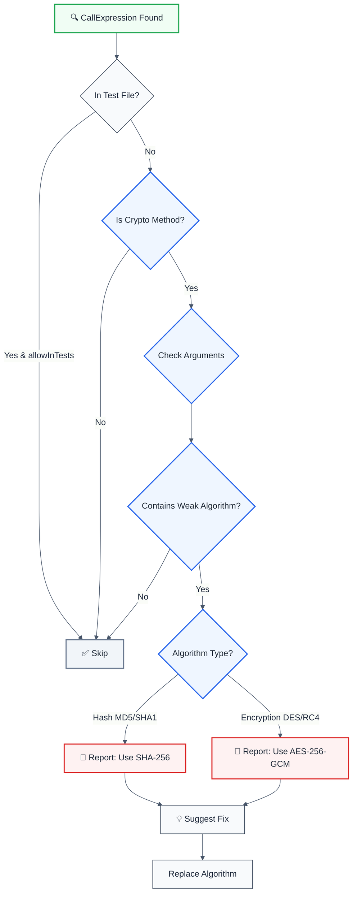

# no-weak-crypto

> **Keywords:** weak cryptography, CWE-327, security, ESLint rule, MD5, SHA1, DES, RC4, encryption, hashing, cryptography security, OWASP, crypto algorithms, auto-fix, LLM-optimized, code security, SHA-256, AES-256, bcrypt, scrypt

Detects use of weak cryptography algorithms (MD5, SHA1, DES, 3DES, RC4) and suggests secure alternatives. This rule is part of [`@forge-js/eslint-plugin-llm-optimized`](https://www.npmjs.com/package/@forge-js/eslint-plugin-llm-optimized) and provides LLM-optimized error messages that AI assistants can automatically fix.

⚠️ This rule **_warns_** by default in the `recommended` config.

## Quick Summary

| Aspect | Details |
|--------|---------|
| **CWE Reference** | CWE-327 (Use of a Broken or Risky Cryptographic Algorithm) |
| **Severity** | Critical (security vulnerability) |
| **Auto-Fix** | ✅ Yes (suggests secure algorithm replacements) |
| **Category** | Security |
| **ESLint MCP** | ✅ Optimized for ESLint MCP integration |
| **Best For** | Applications using cryptography, password hashing, data encryption, security-critical code |

## Rule Details

Weak cryptography algorithms are vulnerable to attacks and should be replaced with modern, secure alternatives. This rule detects deprecated algorithms like MD5, SHA1, DES, and RC4 that are no longer considered secure.

### Why This Matters

| Issue | Impact | Solution |
|-------|--------|----------|
| 🔒 **Security** | Weak algorithms can be broken by attackers | Use SHA-256, SHA-512, or SHA-3 |
| 🐛 **Data Breach** | MD5/SHA1 collisions allow forgery | Use AES-256-GCM for encryption |
| 🔐 **Password Security** | Weak hashing exposes passwords | Use bcrypt, scrypt, or Argon2 |
| 📊 **Compliance** | Violates security standards (FIPS, PCI-DSS) | Migrate to approved algorithms |

## Detection Patterns

The rule detects:

- **MD5**: Deprecated hash function (collision attacks)
- **SHA-1**: Deprecated hash function (collision attacks)
- **DES**: Weak encryption (56-bit key, brute-forceable)
- **3DES**: Deprecated encryption (slow, vulnerable)
- **RC4**: Weak stream cipher (biases, vulnerabilities)

## Examples

### ❌ Incorrect

```typescript
// Weak hash algorithms
const hash = crypto.createHash("md5").update(data);
const hash2 = crypto.createHash("sha1").update(data);

// Weak encryption algorithms
const cipher = crypto.createCipher("des", key);
const cipher2 = crypto.createCipher("des-ede3", key); // 3DES
const cipher3 = crypto.createCipher("rc4", key);

// Case insensitive detection
const hash3 = crypto.createHash("MD5").update(data);
const hash4 = crypto.createHash("Sha1").update(data);
```

### ✅ Correct

```typescript
// Strong hash algorithms
const hash = crypto.createHash("sha256").update(data);
const hash2 = crypto.createHash("sha512").update(data);
const hash3 = crypto.createHash("sha3-256").update(data);

// Strong encryption algorithms
const cipher = crypto.createCipheriv("aes-256-gcm", key, iv);
const cipher2 = crypto.createCipheriv("chacha20-poly1305", key, iv);

// Password hashing
const passwordHash = await bcrypt.hash(password, 10);
const passwordHash2 = await crypto.scrypt(password, salt, 64);
const passwordHash3 = await argon2.hash(password);
```

## Configuration

```javascript
{
  rules: {
    '@forge-js/llm-optimized/no-weak-crypto': ['error', {
      allowInTests: false,                    // Allow weak crypto in test files
      additionalWeakAlgorithms: [],           // Additional algorithms to detect
      trustedLibraries: ['crypto', 'crypto-js'] // Trusted crypto libraries
    }]
  }
}
```

## Options

| Option | Type | Default | Description |
|--------|------|---------|-------------|
| `allowInTests` | `boolean` | `false` | Allow weak crypto in test files (`.test.ts`, `.spec.ts`) |
| `additionalWeakAlgorithms` | `string[]` | `[]` | Additional weak algorithms to detect (e.g., `['md4', 'blowfish']`) |
| `trustedLibraries` | `string[]` | `['crypto', 'crypto-js']` | Trusted crypto libraries to check |

### Allowing Weak Crypto in Tests

```javascript
{
  rules: {
    '@forge-js/llm-optimized/no-weak-crypto': ['error', {
      allowInTests: true  // Allows weak crypto in .test.ts and .spec.ts files
    }]
  }
}
```

### Adding Custom Weak Algorithms

```javascript
{
  rules: {
    '@forge-js/llm-optimized/no-weak-crypto': ['error', {
      additionalWeakAlgorithms: ['md4', 'blowfish', 'rc2']
    }]
  }
}
```

## Rule Logic Flow



## Best Practices

### 1. Use SHA-256 or SHA-512 for Hashing

```typescript
// ✅ Good - Strong hash algorithm
const hash = crypto.createHash("sha256").update(data).digest("hex");

// ✅ Good - Even stronger
const hash = crypto.createHash("sha512").update(data).digest("hex");
```

### 2. Use AES-256-GCM for Encryption

```typescript
// ✅ Good - Authenticated encryption
const iv = crypto.randomBytes(16);
const cipher = crypto.createCipheriv("aes-256-gcm", key, iv);
```

### 3. Use bcrypt for Password Hashing

```typescript
// ✅ Good - Password-specific hashing
import bcrypt from 'bcrypt';
const hash = await bcrypt.hash(password, 10);
const isValid = await bcrypt.compare(password, hash);
```

### 4. Use scrypt for Key Derivation

```typescript
// ✅ Good - Key derivation function
const key = await crypto.scrypt(password, salt, 64);
```

### 5. Use Argon2 for Modern Password Hashing

```typescript
// ✅ Good - Memory-hard password hashing
import argon2 from 'argon2';
const hash = await argon2.hash(password);
const isValid = await argon2.verify(hash, password);
```

## Algorithm Migration Guide

| Weak Algorithm | Secure Alternative | Migration Effort |
|----------------|-------------------|------------------|
| MD5 | SHA-256 | 5 minutes |
| SHA-1 | SHA-256 or SHA-512 | 5 minutes |
| DES | AES-256-GCM | 15 minutes |
| 3DES | AES-256-GCM | 15 minutes |
| RC4 | ChaCha20-Poly1305 | 15 minutes |

### Migration Example: MD5 → SHA-256

```typescript
// ❌ Before
const hash = crypto.createHash("md5").update(data).digest("hex");

// ✅ After
const hash = crypto.createHash("sha256").update(data).digest("hex");
```

### Migration Example: DES → AES-256-GCM

```typescript
// ❌ Before
const cipher = crypto.createCipher("des", key);

// ✅ After
const iv = crypto.randomBytes(16);
const cipher = crypto.createCipheriv("aes-256-gcm", key, iv);
```

## Related Rules

- [`no-hardcoded-credentials`](./no-hardcoded-credentials.md) - Detects hardcoded passwords and API keys
- [`database-injection`](./database-injection.md) - Comprehensive database security
- [`detect-eval-with-expression`](./detect-eval-with-expression.md) - Code injection detection

## Resources

- [CWE-327: Use of a Broken or Risky Cryptographic Algorithm](https://cwe.mitre.org/data/definitions/327.html)
- [OWASP: Weak Cryptography](https://owasp.org/www-community/vulnerabilities/Weak_Cryptography)
- [NIST Cryptographic Standards](https://csrc.nist.gov/projects/cryptographic-standards-and-guidelines)
- [Node.js Crypto Documentation](https://nodejs.org/api/crypto.html)
- [OWASP Cryptographic Storage Cheat Sheet](https://cheatsheetseries.owasp.org/cheatsheets/Cryptographic_Storage_Cheat_Sheet.html)
- [bcrypt Documentation](https://www.npmjs.com/package/bcrypt)
- [Argon2 Documentation](https://www.npmjs.com/package/argon2)

## Version History

- **1.3.0** - Initial release with comprehensive weak crypto detection patterns

