# @forge-js/eslint-plugin-utils

Comprehensive TypeScript utilities for building ESLint plugins, inspired by [typescript-eslint](https://typescript-eslint.io)'s infrastructure.

## Features

✅ **Rule Creator** - Factory function for creating well-typed ESLint rules  
✅ **AST Utilities** - Helper functions for traversing and analyzing ESTree/TSESTree nodes  
✅ **Type Utilities** - Type-aware linting utilities using TypeScript compiler API  
✅ **Fully Typed** - Complete TypeScript support with type safety  
✅ **ESLint 8+ & 9+ Compatible** - Works with both major ESLint versions

## Installation

```bash
pnpm add -D @forge-js/eslint-plugin-utils @typescript-eslint/parser typescript
```

## Usage

### Rule Creator

Create rules with automatic documentation links:

```typescript
import { createRuleCreator } from '@forge-js/eslint-plugin-utils';

// Create a rule creator with custom documentation URL
const createRule = createRuleCreator(
  (name) => `https://github.com/my-org/eslint-plugin/docs/rules/${name}.md`
);

export const myRule = createRule({
  name: 'my-rule',
  meta: {
    type: 'problem',
    docs: {
      description: 'Description of my rule',
      recommended: 'recommended',
    },
    messages: {
      myMessage: 'This is a violation message',
    },
    schema: [],
  },
  defaultOptions: [],
  create(context) {
    return {
      Identifier(node) {
        // Rule logic
      },
    };
  },
});
```

### AST Utilities

Work with AST nodes efficiently:

```typescript
import {
  isNodeOfType,
  isFunctionNode,
  isCallExpression,
  isMemberExpression,
  getIdentifierName,
} from '@forge-js/eslint-plugin-utils';

createRule({
  // ...
  create(context) {
    return {
      CallExpression(node) {
        // Check if it's console.log()
        if (isMemberExpression(node.callee, 'console', 'log')) {
          context.report({
            node,
            messageId: 'noConsoleLog',
          });
        }

        // Check if it's a specific function call
        if (isCallExpression(node, 'dangerousFunction')) {
          context.report({
            node,
            messageId: 'noDangerousFunction',
          });
        }
      },
      FunctionDeclaration(node) {
        if (isFunctionNode(node)) {
          const name = node.id?.name;
          // Process function
        }
      },
    };
  },
});
```

### Type Utilities (Type-Aware Rules)

Create type-aware rules using TypeScript compiler API:

```typescript
import {
  getParserServices,
  hasParserServices,
  getTypeOfNode,
  isStringType,
  isArrayType,
  isPromiseType,
} from '@forge-js/eslint-plugin-utils';

createRule({
  // ...
  create(context) {
    // Check if type information is available
    if (!hasParserServices(context)) {
      return {};
    }

    const parserServices = getParserServices(context);
    const checker = parserServices.program.getTypeChecker();

    return {
      Identifier(node) {
        const type = getTypeOfNode(node, parserServices);

        if (isStringType(type)) {
          // Handle string types
        }

        if (isArrayType(type, checker)) {
          // Handle array types
        }

        if (isPromiseType(type, checker)) {
          // Handle promise types
        }
      },
    };
  },
});
```

## API Reference

### Rule Creator

| Function                        | Description                                                  |
| ------------------------------- | ------------------------------------------------------------ |
| `createRuleCreator(urlCreator)` | Create a custom rule creator with documentation URL resolver |
| `createRule`                    | Default rule creator with standard URL pattern               |

### AST Utilities

| Function                                     | Description                                              |
| -------------------------------------------- | -------------------------------------------------------- |
| `isNodeOfType(node, type)`                   | Check if node is of specific type                        |
| `isFunctionNode(node)`                       | Check if node is a function                              |
| `isClassNode(node)`                          | Check if node is a class                                 |
| `isMemberExpression(node, object, property)` | Check if node is member expression (e.g., `console.log`) |
| `isCallExpression(node, object, method)`     | Check if node is call expression                         |
| `getIdentifierName(node)`                    | Get identifier name from node                            |
| `getFunctionName(node)`                      | Get function name                                        |
| `isInsideNode(node, parentType, ancestors)`  | Check if node is inside specific parent                  |
| `getAncestorOfType(type, ancestors)`         | Get first ancestor of type                               |
| `isLiteral(node)`                            | Check if node is literal                                 |
| `isTemplateLiteral(node)`                    | Check if node is template literal                        |
| `getStaticValue(node)`                       | Get static value from literal node                       |

### Type Utilities

| Function                                         | Description                                 |
| ------------------------------------------------ | ------------------------------------------- |
| `getParserServices(context)`                     | Get parser services (throws if unavailable) |
| `hasParserServices(context)`                     | Check if parser services available          |
| `getTypeOfNode(node, services)`                  | Get TypeScript type of node                 |
| `isAnyType(type)`                                | Check if type is `any`                      |
| `isUnknownType(type)`                            | Check if type is `unknown`                  |
| `isNeverType(type)`                              | Check if type is `never`                    |
| `isNullableType(type)`                           | Check if type is nullable                   |
| `isStringType(type)`                             | Check if type is string                     |
| `isNumberType(type)`                             | Check if type is number                     |
| `isBooleanType(type)`                            | Check if type is boolean                    |
| `isArrayType(type, checker)`                     | Check if type is array                      |
| `isPromiseType(type, checker)`                   | Check if type is promise                    |
| `getTypeArguments(type, checker)`                | Get type arguments of generic               |
| `typeMatchesPredicateRecursive(type, predicate)` | Check if type matches predicate recursively |

## Project Structure

```mermaid
%%{init: {
  'theme': 'base',
  'themeVariables': {
    'primaryColor': '#f8fafc',
    'primaryTextColor': '#1e293b',
    'primaryBorderColor': '#334155',
    'lineColor': '#475569',
    'c0': '#f8fafc',
    'c1': '#f1f5f9',
    'c2': '#e2e8f0',
    'c3': '#cbd5e1'
  }
}}%%
flowchart TD
    A[📦 eslint-plugin-utils] --> B[🏗️ rule-creator.ts]
    A --> C[🌳 ast-utils.ts]
    A --> D[📘 type-utils.ts]
    A --> E[📋 index.ts]

    B --> B1[RuleCreator Factory]
    C --> C1[AST Helpers]
    D --> D1[Type Checking]

    classDef rootNode fill:#f0fdf4,stroke:#16a34a,stroke-width:2px,color:#1f2937
    classDef fileNode fill:#eff6ff,stroke:#2563eb,stroke-width:2px,color:#1f2937
    classDef utilNode fill:#fef3c7,stroke:#f59e0b,stroke-width:2px,color:#1f2937

    class A rootNode
    class B,C,D,E fileNode
    class B1,C1,D1 utilNode
```



## Building

```bash
# Build the package
pnpm nx build eslint-plugin-utils

# Watch mode
pnpm nx build eslint-plugin-utils --watch
```

## Usage in Monorepo

This package is designed to be shared across multiple ESLint plugin packages in a monorepo:

```typescript
// In any plugin package
import { createRule, isCallExpression } from '@forge-js/eslint-plugin-utils';

export const myRule = createRule({
  // ... your rule implementation
});
```

## Compatibility

| Package                   | Version            |
| ------------------------- | ------------------ |
| ESLint                    | ^8.0.0 \|\| ^9.0.0 |
| TypeScript                | >=4.0.0            |
| @typescript-eslint/parser | >=6.0.0            |
| @typescript-eslint/utils  | ^8.0.0             |

## Inspired By

This package is heavily inspired by [@typescript-eslint/utils](https://typescript-eslint.io/packages/utils/) and follows similar patterns for rule creation and AST manipulation. The typescript-eslint team has built an exceptional infrastructure for TypeScript ESLint rules, and this package aims to provide a similar experience for custom plugin development.

## Related Packages

- [@typescript-eslint/utils](https://www.npmjs.com/package/@typescript-eslint/utils) - Official typescript-eslint utilities
- [@typescript-eslint/parser](https://www.npmjs.com/package/@typescript-eslint/parser) - TypeScript parser for ESLint
- [@typescript-eslint/typescript-estree](https://www.npmjs.com/package/@typescript-eslint/typescript-estree) - TypeScript AST converter

## License

MIT © Ofri Peretz
