# @forge-js/eslint-plugin-llm-optimized

A solid TypeScript-based ESLint plugin infrastructure inspired by [typescript-eslint](https://typescript-eslint.io).

## Features

✅ **TypeScript-First** - Built entirely in TypeScript with full type safety  
✅ **ESLint 8+ & 9+ Compatible** - Works with both major ESLint versions  
✅ **NX Monorepo** - Leverages NX for build caching and task orchestration  
✅ **Well-Tested** - Comprehensive test infrastructure using Vitest  
✅ **Extensible** - Easy-to-use rule creator utilities

## Installation

```bash
# Full package name
pnpm add -D @forge-js/eslint-plugin-llm-optimized @typescript-eslint/parser
```

## Usage

**Important:** ESLint automatically strips the `eslint-plugin-` prefix from package names. You can use the shorthand `@forge-js/llm-optimized` in your configs.

### Recommended Configuration (ESLint 9+)

```javascript
// eslint.config.mjs
import llmOptimized from '@forge-js/eslint-plugin-llm-optimized';
import tseslint from 'typescript-eslint';

export default tseslint.config({
  files: ['**/*.ts', '**/*.tsx'],
  plugins: {
    // Use the shorthand (ESLint strips 'eslint-plugin-' prefix)
    '@forge-js/llm-optimized': llmOptimized,
  },
  rules: {
    '@forge-js/llm-optimized/no-console-log': 'warn',
    '@forge-js/llm-optimized/no-circular-dependencies': 'error',
  },
});
```

### ESLint 8 Configuration

```json
{
  "plugins": ["@forge-js/llm-optimized"],
  "rules": {
    "@forge-js/llm-optimized/no-console-log": "warn",
    "@forge-js/llm-optimized/no-circular-dependencies": "error"
  }
}
```

### Alternative: Using Full Package Name

```javascript
// You can also use the full package name
{
  "plugins": ["@forge-js/eslint-plugin-llm-optimized"],
  "rules": {
    "@forge-js/eslint-plugin-llm-optimized/no-console-log": "warn"
  }
}
```

## Available Rules

| Rule                       | Description                                                  | Recommended |
| -------------------------- | ------------------------------------------------------------ | ----------- |
| `no-console-log`           | Disallow console.log statements                              | ⚠️ warn     |
| `no-circular-dependencies` | Detect circular dependencies causing memory bloat and issues | 🚨 error    |

## Development

### Project Structure

```mermaid
%%{init: {
  'theme': 'base',
  'themeVariables': {
    'primaryColor': '#f8fafc',
    'primaryTextColor': '#1e293b',
    'primaryBorderColor': '#334155',
    'lineColor': '#475569',
    'c0': '#f8fafc',
    'c1': '#f1f5f9',
    'c2': '#e2e8f0',
    'c3': '#cbd5e1'
  }
}}%%
flowchart TD
    A[📦 packages/eslint-plugin] --> B[🔧 src/utils/]
    A --> C[📏 src/rules/]
    A --> D[🧪 src/tests/]
    A --> E[📚 docs/]

    B --> B1[create-rule.ts]
    C --> C1[no-console-log.ts]
    C --> C2[... more rules]
    D --> D1[no-console-log.test.ts]

    classDef rootNode fill:#f0fdf4,stroke:#16a34a,stroke-width:2px,color:#1f2937
    classDef dirNode fill:#eff6ff,stroke:#2563eb,stroke-width:2px,color:#1f2937
    classDef fileNode fill:#fef3c7,stroke:#f59e0b,stroke-width:2px,color:#1f2937

    class A rootNode
    class B,C,D,E dirNode
    class B1,C1,C2,D1 fileNode
```



### Adding New Rules

1. Create a new rule file in `src/rules/`:

```typescript
import { createRule } from '../utils/create-rule';

export const myRule = createRule({
  name: 'my-rule',
  meta: {
    type: 'problem',
    docs: {
      description: 'Description of your rule',
      recommended: 'recommended',
    },
    messages: {
      myRuleViolation: 'Your rule violation message',
    },
    schema: [],
  },
  defaultOptions: [],
  create(context) {
    return {
      // Your rule implementation
    };
  },
});
```

2. Export the rule in `src/index.ts`
3. Add tests in `src/tests/`
4. Update documentation

### Building

```bash
pnpm nx build eslint-plugin
```

### Testing

```bash
pnpm nx test eslint-plugin
```

## Compatibility

| Package                   | Version            |
| ------------------------- | ------------------ |
| ESLint                    | ^8.0.0 \|\| ^9.0.0 |
| TypeScript                | >=4.0.0            |
| @typescript-eslint/parser | >=6.0.0            |

## Package Name Conventions

| Full Name                               | Shorthand (in configs)    | On npm                                  |
| --------------------------------------- | ------------------------- | --------------------------------------- |
| `@forge-js/eslint-plugin-llm-optimized` | `@forge-js/llm-optimized` | `@forge-js/eslint-plugin-llm-optimized` |

ESLint automatically removes the `eslint-plugin-` prefix, so both forms work identically.

## Inspired By

This infrastructure is inspired by the excellent work of the [typescript-eslint](https://typescript-eslint.io) team. Their approach to building type-aware ESLint rules has set the standard for the ecosystem.

## License

MIT © Ofri Peretz
