# SonarQube-Inspired ESLint Rules

## 🎯 Overview

This package includes **3 powerful ESLint rules** inspired by SonarQube's industry-leading code quality analysis, enhanced with **LLM-optimized output** for superior developer experience.

```mermaid
%%{init: {
  'theme': 'base',
  'themeVariables': {
    'primaryColor': '#f8fafc',
    'primaryTextColor': '#1e293b',
    'primaryBorderColor': '#334155',
    'lineColor': '#475569',
    'c0': '#f8fafc',
    'c1': '#f1f5f9',
    'c2': '#e2e8f0',
    'c3': '#cbd5e1'
  }
}}%%
flowchart TD
    A[🚀 SonarQube Rules] --> B[⚡ Cognitive Complexity]
    A --> C[🔄 Identical Functions]
    A --> D[🔒 Database Injection]

    B --> E[Refactoring Roadmap]
    C --> F[DRY Suggestions]
    D --> G[Security Fixes]

    classDef ruleNode fill:#eff6ff,stroke:#2563eb,stroke-width:2px,color:#1f2937
    classDef outputNode fill:#f0fdf4,stroke:#16a34a,stroke-width:2px,color:#1f2937

    class B,C,D ruleNode
    class E,F,G outputNode
```



---

## 📊 Rules Summary

| Rule                       | SonarQube Reference | Category    | Severity | Auto-Fix   | LLM Enhancement             |
| -------------------------- | ------------------- | ----------- | -------- | ---------- | --------------------------- |
| **`cognitive-complexity`** | RSPEC-3776          | Complexity  | Warning  | ❌         | ✅ Refactoring roadmap      |
| **`identical-functions`**  | RSPEC-4144          | Duplication | Warning  | ❌         | ✅ DRY suggestions          |
| **`database-injection`**   | RSPEC-3649          | Security    | Error    | ⚠️ Partial | ✅ Framework-specific fixes |

---

## ⚡ Rule 1: Cognitive Complexity

### SonarQube Reference

- **RSPEC-3776**: Cognitive Complexity of functions should not be too high
- **Docs**: https://rules.sonarsource.com/javascript/RSPEC-3776/

### What It Detects

Functions with **high cognitive complexity** that are difficult to understand, test, and maintain.

### Traditional SonarQube Output

```plaintext
Function has cognitive complexity of 25 (max allowed is 15)
```

### 🚀 LLM-Optimized Output

```json
{
  "message": "⚡ High cognitive complexity detected (25/15)",
  "complexity": {
    "current": 25,
    "threshold": 15,
    "breakdown": {
      "conditionals": 8,
      "loops": 4,
      "switches": 2,
      "nesting": 5,
      "logicalOperators": 6
    }
  },
  "refactoringPlan": {
    "pattern": "Strategy Pattern + Extract Method",
    "estimatedTime": "45-60 minutes",
    "suggestions": [
      {
        "methodName": "extractNestedLogic",
        "reason": "Nesting depth of 5 makes code hard to follow",
        "complexityReduction": 7,
        "priority": "high"
      },
      {
        "methodName": "refactorSwitchToStrategy",
        "reason": "2 switch statements suggest strategy pattern",
        "complexityReduction": 4,
        "priority": "medium"
      }
    ],
    "steps": [
      "1. Identify the most complex nested blocks",
      "2. Extract repeated logic to helper functions",
      "3. Apply Strategy Pattern + Extract Method",
      "4. Add unit tests for extracted methods",
      "5. Verify complexity reduced below threshold"
    ]
  },
  "impact": {
    "maintainability": "Hard to understand, test, and modify",
    "bugRisk": "Higher chance of introducing bugs",
    "technicalDebt": "Estimated 45-60 minutes to refactor"
  }
}
```

### Configuration

```javascript
{
  "rules": {
    "@forge-js/llm-optimized/complexity/cognitive-complexity": ["warn", {
      "maxComplexity": 15,        // Default: 15
      "includeMetrics": true      // Default: true
    }]
  }
}
```

### Examples

#### ❌ Bad (Complexity: 25)

```javascript
function processPayment(order, user, settings) {
  if (order.status === 'pending') {
    if (user.verified) {
      if (settings.allowPayments) {
        for (const item of order.items) {
          if (item.price > 100) {
            if (item.category === 'electronics') {
              // Deep nesting continues...
              switch (item.warranty) {
                case 'premium':
                  // More logic...
                  break;
                case 'standard':
                  // More logic...
                  break;
              }
            }
          }
        }
      }
    }
  }
}
```

#### ✅ Good (Complexity: 8)

```javascript
function processPayment(order, user, settings) {
  // Guard clauses
  if (!canProcessPayment(order, user, settings)) return;

  // Extract method
  const expensiveElectronics = getExpensiveElectronics(order.items);

  // Strategy pattern
  expensiveElectronics.forEach((item) => {
    const warranty = WarrantyStrategyFactory.create(item.warranty);
    warranty.apply(item);
  });
}

function canProcessPayment(order, user, settings) {
  return order.status === 'pending' && user.verified && settings.allowPayments;
}
```

---

## 🔄 Rule 2: Identical Functions

### SonarQube Reference

- **RSPEC-4144**: Functions should not have identical implementations
- **Docs**: https://rules.sonarsource.com/javascript/RSPEC-4144/

### What It Detects

**Duplicate function implementations** that violate the DRY (Don't Repeat Yourself) principle.

### Traditional SonarQube Output

```plaintext
Functions 'handleUserLogin' and 'handleAdminLogin' have identical implementations
```

### 🚀 LLM-Optimized Output

```json
{
  "message": "🔄 Duplicate implementations detected (3 functions) | Similarity: 95%",
  "duplication": {
    "count": 3,
    "similarityScore": 95,
    "wastedLines": 42
  },
  "locations": [
    { "name": "handleUserLogin", "location": "auth/user.ts:45", "lines": 21 },
    { "name": "handleAdminLogin", "location": "auth/admin.ts:23", "lines": 21 },
    { "name": "handleGuestLogin", "location": "auth/guest.ts:12", "lines": 21 }
  ],
  "refactoring": {
    "approach": "Parameter Object + Strategy Pattern",
    "pattern": "Extract discriminator as parameter",
    "estimatedTime": "20-30 minutes"
  },
  "unifiedImplementation": {
    "code": "function handleLogin(credentials, role, options) {\n  const user = await authenticate(credentials);\n  return createSession(user, role, options);\n}",
    "benefits": [
      "Single source of truth",
      "Reduces 2 duplicate implementations",
      "Centralizes bug fixes"
    ]
  },
  "migration": {
    "before": [
      "handleUserLogin(creds) → auth/user.ts:45",
      "handleAdminLogin(creds) → auth/admin.ts:23",
      "handleGuestLogin(creds) → auth/guest.ts:12"
    ],
    "after": [
      "handleLogin(creds, 'user', {}) → Unified",
      "handleLogin(creds, 'admin', {}) → Unified",
      "handleLogin(creds, 'guest', {}) → Unified"
    ]
  }
}
```

### Configuration

```javascript
{
  "rules": {
    "@forge-js/llm-optimized/duplication/identical-functions": ["warn", {
      "minLines": 3,                 // Default: 3
      "similarityThreshold": 0.85,   // Default: 0.85 (85%)
      "ignoreTestFiles": true        // Default: true
    }]
  }
}
```

### Examples

#### ❌ Bad (Duplicate Implementations)

```javascript
// auth/user.ts
function handleUserLogin(credentials) {
  const user = await authenticateUser(credentials);
  const session = await createUserSession(user);
  await logLoginEvent(user, 'user_login');
  return { user, session };
}

// auth/admin.ts
function handleAdminLogin(credentials) {
  const user = await authenticateUser(credentials);
  const session = await createUserSession(user);
  await logLoginEvent(user, 'admin_login');
  return { user, session };
}

// auth/guest.ts
function handleGuestLogin(credentials) {
  const user = await authenticateUser(credentials);
  const session = await createUserSession(user);
  await logLoginEvent(user, 'guest_login');
  return { user, session };
}
```

#### ✅ Good (Unified Implementation)

```javascript
// auth/login.ts
function handleLogin(credentials, role, options = {}) {
  const user = await authenticateUser(credentials);
  const session = await createUserSession(user, role, options);
  await logLoginEvent(user, `${role}_login`);
  return { user, session };
}

// Usage
handleLogin(creds, 'user');
handleLogin(creds, 'admin');
handleLogin(creds, 'guest');
```

---

## 🔒 Rule 3: Database Injection

### SonarQube Reference

- **RSPEC-3649**: Database queries should not be vulnerable to injection attacks
- **Docs**: https://rules.sonarsource.com/javascript/RSPEC-3649/

### What It Detects

**SQL and NoSQL injection vulnerabilities** with framework-specific secure alternatives.

### Traditional SonarQube Output

```plaintext
SQL injection vulnerability detected
```

### 🚀 LLM-Optimized Output

```json
{
  "message": "🔒 SQL Injection Vulnerability (CRITICAL) | CWE-89",
  "vulnerability": {
    "type": "SQL",
    "severity": "critical",
    "exploitability": "Easily exploitable via API parameters",
    "cwe": "CWE-89",
    "owasp": "A03:2021 - Injection",
    "cvss": "9.8 Critical"
  },
  "attack": {
    "vector": "SQL Injection via template literal interpolation",
    "examples": [
      "Input: ' OR '1'='1",
      "Input: '; DROP TABLE users--",
      "Input: ' UNION SELECT password FROM admin--"
    ],
    "impact": [
      "Complete database access",
      "Data theft (PII, credentials, payment info)",
      "Privilege escalation",
      "Remote code execution"
    ],
    "realWorldCost": "$4.24M average data breach cost (IBM 2023)"
  },
  "secureAlternatives": [
    {
      "framework": "Prisma (Recommended)",
      "code": "const user = await prisma.user.findUnique({\n  where: { email: userEmail }\n});",
      "explanation": "Prisma automatically parameterizes all queries",
      "confidence": "high"
    },
    {
      "framework": "Parameterized Query (pg/mysql2)",
      "code": "const result = await db.query(\n  'SELECT * FROM users WHERE email = $1',\n  [userEmail]\n);",
      "explanation": "Parameterized queries separate SQL from data",
      "confidence": "high"
    }
  ],
  "compliance": {
    "pciDss": "Requirement 6.5.1 - Injection flaws",
    "hipaa": "Security Rule - Access Controls",
    "gdpr": "Article 32 - Security of processing",
    "owasp": "A03:2021 - Injection (3rd most critical)"
  }
}
```

### Configuration

```javascript
{
  "rules": {
    "@forge-js/llm-optimized/security/database-injection": ["error", {
      "detectNoSQL": true,           // Default: true
      "detectORMs": true,            // Default: true
      "trustedSources": [],          // Default: []
      "frameworkHints": true         // Default: true
    }]
  }
}
```

### Examples

#### ❌ Bad (SQL Injection Vulnerable)

```javascript
// Template literal with user input
const query = `SELECT * FROM users WHERE email = '${userEmail}'`;
db.execute(query);

// String concatenation
const query = "SELECT * FROM users WHERE email = '" + userEmail + "'";
db.execute(query);

// NoSQL injection
const user = await User.findOne({ email: req.body.email });
```

#### ✅ Good (Secure Alternatives)

```javascript
// Prisma (Recommended)
const user = await prisma.user.findUnique({
  where: { email: userEmail },
});

// Parameterized query (PostgreSQL)
const result = await db.query('SELECT * FROM users WHERE email = $1', [
  userEmail,
]);

// NoSQL with sanitization
import mongoSanitize from 'mongo-sanitize';
const cleanInput = mongoSanitize(req.body.email);
const user = await User.findOne({ email: cleanInput });
```

---

## 🚀 Quick Start

### Installation

```bash
npm install @forge-js/eslint-plugin-llm-optimized --save-dev
```

### Configuration

#### ESLint Flat Config (v9+)

```javascript
import llmOptimized from '@forge-js/eslint-plugin-llm-optimized';

export default [
  // Use the SonarQube-inspired preset
  llmOptimized.configs.sonarqube,

  // Or configure individually
  {
    plugins: {
      '@forge-js/llm-optimized': llmOptimized,
    },
    rules: {
      '@forge-js/llm-optimized/complexity/cognitive-complexity': 'warn',
      '@forge-js/llm-optimized/duplication/identical-functions': 'warn',
      '@forge-js/llm-optimized/security/database-injection': 'error',
    },
  },
];
```

#### Legacy .eslintrc (v8)

```json
{
  "plugins": ["@forge-js/llm-optimized"],
  "extends": ["plugin:@forge-js/llm-optimized/sonarqube"],
  "rules": {
    "@forge-js/llm-optimized/complexity/cognitive-complexity": [
      "warn",
      {
        "maxComplexity": 15
      }
    ],
    "@forge-js/llm-optimized/duplication/identical-functions": [
      "warn",
      {
        "similarityThreshold": 0.85
      }
    ],
    "@forge-js/llm-optimized/security/database-injection": "error"
  }
}
```

---

## 📊 Comparison: Traditional vs LLM-Optimized

```mermaid
%%{init: {
  'theme': 'base',
  'themeVariables': {
    'primaryColor': '#f8fafc',
    'primaryTextColor': '#1e293b',
    'primaryBorderColor': '#334155',
    'lineColor': '#475569',
    'c0': '#f8fafc',
    'c1': '#f1f5f9',
    'c2': '#e2e8f0',
    'c3': '#cbd5e1'
  }
}}%%
flowchart LR
    A[Traditional SonarQube] --> B[Simple Error Message]
    C[LLM-Optimized] --> D[Contextual Analysis]
    C --> E[Refactoring Roadmap]
    C --> F[Framework Suggestions]
    C --> G[Impact Assessment]

    B --> H[❌ Manual Research Needed]
    D --> I[✅ Actionable Guidance]
    E --> I
    F --> I
    G --> I

    classDef traditional fill:#fef2f2,stroke:#dc2626,stroke-width:2px,color:#1f2937
    classDef llm fill:#f0fdf4,stroke:#16a34a,stroke-width:2px,color:#1f2937

    class A,B,H traditional
    class C,D,E,F,G,I llm
```



| Feature                     | Traditional SonarQube | LLM-Optimized                 |
| --------------------------- | --------------------- | ----------------------------- |
| **Error Detection**         | ✅ Yes                | ✅ Yes                        |
| **Complexity Breakdown**    | ❌ No                 | ✅ Detailed metrics           |
| **Refactoring Suggestions** | ❌ Generic            | ✅ Specific + code examples   |
| **Framework Detection**     | ❌ No                 | ✅ Auto-detects framework     |
| **Impact Analysis**         | ❌ No                 | ✅ Time estimates + risks     |
| **Security Context**        | ⚠️ Basic              | ✅ Compliance + CVE examples  |
| **Learning Resources**      | ⚠️ Links only         | ✅ Inline examples + patterns |

---

## 🎯 Benefits

### For Developers

- **⚡ Faster Fixes**: Specific refactoring steps instead of vague warnings
- **📚 Learn While Coding**: Educational context for every violation
- **🛠️ Framework-Aware**: Tailored suggestions for your tech stack

### For Teams

- **📊 Better Metrics**: Understand _why_ code is complex, not just _that_ it is
- **🔄 Consistent Patterns**: Unified refactoring approaches across codebase
- **🔒 Security First**: Compliance-ready with OWASP/CWE references

### For Organizations

- **💰 Reduced Tech Debt**: Precise time estimates for refactoring
- **🎓 Team Education**: Built-in best practices and patterns
- **✅ Audit Trail**: Compliance documentation (PCI-DSS, HIPAA, GDPR)

---

## 📖 Resources

- **SonarQube Rules**: https://rules.sonarsource.com/javascript/
- **Cognitive Complexity Whitepaper**: https://www.sonarsource.com/docs/CognitiveComplexity.pdf
- **OWASP Injection Prevention**: https://cheatsheetseries.owasp.org/cheatsheets/Injection_Prevention_Cheat_Sheet.html
- **Refactoring Catalog**: https://refactoring.guru/refactoring/catalog

---

## 🤝 Contributing

We welcome contributions! Please see [CONTRIBUTING.md](../CONTRIBUTING.md) for details.

---

## 📝 License

MIT © [Your Name]

---

## 🌟 Acknowledgments

Inspired by [SonarQube](https://www.sonarqube.org/) - the industry standard for code quality and security analysis.
