# cognitive-complexity

> **Keywords:** cognitive complexity, code complexity, SonarQube, ESLint rule, code maintainability, refactoring, code quality, auto-fix, LLM-optimized

Enforces a maximum cognitive complexity threshold with refactoring guidance. This rule is part of [`@forge-js/eslint-plugin-llm-optimized`](https://www.npmjs.com/package/@forge-js/eslint-plugin-llm-optimized) and provides LLM-optimized error messages with fix suggestions.

**🎨 SonarQube-inspired** | **💡 Provides suggestions** | **⚠️ Set to warn in `recommended`**

## Quick Summary

| Aspect | Details |
|--------|---------|
| **Severity** | Warning (code quality) |
| **Auto-Fix** | ⚠️ Suggests fixes (manual application) |
| **Category** | Code Quality |
| **ESLint MCP** | ✅ Optimized for ESLint MCP integration |
| **Best For** | All projects, especially large codebases requiring maintainability |

## Rule Details

Cognitive complexity is a measure of how difficult code is to understand. Unlike cyclomatic complexity, cognitive complexity takes into account nested structures and breaks that interrupt the linear flow of code.

```mermaid
%%{init: {
  'theme': 'base',
  'themeVariables': {
    'primaryColor': '#f8fafc',
    'primaryTextColor': '#1e293b',
    'primaryBorderColor': '#334155',
    'lineColor': '#475569',
    'c0': '#f8fafc',
    'c1': '#f1f5f9',
    'c2': '#e2e8f0',
    'c3': '#cbd5e1'
  }
}}%%
flowchart TD
    A[📊 Analyze Function] --> B{Calculate Complexity}
    B --> C[+1 for each conditional]
    B --> D[+1 for each loop]
    B --> E[+1 for each switch]
    B --> F[+nesting level for nesting]
    B --> G[+1 for logical operators]

    C --> H{Complexity > Threshold?}
    D --> H
    E --> H
    F --> H
    G --> H

    H -->|Yes| I[⚠️ Report with suggestions]
    H -->|No| J[✅ Pass]

    I --> K[Extract method]
    I --> L[Simplify logic]
    I --> M[Use strategy pattern]

    classDef startNode fill:#f0fdf4,stroke:#16a34a,stroke-width:2px,color:#1f2937
    classDef errorNode fill:#fef2f2,stroke:#dc2626,stroke-width:2px,color:#1f2937
    classDef processNode fill:#eff6ff,stroke:#2563eb,stroke-width:2px,color:#1f2937

    class A startNode
    class I errorNode
    class J,K,L,M processNode
```



### Complexity Factors

| Factor            | Weight         | Example                        |
| ----------------- | -------------- | ------------------------------ |
| Conditionals      | +1             | `if`, `else if`, `? :`, `??`   |
| Loops             | +1             | `for`, `while`, `do-while`     |
| Switches          | +1 per case    | `switch` statement cases       |
| Nesting           | +nesting level | Nested `if` inside `for`       |
| Logical Operators | +1             | `&&`, `\|\|` (sequence breaks) |
| Catch blocks      | +1             | `catch` in try-catch           |
| Recursion         | +1             | Function calling itself        |

## Error Message Format

The rule provides **LLM-optimized error messages** that include actionable guidance:

```
⚡ Cognitive Complexity: 23/15 (8 over) | Function: processOrder(order) | src/orders.ts:45
📊 Breakdown: 7 conditionals, 3 loops, 4 max nesting
💡 Recommended Pattern: Extract Method + Guard Clauses
🔧 Refactoring Steps:
   1. Extract nested blocks into helper functions
   2. Replace nested if/else with guard clauses (early returns)
   3. Apply Extract Method + Guard Clauses to reduce branching logic
   4. Target complexity: 15 or lower
⏱️  Estimated effort: 24 minutes
```

### Message Components

| Component            | Purpose                         | Example                                  |
| -------------------- | ------------------------------- | ---------------------------------------- |
| **Complexity Score** | Shows current/max and overage   | `23/15 (8 over)`                         |
| **Function Name**    | Identifies problematic function | `processOrder(order)`                    |
| **Location**         | File path and line number       | `src/orders.ts:45`                       |
| **Breakdown**        | Detailed complexity factors     | `7 conditionals, 3 loops, 4 max nesting` |
| **Pattern**          | Recommended refactoring pattern | `Extract Method + Guard Clauses`         |
| **Steps**            | Concrete refactoring actions    | Numbered list of steps                   |
| **Effort**           | Time estimate for refactoring   | `24 minutes`                             |

This format is optimized for:

- 🤖 **LLMs** - Can parse and act on the structured guidance
- 👨‍💻 **Developers** - Clear, actionable information
- 📊 **Planning** - Time estimates for task estimation

## Configuration

| Option           | Type      | Default | Description                                       |
| ---------------- | --------- | ------- | ------------------------------------------------- |
| `maxComplexity`  | `number`  | `15`    | Maximum allowed cognitive complexity              |
| `includeMetrics` | `boolean` | `true`  | Include detailed complexity breakdown in messages |

## Examples

### ❌ Incorrect

```typescript
// Cognitive complexity: 23 (too high!)
function processOrder(order: Order) {
  if (order.status === 'pending') {
    // +1
    if (order.items.length > 0) {
      // +2 (nested)
      for (const item of order.items) {
        // +3 (nested)
        if (item.quantity > 0) {
          // +4 (nested)
          if (item.price > 100) {
            // +5 (nested)
            if (item.discount && item.discount > 0) {
              // +6 (nested) +1 (&&)
              // Process high-value discounted item
            } else {
              // +1
              // Process high-value regular item
            }
          } else {
            // +1
            // Process low-value item
          }
        }
      }
    } else {
      // +1
      throw new Error('Empty order');
    }
  } else if (order.status === 'cancelled') {
    // +1
    // Handle cancellation
  }
}
```

### ✅ Correct

```typescript
// Cognitive complexity: 5 (much better!)
function processOrder(order: Order) {
  validateOrder(order); // +0 (extracted)

  if (order.status === 'pending') {
    // +1
    processItems(order.items);
  } else if (order.status === 'cancelled') {
    // +1
    handleCancellation(order);
  }
}

function validateOrder(order: Order) {
  // Complexity: 2
  if (order.items.length === 0) {
    // +1
    throw new Error('Empty order');
  }
}

function processItems(items: OrderItem[]) {
  // Complexity: 4
  for (const item of items) {
    // +1
    if (item.quantity > 0) {
      // +2 (nested)
      processValidItem(item);
    }
  }
}

function processValidItem(item: OrderItem) {
  // Complexity: 3
  if (item.price > 100) {
    // +1
    processHighValueItem(item);
  } else {
    // +1
    processLowValueItem(item);
  }
}
```

## Configuration Examples

### Basic Usage

```javascript
{
  rules: {
    '@forge-js/cognitive-complexity': ['warn', {
      maxComplexity: 15
    }]
  }
}
```

### Strict Mode

```javascript
{
  rules: {
    '@forge-js/cognitive-complexity': ['error', {
      maxComplexity: 10,
      includeMetrics: true
    }]
  }
}
```

### Relaxed Mode (Legacy Code)

```javascript
{
  rules: {
    '@forge-js/cognitive-complexity': ['warn', {
      maxComplexity: 25,
      includeMetrics: false  // Less verbose for gradual refactoring
    }]
  }
}
```

## Refactoring Strategies

### 1. Extract Method

```typescript
// Before: Complexity 18
function validateUser(user: User) {
  if (user.email) {
    if (user.email.includes('@')) {
      if (user.email.length > 5) {
        // More validation...
      }
    }
  }
}

// After: Complexity 5
function validateUser(user: User) {
  if (user.email) {
    validateEmail(user.email);
  }
}

function validateEmail(email: string) {
  if (!email.includes('@')) return false;
  if (email.length <= 5) return false;
  return true;
}
```

### 2. Use Guard Clauses

```typescript
// Before: Complexity 12
function processPayment(payment: Payment) {
  if (payment.amount > 0) {
    if (payment.method === 'credit') {
      if (payment.card) {
        // Process credit card
      }
    }
  }
}

// After: Complexity 3
function processPayment(payment: Payment) {
  if (payment.amount <= 0) return;
  if (payment.method !== 'credit') return;
  if (!payment.card) return;

  // Process credit card
}
```

### 3. Strategy Pattern

```typescript
// Before: Complexity 15
function calculateShipping(order: Order) {
  if (order.type === 'express') {
    if (order.weight > 10) {
      return order.weight * 5;
    } else {
      return 20;
    }
  } else if (order.type === 'standard') {
    // More conditions...
  }
}

// After: Complexity 2
const shippingStrategies = {
  express: (order: Order) => order.weight > 10 ? order.weight * 5 : 20,
  standard: (order: Order) => /* ... */,
};

function calculateShipping(order: Order) {
  const strategy = shippingStrategies[order.type];
  return strategy ? strategy(order) : 0;
}
```

## Why This Matters

| Issue                  | Impact                              | Solution                  |
| ---------------------- | ----------------------------------- | ------------------------- |
| 🧠 **Maintainability** | Hard to understand and modify       | Extract methods           |
| 🐛 **Bug Density**     | More bugs in complex functions      | Simplify logic            |
| ⏱️ **Review Time**     | Takes longer to review complex code | Break into smaller pieces |
| 📝 **Testing**         | Harder to write comprehensive tests | Reduce branching          |
| 🔄 **Refactoring**     | Risky to change complex functions   | Use design patterns       |

## Comparison with Cyclomatic Complexity

| Aspect            | Cognitive Complexity       | Cyclomatic Complexity |
| ----------------- | -------------------------- | --------------------- |
| Nesting Impact    | ✅ Penalizes deeply nested | ❌ Treats all equal   |
| Linear Flow       | ✅ Recognizes clarity      | ❌ Ignores flow       |
| Readability Focus | ✅ Human-centric           | ❌ Branch-centric     |
| Better for        | Understanding code         | Test coverage         |

## Comparison with Alternatives

| Feature | cognitive-complexity | eslint-plugin-complexity | SonarQube |
|---------|---------------------|-------------------------|-----------|
| **Cognitive Complexity** | ✅ Yes | ❌ Cyclomatic only | ✅ Yes |
| **LLM-Optimized** | ✅ Yes | ❌ No | ❌ No |
| **ESLint MCP** | ✅ Optimized | ❌ No | ❌ No |
| **Fix Suggestions** | ✅ Detailed | ⚠️ Basic | ⚠️ Basic |
| **ESLint Integration** | ✅ Native | ✅ Native | ❌ External |

## Related Rules

- [`identical-functions`](./identical-functions.md) - Detects duplicate code
- [`no-circular-dependencies`](./no-circular-dependencies.md) - Prevents circular imports
- [`no-internal-modules`](./no-internal-modules.md) - Enforces module boundaries

## Further Reading

- **[Cognitive Complexity - SonarSource](https://www.sonarsource.com/docs/CognitiveComplexity.pdf)** - Cognitive complexity white paper
- **[G. Ann Campbell: Cognitive Complexity](https://www.sonarsource.com/resources/cognitive-complexity/)** - Original cognitive complexity paper
- **[SonarQube RSPEC-3776](https://rules.sonarsource.com/javascript/RSPEC-3776/)** - SonarQube complexity rule
- **[ESLint MCP Setup](https://eslint.org/docs/latest/use/mcp)** - Enable AI assistant integration

## References

Inspired by **SonarQube RSPEC-3776**
