# detect-non-literal-fs-filename

> **Keywords:** path traversal, CWE-22, security, ESLint rule, file system, fs module, directory traversal, file access, auto-fix, LLM-optimized, code security

Detects variable in filename argument of fs calls, which might allow an attacker to access anything on your system. This rule is part of [`@forge-js/eslint-plugin-llm-optimized`](https://www.npmjs.com/package/@forge-js/eslint-plugin-llm-optimized) and provides LLM-optimized error messages with fix suggestions.

**🚨 Security rule** | **💡 Provides LLM-optimized guidance** | **⚠️ Set to error in `recommended`**

## Quick Summary

| Aspect | Details |
|--------|---------|
| **CWE Reference** | CWE-22 (Path Traversal) |
| **Severity** | High (security vulnerability) |
| **Auto-Fix** | ⚠️ Suggests fixes (manual application) |
| **Category** | Security |
| **ESLint MCP** | ✅ Optimized for ESLint MCP integration |
| **Best For** | Node.js applications, file processing systems, file upload handlers |

## Rule Details

This rule detects dangerous use of Node.js fs methods with dynamic paths that can lead to path traversal attacks (also known as directory traversal).

```mermaid
%%{init: {
  'theme': 'base',
  'themeVariables': {
    'primaryColor': '#f8fafc',
    'primaryTextColor': '#1e293b',
    'primaryBorderColor': '#334155',
    'lineColor': '#475569',
    'c0': '#f8fafc',
    'c1': '#f1f5f9',
    'c2': '#e2e8f0',
    'c3': '#cbd5e1'
  }
}}%%
flowchart TD
    A[🔍 Detect fs Call] --> B{Dynamic Path?}
    B -->|Yes| C[🚨 Path Traversal Risk]
    B -->|No| D[✅ Literal Path - Safe]

    C --> E{Contains ../ ?}
    E -->|Yes| F[⚠️ Obvious Traversal]
    E -->|No| G[⚠️ Potential Traversal]

    F --> H[💡 Suggest path.resolve + validation]
    G --> H

    H --> I[📝 LLM-Optimized Guidance]
```



## Error Message Format

```
🚨 Security: Path Traversal Vulnerability | fs.readFile(userPath) | src/files.ts:23
📊 Risk Level: HIGH (CWE-22: Path Traversal)
🔍 Issue: Path traversal allows accessing files outside intended directory
💡 Safe Pattern: path.resolve(SAFE_DIR, path.basename(userInput))
🔧 Refactoring Steps:
   1. Define a SAFE_DIR constant for allowed operations
   2. Use path.basename() to strip directory components
   3. Combine with SAFE_DIR: path.join(SAFE_DIR, path.basename(userPath))
   4. Optionally validate file extensions
   5. Add error handling for invalid paths
⏱️  Estimated effort: 10-15 minutes
🔗 Security Impact: Prevents unauthorized file system access
```

## Configuration

| Option | Type | Default | Description |
|--------|------|---------|-------------|
| `allowLiterals` | `boolean` | `false` | Allow literal string paths |
| `additionalMethods` | `string[]` | `[]` | Additional fs methods to check |

## Examples

### ❌ Incorrect

```typescript
// Path traversal - HIGH risk
const { readFile } = require('fs');
readFile(userPath, callback); // Attacker can access ../../../etc/passwd

// Directory traversal - HIGH risk
fs.readdir(userDir, callback); // Can list any directory

// File creation - MEDIUM risk
fs.writeFile(userFile, data, callback); // Can write anywhere
```

### ✅ Correct

```typescript
// Safe file reading
const SAFE_UPLOADS_DIR = path.join(__dirname, 'uploads');
const safePath = path.join(SAFE_UPLOADS_DIR, path.basename(userFile));
fs.readFile(safePath, callback);

// Safe directory listing
const ALLOWED_DIRS = [path.join(__dirname, 'public')];
const resolvedDir = path.resolve(ALLOWED_DIRS[0], userSubDir);
if (resolvedDir.startsWith(ALLOWED_DIRS[0])) {
  fs.readdir(resolvedDir, callback);
}

// Safe file writing
const safeWritePath = path.join(SAFE_WRITES_DIR, path.basename(userFile));
fs.writeFile(safeWritePath, data, callback);
```

## Path Traversal Prevention

### Basic Protection
```typescript
const path = require('path');

// ❌ Vulnerable
fs.readFile(userInput, callback);

// ✅ Protected
const safePath = path.resolve(SAFE_DIR, userInput);
if (!safePath.startsWith(SAFE_DIR)) {
  return callback(new Error('Invalid path'));
}
fs.readFile(safePath, callback);
```

### Advanced Protection
```typescript
function securePath(baseDir: string, userPath: string): string {
  const resolved = path.resolve(baseDir, userPath);

  // Check if resolved path is within base directory
  if (!resolved.startsWith(baseDir)) {
    throw new Error('Path traversal detected');
  }

  // Additional security: remove any remaining ..
  const normalized = path.normalize(resolved);
  if (normalized.includes('..')) {
    throw new Error('Invalid path segments');
  }

  return resolved;
}
```

## Common Attack Vectors

| Attack | Example Input | Result |
|--------|---------------|---------|
| Basic traversal | `../../../etc/passwd` | Access system files |
| Windows traversal | `....\\....\\windows\\system32` | Access Windows files |
| Encoded traversal | `%2e%2e%2f%2e%2e%2fetc/passwd` | URL-encoded attack |
| Unicode traversal | `..\\u002f..\\u002fetc/passwd` | Unicode bypass |

## Method-Specific Guidance

### File Reading (`readFile`, `readFileSync`)
- Use `path.basename()` to strip directory components
- Combine with safe base directory
- Validate file extensions if needed

### File Writing (`writeFile`, `writeFileSync`)
- Same as reading, but consider separate write directories
- Check disk space and file size limits
- Validate file types on upload

### Directory Operations (`readdir`, `stat`)
- Always resolve and validate directory paths
- Check directory existence and permissions
- Consider rate limiting for directory listings

### Stream Operations (`createReadStream`, `createWriteStream`)
- Apply same path validation as regular file operations
- Be careful with relative paths in streams
- Validate stream destinations

## Security Best Practices

### Directory Structure
```
project/
├── uploads/        # User uploads (read-only from here)
├── public/         # Public files
├── temp/          # Temporary files
└── user-data/     # User-specific data
```

### Path Validation
```typescript
class SecurePath {
  constructor(private baseDir: string) {}

  resolve(userPath: string): string {
    const resolved = path.resolve(this.baseDir, userPath);

    // Security checks
    if (!resolved.startsWith(this.baseDir)) {
      throw new Error('Path traversal attempt');
    }

    // Remove dangerous segments
    const normalized = path.normalize(resolved);
    if (normalized.includes('..') || normalized.includes('\0')) {
      throw new Error('Invalid path');
    }

    return resolved;
  }
}
```

## Migration Guide

### Phase 1: Discovery
```javascript
{
  rules: {
    '@forge-js/detect-non-literal-fs-filename': 'warn'
  }
}
```

### Phase 2: Implementation
```typescript
// Add security utilities
const SECURE_PATHS = {
  uploads: path.join(__dirname, 'uploads'),
  public: path.join(__dirname, 'public'),
  temp: path.join(__dirname, 'temp')
};

// Replace unsafe calls
fs.readFile(userPath) → fs.readFile(securePath.resolve(userPath))
```

### Phase 3: Testing
```typescript
// Test path traversal attempts
const attacks = [
  '../../../etc/passwd',
  '..\\..\\windows\\system32',
  '....//....//etc/passwd'
];

for (const attack of attacks) {
  expect(() => securePath.resolve(attack)).toThrow();
}
```

## Comparison with Alternatives

| Feature | detect-non-literal-fs-filename | eslint-plugin-security | eslint-plugin-node |
|---------|-------------------------------|------------------------|-------------------|
| **Path Traversal Detection** | ✅ Yes | ⚠️ Limited | ⚠️ Limited |
| **CWE Reference** | ✅ CWE-22 included | ⚠️ Limited | ⚠️ Limited |
| **LLM-Optimized** | ✅ Yes | ❌ No | ❌ No |
| **ESLint MCP** | ✅ Optimized | ❌ No | ❌ No |
| **Fix Suggestions** | ✅ Detailed | ⚠️ Basic | ⚠️ Basic |

## Related Rules

- [`detect-eval-with-expression`](./detect-eval-with-expression.md) - Prevents code injection via eval()
- [`detect-child-process`](./detect-child-process.md) - Prevents command injection
- [`detect-object-injection`](./detect-object-injection.md) - Prevents prototype pollution
- [`detect-non-literal-regexp`](./detect-non-literal-regexp.md) - Prevents ReDoS attacks

## Further Reading

- **[OWASP Path Traversal](https://owasp.org/www-community/attacks/Path_Traversal)** - Path traversal attack guide
- **[Node.js File System Security](https://nodejs.org/api/fs.html#file-system)** - Node.js fs module security
- **[CWE-22: Path Traversal](https://cwe.mitre.org/data/definitions/22.html)** - Official CWE entry
- **[ESLint MCP Setup](https://eslint.org/docs/latest/use/mcp)** - Enable AI assistant integration
