# detect-object-injection

Detects `variable[key]` as a left- or right-hand assignment operand (prototype pollution).

**🚨 Security rule** | **💡 Provides LLM-optimized guidance** | **⚠️ Set to error in `recommended`**

## Rule Details

This rule detects dangerous use of bracket notation with dynamic property names that can lead to prototype pollution attacks.

```mermaid
%%{init: {
  'theme': 'base',
  'themeVariables': {
    'primaryColor': '#f8fafc',
    'primaryTextColor': '#1e293b',
    'primaryBorderColor': '#334155',
    'lineColor': '#475569',
    'c0': '#f8fafc',
    'c1': '#f1f5f9',
    'c2': '#e2e8f0',
    'c3': '#cbd5e1'
  }
}}%%
flowchart TD
    A[🔍 Detect Bracket Notation] --> B{Dynamic Property?}
    B -->|Yes| C[🚨 Prototype Pollution Risk]
    B -->|No| D[✅ Literal Property - Safe]

    C --> E{Dangerous Property?}
    E -->|__proto__| F[⚠️ Prototype Pollution]
    E -->|constructor| G[⚠️ Method Injection]
    E -->|Other| H[⚠️ Property Injection]

    F --> I[💡 Suggest Map/Object.create]
    G --> I
    H --> J[💡 Suggest whitelisting]

    I --> K[📝 LLM-Optimized Guidance]
    J --> K
```



## Error Message Format

```
🚨 Security: Prototype Pollution Risk | obj[userKey] = value | src/config.ts:34
📊 Risk Level: CRITICAL (CWE-915: Improperly Controlled Modification of Object Prototype)
🔍 Issue: Prototype pollution allows modifying object prototypes or injecting properties
💡 Safe Alternative: Object.create(null) or Map
🔧 Refactoring Steps:
   1. Use Map instead of plain objects: new Map()
   2. Use Object.create(null) for prototype-free objects
   3. Avoid direct property assignment with user input
   4. Implement property whitelisting
   5. Consider freezing Object.prototype in secure contexts
⏱️  Estimated effort: 15-20 minutes
🔗 Security Impact: Prevents prototype chain manipulation
```

## Configuration

| Option | Type | Default | Description |
|--------|------|---------|-------------|
| `allowLiterals` | `boolean` | `false` | Allow bracket notation with literal strings |
| `additionalMethods` | `string[]` | `[]` | Additional object methods to check |
| `dangerousProperties` | `string[]` | `['__proto__', 'prototype', 'constructor']` | Properties to consider dangerous |

## Examples

### ❌ Incorrect

```typescript
// Prototype pollution - CRITICAL risk
obj[userInput] = value; // If userInput is "__proto__", pollutes all objects

// Constructor manipulation - HIGH risk
config[userKey] = func; // If userKey is "constructor", injects methods

// Property injection - MEDIUM risk
settings[dynamicKey] = data; // Uncontrolled property addition
```

### ✅ Correct

```typescript
// Use Map for dynamic key-value storage
const config = new Map<string, any>();
config.set(userKey, value);

// Use Object.create(null) for clean objects
const safeObj = Object.create(null);
safeObj[userKey] = value; // Safe because no prototype

// Property whitelisting
const ALLOWED_KEYS = ['name', 'age', 'email', 'role'];
if (ALLOWED_KEYS.includes(userKey)) {
  obj[userKey] = value;
}

// hasOwnProperty check
if (obj.hasOwnProperty(userKey)) {
  const value = obj[userKey]; // Safe access
}
```

## Prototype Pollution Prevention

### Understanding the Attack

```javascript
// Attacker controls userInput = "__proto__"
// This pollutes ALL objects in the application
obj[userInput] = { malicious: () => console.log('HACKED') };

// Now ALL objects have the malicious property
const innocent = {};
console.log(innocent.malicious); // Function exists!
```

### Safe Alternatives

1. **Map for Key-Value Storage**
   ```typescript
   const config = new Map<string, any>();
   config.set(userKey, value);
   const value = config.get(userKey);
   ```

2. **Object.create(null)**
   ```typescript
   const safeObject = Object.create(null); // No prototype
   safeObject[userKey] = value;
   ```

3. **Property Whitelisting**
   ```typescript
   const ALLOWED_PROPS = ['name', 'age', 'email'];
   if (ALLOWED_PROPS.includes(prop)) {
     obj[prop] = value;
   }
   ```

## Security Impact

### Prototype Pollution Attacks

```javascript
// Pollute Object.prototype
const obj = {};
obj[userInput] = maliciousFunction;
// If userInput = "__proto__", ALL objects are polluted

// Constructor injection
obj[userInput] = maliciousConstructor;
// If userInput = "constructor", object creation is compromised

// Property shadowing
Object.prototype[userInput] = maliciousValue;
// All property access can be manipulated
```

### Real-World Impact

- **Data Manipulation** - Alter application data structures
- **Method Injection** - Add malicious methods to all objects
- **Information Disclosure** - Access sensitive object properties
- **Denial of Service** - Break application functionality

## Migration Guide

### Phase 1: Discovery
```javascript
{
  rules: {
    '@forge-js/detect-object-injection': 'warn'
  }
}
```

### Phase 2: Replace Dynamic Access
```typescript
// Replace object access
obj[key] → use Map or whitelisting

// Replace assignments
obj[key] = value → map.set(key, value)
```

### Phase 3: Add Validation
```typescript
// Implement property validation
function isValidProperty(prop: string): boolean {
  const ALLOWED = ['name', 'value', 'type'];
  return ALLOWED.includes(prop) && !prop.startsWith('_');
}
```

### Phase 4: Secure Implementation
```typescript
// Use secure patterns
const config = new Map();
const safeObj = Object.create(null);
```

## Advanced Protection

### Deep Prototype Protection
```typescript
// Freeze prototypes (careful - affects entire application)
Object.freeze(Object.prototype);
Object.freeze(Array.prototype);

// Or use a security library
import { secureObject } from 'security-utils';
const safeObj = secureObject.create();
```

### Type-Safe Access
```typescript
// TypeScript: strict property access
interface SafeConfig {
  [key: string]: never; // No index signature
  name: string;
  value: number;
}

const config: SafeConfig = { name: '', value: 0 };
// config[userKey] = value; // TypeScript error!
```

## Testing Security

```typescript
// Test prototype pollution attempts
const pollutionAttempts = [
  '__proto__',
  'prototype',
  'constructor',
  '__defineGetter__',
  '__defineSetter__'
];

for (const prop of pollutionAttempts) {
  expect(() => {
    const obj = {};
    obj[prop] = 'malicious';
    return obj.hasOwnProperty('malicious');
  }).toBe(false); // Should not pollute
}
```

## Related Rules

- `detect-eval-with-expression` - Code injection prevention
- `detect-child-process` - Command injection prevention
- `detect-non-literal-fs-filename` - Path traversal prevention
- `detect-non-literal-regexp` - ReDoS prevention

## Further Reading

- [Prototype Pollution Attacks](https://portswigger.net/web-security/prototype-pollution)
- [JavaScript Prototype Security](https://developer.mozilla.org/en-US/docs/Web/JavaScript/Inheritance_and_the_prototype_chain)
- [CWE-915: Object Prototype Modification](https://cwe.mitre.org/data/definitions/915.html)
