# display-name

> **Keywords:** React, displayName, component, debugging, DevTools, ESLint rule, naming, LLM-optimized

Enforce component display names for better debugging experience. This rule is part of [`@forge-js/eslint-plugin-llm-optimized`](https://www.npmjs.com/package/@forge-js/eslint-plugin-llm-optimized) and provides LLM-optimized error messages.

## Quick Summary

| Aspect         | Details                                                              |
| -------------- | -------------------------------------------------------------------- |
| **Severity**   | Warning (development)                                                |
| **Auto-Fix**   | ❌ No (requires manual naming)                                       |
| **Category**   | React                                                                |
| **ESLint MCP** | ✅ Optimized for ESLint MCP integration                              |
| **Best For**   | React projects, debugging with React DevTools                        |

## Rule Details

```mermaid
%%{init: {
  'theme': 'base',
  'themeVariables': {
    'primaryColor': '#f8fafc',
    'primaryTextColor': '#1e293b',
    'primaryBorderColor': '#334155',
    'lineColor': '#475569',
    'c0': '#f8fafc',
    'c1': '#f1f5f9',
    'c2': '#e2e8f0',
    'c3': '#cbd5e1'
  }
}}%%
flowchart TD
    A[🔍 Detect Component] --> B{Class or Function?}
    B -->|Class| C{Has displayName?}
    B -->|Function| D{Named Export/Const?}
    
    C -->|✅ Yes| E[✅ Pass]
    C -->|❌ No| F[⚠️ Missing displayName]
    
    D -->|✅ Yes| E
    D -->|❌ No| F
    
    classDef startNode fill:#f0fdf4,stroke:#16a34a,stroke-width:2px,color:#1f2937
    classDef errorNode fill:#fef2f2,stroke:#dc2626,stroke-width:2px,color:#1f2937
    classDef processNode fill:#eff6ff,stroke:#2563eb,stroke-width:2px,color:#1f2937
    
    class A startNode
    class F errorNode
    class E processNode
```



### Why This Matters

| Issue                     | Impact                          | Solution                  |
| ------------------------- | ------------------------------- | ------------------------- |
| 🔍 **React DevTools**     | Anonymous components show as `<Unknown>` | Add displayName   |
| 🐛 **Error Stack Traces** | Hard to identify component      | Named components          |
| 📊 **Performance Tools**  | Can't identify slow components  | Clear naming              |
| 🧪 **Testing**            | Selectors may fail              | Consistent names          |

## Configuration

This rule has no configuration options.

## Examples

### ❌ Incorrect

```tsx
// Anonymous arrow function
const MyComponent = () => {
  return <div>Hello</div>;
};

// Anonymous function expression
const AnotherComponent = function() {
  return <div>World</div>;
};

// Class without displayName
class UserCard extends React.Component {
  render() {
    return <div>{this.props.name}</div>;
  }
}

// HOC without displayName
const withAuth = (WrappedComponent) => {
  return (props) => <WrappedComponent {...props} />;  // ❌ No name
};
```

### ✅ Correct

```tsx
// Named function declaration
function MyComponent() {
  return <div>Hello</div>;
}

// Arrow function with displayName
const AnotherComponent = () => {
  return <div>World</div>;
};
AnotherComponent.displayName = 'AnotherComponent';

// Class with displayName
class UserCard extends React.Component {
  static displayName = 'UserCard';
  
  render() {
    return <div>{this.props.name}</div>;
  }
}

// HOC with proper displayName
const withAuth = (WrappedComponent) => {
  const WithAuth = (props) => <WrappedComponent {...props} />;
  WithAuth.displayName = `withAuth(${WrappedComponent.displayName || WrappedComponent.name || 'Component'})`;
  return WithAuth;
};

// forwardRef with displayName
const Input = React.forwardRef((props, ref) => {
  return <input ref={ref} {...props} />;
});
Input.displayName = 'Input';

// memo with displayName
const MemoizedComponent = React.memo(function ExpensiveComponent(props) {
  return <div>{props.data}</div>;
});
MemoizedComponent.displayName = 'MemoizedComponent';
```

## Configuration Examples

### Basic Usage

```javascript
{
  rules: {
    '@forge-js/display-name': 'warn'
  }
}
```

### Strict Mode

```javascript
{
  rules: {
    '@forge-js/display-name': 'error'
  }
}
```

## Common Patterns

### Higher-Order Components

```tsx
function withLogger(WrappedComponent) {
  const WithLogger = (props) => {
    console.log('Rendering:', WrappedComponent.displayName);
    return <WrappedComponent {...props} />;
  };
  
  // Set displayName for debugging
  WithLogger.displayName = `withLogger(${
    WrappedComponent.displayName || 
    WrappedComponent.name || 
    'Component'
  })`;
  
  return WithLogger;
}
```

### React.forwardRef

```tsx
const TextInput = React.forwardRef<HTMLInputElement, InputProps>(
  (props, ref) => <input ref={ref} {...props} />
);
TextInput.displayName = 'TextInput';
```

### React.memo

```tsx
const ExpensiveList = React.memo(({ items }) => {
  return items.map(item => <Item key={item.id} {...item} />);
});
ExpensiveList.displayName = 'ExpensiveList';
```

### Context Components

```tsx
const ThemeContext = React.createContext(defaultTheme);

const ThemeProvider = ({ children, theme }) => {
  return (
    <ThemeContext.Provider value={theme}>
      {children}
    </ThemeContext.Provider>
  );
};
ThemeProvider.displayName = 'ThemeProvider';
```

## When Not To Use

| Scenario                    | Recommendation                              |
| --------------------------- | ------------------------------------------- |
| 🚀 **Production builds**    | displayName is stripped in prod anyway      |
| 🧪 **Test utilities**       | May not need debugging names                |
| 📦 **Tiny components**      | Named exports may be sufficient             |

## Comparison with Alternatives

| Feature              | display-name        | eslint-plugin-react | React DevTools     |
| -------------------- | ------------------- | ------------------- | ------------------ |
| **Class components** | ✅ Yes              | ✅ Yes              | ✅ Shows name      |
| **Function components** | ✅ Yes           | ✅ Yes              | ⚠️ May be Anonymous |
| **HOCs**             | ✅ Enforces naming  | ⚠️ Limited          | ❌ Shows wrapper   |
| **LLM-Optimized**    | ✅ Yes              | ❌ No               | ❌ No              |
| **ESLint MCP**       | ✅ Optimized        | ❌ No               | ❌ No              |

## Related Rules

- [`jsx-key`](./jsx-key.md) - Enforce keys in lists
- [`react-class-to-hooks`](./react-class-to-hooks.md) - Migrate to hooks

## Further Reading

- **[React displayName](https://react.dev/reference/react/Component#static-displayname)** - Official React docs
- **[React DevTools](https://react.dev/learn/react-developer-tools)** - Debugging tools
- **[eslint-plugin-react display-name](https://github.com/jsx-eslint/eslint-plugin-react/blob/master/docs/rules/display-name.md)** - React plugin docs
- **[ESLint MCP Setup](https://eslint.org/docs/latest/use/mcp)** - Enable AI assistant integration

