# enforce-dependency-direction

> **Keywords:** enforce dependency direction, architecture, ESLint rule, JavaScript, TypeScript

ESLint Rule: enforce-dependency-direction with LLM-optimized suggestions and auto-fix capabilities.

## Quick Summary

| Aspect         | Details                                      |
| -------------- | -------------------------------------------- |
| **Severity**   | Error (code quality)                        |
| **Auto-Fix**   | ❌ No                                        |
| **Category**   | Architecture |
| **ESLint MCP** | ✅ Optimized for ESLint MCP integration      |
| **Best For**   | Production applications                      |
| **Suggestions** | ✅ 3 available           |

## Rule Details

```mermaid
%%{init: {
  'theme': 'base',
  'themeVariables': {
    'primaryColor': '#f8fafc',
    'primaryTextColor': '#1e293b',
    'primaryBorderColor': '#334155',
    'lineColor': '#475569',
    'c0': '#f8fafc',
    'c1': '#f1f5f9',
    'c2': '#e2e8f0',
    'c3': '#cbd5e1'
  }
}}%%
flowchart TD
    A[🔍 Detect enforce dependency direction] --> B{Valid pattern?}
    B -->|❌ No| C[🚨 Report violation]
    B -->|✅ Yes| D[✅ Pass]

    classDef startNode fill:#f0fdf4,stroke:#16a34a,stroke-width:2px,color:#1f2937
    classDef errorNode fill:#fef2f2,stroke:#dc2626,stroke-width:2px,color:#1f2937

    class A startNode
    class C errorNode
```



### Why This Matters

| Issue                | Impact                                | Solution                    |
| -------------------- | ------------------------------------- | --------------------------- |
| 🔒 **Security/Code Quality** | [Specific issue] | [Solution approach] |
| 🐛 **Maintainability** | [Impact] | [Fix] |
| ⚡ **Performance**   | [Impact] | [Optimization] |

## Configuration

**No configuration options available.**

## Examples

### ❌ Incorrect

```typescript
// Example of incorrect usage
```

### ✅ Correct

```typescript
// Example of correct usage
```

## Configuration Examples

### Basic Usage

```javascript
// eslint.config.mjs
export default [
  {
    rules: {
      '@forge-js/enforce-dependency-direction': 'error',
    },
  },
];
```

## LLM-Optimized Output

```
🚨 enforce dependency direction | Description | MEDIUM
   Fix: Suggestion | Reference
```

## Related Rules

- [`rule-name`](./rule-name.md) - Description

## Further Reading

- **[Reference](https://example.com)** - Description
