# error-message

> **Keywords:** Error, message, debugging, exception, throw, ESLint rule, error handling, LLM-optimized

Enforce providing a message when creating built-in Error objects for better debugging. This rule is part of [`@forge-js/eslint-plugin-llm-optimized`](https://www.npmjs.com/package/@forge-js/eslint-plugin-llm-optimized) and provides LLM-optimized error messages with suggestions.

## Quick Summary

| Aspect         | Details                                                              |
| -------------- | -------------------------------------------------------------------- |
| **Severity**   | Error (correctness)                                                  |
| **Auto-Fix**   | 💡 Suggests fixes                                                    |
| **Category**   | Error Handling                                                       |
| **ESLint MCP** | ✅ Optimized for ESLint MCP integration                              |
| **Best For**   | All projects, especially debugging-heavy development                 |

## Rule Details

```mermaid
%%{init: {
  'theme': 'base',
  'themeVariables': {
    'primaryColor': '#f8fafc',
    'primaryTextColor': '#1e293b',
    'primaryBorderColor': '#334155',
    'lineColor': '#475569',
    'c0': '#f8fafc',
    'c1': '#f1f5f9',
    'c2': '#e2e8f0',
    'c3': '#cbd5e1'
  }
}}%%
flowchart TD
    A[🔍 Detect Error Constructor] --> B{Built-in Error?}
    B -->|❌ No| C[✅ Pass]
    B -->|✅ Yes| D{Has Message?}
    
    D -->|✅ Non-empty| C
    D -->|❌ Empty/Missing| E{In Catch?}
    
    E -->|✅ Yes & Allowed| C
    E -->|❌ No| F[❌ Report: Add Message]
    
    classDef startNode fill:#f0fdf4,stroke:#16a34a,stroke-width:2px,color:#1f2937
    classDef errorNode fill:#fef2f2,stroke:#dc2626,stroke-width:2px,color:#1f2937
    classDef processNode fill:#eff6ff,stroke:#2563eb,stroke-width:2px,color:#1f2937
    
    class A startNode
    class F errorNode
    class C processNode
```



### Why This Matters

| Issue                     | Impact                          | Solution                  |
| ------------------------- | ------------------------------- | ------------------------- |
| 🐛 **Debugging**          | No context in stack traces      | Add descriptive messages  |
| 📊 **Error Tracking**     | Vague errors in monitoring      | Clear error descriptions  |
| 🔍 **Root Cause Analysis**| Hard to identify issues         | Actionable messages       |
| 📝 **Documentation**      | Code intent unclear             | Self-documenting errors   |

## Configuration

| Option            | Type      | Default | Description                              |
| ----------------- | --------- | ------- | ---------------------------------------- |
| `allowEmptyCatch` | `boolean` | `false` | Allow empty errors in catch blocks       |

### Covered Error Constructors

| Constructor      | Example                              |
| ---------------- | ------------------------------------ |
| `Error`          | `new Error('message')`               |
| `TypeError`      | `new TypeError('message')`           |
| `ReferenceError` | `new ReferenceError('message')`      |
| `SyntaxError`    | `new SyntaxError('message')`         |
| `RangeError`     | `new RangeError('message')`          |
| `EvalError`      | `new EvalError('message')`           |
| `URIError`       | `new URIError('message')`            |

## Examples

### ❌ Incorrect

```typescript
// Missing message
throw new Error();
throw new TypeError();
throw new RangeError();

// Empty string message
throw new Error('');
throw new Error('   ');

// Function call without new (also caught)
throw Error();
```

### ✅ Correct

```typescript
// Descriptive messages
throw new Error('User not found in database');
throw new TypeError('Expected string, received number');
throw new RangeError('Value must be between 0 and 100');

// Dynamic messages
throw new Error(`Failed to process item ${id}`);
throw new Error(errorMessage);

// Template literals
throw new Error(`Invalid configuration: ${JSON.stringify(config)}`);
```

## Configuration Examples

### Basic Usage

```javascript
{
  rules: {
    '@forge-js/error-message': 'error'
  }
}
```

### Allow in Catch Blocks

```javascript
{
  rules: {
    '@forge-js/error-message': ['error', {
      allowEmptyCatch: true
    }]
  }
}
```

## Best Practices

### Good Error Messages

```typescript
// ✅ Specific and actionable
throw new Error('Database connection failed: connection string missing');
throw new TypeError('Expected array of users, received undefined');
throw new RangeError('Page number must be positive integer, got -5');

// ✅ Include relevant context
throw new Error(`Failed to fetch user ${userId}: ${response.status}`);
throw new Error(`Invalid email format: ${email}`);

// ✅ Suggest solution
throw new Error('API key not found. Set OPENAI_API_KEY environment variable.');
```

### Bad Error Messages

```typescript
// ❌ Too vague
throw new Error('Something went wrong');
throw new Error('Error');
throw new Error('Invalid input');

// ❌ No message at all
throw new Error();

// ❌ Generic
throw new TypeError('Type error');
```

### Error Context Pattern

```typescript
// ✅ Good: Include operation context
function fetchUser(id: string) {
  const user = db.find(id);
  if (!user) {
    throw new Error(`User not found with id: ${id}`);
  }
  return user;
}

// ✅ Good: Include validation context
function validateAge(age: number) {
  if (age < 0 || age > 150) {
    throw new RangeError(`Age must be between 0 and 150, received: ${age}`);
  }
}

// ✅ Good: Include expected vs actual
function processConfig(config: unknown) {
  if (typeof config !== 'object') {
    throw new TypeError(
      `Expected config to be an object, received ${typeof config}`
    );
  }
}
```

## When Not To Use

| Scenario                    | Recommendation                              |
| --------------------------- | ------------------------------------------- |
| 🔄 **Re-throwing errors**   | Use `allowEmptyCatch: true`                 |
| 🧪 **Test assertions**      | Test frameworks handle this                 |
| 📦 **Error wrapping**       | Ensure wrapper adds message                 |

## Comparison with Alternatives

| Feature              | error-message       | unicorn rule         | Manual review      |
| -------------------- | ------------------- | -------------------- | ------------------ |
| **All Error types**  | ✅ Yes              | ✅ Yes               | ⚠️ Manual          |
| **Function calls**   | ✅ Error()          | ✅ Yes               | ⚠️ Manual          |
| **Empty string check** | ✅ Yes            | ✅ Yes               | ❌ No              |
| **LLM-Optimized**    | ✅ Yes              | ❌ No                | ❌ No              |
| **ESLint MCP**       | ✅ Optimized        | ❌ No                | ❌ No              |

## Related Rules

- [`no-silent-errors`](./no-silent-errors.md) - Prevents empty catch blocks
- [`no-missing-error-context`](./no-missing-error-context.md) - Ensures error context

## Further Reading

- **[Error - MDN](https://developer.mozilla.org/en-US/docs/Web/JavaScript/Reference/Global_Objects/Error)** - JavaScript Error reference
- **[unicorn error-message](https://github.com/sindresorhus/eslint-plugin-unicorn/blob/main/docs/rules/error-message.md)** - Unicorn implementation
- **[Error Handling Best Practices](https://www.joyent.com/node-js/production/design/errors)** - Node.js error handling
- **[ESLint MCP Setup](https://eslint.org/docs/latest/use/mcp)** - Enable AI assistant integration

