# expiring-todo-comments

> **Keywords:** TODO, FIXME, XXX, expiration, comments, technical debt, code quality, ESLint rule, version, date, LLM-optimized

Add expiration conditions to TODO comments to prevent forgotten tasks. This rule is part of [`@forge-js/eslint-plugin-llm-optimized`](https://www.npmjs.com/package/@forge-js/eslint-plugin-llm-optimized) and provides LLM-optimized error messages.

## Quick Summary

| Aspect         | Details                                                              |
| -------------- | -------------------------------------------------------------------- |
| **Severity**   | Warning (code quality)                                               |
| **Auto-Fix**   | ❌ No (requires addressing the TODO)                                 |
| **Category**   | Quality                                                              |
| **ESLint MCP** | ✅ Optimized for ESLint MCP integration                              |
| **Best For**   | Teams tracking technical debt, version-based deprecations            |

## Rule Details

```mermaid
%%{init: {
  'theme': 'base',
  'themeVariables': {
    'primaryColor': '#f8fafc',
    'primaryTextColor': '#1e293b',
    'primaryBorderColor': '#334155',
    'lineColor': '#475569',
    'c0': '#f8fafc',
    'c1': '#f1f5f9',
    'c2': '#e2e8f0',
    'c3': '#cbd5e1'
  }
}}%%
flowchart TD
    A[🔍 Find TODO/FIXME] --> B{Has Condition?}
    B -->|❌ No| C[✅ Pass - Regular TODO]
    B -->|✅ Yes| D{Valid Format?}
    
    D -->|❌ No| E[❌ Invalid Condition]
    D -->|✅ Yes| F{Condition Expired?}
    
    F -->|❌ No| C
    F -->|✅ Yes| G[⚠️ Report: Address TODO]
    
    classDef startNode fill:#f0fdf4,stroke:#16a34a,stroke-width:2px,color:#1f2937
    classDef errorNode fill:#fef2f2,stroke:#dc2626,stroke-width:2px,color:#1f2937
    classDef processNode fill:#eff6ff,stroke:#2563eb,stroke-width:2px,color:#1f2937
    
    class A startNode
    class E,G errorNode
    class C processNode
```



### Why This Matters

| Issue                     | Impact                          | Solution                  |
| ------------------------- | ------------------------------- | ------------------------- |
| 📅 **Forgotten TODOs**    | Technical debt accumulates      | Add expiration dates      |
| 🔄 **Version Migration**  | Old workarounds stay            | Version-based conditions  |
| 📦 **Dependency Updates** | Polyfills become unnecessary    | Package-based conditions  |
| ⏰ **Deadline Tracking**  | Tasks slip through reviews      | Date-based conditions     |

## Configuration

| Option       | Type       | Default                    | Description                              |
| ------------ | ---------- | -------------------------- | ---------------------------------------- |
| `terms`      | `string[]` | `['TODO', 'FIXME', 'XXX']` | Terms to check for                       |
| `dateFormat` | `string`   | `'YYYY-MM-DD'`             | Date format for expiry dates             |

## Condition Types

| Condition Type    | Format                | Example                           |
| ----------------- | --------------------- | --------------------------------- |
| **Date**          | `[YYYY-MM-DD]`        | `TODO [2025-01-01]: Remove this`  |
| **Package Version** | `[>=X.Y.Z]`         | `TODO [>=2.0.0]: Use new API`     |
| **Engine Version** | `[engine:node@>=X]`  | `TODO [engine:node@>=20]: Use fetch` |
| **Dependency**    | `[+package]` / `[-package]` | `TODO [+lodash]: Replace with lodash` |

## Examples

### ❌ Expired (Will Report)

```typescript
// Date-based expiration (if current date >= 2024-12-01)
// TODO [2024-12-01]: Remove deprecated API call
fetchLegacyData();

// Version-based expiration (if package.json version >= 2.0.0)
// FIXME [>=2.0.0]: Migrate to new authentication system
useOldAuth();

// Engine-based expiration (if node >= 20)
// TODO [engine:node@>=20]: Replace node-fetch with native fetch
import fetch from 'node-fetch';

// Dependency-based (if lodash is installed)
// TODO [+lodash]: Use _.debounce instead
function debounce() { /* custom impl */ }
```

### ✅ Not Yet Expired

```typescript
// Future date
// TODO [2030-01-01]: Consider removing this feature
legacyFeature();

// Future version
// FIXME [>=10.0.0]: This will need updating
currentImplementation();
```

### ❌ Invalid Format

```typescript
// Missing brackets
// TODO 2024-12-01: Fix this  // ❌ Invalid

// Wrong date format
// TODO [12/01/2024]: Fix this  // ❌ Invalid

// Multiple conditions
// TODO [2024-01-01, >=2.0.0]: Fix this  // ❌ Invalid
```

## Configuration Examples

### Basic Usage

```javascript
{
  rules: {
    '@forge-js/expiring-todo-comments': 'warn'
  }
}
```

### Custom Terms

```javascript
{
  rules: {
    '@forge-js/expiring-todo-comments': ['warn', {
      terms: ['TODO', 'FIXME', 'XXX', 'HACK', 'BUG']
    }]
  }
}
```

### Strict Mode

```javascript
{
  rules: {
    '@forge-js/expiring-todo-comments': ['error', {
      terms: ['TODO', 'FIXME']
    }]
  }
}
```

## Use Cases

### Version Migrations

```typescript
// When you're waiting for a major version to remove compatibility code
// TODO [>=3.0.0]: Remove React 17 compatibility layer
if (React.version.startsWith('17')) {
  // legacy code
}
```

### Node.js Feature Adoption

```typescript
// Waiting for minimum Node version in CI
// TODO [engine:node@>=18]: Use native fetch instead of node-fetch
import fetch from 'node-fetch';

// TODO [engine:node@>=20]: Use native test runner
import { describe, it } from 'node:test';
```

### Scheduled Deprecations

```typescript
// Time-boxed technical debt
// TODO [2025-06-01]: Remove this after Q2 migration
function legacyApiHandler() { }
```

### Dependency Additions

```typescript
// Waiting for a package to be added
// TODO [+zod]: Replace with zod validation
function validateManually(data: unknown) { }
```

## When Not To Use

| Scenario                    | Recommendation                              |
| --------------------------- | ------------------------------------------- |
| 📝 **Regular TODOs**        | This rule only affects conditional TODOs    |
| 🔄 **No release cycle**     | Date conditions work without versions       |
| 🧪 **Prototyping**          | Disable during rapid development            |

## Comparison with Alternatives

| Feature              | expiring-todo-comments | unicorn rule         | Manual tracking    |
| -------------------- | ---------------------- | -------------------- | ------------------ |
| **Date conditions**  | ✅ Yes                 | ✅ Yes               | ❌ No              |
| **Version conditions** | ✅ Yes               | ✅ Yes               | ❌ No              |
| **Engine conditions** | ✅ Yes                | ✅ Yes               | ❌ No              |
| **LLM-Optimized**    | ✅ Yes                 | ❌ No                | ❌ No              |
| **ESLint MCP**       | ✅ Optimized           | ❌ No                | ❌ No              |

## Related Rules

- [`no-commented-code`](./no-commented-code.md) - Prevents commented-out code
- [`cognitive-complexity`](./cognitive-complexity.md) - Code complexity limits

## Further Reading

- **[unicorn expiring-todo-comments](https://github.com/sindresorhus/eslint-plugin-unicorn/blob/main/docs/rules/expiring-todo-comments.md)** - Unicorn implementation
- **[Managing Technical Debt](https://martinfowler.com/bliki/TechnicalDebt.html)** - Martin Fowler on tech debt
- **[ESLint MCP Setup](https://eslint.org/docs/latest/use/mcp)** - Enable AI assistant integration

