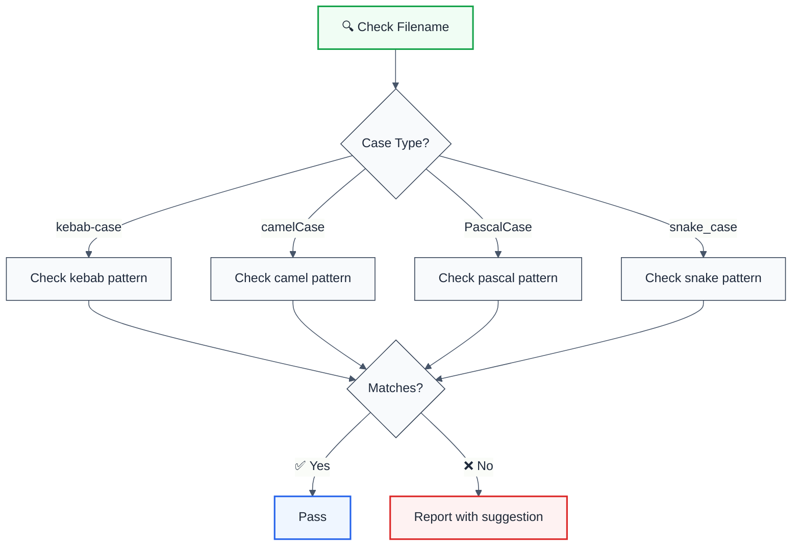

# filename-case

> **Keywords:** filename, naming convention, case style, kebab-case, camelCase, PascalCase, snake_case, ESLint rule, code consistency, LLM-optimized

Enforce filename case conventions for consistency across your codebase. This rule is part of [`@forge-js/eslint-plugin-llm-optimized`](https://www.npmjs.com/package/@forge-js/eslint-plugin-llm-optimized) and provides LLM-optimized error messages with fix suggestions.

## Quick Summary

| Aspect         | Details                                                              |
| -------------- | -------------------------------------------------------------------- |
| **Severity**   | Warning (code quality)                                               |
| **Auto-Fix**   | 💡 Suggests fixes (requires manual file rename)                      |
| **Category**   | Architecture                                                         |
| **ESLint MCP** | ✅ Optimized for ESLint MCP integration                              |
| **Best For**   | Teams wanting consistent filename conventions across the codebase    |

## Rule Details



### Why This Matters

| Issue                   | Impact                          | Solution                  |
| ----------------------- | ------------------------------- | ------------------------- |
| 🎨 **Consistency**      | Mixed naming styles in codebase | Enforce single convention |
| 📁 **Discoverability**  | Hard to find files              | Predictable naming        |
| 🔄 **Cross-platform**   | Case sensitivity issues         | Use lowercase conventions |
| 🤝 **Team Alignment**   | Disagreements on style          | Automated enforcement     |

## Configuration

| Option                 | Type       | Default                                    | Description                                              |
| ---------------------- | ---------- | ------------------------------------------ | -------------------------------------------------------- |
| `case`                 | `string`   | `'kebabCase'`                              | Case convention: `camelCase`, `kebabCase`, `pascalCase`, `snakeCase` |
| `ignore`               | `array`    | `[]`                                       | Patterns to ignore completely                            |
| `allowedUppercaseFiles`| `string[]` | `['README', 'LICENSE', 'CHANGELOG', ...]`  | Uppercase filenames allowed without extension            |
| `allowedKebabCase`     | `string[]` | `[]`                                       | Specific files allowed to use kebab-case                 |
| `allowedSnakeCase`     | `string[]` | `[]`                                       | Specific files allowed to use snake_case                 |
| `allowedCamelCase`     | `string[]` | `[]`                                       | Specific files allowed to use camelCase                  |
| `allowedPascalCase`    | `string[]` | `[]`                                       | Specific files allowed to use PascalCase                 |

### Case Style Reference

| Case Style      | Pattern           | Example              |
| --------------- | ----------------- | -------------------- |
| `kebabCase`     | `lowercase-words` | `user-service.ts`    |
| `camelCase`     | `camelCaseWords`  | `userService.ts`     |
| `PascalCase`    | `PascalCaseWords` | `UserService.ts`     |
| `snake_case`    | `lowercase_words` | `user_service.ts`    |

## Examples

### ❌ Incorrect (with `kebabCase`)

```
src/
  UserService.ts        ❌ Should be user-service.ts
  myComponent.tsx       ❌ Should be my-component.tsx
  API_Handler.ts        ❌ Should be api-handler.ts
```

### ✅ Correct (with `kebabCase`)

```
src/
  user-service.ts       ✅
  my-component.tsx      ✅
  api-handler.ts        ✅
  README.md             ✅ (allowed uppercase)
  LICENSE               ✅ (allowed uppercase)
```

## Configuration Examples

### Basic Usage (Default kebab-case)

```javascript
{
  rules: {
    '@forge-js/filename-case': 'error'
  }
}
```

### PascalCase for React Components

```javascript
{
  rules: {
    '@forge-js/filename-case': ['error', {
      case: 'pascalCase',
      allowedKebabCase: ['index', 'main']
    }]
  }
}
```

### Mixed Convention with Overrides

```javascript
{
  rules: {
    '@forge-js/filename-case': ['error', {
      case: 'kebabCase',
      allowedPascalCase: ['App', 'Button', 'Modal'],  // React components
      allowedSnakeCase: ['db_migrations'],            // Legacy
      ignore: [/\.config\./]                          // Config files
    }]
  }
}
```

### Disable Default Uppercase Files

```javascript
{
  rules: {
    '@forge-js/filename-case': ['error', {
      case: 'kebabCase',
      allowedUppercaseFiles: []  // Disable all uppercase exceptions
    }]
  }
}
```

## When Not To Use

| Scenario                | Recommendation                                   |
| ----------------------- | ------------------------------------------------ |
| 🏛️ **Legacy codebase**  | Use `ignore` for existing files                  |
| ⚛️ **React components** | Consider `pascalCase` or add to `allowedPascalCase` |
| 🧪 **Test files**       | Usually follows source file convention           |
| 📦 **Generated files**  | Add to `ignore` patterns                         |

## Comparison with Alternatives

| Feature              | filename-case         | eslint-plugin-unicorn | Manual enforcement |
| -------------------- | --------------------- | --------------------- | ------------------ |
| **Multiple cases**   | ✅ 4 options          | ✅ Yes                | ❌ No              |
| **Per-file override**| ✅ Flexible           | ⚠️ Limited            | ❌ No              |
| **LLM-Optimized**    | ✅ Yes                | ❌ No                 | ❌ No              |
| **ESLint MCP**       | ✅ Optimized          | ❌ No                 | ❌ No              |

## Related Rules

- [`enforce-naming`](./enforce-naming.md) - Enforces domain-specific naming conventions
- [`no-internal-modules`](./no-internal-modules.md) - Enforces module boundaries

## Further Reading

- **[Naming Conventions](https://google.github.io/styleguide/tsguide.html#naming-style)** - Google TypeScript Style Guide
- **[eslint-plugin-unicorn filename-case](https://github.com/sindresorhus/eslint-plugin-unicorn/blob/main/docs/rules/filename-case.md)** - Unicorn's implementation
- **[ESLint MCP Setup](https://eslint.org/docs/latest/use/mcp)** - Enable AI assistant integration

