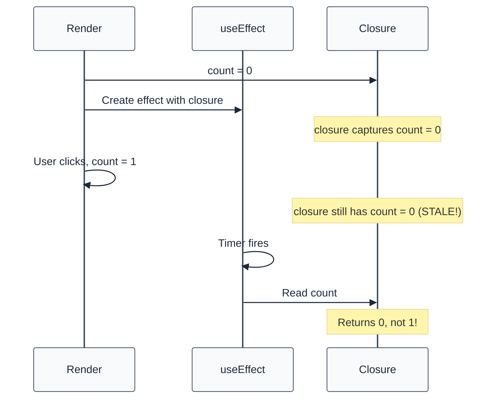

# hooks-exhaustive-deps

> **Keywords:** React, hooks, useEffect, useCallback, useMemo, dependencies, stale closure, ESLint rule, performance, LLM-optimized

Enforce exhaustive dependencies in React hooks to prevent stale closures. This rule is part of [`@forge-js/eslint-plugin-llm-optimized`](https://www.npmjs.com/package/@forge-js/eslint-plugin-llm-optimized) and provides LLM-optimized error messages with suggestions.

## Quick Summary

| Aspect         | Details                                                              |
| -------------- | -------------------------------------------------------------------- |
| **Severity**   | Warning (correctness)                                                |
| **Auto-Fix**   | 💡 Suggests fixes                                                    |
| **Category**   | React                                                                |
| **ESLint MCP** | ✅ Optimized for ESLint MCP integration                              |
| **Best For**   | All React projects using hooks                                       |

## Rule Details

```mermaid
%%{init: {
  'theme': 'base',
  'themeVariables': {
    'primaryColor': '#f8fafc',
    'primaryTextColor': '#1e293b',
    'primaryBorderColor': '#334155',
    'lineColor': '#475569',
    'c0': '#f8fafc',
    'c1': '#f1f5f9',
    'c2': '#e2e8f0',
    'c3': '#cbd5e1'
  }
}}%%
flowchart TD
    A[🔍 React Hook Call] --> B{Has dependency array?}
    B -->|❌ No array| C[⚠️ Consider adding deps]
    B -->|✅ Has array| D{Dependencies complete?}
    
    D -->|❌ Missing deps| E[❌ Report: Missing dependency]
    D -->|➕ Extra deps| F[⚠️ Warn: Unnecessary dependency]
    D -->|✅ Complete| G[✅ Pass]
    
    classDef startNode fill:#f0fdf4,stroke:#16a34a,stroke-width:2px,color:#1f2937
    classDef errorNode fill:#fef2f2,stroke:#dc2626,stroke-width:2px,color:#1f2937
    classDef warnNode fill:#fef3c7,stroke:#f59e0b,stroke-width:2px,color:#1f2937
    classDef processNode fill:#eff6ff,stroke:#2563eb,stroke-width:2px,color:#1f2937
    
    class A startNode
    class E errorNode
    class C,F warnNode
    class G processNode
```



### Why This Matters

| Issue                     | Impact                          | Solution                          |
| ------------------------- | ------------------------------- | --------------------------------- |
| 🔄 **Stale Closures**     | Outdated values in callbacks    | Add all reactive dependencies     |
| 🐛 **Missing Updates**    | Effect doesn't re-run           | Include all used variables        |
| 🔁 **Infinite Loops**     | Effect triggers itself          | Memoize object/function deps      |
| ⚡ **Performance Issues** | Unnecessary effect runs         | Remove constant dependencies      |

## Hooks Covered

| Hook                   | Description                       | Dependency Array Purpose          |
| ---------------------- | --------------------------------- | --------------------------------- |
| `useEffect`            | Side effects                      | When to re-run effect             |
| `useLayoutEffect`      | Synchronous DOM updates           | When to re-run effect             |
| `useCallback`          | Memoize functions                 | When to recreate function         |
| `useMemo`              | Memoize values                    | When to recalculate value         |
| `useImperativeHandle`  | Customize ref handle              | When to recreate handle           |

## Examples

### ❌ Incorrect

```tsx
// Missing dependency
function SearchResults({ query }) {
  const [results, setResults] = useState([]);

  useEffect(() => {
    fetchResults(query).then(setResults);
  }, []);  // ❌ Missing 'query' dependency
  // Effect won't re-run when query changes!

  return <ResultList items={results} />;
}

// Missing function dependency
function UserProfile({ userId }) {
  const loadUser = () => fetch(`/api/users/${userId}`);

  useEffect(() => {
    loadUser().then(setUser);
  }, []);  // ❌ Missing 'loadUser' and 'userId'

  // ...
}
```

### ✅ Correct

```tsx
// All dependencies included
function SearchResults({ query }) {
  const [results, setResults] = useState([]);

  useEffect(() => {
    fetchResults(query).then(setResults);
  }, [query]);  // ✅ 'query' included

  return <ResultList items={results} />;
}

// Memoized callback with correct deps
function UserProfile({ userId }) {
  const loadUser = useCallback(() => {
    return fetch(`/api/users/${userId}`);
  }, [userId]);  // ✅ 'userId' included

  useEffect(() => {
    loadUser().then(setUser);
  }, [loadUser]);  // ✅ 'loadUser' included

  // ...
}
```

## Configuration

| Option                                           | Type      | Default | Description                              |
| ------------------------------------------------ | --------- | ------- | ---------------------------------------- |
| `additionalHooks`                                | `string`  | -       | Regex for custom hooks to check          |
| `enableDangerousAutofixThisMayCauseInfiniteLoops`| `boolean` | `false` | Allow autofix (may cause issues)         |

## Configuration Examples

### Basic Usage

```javascript
{
  rules: {
    '@forge-js/hooks-exhaustive-deps': 'warn'
  }
}
```

### With Custom Hooks

```javascript
{
  rules: {
    '@forge-js/hooks-exhaustive-deps': ['warn', {
      additionalHooks: '(useMyCustomEffect|useDeepCompareEffect)'
    }]
  }
}
```

## Common Patterns

### Object Dependencies

```tsx
// ❌ Problem: Object recreated each render
function Component({ filters }) {
  useEffect(() => {
    search(filters);
  }, [filters]);  // Runs every render if filters is new object!
}

// ✅ Solution: Destructure or memoize
function Component({ filters }) {
  const { query, category } = filters;
  
  useEffect(() => {
    search({ query, category });
  }, [query, category]);  // Only primitive values
}
```

### Function Dependencies

```tsx
// ❌ Problem: Function recreated each render
function Component({ onSuccess }) {
  useEffect(() => {
    api.subscribe(onSuccess);
    return () => api.unsubscribe(onSuccess);
  }, [onSuccess]);  // May cause re-subscribe every render
}

// ✅ Solution: Use ref for stable callbacks
function Component({ onSuccess }) {
  const onSuccessRef = useRef(onSuccess);
  onSuccessRef.current = onSuccess;

  useEffect(() => {
    const handler = (...args) => onSuccessRef.current(...args);
    api.subscribe(handler);
    return () => api.unsubscribe(handler);
  }, []);  // Stable - no dependencies needed
}
```

### Intentionally Omitting Dependencies

```tsx
// ✅ Run effect only once with ESLint directive
function Component({ initialValue }) {
  useEffect(() => {
    setup(initialValue);
    // eslint-disable-next-line @forge-js/hooks-exhaustive-deps
  }, []);  // Intentionally run once
}
```

## Stale Closure Deep Dive



## When Not To Use

| Scenario                    | Recommendation                              |
| --------------------------- | ------------------------------------------- |
| 🧪 **Prototyping**          | Consider relaxing to reduce noise           |
| 📊 **Legacy codebase**      | Enable incrementally                        |
| 🔧 **Complex patterns**     | Use eslint-disable with comment explaining  |

## Comparison with Alternatives

| Feature                | hooks-exhaustive-deps   | react-hooks/exhaustive-deps |
| ---------------------- | ----------------------- | --------------------------- |
| **Missing deps**       | ✅ Yes                  | ✅ Yes                      |
| **Extra deps**         | ✅ Yes                  | ✅ Yes                      |
| **LLM-Optimized**      | ✅ Yes                  | ❌ No                       |
| **ESLint MCP**         | ✅ Optimized            | ❌ No                       |
| **Suggestions**        | ✅ With fix examples    | ⚠️ Limited                  |
| **Custom hooks**       | ✅ Yes                  | ✅ Yes                      |

## Related Rules

- [`jsx-key`](./jsx-key.md) - React key prop validation
- [`no-direct-mutation-state`](./no-direct-mutation-state.md) - State mutation prevention
- [`react-no-inline-functions`](./react-no-inline-functions.md) - Performance optimization

## Further Reading

- **[React Hooks Dependencies](https://react.dev/reference/react/useEffect#specifying-reactive-dependencies)** - Official React docs
- **[A Complete Guide to useEffect](https://overreacted.io/a-complete-guide-to-useeffect/)** - Dan Abramov's deep dive
- **[Removing Effect Dependencies](https://react.dev/reference/react/useEffect#removing-unnecessary-dependencies)** - When and how to optimize
- **[ESLint MCP Setup](https://eslint.org/docs/latest/use/mcp)** - Enable AI assistant integration

