# identical-functions

> **Keywords:** code duplication, DRY principle, CWE-1104, ESLint rule, duplicate code, refactoring, SonarQube, auto-fix, LLM-optimized, code quality

Detects duplicate function implementations with DRY refactoring suggestions. This rule is part of [`@forge-js/eslint-plugin-llm-optimized`](https://www.npmjs.com/package/@forge-js/eslint-plugin-llm-optimized) and provides LLM-optimized error messages with fix suggestions.

**🎨 SonarQube-inspired** | **💡 Provides suggestions**

## Quick Summary

| Aspect | Details |
|--------|---------|
| **CWE Reference** | CWE-1104 (Code Duplication) |
| **Severity** | Medium (code quality) |
| **Auto-Fix** | ⚠️ Suggests fixes (manual application) |
| **Category** | Code Quality |
| **ESLint MCP** | ✅ Optimized for ESLint MCP integration |
| **Best For** | Large codebases, teams refactoring legacy code |

## Rule Details

Finds functions with identical or nearly identical implementations and suggests refactoring to follow the DRY (Don't Repeat Yourself) principle.

```mermaid
%%{init: {
  'theme': 'base',
  'themeVariables': {
    'primaryColor': '#f8fafc',
    'primaryTextColor': '#1e293b',
    'primaryBorderColor': '#334155',
    'lineColor': '#475569'
  }
}}%%
flowchart TD
    A[📊 Collect Functions] --> B[Normalize Bodies]
    B --> C{Compare Functions}
    C -->|Similarity > Threshold| D[🔄 Report Duplication]
    C -->|Unique| E[✅ Pass]
    
    D --> F[Suggest extract method]
    D --> G[Suggest higher-order function]
    D --> H[Suggest inheritance/composition]
    
    classDef startNode fill:#f0fdf4,stroke:#16a34a,stroke-width:2px
    classDef errorNode fill:#fef2f2,stroke:#dc2626,stroke-width:2px
    classDef processNode fill:#eff6ff,stroke:#2563eb,stroke-width:2px
    
    class A startNode
    class D errorNode
    class E,F,G,H processNode
```



## Configuration

| Option                 | Type      | Default | Description                                      |
| ---------------------- | --------- | ------- | ------------------------------------------------ |
| `minLines`             | `number`  | `3`     | Minimum lines to consider for duplication        |
| `similarityThreshold`  | `number`  | `0.85`  | Similarity threshold (0.5-1.0)                   |
| `ignoreTestFiles`      | `boolean` | `true`  | Ignore test files (*.test.ts, *.spec.ts)         |

## Examples

### ❌ Incorrect

```typescript
// 95% similar - duplicated logic!
function processUserOrder(order: UserOrder) {
  if (!order.items || order.items.length === 0) {
    throw new Error('Order has no items');
  }
  
  const total = order.items.reduce((sum, item) => {
    return sum + (item.price * item.quantity);
  }, 0);
  
  return {
    orderId: order.id,
    total: total,
    status: 'processed'
  };
}

function processGuestOrder(order: GuestOrder) {
  if (!order.items || order.items.length === 0) {
    throw new Error('Order has no items');
  }
  
  const total = order.items.reduce((sum, item) => {
    return sum + (item.price * item.quantity);
  }, 0);
  
  return {
    orderId: order.id,
    total: total,
    status: 'processed'
  };
}
```

### ✅ Correct

```typescript
// Extracted common logic
function processOrder<T extends BaseOrder>(order: T) {
  if (!order.items || order.items.length === 0) {
    throw new Error('Order has no items');
  }
  
  const total = order.items.reduce((sum, item) => {
    return sum + (item.price * item.quantity);
  }, 0);
  
  return {
    orderId: order.id,
    total: total,
    status: 'processed'
  };
}

// Or use composition
const processUserOrder = (order: UserOrder) => processOrder(order);
const processGuestOrder = (order: GuestOrder) => processOrder(order);
```

## Configuration Examples

### Basic Usage

```javascript
{
  rules: {
    '@forge-js/identical-functions': ['error', {
      minLines: 3,
      similarityThreshold: 0.85
    }]
  }
}
```

### Strict Mode

```javascript
{
  rules: {
    '@forge-js/identical-functions': ['error', {
      minLines: 2,              // Catch even small duplications
      similarityThreshold: 0.7,  // Lower threshold = more sensitive
      ignoreTestFiles: false     // Check test files too
    }]
  }
}
```

### Relaxed Mode

```javascript
{
  rules: {
    '@forge-js/identical-functions': ['warn', {
      minLines: 5,               // Only large duplications
      similarityThreshold: 0.95, // Must be nearly identical
      ignoreTestFiles: true
    }]
  }
}
```

## Refactoring Patterns

### 1. Extract Generic Function

```typescript
// Before: 3 similar functions
function formatUserName(user: User) {
  return `${user.firstName} ${user.lastName}`.trim();
}

function formatAdminName(admin: Admin) {
  return `${admin.firstName} ${admin.lastName}`.trim();
}

function formatGuestName(guest: Guest) {
  return `${guest.firstName} ${guest.lastName}`.trim();
}

// After: One generic function
function formatFullName(person: { firstName: string; lastName: string }) {
  return `${person.firstName} ${person.lastName}`.trim();
}
```

### 2. Higher-Order Function

```typescript
// Before: Similar validation functions
function validateEmail(email: string) {
  if (!email) throw new Error('Email required');
  if (!email.includes('@')) throw new Error('Invalid email');
  return email;
}

function validatePhone(phone: string) {
  if (!phone) throw new Error('Phone required');
  if (phone.length < 10) throw new Error('Invalid phone');
  return phone;
}

// After: Higher-order function
function createValidator<T>(
  fieldName: string,
  validators: Array<(value: T) => boolean>,
  errorMessages: string[]
) {
  return (value: T): T => {
    if (!value) throw new Error(`${fieldName} required`);
    
    validators.forEach((validator, index) => {
      if (!validator(value)) {
        throw new Error(errorMessages[index]);
      }
    });
    
    return value;
  };
}

const validateEmail = createValidator<string>(
  'Email',
  [(email) => email.includes('@')],
  ['Invalid email']
);

const validatePhone = createValidator<string>(
  'Phone',
  [(phone) => phone.length >= 10],
  ['Invalid phone']
);
```

### 3. Strategy Pattern

```typescript
// Before: Similar calculation methods
function calculateStandardShipping(weight: number) {
  const baseRate = 5;
  return weight * 2 + baseRate;
}

function calculateExpressShipping(weight: number) {
  const baseRate = 15;
  return weight * 3 + baseRate;
}

// After: Strategy pattern
interface ShippingStrategy {
  baseRate: number;
  weightMultiplier: number;
}

const shippingStrategies: Record<string, ShippingStrategy> = {
  standard: { baseRate: 5, weightMultiplier: 2 },
  express: { baseRate: 15, weightMultiplier: 3 },
};

function calculateShipping(type: string, weight: number) {
  const strategy = shippingStrategies[type];
  return weight * strategy.weightMultiplier + strategy.baseRate;
}
```

## Why This Matters

| Issue                   | Impact                                | Solution                      |
| ----------------------- | ------------------------------------- | ----------------------------- |
| 🔄 **Maintenance**      | Fix bugs in multiple places           | Single source of truth        |
| 🐛 **Bug Propagation**  | Same bug exists in all copies         | Fix once, fix everywhere      |
| 📈 **Code Growth**      | Codebase grows unnecessarily          | Extract common logic          |
| 🧪 **Testing**          | Must test same logic multiple times   | Test once, reuse everywhere   |
| 🔍 **Refactoring**      | Changes require updating many places  | Change in one place           |

## Similarity Calculation

The rule uses normalized AST comparison:

1. **Normalize** function bodies (remove variable names, whitespace)
2. **Compare** AST structures
3. **Calculate** similarity score (0.0 - 1.0)
4. **Report** if score > threshold

## Comparison with Alternatives

| Feature | identical-functions | eslint-plugin-sonarjs | jscpd (copy-paste detector) |
|---------|---------------------|----------------------|----------------------------|
| **Code Duplication Detection** | ✅ Yes | ⚠️ Limited | ✅ Yes |
| **CWE Reference** | ✅ CWE-1104 included | ⚠️ Limited | ❌ No |
| **LLM-Optimized** | ✅ Yes | ❌ No | ❌ No |
| **ESLint MCP** | ✅ Optimized | ❌ No | ❌ No |
| **Fix Suggestions** | ✅ Detailed | ⚠️ Basic | ❌ No |
| **ESLint Integration** | ✅ Native | ✅ Native | ❌ External tool |

## Related Rules

- [`cognitive-complexity`](./cognitive-complexity.md) - Measures code complexity
- [`no-console-log`](./no-console-log.md) - Code quality enforcement
- [`no-deprecated-api`](./no-deprecated-api.md) - API modernization

## Further Reading

- **[CWE-1104: Code Duplication](https://cwe.mitre.org/data/definitions/1104.html)** - Official CWE entry
- **[DRY Principle](https://en.wikipedia.org/wiki/Don%27t_repeat_yourself)** - Don't Repeat Yourself
- **[SonarQube RSPEC-4144](https://rules.sonarsource.com/javascript/RSPEC-4144/)** - SonarQube duplication rule
- **[ESLint MCP Setup](https://eslint.org/docs/latest/use/mcp)** - Enable AI assistant integration

## References

Inspired by **SonarQube RSPEC-4144**
- [DRY Principle](https://en.wikipedia.org/wiki/Don%27t_repeat_yourself)

