# jsx-handler-names

> **Keywords:** React, event handlers, naming conventions, onClick, onSubmit, handleClick, ESLint rule, LLM-optimized

Enforces consistent naming conventions for event handler functions in JSX. This rule is part of [`@forge-js/eslint-plugin-llm-optimized`](https://www.npmjs.com/package/@forge-js/eslint-plugin-llm-optimized) and provides LLM-optimized error messages.

## Quick Summary

| Aspect         | Details                                                              |
| -------------- | -------------------------------------------------------------------- |
| **Severity**   | Low (code style)                                                     |
| **Auto-Fix**   | ❌ No (requires manual renaming)                                     |
| **Category**   | React                                                                |
| **ESLint MCP** | ✅ Optimized for ESLint MCP integration                              |
| **Best For**   | Code consistency, team conventions                                   |

## Rule Details

```mermaid
%%{init: {
  'theme': 'base',
  'themeVariables': {
    'primaryColor': '#f8fafc',
    'primaryTextColor': '#1e293b',
    'primaryBorderColor': '#334155',
    'lineColor': '#475569'
  }
}}%%
flowchart TD
    A[🔍 Check JSX event prop] --> B{Prop starts with 'on'?}
    B -->|❌ No| C[✅ Pass]
    B -->|✅ Yes| D{Value is identifier?}
    D -->|❌ No| C
    D -->|✅ Yes| E{Name starts with 'handle' or 'on'?}
    E -->|✅ Yes| C
    E -->|❌ No| F[⚠️ Report: Invalid handler name]
    
    classDef startNode fill:#f0fdf4,stroke:#16a34a,stroke-width:2px,color:#1f2937
    classDef errorNode fill:#fef2f2,stroke:#dc2626,stroke-width:2px,color:#1f2937
    classDef processNode fill:#eff6ff,stroke:#2563eb,stroke-width:2px,color:#1f2937
    
    class A startNode
    class F errorNode
    class C processNode
```



### Naming Convention

| JSX Prop      | Expected Handler Name    | Alternative             |
| ------------- | ------------------------ | ----------------------- |
| `onClick`     | `handleClick`            | `onClick`               |
| `onSubmit`    | `handleSubmit`           | `onSubmit`              |
| `onChange`    | `handleChange`           | `onChange`              |
| `onFocus`     | `handleFocus`            | `onFocus`               |
| `onBlur`      | `handleBlur`             | `onBlur`                |

## Examples

### ❌ Incorrect

```jsx
// Handler doesn't follow convention
<button onClick={clickHandler}>Click</button>

// Unclear naming
<form onSubmit={submit}>Submit</form>

// Missing prefix
<input onChange={nameChange} />

// Arbitrary naming
<div onMouseEnter={mouseIn}>Hover</div>
```

### ✅ Correct

```jsx
// Using 'handle' prefix
<button onClick={handleClick}>Click</button>

// Using 'on' prefix (for passed props)
<button onClick={onClick}>Click</button>

// Descriptive handler names
<form onSubmit={handleSubmit}>Submit</form>

// With context in name
<input onChange={handleNameChange} />

// Inline functions are allowed
<button onClick={() => doSomething()}>Click</button>
```

## Configuration

```javascript
{
  rules: {
    '@forge-js/jsx-handler-names': 'warn'
  }
}
```

## Best Practices

| Convention               | Example                    | Use When                      |
| ------------------------ | -------------------------- | ----------------------------- |
| `handle` + Event         | `handleClick`              | Component's own handlers      |
| `handle` + Context + Event | `handleFormSubmit`       | Multiple similar handlers     |
| `on` + Event             | `onClick`                  | Props passed from parent      |

### Example Component

```jsx
function UserForm({ onSubmit }) {
  // Internal handlers use 'handle' prefix
  const handleNameChange = (e) => {
    setName(e.target.value);
  };

  const handleEmailChange = (e) => {
    setEmail(e.target.value);
  };

  // Props from parent use 'on' prefix
  const handleSubmit = (e) => {
    e.preventDefault();
    onSubmit({ name, email });
  };

  return (
    <form onSubmit={handleSubmit}>
      <input onChange={handleNameChange} />
      <input onChange={handleEmailChange} />
    </form>
  );
}
```

## Related Rules

- [`jsx-no-bind`](./jsx-no-bind.md) - Prevent binding in JSX props
- [`no-anonymous-default-export`](./no-anonymous-default-export.md) - Require named exports

## Further Reading

- **[Naming Event Handlers](https://react.dev/learn/responding-to-events#naming-event-handler-functions)** - React documentation
- **[Event Handling in React](https://react.dev/learn/responding-to-events)** - React events guide
- **[ESLint MCP Setup](https://eslint.org/docs/latest/use/mcp)** - Enable AI assistant integration

