# jsx-key

> **Keywords:** React, JSX, key prop, reconciliation, lists, map, iteration, ESLint rule, performance, LLM-optimized

Detect missing or problematic React keys that could break reconciliation. This rule is part of [`@forge-js/eslint-plugin-llm-optimized`](https://www.npmjs.com/package/@forge-js/eslint-plugin-llm-optimized) and provides LLM-optimized error messages with suggestions.

## Quick Summary

| Aspect         | Details                                                              |
| -------------- | -------------------------------------------------------------------- |
| **Severity**   | Error (correctness)                                                  |
| **Auto-Fix**   | 💡 Suggests fixes                                                    |
| **Category**   | React                                                                |
| **ESLint MCP** | ✅ Optimized for ESLint MCP integration                              |
| **Best For**   | All React/JSX projects                                               |

## Rule Details

```mermaid
%%{init: {
  'theme': 'base',
  'themeVariables': {
    'primaryColor': '#f8fafc',
    'primaryTextColor': '#1e293b',
    'primaryBorderColor': '#334155',
    'lineColor': '#475569',
    'c0': '#f8fafc',
    'c1': '#f1f5f9',
    'c2': '#e2e8f0',
    'c3': '#cbd5e1'
  }
}}%%
flowchart TD
    A[🔍 JSX in Iterator] --> B{Has key prop?}
    B -->|❌ No| C[❌ Report: Missing Key]
    B -->|✅ Yes| D{Key Quality?}
    
    D -->|🔢 Index| E[⚠️ Warn: Unstable Key]
    D -->|✅ Stable ID| F[✅ Pass]
    D -->|🔁 Duplicate| G[❌ Report: Duplicate Key]
    
    classDef startNode fill:#f0fdf4,stroke:#16a34a,stroke-width:2px,color:#1f2937
    classDef errorNode fill:#fef2f2,stroke:#dc2626,stroke-width:2px,color:#1f2937
    classDef warnNode fill:#fef3c7,stroke:#f59e0b,stroke-width:2px,color:#1f2937
    classDef processNode fill:#eff6ff,stroke:#2563eb,stroke-width:2px,color:#1f2937
    
    class A startNode
    class C,G errorNode
    class E warnNode
    class F processNode
```



### Why This Matters

| Issue                     | Impact                          | Solution                  |
| ------------------------- | ------------------------------- | ------------------------- |
| 🔄 **Reconciliation**     | React can't track elements      | Add unique keys           |
| ⚡ **Performance**        | Unnecessary re-renders          | Stable keys               |
| 🐛 **State Bugs**         | Wrong component gets state      | Use item IDs, not indexes |
| 🎨 **Animation Issues**   | Elements animate incorrectly    | Consistent key identity   |

## Configuration

| Option             | Type      | Default | Description                              |
| ------------------ | --------- | ------- | ---------------------------------------- |
| `warnUnstableKeys` | `boolean` | `true`  | Warn about potentially unstable keys     |

## Examples

### ❌ Incorrect

```tsx
// Missing key
function UserList({ users }) {
  return (
    <ul>
      {users.map(user => (
        <li>{user.name}</li>  // ❌ Missing key
      ))}
    </ul>
  );
}

// Using index as key (unstable)
function ItemList({ items }) {
  return (
    <ul>
      {items.map((item, index) => (
        <li key={index}>{item.name}</li>  // ⚠️ Unstable key
      ))}
    </ul>
  );
}
```

### ✅ Correct

```tsx
// Using unique ID as key
function UserList({ users }) {
  return (
    <ul>
      {users.map(user => (
        <li key={user.id}>{user.name}</li>  // ✅ Stable unique key
      ))}
    </ul>
  );
}

// Using compound key when no ID available
function ItemList({ items }) {
  return (
    <ul>
      {items.map(item => (
        <li key={`${item.category}-${item.name}`}>
          {item.name}
        </li>  // ✅ Unique compound key
      ))}
    </ul>
  );
}
```

## Configuration Examples

### Basic Usage

```javascript
{
  rules: {
    '@forge-js/jsx-key': 'error'
  }
}
```

### Disable Unstable Key Warnings

```javascript
{
  rules: {
    '@forge-js/jsx-key': ['error', {
      warnUnstableKeys: false
    }]
  }
}
```

## Key Best Practices

### Choosing Keys

| Source              | Quality    | Example                              |
| ------------------- | ---------- | ------------------------------------ |
| Database ID         | ✅ Best    | `key={user.id}`                      |
| Unique field        | ✅ Good    | `key={item.slug}`                    |
| Compound unique     | ✅ Good    | `key={\`${cat}-${name}\`}`           |
| UUID/nanoid         | ⚠️ OK      | `key={generateId()}`                 |
| Array index         | ❌ Avoid   | `key={index}`                        |
| Random number       | ❌ Never   | `key={Math.random()}`                |

### When Index Keys Are Acceptable

```tsx
// ✅ Static list that never reorders/filters
const WEEKDAYS = ['Mon', 'Tue', 'Wed', 'Thu', 'Fri'];
<ul>
  {WEEKDAYS.map((day, i) => <li key={i}>{day}</li>)}
</ul>

// ❌ Dynamic list - DON'T use index
{users.map((user, i) => <UserCard key={i} user={user} />)}  // Bad!
{users.map(user => <UserCard key={user.id} user={user} />)} // Good!
```

## Common Patterns

### Fragment Keys

```tsx
// When using fragments in lists, key goes on Fragment
function DataList({ data }) {
  return (
    <>
      {data.map(item => (
        <React.Fragment key={item.id}>
          <dt>{item.term}</dt>
          <dd>{item.definition}</dd>
        </React.Fragment>
      ))}
    </>
  );
}
```

### Nested Lists

```tsx
function NestedList({ categories }) {
  return categories.map(category => (
    <div key={category.id}>
      <h2>{category.name}</h2>
      <ul>
        {category.items.map(item => (
          <li key={item.id}>{item.name}</li>  // Separate key namespace
        ))}
      </ul>
    </div>
  ));
}
```

## When Not To Use

| Scenario                    | Recommendation                              |
| --------------------------- | ------------------------------------------- |
| 🧪 **Testing/Prototypes**   | Consider allowing index keys temporarily    |
| 📊 **Static content**       | Index keys may be acceptable                |
| 🔄 **No reordering**        | Index keys work for append-only lists       |

## Comparison with Alternatives

| Feature              | jsx-key             | eslint-plugin-react | jsx-ally           |
| -------------------- | ------------------- | ------------------- | ------------------ |
| **Missing key**      | ✅ Yes              | ✅ Yes              | ❌ No              |
| **Unstable keys**    | ✅ Configurable     | ⚠️ Limited          | ❌ No              |
| **LLM-Optimized**    | ✅ Yes              | ❌ No               | ❌ No              |
| **ESLint MCP**       | ✅ Optimized        | ❌ No               | ❌ No              |
| **Suggestions**      | ✅ Yes              | ⚠️ Limited          | ❌ No              |

## Related Rules

- [`react-no-inline-functions`](./react-no-inline-functions.md) - Performance optimization
- [`react-render-optimization`](./react-render-optimization.md) - Render performance

## Further Reading

- **[React Keys Documentation](https://react.dev/learn/rendering-lists#keeping-list-items-in-order-with-key)** - Official React docs
- **[Why React Keys Matter](https://kentcdodds.com/blog/understanding-reacts-key-prop)** - Kent C. Dodds article
- **[Reconciliation](https://react.dev/learn/preserving-and-resetting-state)** - How React updates the DOM
- **[ESLint MCP Setup](https://eslint.org/docs/latest/use/mcp)** - Enable AI assistant integration

