# jsx-max-depth

> **Keywords:** React, JSX nesting, component depth, complexity, refactoring, ESLint rule, LLM-optimized

Limits the maximum depth of JSX nesting to encourage component extraction and improve readability. This rule is part of [`@forge-js/eslint-plugin-llm-optimized`](https://www.npmjs.com/package/@forge-js/eslint-plugin-llm-optimized) and provides LLM-optimized error messages.

## Quick Summary

| Aspect         | Details                                                              |
| -------------- | -------------------------------------------------------------------- |
| **Severity**   | Warning (code complexity)                                            |
| **Auto-Fix**   | ❌ No (requires component extraction)                                |
| **Category**   | React                                                                |
| **ESLint MCP** | ✅ Optimized for ESLint MCP integration                              |
| **Best For**   | Maintaining readable components, encouraging composition             |

## Rule Details

```mermaid
%%{init: {
  'theme': 'base',
  'themeVariables': {
    'primaryColor': '#f8fafc',
    'primaryTextColor': '#1e293b',
    'primaryBorderColor': '#334155',
    'lineColor': '#475569'
  }
}}%%
flowchart TD
    A[🔍 Parse JSX tree] --> B[📐 Calculate nesting depth]
    B --> C{Depth > max?}
    C -->|❌ No| D[✅ Pass]
    C -->|✅ Yes| E[⚠️ Report: Excessive depth]
    
    classDef startNode fill:#f0fdf4,stroke:#16a34a,stroke-width:2px,color:#1f2937
    classDef errorNode fill:#fef2f2,stroke:#dc2626,stroke-width:2px,color:#1f2937
    classDef processNode fill:#eff6ff,stroke:#2563eb,stroke-width:2px,color:#1f2937
    
    class A startNode
    class E errorNode
    class D processNode
```



### Why This Matters

| Issue                   | Impact                          | Solution                       |
| ----------------------- | ------------------------------- | ------------------------------ |
| 📖 **Readability**      | Hard to follow nested JSX       | Extract to child components    |
| 🧪 **Testability**      | Large components hard to test   | Smaller, focused components    |
| 🔄 **Reusability**      | Nested JSX can't be reused      | Create reusable components     |
| 🐛 **Debugging**        | Deeply nested errors hard to find | Isolated component logic     |

## Configuration

| Option | Type     | Default | Description                              |
| ------ | -------- | ------- | ---------------------------------------- |
| `max`  | `number` | `5`     | Maximum allowed JSX nesting depth        |

## Examples

### ❌ Incorrect (with max: 3)

```jsx
// Depth of 4 - exceeds limit
function DeepComponent() {
  return (
    <div>                    {/* depth 1 */}
      <section>              {/* depth 2 */}
        <article>            {/* depth 3 */}
          <p>Too deep!</p>   {/* depth 4 - violation */}
        </article>
      </section>
    </div>
  );
}
```

### ✅ Correct (with max: 3)

```jsx
// Extracted component reduces depth
function ArticleContent() {
  return <p>Content</p>;
}

function Article() {
  return (
    <article>
      <ArticleContent />
    </article>
  );
}

function ShallowComponent() {
  return (
    <div>                    {/* depth 1 */}
      <section>              {/* depth 2 */}
        <Article />          {/* depth 3 - component boundary */}
      </section>
    </div>
  );
}
```

## Configuration Examples

### Default (max: 5)

```javascript
{
  rules: {
    '@forge-js/jsx-max-depth': 'warn'
  }
}
```

### Strict (max: 3)

```javascript
{
  rules: {
    '@forge-js/jsx-max-depth': ['error', { max: 3 }]
  }
}
```

### Lenient (max: 7)

```javascript
{
  rules: {
    '@forge-js/jsx-max-depth': ['warn', { max: 7 }]
  }
}
```

## Refactoring Strategy

| Depth Level | Recommended Action                              |
| ----------- | ----------------------------------------------- |
| 1-3         | ✅ Good - readable structure                    |
| 4-5         | ⚠️ Consider extracting reusable parts          |
| 6+          | 🔴 Extract into child components               |

### Before Refactoring

```jsx
function Dashboard() {
  return (
    <div className="dashboard">
      <header>
        <nav>
          <ul>
            <li>
              <a href="/">Home</a>  {/* depth 5 */}
            </li>
          </ul>
        </nav>
      </header>
    </div>
  );
}
```

### After Refactoring

```jsx
function NavLink({ href, children }) {
  return <li><a href={href}>{children}</a></li>;
}

function Navigation() {
  return (
    <nav>
      <ul>
        <NavLink href="/">Home</NavLink>
      </ul>
    </nav>
  );
}

function Dashboard() {
  return (
    <div className="dashboard">
      <header>
        <Navigation />
      </header>
    </div>
  );
}
```

## Related Rules

- [`no-multi-comp`](./no-multi-comp.md) - One component per file
- [`cognitive-complexity`](./cognitive-complexity.md) - Limit code complexity

## Further Reading

- **[Thinking in React](https://react.dev/learn/thinking-in-react#step-4-identify-where-your-state-should-live)** - Component composition
- **[Component Composition](https://react.dev/learn/passing-props-to-a-component)** - React patterns
- **[ESLint MCP Setup](https://eslint.org/docs/latest/use/mcp)** - Enable AI assistant integration

