# jsx-no-literals

> **Keywords:** React, JSX, string literals, i18n, internationalization, translation, ESLint rule, LLM-optimized

Prevents string literals directly in JSX to encourage internationalization and consistent text management. This rule is part of [`@forge-js/eslint-plugin-llm-optimized`](https://www.npmjs.com/package/@forge-js/eslint-plugin-llm-optimized) and provides LLM-optimized error messages.

## Quick Summary

| Aspect         | Details                                                              |
| -------------- | -------------------------------------------------------------------- |
| **Severity**   | Warning (i18n best practice)                                         |
| **Auto-Fix**   | ❌ No (requires extraction to translation keys)                      |
| **Category**   | React                                                                |
| **ESLint MCP** | ✅ Optimized for ESLint MCP integration                              |
| **Best For**   | Internationalized apps, consistent text management                   |

## Rule Details

```mermaid
%%{init: {
  'theme': 'base',
  'themeVariables': {
    'primaryColor': '#f8fafc',
    'primaryTextColor': '#1e293b',
    'primaryBorderColor': '#334155',
    'lineColor': '#475569'
  }
}}%%
flowchart TD
    A[🔍 Check JSX content] --> B{Is string literal?}
    B -->|❌ No| C[✅ Pass]
    B -->|✅ Yes| D{In allowedStrings?}
    D -->|✅ Yes| C
    D -->|❌ No| E{noStrings enabled?}
    E -->|❌ No| C
    E -->|✅ Yes| F[⚠️ Report: Extract string]
    
    classDef startNode fill:#f0fdf4,stroke:#16a34a,stroke-width:2px,color:#1f2937
    classDef errorNode fill:#fef2f2,stroke:#dc2626,stroke-width:2px,color:#1f2937
    classDef processNode fill:#eff6ff,stroke:#2563eb,stroke-width:2px,color:#1f2937
    
    class A startNode
    class F errorNode
    class C processNode
```



### Why This Matters

| Issue                   | Impact                          | Solution                       |
| ----------------------- | ------------------------------- | ------------------------------ |
| 🌍 **i18n**             | Can't translate hardcoded text  | Use translation keys           |
| 📝 **Consistency**      | Duplicate strings across app    | Centralize text management     |
| 🔄 **Updates**          | Hard to update text globally    | Single source of truth         |
| 🧪 **Testing**          | Brittle text-based tests        | Use data-testid instead        |

## Configuration

| Option           | Type       | Default | Description                              |
| ---------------- | ---------- | ------- | ---------------------------------------- |
| `noStrings`      | `boolean`  | `true`  | Disallow string literals in JSX          |
| `allowedStrings` | `string[]` | `[]`    | Strings that are allowed (e.g., symbols) |
| `ignoreProps`    | `boolean`  | `true`  | Allow strings in prop values             |

## Examples

### ❌ Incorrect

```jsx
// Hardcoded text in JSX
function Welcome() {
  return <h1>Welcome to our app!</h1>;
}

// Multiple hardcoded strings
function Button() {
  return (
    <button>
      Click here to continue
    </button>
  );
}

// Text in complex components
function Card() {
  return (
    <div>
      <h2>Product Title</h2>
      <p>This is a description.</p>
    </div>
  );
}
```

### ✅ Correct

```jsx
// Using translation function
import { t } from './i18n';

function Welcome() {
  return <h1>{t('welcome.title')}</h1>;
}

// Using constants
const BUTTON_TEXT = 'Click here to continue';

function Button() {
  return <button>{BUTTON_TEXT}</button>;
}

// Using react-intl
import { FormattedMessage } from 'react-intl';

function Card() {
  return (
    <div>
      <h2><FormattedMessage id="card.title" /></h2>
      <p><FormattedMessage id="card.description" /></p>
    </div>
  );
}

// Props are allowed by default
<input placeholder="Search..." />
```

## Configuration Examples

### Basic Usage

```javascript
{
  rules: {
    '@forge-js/jsx-no-literals': 'warn'
  }
}
```

### Allow Common Symbols

```javascript
{
  rules: {
    '@forge-js/jsx-no-literals': ['error', {
      noStrings: true,
      allowedStrings: ['©', '•', '|', '-', '→', '←'],
      ignoreProps: true
    }]
  }
}
```

### Strict Mode (Including Props)

```javascript
{
  rules: {
    '@forge-js/jsx-no-literals': ['error', {
      noStrings: true,
      allowedStrings: [],
      ignoreProps: false
    }]
  }
}
```

### Disabled for Whitespace

```javascript
{
  rules: {
    '@forge-js/jsx-no-literals': ['warn', {
      noStrings: true,
      allowedStrings: [' ', '\n'],
      ignoreProps: true
    }]
  }
}
```

## Migration Strategy

### Step 1: Extract to Constants

```jsx
// Before
<button>Submit Form</button>

// After
const SUBMIT_TEXT = 'Submit Form';
<button>{SUBMIT_TEXT}</button>
```

### Step 2: Move to Translation File

```javascript
// translations/en.json
{
  "form.submit": "Submit Form"
}

// Component
import { t } from './i18n';
<button>{t('form.submit')}</button>
```

### Step 3: Support Multiple Languages

```javascript
// translations/en.json
{ "form.submit": "Submit Form" }

// translations/es.json
{ "form.submit": "Enviar Formulario" }

// translations/ja.json
{ "form.submit": "フォームを送信" }
```

## Related Rules

- [`no-unescaped-entities`](./no-unescaped-entities.md) - Escape special characters
- [`jsx-max-depth`](./jsx-max-depth.md) - Limit JSX nesting

## Further Reading

- **[React Internationalization](https://react.dev/learn/passing-props-to-a-component#passing-jsx-as-children)** - React docs
- **[react-intl](https://formatjs.io/docs/react-intl/)** - Popular i18n library
- **[i18next](https://react.i18next.com/)** - Another i18n solution
- **[ESLint MCP Setup](https://eslint.org/docs/latest/use/mcp)** - Enable AI assistant integration

