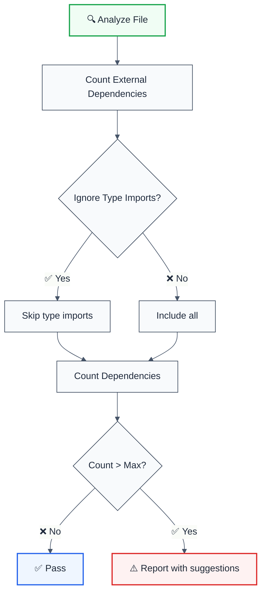

# max-dependencies

> **Keywords:** dependencies, imports, module coupling, architecture, code quality, ESLint rule, refactoring, LLM-optimized

Enforce the maximum number of dependencies a module can have. This rule is part of [`@forge-js/eslint-plugin-llm-optimized`](https://www.npmjs.com/package/@forge-js/eslint-plugin-llm-optimized) and provides LLM-optimized error messages with refactoring guidance.

## Quick Summary

| Aspect         | Details                                                              |
| -------------- | -------------------------------------------------------------------- |
| **Severity**   | Warning (architecture)                                               |
| **Auto-Fix**   | ❌ No (requires manual refactoring)                                  |
| **Category**   | Architecture                                                         |
| **ESLint MCP** | ✅ Optimized for ESLint MCP integration                              |
| **Best For**   | Large codebases, enforcing module boundaries, reducing coupling      |

## Rule Details



### Why This Matters

| Issue                   | Impact                          | Solution                  |
| ----------------------- | ------------------------------- | ------------------------- |
| 🔗 **High Coupling**    | Changes ripple through codebase | Reduce dependencies       |
| 🧪 **Testing Difficulty** | Many mocks needed             | Smaller, focused modules  |
| 📦 **Bundle Size**      | Larger builds                   | Tree-shake unused deps    |
| 🔄 **Maintainability**  | Hard to understand module       | Split into smaller units  |

## Configuration

| Option             | Type       | Default | Description                              |
| ------------------ | ---------- | ------- | ---------------------------------------- |
| `max`              | `number`   | `10`    | Maximum number of dependencies allowed   |
| `ignoreTypeImports`| `boolean`  | `true`  | Ignore type-only imports                 |
| `ignoreImports`    | `string[]` | `[]`    | Specific import sources to ignore        |
| `ignoreFiles`      | `string[]` | `[]`    | File patterns to ignore                  |

### What Counts as a Dependency

| Import Type          | Counted  | Example                              |
| -------------------- | -------- | ------------------------------------ |
| External packages    | ✅ Yes   | `import lodash from 'lodash'`        |
| Relative imports     | ❌ No    | `import { util } from './util'`      |
| Node.js built-ins    | ❌ No    | `import fs from 'fs'`                |
| Type-only imports    | ⚙️ Config | `import type { User } from 'api'`    |
| Scoped packages      | ✅ Yes   | `import { Button } from '@mui/core'` |

## Examples

### ❌ Incorrect (with max: 5)

```typescript
// user-service.ts - 8 dependencies (exceeds max of 5)
import { User } from '@company/types';           // 1
import { validate } from 'class-validator';       // 2
import { Logger } from 'winston';                 // 3
import { Repository } from 'typeorm';             // 4
import { hash } from 'bcrypt';                    // 5
import { sign } from 'jsonwebtoken';              // 6 ❌
import { sendEmail } from 'nodemailer';           // 7 ❌
import { cache } from 'node-cache';               // 8 ❌
```

### ✅ Correct (with max: 5)

```typescript
// user-service.ts - 4 dependencies
import { User } from '@company/types';
import { validate } from 'class-validator';
import { Logger } from 'winston';
import { Repository } from 'typeorm';

// Extracted to separate modules:
// - auth.service.ts (bcrypt, jsonwebtoken)
// - notification.service.ts (nodemailer)
// - cache.service.ts (node-cache)
```

## Configuration Examples

### Basic Usage

```javascript
{
  rules: {
    '@forge-js/max-dependencies': ['warn', {
      max: 10
    }]
  }
}
```

### Strict Mode

```javascript
{
  rules: {
    '@forge-js/max-dependencies': ['error', {
      max: 5,
      ignoreTypeImports: true
    }]
  }
}
```

### Ignore Specific Patterns

```javascript
{
  rules: {
    '@forge-js/max-dependencies': ['warn', {
      max: 10,
      ignoreImports: ['react', 'react-dom', '@testing-library/*'],
      ignoreFiles: ['*.test.ts', '*.spec.ts', 'index.ts']
    }]
  }
}
```

### Include Type Imports

```javascript
{
  rules: {
    '@forge-js/max-dependencies': ['warn', {
      max: 15,
      ignoreTypeImports: false  // Count type imports too
    }]
  }
}
```

## Refactoring Strategies

### 1. Extract Services

```typescript
// ❌ Before: One large service
class UserService {
  async createUser() { /* auth + email + cache */ }
}

// ✅ After: Separate concerns
class UserService {
  constructor(
    private authService: AuthService,
    private notificationService: NotificationService
  ) {}
}
```

### 2. Use Barrel Exports

```typescript
// ❌ Before: Import each utility
import { formatDate } from 'date-fns';
import { format } from 'date-fns/format';
import { parse } from 'date-fns/parse';

// ✅ After: Single import from barrel
import { formatDate, format, parse } from './date-utils';
```

### 3. Dependency Injection

```typescript
// ❌ Before: Direct imports
import { Logger } from 'winston';
import { Cache } from 'node-cache';

// ✅ After: Injected dependencies
class Service {
  constructor(
    private logger: ILogger,
    private cache: ICache
  ) {}
}
```

## When Not To Use

| Scenario                    | Recommendation                              |
| --------------------------- | ------------------------------------------- |
| 📁 **Entry point files**    | Add to `ignoreFiles: ['index.ts']`          |
| 🧪 **Test files**           | Add to `ignoreFiles: ['*.test.ts']`         |
| 🎨 **UI components**        | Consider higher `max` for component files   |
| 🔧 **Configuration files**  | Often need many dependencies                |

## Comparison with Alternatives

| Feature              | max-dependencies    | eslint-plugin-import | Manual review      |
| -------------------- | ------------------- | -------------------- | ------------------ |
| **Type-aware**       | ✅ Yes              | ⚠️ Limited           | ❌ No              |
| **Package counting** | ✅ Smart            | ✅ Yes               | ❌ No              |
| **LLM-Optimized**    | ✅ Yes              | ❌ No                | ❌ No              |
| **ESLint MCP**       | ✅ Optimized        | ❌ No                | ❌ No              |
| **Ignore patterns**  | ✅ Flexible         | ⚠️ Limited           | ❌ No              |

## Related Rules

- [`no-circular-dependencies`](./no-circular-dependencies.md) - Prevents circular dependencies
- [`no-internal-modules`](./no-internal-modules.md) - Enforces module boundaries
- [`enforce-dependency-direction`](./enforce-dependency-direction.md) - Enforces dependency flow

## Further Reading

- **[Clean Architecture](https://blog.cleancoder.com/uncle-bob/2012/08/13/the-clean-architecture.html)** - Robert C. Martin's architecture principles
- **[eslint-plugin-import max-dependencies](https://github.com/import-js/eslint-plugin-import/blob/main/docs/rules/max-dependencies.md)** - Import plugin docs
- **[Dependency Injection](https://en.wikipedia.org/wiki/Dependency_injection)** - Design pattern
- **[ESLint MCP Setup](https://eslint.org/docs/latest/use/mcp)** - Enable AI assistant integration

