# no-adjacent-inline-elements

> **Keywords:** React, JSX, inline elements, layout, accessibility, spacing, ESLint rule, LLM-optimized

Prevents adjacent inline elements without proper spacing or wrapping. This rule is part of [`@forge-js/eslint-plugin-llm-optimized`](https://www.npmjs.com/package/@forge-js/eslint-plugin-llm-optimized) and provides LLM-optimized error messages.

## Quick Summary

| Aspect         | Details                                                              |
| -------------- | -------------------------------------------------------------------- |
| **Severity**   | Warning (layout best practice)                                       |
| **Auto-Fix**   | ❌ No (requires layout refactoring)                                  |
| **Category**   | React                                                                |
| **ESLint MCP** | ✅ Optimized for ESLint MCP integration                              |
| **Best For**   | Proper spacing, accessible layouts                                   |

## Rule Details

```mermaid
%%{init: {
  'theme': 'base',
  'themeVariables': {
    'primaryColor': '#f8fafc',
    'primaryTextColor': '#1e293b',
    'primaryBorderColor': '#334155',
    'lineColor': '#475569'
  }
}}%%
flowchart TD
    A[🔍 Check JSX children] --> B{Adjacent inline elements?}
    B -->|❌ No| C[✅ Pass]
    B -->|✅ Yes| D[⚠️ Report: Wrap in block container]
    
    classDef startNode fill:#f0fdf4,stroke:#16a34a,stroke-width:2px,color:#1f2937
    classDef errorNode fill:#fef2f2,stroke:#dc2626,stroke-width:2px,color:#1f2937
    classDef processNode fill:#eff6ff,stroke:#2563eb,stroke-width:2px,color:#1f2937
    
    class A startNode
    class D errorNode
    class C processNode
```



### Inline Elements Detected

| Element  | Type         |
| -------- | ------------ |
| `<span>` | Inline       |
| `<a>`    | Inline       |
| `<strong>`, `<em>`, `<b>`, `<i>` | Inline |
| `<code>`, `<kbd>`, `<samp>` | Inline |
| `<abbr>`, `<cite>`, `<q>` | Inline |
| `<time>`, `<mark>` | Inline |
| `<sub>`, `<sup>` | Inline |
| `<small>`, `<del>`, `<ins>` | Inline |

### Why This Matters

| Issue                   | Impact                          | Solution                       |
| ----------------------- | ------------------------------- | ------------------------------ |
| 📐 **Layout Issues**    | Elements may touch              | Add spacing or wrapper         |
| ♿ **Accessibility**    | Screen readers may run together | Proper semantic structure      |
| 🎨 **Styling**          | Hard to apply consistent styles | Use flex/grid containers       |
| 📱 **Responsiveness**   | Unpredictable line breaks       | Control with block containers  |

## Examples

### ❌ Incorrect

```jsx
// Adjacent spans without separation
function Tags() {
  return (
    <div>
      <span>Tag1</span>
      <span>Tag2</span>
      <span>Tag3</span>
    </div>
  );
}

// Adjacent links
function Links() {
  return (
    <nav>
      <a href="/home">Home</a>
      <a href="/about">About</a>
    </nav>
  );
}

// Mixed inline elements
function Text() {
  return (
    <p>
      <strong>Bold</strong>
      <em>Italic</em>
    </p>
  );
}
```

### ✅ Correct

```jsx
// Separated by text
function Tags() {
  return (
    <div>
      <span>Tag1</span> | <span>Tag2</span> | <span>Tag3</span>
    </div>
  );
}

// Wrapped in list
function Links() {
  return (
    <nav>
      <ul>
        <li><a href="/home">Home</a></li>
        <li><a href="/about">About</a></li>
      </ul>
    </nav>
  );
}

// With proper spacing
function Text() {
  return (
    <p>
      <strong>Bold</strong> <em>Italic</em>
    </p>
  );
}

// Using flex container
function TagList() {
  return (
    <div style={{ display: 'flex', gap: '8px' }}>
      <span>Tag1</span>
      <span>Tag2</span>
      <span>Tag3</span>
    </div>
  );
}
```

## Configuration

```javascript
{
  rules: {
    '@forge-js/no-adjacent-inline-elements': 'warn'
  }
}
```

## Proper Patterns

| Problem                  | Solution                              |
| ------------------------ | ------------------------------------- |
| Adjacent `<span>`s       | Flexbox with gap                      |
| Adjacent `<a>`s          | List structure `<ul><li>`             |
| Adjacent formatting      | Add space between: `text {" "} text`  |
| Adjacent badges          | Use CSS gap or margin                 |

### Using CSS Gap

```jsx
// Correct with CSS
const styles = {
  container: {
    display: 'flex',
    gap: '8px'
  }
};

function TagList({ tags }) {
  return (
    <div style={styles.container}>
      {tags.map(tag => (
        <span key={tag}>{tag}</span>
      ))}
    </div>
  );
}
```

### Using JSX Spacing

```jsx
// Explicit space between elements
function Breadcrumbs({ items }) {
  return (
    <nav>
      {items.map((item, index) => (
        <React.Fragment key={item.path}>
          {index > 0 && ' / '}
          <a href={item.path}>{item.label}</a>
        </React.Fragment>
      ))}
    </nav>
  );
}
```

## Related Rules

- [`jsx-max-depth`](./jsx-max-depth.md) - Limit JSX nesting
- [`no-children-prop`](./no-children-prop.md) - Proper children handling

## Further Reading

- **[Inline Elements](https://developer.mozilla.org/en-US/docs/Web/HTML/Inline_elements)** - MDN reference
- **[CSS Flexbox](https://developer.mozilla.org/en-US/docs/Web/CSS/CSS_Flexible_Box_Layout)** - Layout guide
- **[ESLint MCP Setup](https://eslint.org/docs/latest/use/mcp)** - Enable AI assistant integration

