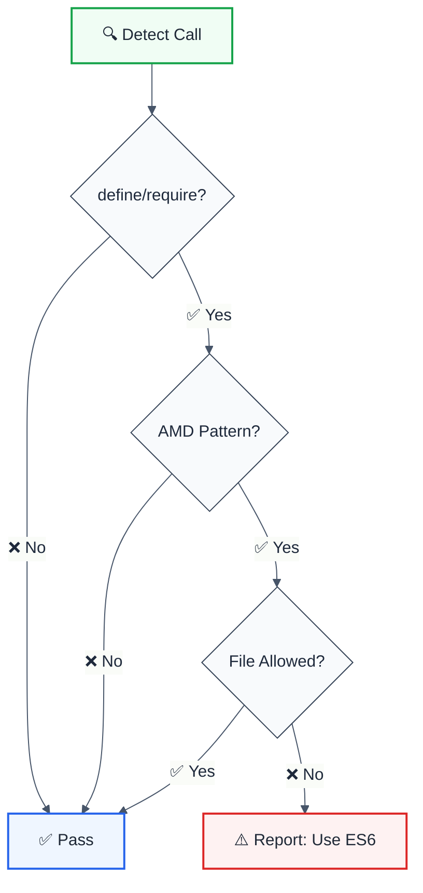

# no-amd

> **Keywords:** AMD, RequireJS, define, require, ES6 modules, ESLint rule, module system, migration, LLM-optimized

Prevents AMD `require`/`define` calls and encourages ES6 module syntax. This rule is part of [`@forge-js/eslint-plugin-llm-optimized`](https://www.npmjs.com/package/@forge-js/eslint-plugin-llm-optimized) and provides LLM-optimized error messages.

## Quick Summary

| Aspect         | Details                                                              |
| -------------- | -------------------------------------------------------------------- |
| **Severity**   | Warning (development)                                                |
| **Auto-Fix**   | ❌ No (requires manual migration)                                    |
| **Category**   | Development                                                          |
| **ESLint MCP** | ✅ Optimized for ESLint MCP integration                              |
| **Best For**   | Modern codebases, AMD to ES6 migration projects                      |

## Rule Details



### Why This Matters

| Issue                   | Impact                          | Solution                  |
| ----------------------- | ------------------------------- | ------------------------- |
| 📦 **Legacy Code**      | AMD is outdated                 | Migrate to ES6 modules    |
| 🌳 **Tree-shaking**     | AMD doesn't support it          | ES6 enables optimization  |
| 🔧 **Tooling**          | Modern tools prefer ES6         | Better bundler support    |
| 📖 **Readability**      | AMD syntax is verbose           | ES6 is cleaner            |

## Configuration

| Option       | Type       | Default | Description                              |
| ------------ | ---------- | ------- | ---------------------------------------- |
| `allow`      | `string[]` | `[]`    | File patterns where AMD is allowed       |
| `suggestES6` | `boolean`  | `true`  | Suggest ES6 import alternative           |

## Examples

### ❌ Incorrect

```javascript
// AMD define pattern
define(['jquery', 'lodash'], function($, _) {
  return {
    init: function() { }
  };
});

// AMD require pattern
require(['module1', 'module2'], function(mod1, mod2) {
  // callback
});
```

### ✅ Correct

```typescript
// ES6 imports
import $ from 'jquery';
import _ from 'lodash';

export const init = () => { };

// Dynamic imports
const mod1 = await import('module1');
const mod2 = await import('module2');
```

## Configuration Examples

### Basic Usage

```javascript
{
  rules: {
    '@forge-js/no-amd': 'error'
  }
}
```

### Allow Legacy Files

```javascript
{
  rules: {
    '@forge-js/no-amd': ['error', {
      allow: [
        '**/legacy/**',
        '**/vendor/**'
      ]
    }]
  }
}
```

### Gradual Migration

```javascript
{
  rules: {
    '@forge-js/no-amd': ['warn', {
      allow: ['src/old/**'],
      suggestES6: true
    }]
  }
}
```

## Migration Guide

### AMD to ES6 Conversion

| AMD Pattern                           | ES6 Equivalent                    |
| ------------------------------------- | --------------------------------- |
| `define(['dep'], fn)`                 | `import dep from 'dep'`           |
| `require(['dep'], fn)`                | `const dep = await import('dep')` |
| `define(function() { return val; })` | `export default val`              |
| `define({ key: 'value' })`            | `export const key = 'value'`      |

### Example Migration

```javascript
// ❌ Before: AMD
define(['react', 'lodash'], function(React, _) {
  var Component = function() {
    return React.createElement('div', null, _.map([1, 2], String));
  };
  return Component;
});

// ✅ After: ES6
import React from 'react';
import { map } from 'lodash';

export const Component = () => {
  return <div>{map([1, 2], String)}</div>;
};
```

## When Not To Use

| Scenario                    | Recommendation                              |
| --------------------------- | ------------------------------------------- |
| 🏛️ **Legacy RequireJS**    | Use `allow` for legacy directories          |
| 📦 **Vendor scripts**       | Add vendor paths to `allow`                 |
| 🔄 **Gradual migration**    | Use `warn` severity during transition       |
| 🌐 **Browser-only AMD**     | Consider if ES6 is not available            |

## Comparison with Alternatives

| Feature              | no-amd              | eslint-plugin-import | Manual review      |
| -------------------- | ------------------- | -------------------- | ------------------ |
| **AMD Detection**    | ✅ Yes              | ✅ Yes               | ⚠️ Manual          |
| **ES6 Suggestions**  | ✅ Yes              | ❌ No                | ❌ No              |
| **LLM-Optimized**    | ✅ Yes              | ❌ No                | ❌ No              |
| **ESLint MCP**       | ✅ Optimized        | ❌ No                | ❌ No              |

## Related Rules

- [`no-commonjs`](./no-commonjs.md) - Prevents CommonJS require/exports
- [`prefer-node-protocol`](./prefer-node-protocol.md) - Use `node:` protocol

## Further Reading

- **[ES6 Modules](https://developer.mozilla.org/en-US/docs/Web/JavaScript/Guide/Modules)** - MDN guide
- **[AMD Specification](https://github.com/amdjs/amdjs-api/blob/master/AMD.md)** - AMD API reference
- **[eslint-plugin-import no-amd](https://github.com/import-js/eslint-plugin-import/blob/main/docs/rules/no-amd.md)** - Import plugin docs
- **[ESLint MCP Setup](https://eslint.org/docs/latest/use/mcp)** - Enable AI assistant integration

