# no-anonymous-default-export

> **Keywords:** anonymous, default export, naming, debugging, ESLint rule, stack traces, LLM-optimized

Forbid anonymous values as default exports for better debugging and code navigation. This rule is part of [`@forge-js/eslint-plugin-llm-optimized`](https://www.npmjs.com/package/@forge-js/eslint-plugin-llm-optimized) and provides LLM-optimized error messages.

## Quick Summary

| Aspect         | Details                                                              |
| -------------- | -------------------------------------------------------------------- |
| **Severity**   | Warning (code quality)                                               |
| **Auto-Fix**   | ❌ No (requires meaningful name)                                     |
| **Category**   | Architecture                                                         |
| **ESLint MCP** | ✅ Optimized for ESLint MCP integration                              |
| **Best For**   | All projects, especially those using debugging tools                 |

## Rule Details

```mermaid
%%{init: {
  'theme': 'base',
  'themeVariables': {
    'primaryColor': '#f8fafc',
    'primaryTextColor': '#1e293b',
    'primaryBorderColor': '#334155',
    'lineColor': '#475569',
    'c0': '#f8fafc',
    'c1': '#f1f5f9',
    'c2': '#e2e8f0',
    'c3': '#cbd5e1'
  }
}}%%
flowchart TD
    A[🔍 Detect Default Export] --> B{Export Type?}
    B -->|Arrow Function| C{allowArrowFunction?}
    B -->|Function Expr| D{allowFunctionExpression?}
    B -->|Class Expr| E{allowClassExpression?}
    B -->|Named/Identifier| F[✅ Pass]
    
    C -->|✅ Yes| F
    C -->|❌ No| G[⚠️ Report: Add name]
    
    D -->|✅ Yes| F
    D -->|❌ No| G
    
    E -->|✅ Yes| F
    E -->|❌ No| G
    
    classDef startNode fill:#f0fdf4,stroke:#16a34a,stroke-width:2px,color:#1f2937
    classDef errorNode fill:#fef2f2,stroke:#dc2626,stroke-width:2px,color:#1f2937
    classDef processNode fill:#eff6ff,stroke:#2563eb,stroke-width:2px,color:#1f2937
    
    class A startNode
    class G errorNode
    class F processNode
```



### Why This Matters

| Issue                     | Impact                          | Solution                  |
| ------------------------- | ------------------------------- | ------------------------- |
| 🐛 **Stack Traces**       | Shows "anonymous" or "(unknown)"| Named functions           |
| 🔍 **React DevTools**     | Components show as `<Unknown>`  | Named components          |
| 🔄 **Refactoring**        | Hard to find usages             | Clear naming              |
| 📖 **Code Navigation**    | IDE can't show function name    | Explicit names            |

## Configuration

| Option                   | Type      | Default | Description                              |
| ------------------------ | --------- | ------- | ---------------------------------------- |
| `allowArrowFunction`     | `boolean` | `false` | Allow anonymous arrow functions          |
| `allowFunctionExpression`| `boolean` | `false` | Allow anonymous function expressions     |
| `allowClassExpression`   | `boolean` | `false` | Allow anonymous class expressions        |

## Examples

### ❌ Incorrect

```typescript
// Anonymous arrow function
export default () => {
  return <div>Hello</div>;
};

// Anonymous function expression
export default function() {
  return 42;
}

// Anonymous class
export default class {
  constructor() {}
}
```

### ✅ Correct

```typescript
// Named function declaration
export default function MyComponent() {
  return <div>Hello</div>;
}

// Named arrow function via const
const MyComponent = () => {
  return <div>Hello</div>;
};
export default MyComponent;

// Named class declaration
export default class MyService {
  constructor() {}
}

// Named identifier export
const helper = () => {};
export default helper;

// Call expressions (HOCs) are allowed
export default React.memo(function MyComponent() {});
export default withRouter(MyComponent);
```

## Configuration Examples

### Basic Usage

```javascript
{
  rules: {
    '@forge-js/no-anonymous-default-export': 'warn'
  }
}
```

### Allow Arrow Functions

```javascript
{
  rules: {
    '@forge-js/no-anonymous-default-export': ['warn', {
      allowArrowFunction: true,
      allowFunctionExpression: false,
      allowClassExpression: false
    }]
  }
}
```

### Strict Mode

```javascript
{
  rules: {
    '@forge-js/no-anonymous-default-export': ['error', {
      allowArrowFunction: false,
      allowFunctionExpression: false,
      allowClassExpression: false
    }]
  }
}
```

## Naming Best Practices

### Components

```tsx
// ❌ Anonymous
export default () => <div>Hello</div>;

// ✅ Named - describes the component
export default function WelcomeMessage() {
  return <div>Hello</div>;
}

// ✅ Named - file-based naming
// File: UserProfile.tsx
export default function UserProfile() {
  return <div>Profile</div>;
}
```

### Utilities

```typescript
// ❌ Anonymous
export default (a: number, b: number) => a + b;

// ✅ Named - describes the function
export default function add(a: number, b: number) {
  return a + b;
}

// ✅ Named via const
const calculateSum = (a: number, b: number) => a + b;
export default calculateSum;
```

### Classes

```typescript
// ❌ Anonymous
export default class {
  fetch() {}
}

// ✅ Named - describes the service
export default class ApiService {
  fetch() {}
}
```

## Stack Trace Comparison

### With Anonymous Export

```
Error: Something went wrong
    at anonymous (bundle.js:123:45)
    at anonymous (bundle.js:456:78)
    at anonymous (bundle.js:789:12)
```

### With Named Export

```
Error: Something went wrong
    at UserService.fetchUser (bundle.js:123:45)
    at UserProfile.handleClick (bundle.js:456:78)
    at App.render (bundle.js:789:12)
```

## When Not To Use

| Scenario                    | Recommendation                              |
| --------------------------- | ------------------------------------------- |
| 🎨 **Simple utilities**     | Use `allowArrowFunction: true`              |
| 🔄 **Migration period**     | Use `warn` severity during transition       |
| 📦 **HOC wrappers**         | Already allowed (CallExpression)            |

## Comparison with Alternatives

| Feature              | no-anonymous-default-export | eslint-plugin-import | Manual enforcement |
| -------------------- | --------------------------- | -------------------- | ------------------ |
| **Arrow functions**  | ✅ Configurable             | ✅ Yes               | ⚠️ Manual          |
| **Class expressions** | ✅ Configurable            | ✅ Yes               | ⚠️ Manual          |
| **HOC handling**     | ✅ Allowed by default       | ⚠️ Limited           | ❌ No              |
| **LLM-Optimized**    | ✅ Yes                      | ❌ No                | ❌ No              |
| **ESLint MCP**       | ✅ Optimized                | ❌ No                | ❌ No              |

## Related Rules

- [`no-default-export`](./no-default-export.md) - Forbid all default exports
- [`display-name`](./display-name.md) - Enforce React displayName

## Further Reading

- **[eslint-plugin-import no-anonymous-default-export](https://github.com/import-js/eslint-plugin-import/blob/main/docs/rules/no-anonymous-default-export.md)** - Import plugin docs
- **[Named vs Anonymous Functions](https://developer.mozilla.org/en-US/docs/Web/JavaScript/Reference/Functions#named_function_expression)** - MDN reference
- **[React DevTools](https://react.dev/learn/react-developer-tools)** - Component debugging
- **[ESLint MCP Setup](https://eslint.org/docs/latest/use/mcp)** - Enable AI assistant integration

