# no-await-in-loop

> **Keywords:** async, await, loop, Promise.all, concurrency, performance, ESLint rule, sequential, parallel, LLM-optimized

Disallow await inside loops without considering concurrency implications. This rule is part of [`@forge-js/eslint-plugin-llm-optimized`](https://www.npmjs.com/package/@forge-js/eslint-plugin-llm-optimized) and provides LLM-optimized error messages with concurrency pattern suggestions.

## Quick Summary

| Aspect         | Details                                                              |
| -------------- | -------------------------------------------------------------------- |
| **Severity**   | Warning (performance)                                                |
| **Auto-Fix**   | ❌ No (suggests refactoring patterns)                                |
| **Category**   | Architecture / Performance                                           |
| **ESLint MCP** | ✅ Optimized for ESLint MCP integration                              |
| **Best For**   | Performance-critical applications, API batch operations              |

## Rule Details

```mermaid
%%{init: {
  'theme': 'base',
  'themeVariables': {
    'primaryColor': '#f8fafc',
    'primaryTextColor': '#1e293b',
    'primaryBorderColor': '#334155',
    'lineColor': '#475569',
    'c0': '#f8fafc',
    'c1': '#f1f5f9',
    'c2': '#e2e8f0',
    'c3': '#cbd5e1'
  }
}}%%
flowchart TD
    A[🔍 Detect Loop] --> B{Contains await?}
    B -->|❌ No| C[✅ Pass]
    B -->|✅ Yes| D{Loop Type Allowed?}
    
    D -->|✅ Allowed| C
    D -->|❌ Not Allowed| E[Analyze Dependencies]
    
    E --> F{Independent Operations?}
    F -->|✅ Yes| G[Suggest Promise.all]
    F -->|❌ No| H[Suggest Sequential Pattern]
    
    G --> I[⚠️ Report]
    H --> I
    
    classDef startNode fill:#f0fdf4,stroke:#16a34a,stroke-width:2px,color:#1f2937
    classDef errorNode fill:#fef2f2,stroke:#dc2626,stroke-width:2px,color:#1f2937
    classDef processNode fill:#eff6ff,stroke:#2563eb,stroke-width:2px,color:#1f2937
    
    class A startNode
    class I errorNode
    class C processNode
```



### Why This Matters

| Issue                    | Impact                      | Solution                |
| ------------------------ | --------------------------- | ----------------------- |
| ⚡ **Performance**       | N*latency instead of 1x     | Use Promise.all()       |
| 🔄 **Sequential Bottleneck** | Blocks event loop       | Concurrent execution    |
| 📊 **Scalability**       | Slow with large datasets    | Batch processing        |
| 🎯 **Resource Usage**    | Inefficient API calls       | Parallelization         |

## Configuration

| Option            | Type      | Default  | Description                              |
| ----------------- | --------- | -------- | ---------------------------------------- |
| `allowForOf`      | `boolean` | `false`  | Allow await in for-of loops              |
| `allowWhile`      | `boolean` | `false`  | Allow await in while loops               |
| `checkConcurrency`| `boolean` | `true`   | Check for potential concurrent execution |

## Examples

### ❌ Incorrect

```typescript
// Sequential execution - N * latency
async function fetchAllUsers(ids: string[]) {
  const users = [];
  for (const id of ids) {
    const user = await fetchUser(id);  // ❌ Await in loop
    users.push(user);
  }
  return users;
}

// Also problematic
async function processItems(items: Item[]) {
  for (let i = 0; i < items.length; i++) {
    await processItem(items[i]);  // ❌ Await in loop
  }
}
```

### ✅ Correct

```typescript
// Concurrent execution - 1x latency (max)
async function fetchAllUsers(ids: string[]) {
  const users = await Promise.all(
    ids.map(id => fetchUser(id))
  );
  return users;
}

// With error handling
async function processItems(items: Item[]) {
  const results = await Promise.allSettled(
    items.map(item => processItem(item))
  );
  return results;
}

// Controlled concurrency with p-map
import pMap from 'p-map';

async function fetchWithLimit(urls: string[]) {
  return pMap(urls, fetchUrl, { concurrency: 5 });
}
```

## Configuration Examples

### Basic Usage

```javascript
{
  rules: {
    '@forge-js/no-await-in-loop': 'warn'
  }
}
```

### Allow for-of Loops

```javascript
{
  rules: {
    '@forge-js/no-await-in-loop': ['warn', {
      allowForOf: true,
      allowWhile: false
    }]
  }
}
```

### Strict Mode

```javascript
{
  rules: {
    '@forge-js/no-await-in-loop': ['error', {
      allowForOf: false,
      allowWhile: false,
      checkConcurrency: true
    }]
  }
}
```

## Refactoring Patterns

### Sequential to Parallel

```typescript
// ❌ Before: 10 items = 10 * 100ms = 1000ms
for (const item of items) {
  await process(item);
}

// ✅ After: 10 items = ~100ms (parallel)
await Promise.all(items.map(process));
```

### With Rate Limiting

```typescript
// Using p-map for controlled concurrency
import pMap from 'p-map';

async function fetchAll(urls: string[]) {
  return pMap(urls, fetch, { concurrency: 3 });
}
```

### When Sequential is Required

```typescript
// ✅ Extract to separate function if sequential is needed
async function processSequentially(items: Item[]) {
  const results = [];
  for (const item of items) {
    // Dependencies between iterations require sequential
    const result = await processWithPrevious(item, results);
    results.push(result);
  }
  return results;
}
```

## When Not To Use

| Scenario                    | Recommendation                              |
| --------------------------- | ------------------------------------------- |
| 📊 **Order-dependent ops**  | Use `allowForOf: true` or disable rule      |
| 🔒 **Rate-limited APIs**    | Use controlled concurrency libraries        |
| 💾 **Memory constraints**   | Sequential may be necessary                 |
| 🔄 **Transaction chains**   | Sequential execution required               |

## Comparison with Alternatives

| Feature              | no-await-in-loop    | eslint built-in    | unicorn            |
| -------------------- | ------------------- | ------------------ | ------------------ |
| **Concurrency Check**| ✅ Yes              | ❌ No              | ⚠️ Limited         |
| **Loop Type Config** | ✅ Per-type         | ❌ No              | ❌ No              |
| **LLM-Optimized**    | ✅ Yes              | ❌ No              | ❌ No              |
| **ESLint MCP**       | ✅ Optimized        | ❌ No              | ❌ No              |
| **Pattern Suggestions** | ✅ Yes           | ❌ No              | ⚠️ Limited         |

## Related Rules

- [`detect-n-plus-one-queries`](./detect-n-plus-one-queries.md) - Detects N+1 query patterns
- [`no-blocking-operations`](./no-blocking-operations.md) - Detects blocking operations

## Further Reading

- **[Promise.all() - MDN](https://developer.mozilla.org/en-US/docs/Web/JavaScript/Reference/Global_Objects/Promise/all)** - Concurrent promise execution
- **[Promise.allSettled() - MDN](https://developer.mozilla.org/en-US/docs/Web/JavaScript/Reference/Global_Objects/Promise/allSettled)** - Handle mixed results
- **[p-map](https://github.com/sindresorhus/p-map)** - Controlled concurrency library
- **[ESLint MCP Setup](https://eslint.org/docs/latest/use/mcp)** - Enable AI assistant integration

