# no-commonjs

> **Keywords:** CommonJS, require, module.exports, ES6 modules, imports, exports, ESLint rule, migration, LLM-optimized

Prevents CommonJS `require()`/`module.exports` and encourages ES6 module syntax. This rule is part of [`@forge-js/eslint-plugin-llm-optimized`](https://www.npmjs.com/package/@forge-js/eslint-plugin-llm-optimized) and provides LLM-optimized error messages with suggestions.

## Quick Summary

| Aspect         | Details                                                              |
| -------------- | -------------------------------------------------------------------- |
| **Severity**   | Warning (development)                                                |
| **Auto-Fix**   | 💡 Suggests fixes                                                    |
| **Category**   | Development                                                          |
| **ESLint MCP** | ✅ Optimized for ESLint MCP integration                              |
| **Best For**   | Modern codebases, CommonJS to ES6 migration projects                 |

## Rule Details

```mermaid
%%{init: {
  'theme': 'base',
  'themeVariables': {
    'primaryColor': '#f8fafc',
    'primaryTextColor': '#1e293b',
    'primaryBorderColor': '#334155',
    'lineColor': '#475569',
    'c0': '#f8fafc',
    'c1': '#f1f5f9',
    'c2': '#e2e8f0',
    'c3': '#cbd5e1'
  }
}}%%
flowchart TD
    A[🔍 Detect Pattern] --> B{Which Pattern?}
    B -->|require| C{allowRequire?}
    B -->|module.exports| D{allowModuleExports?}
    B -->|exports.*| E{allowExports?}
    B -->|__dirname| F[⚠️ Report: Use import.meta]
    
    C -->|✅ Yes| G[✅ Pass]
    C -->|❌ No| H[⚠️ Report: Use import]
    
    D -->|✅ Yes| G
    D -->|❌ No| I[⚠️ Report: Use export]
    
    E -->|✅ Yes| G
    E -->|❌ No| J[⚠️ Report: Use named export]
    
    classDef startNode fill:#f0fdf4,stroke:#16a34a,stroke-width:2px,color:#1f2937
    classDef errorNode fill:#fef2f2,stroke:#dc2626,stroke-width:2px,color:#1f2937
    classDef processNode fill:#eff6ff,stroke:#2563eb,stroke-width:2px,color:#1f2937
    
    class A startNode
    class H,I,J,F errorNode
    class G processNode
```



### Why This Matters

| Issue                   | Impact                          | Solution                  |
| ----------------------- | ------------------------------- | ------------------------- |
| 🌳 **Tree-shaking**     | CommonJS isn't statically analyzable | ES6 modules optimize    |
| 📦 **Bundle Size**      | Can't eliminate dead code       | Named exports help        |
| 🔧 **Tooling**          | Limited IDE support             | Better static analysis    |
| 🚀 **Future-proof**     | ESM is the standard             | Migrate to ES6            |

## Configuration

| Option             | Type       | Default | Description                              |
| ------------------ | ---------- | ------- | ---------------------------------------- |
| `allowRequire`     | `boolean`  | `false` | Allow `require()` calls                  |
| `allowModuleExports` | `boolean` | `false` | Allow `module.exports`                   |
| `allowExports`     | `boolean`  | `false` | Allow `exports.*` patterns               |
| `allowInFiles`     | `string[]` | `[]`    | File patterns where CommonJS is allowed  |
| `suggestES6`       | `boolean`  | `true`  | Suggest ES6 alternatives                 |

## Examples

### ❌ Incorrect

```javascript
// CommonJS require
const lodash = require('lodash');
const { map } = require('lodash');

// CommonJS exports
module.exports = MyClass;
module.exports.helper = function() {};
exports.util = utility;

// CommonJS globals
const dir = __dirname;
const file = __filename;
```

### ✅ Correct

```typescript
// ES6 imports
import lodash from 'lodash';
import { map } from 'lodash';

// ES6 exports
export default MyClass;
export const helper = function() {};
export const util = utility;

// ES6 module meta
const dir = new URL('.', import.meta.url).pathname;
const file = new URL(import.meta.url).pathname;
```

## Configuration Examples

### Basic Usage

```javascript
{
  rules: {
    '@forge-js/no-commonjs': 'error'
  }
}
```

### Allow require for Config Files

```javascript
{
  rules: {
    '@forge-js/no-commonjs': ['error', {
      allowInFiles: [
        '*.config.js',
        'webpack.config.js',
        'jest.config.js'
      ]
    }]
  }
}
```

### Gradual Migration

```javascript
{
  rules: {
    '@forge-js/no-commonjs': ['warn', {
      allowRequire: true,        // Allow require first
      allowModuleExports: false, // Force export conversion
      suggestES6: true
    }]
  }
}
```

### Allow in Legacy Directory

```javascript
{
  rules: {
    '@forge-js/no-commonjs': ['error', {
      allowInFiles: [
        '**/legacy/**',
        '**/vendor/**',
        '**/*.cjs'
      ]
    }]
  }
}
```

## Migration Guide

### CommonJS to ES6 Conversion

| CommonJS Pattern                     | ES6 Equivalent                        |
| ------------------------------------ | ------------------------------------- |
| `const mod = require('mod')`         | `import mod from 'mod'`               |
| `const { a, b } = require('mod')`    | `import { a, b } from 'mod'`          |
| `module.exports = value`             | `export default value`                |
| `module.exports.name = value`        | `export const name = value`           |
| `exports.name = value`               | `export const name = value`           |
| `__dirname`                          | `new URL('.', import.meta.url).pathname` |
| `__filename`                         | `new URL(import.meta.url).pathname`   |

### Example Migration

```javascript
// ❌ Before: CommonJS
const express = require('express');
const { Router } = require('express');
const utils = require('./utils');

function createApp() {
  return express();
}

module.exports = createApp;
module.exports.utils = utils;

// ✅ After: ES6
import express, { Router } from 'express';
import utils from './utils.js';

function createApp() {
  return express();
}

export default createApp;
export { utils };
```

## When Not To Use

| Scenario                    | Recommendation                              |
| --------------------------- | ------------------------------------------- |
| 📦 **Config files**         | Use `allowInFiles: ['*.config.js']`         |
| 🏛️ **Legacy Node.js**       | Consider if ESM is supported                |
| 🔄 **Gradual migration**    | Enable specific `allow*` options            |
| 🧪 **Jest config**          | Jest config often requires CJS              |

## Comparison with Alternatives

| Feature              | no-commonjs         | eslint-plugin-import | Manual review      |
| -------------------- | ------------------- | -------------------- | ------------------ |
| **require detection** | ✅ Yes             | ✅ Yes               | ⚠️ Manual          |
| **exports detection** | ✅ Yes             | ✅ Yes               | ⚠️ Manual          |
| **__dirname/__filename** | ✅ Yes          | ❌ No                | ❌ No              |
| **LLM-Optimized**    | ✅ Yes              | ❌ No                | ❌ No              |
| **ESLint MCP**       | ✅ Optimized        | ❌ No                | ❌ No              |
| **ES6 suggestions**  | ✅ Yes              | ⚠️ Limited           | ❌ No              |

## Related Rules

- [`no-amd`](./no-amd.md) - Prevents AMD require/define
- [`prefer-node-protocol`](./prefer-node-protocol.md) - Use `node:` protocol

## Further Reading

- **[ES Modules](https://developer.mozilla.org/en-US/docs/Web/JavaScript/Guide/Modules)** - MDN guide
- **[Node.js ESM](https://nodejs.org/api/esm.html)** - Node.js ES modules documentation
- **[eslint-plugin-import no-commonjs](https://github.com/import-js/eslint-plugin-import/blob/main/docs/rules/no-commonjs.md)** - Import plugin docs
- **[ESLint MCP Setup](https://eslint.org/docs/latest/use/mcp)** - Enable AI assistant integration

