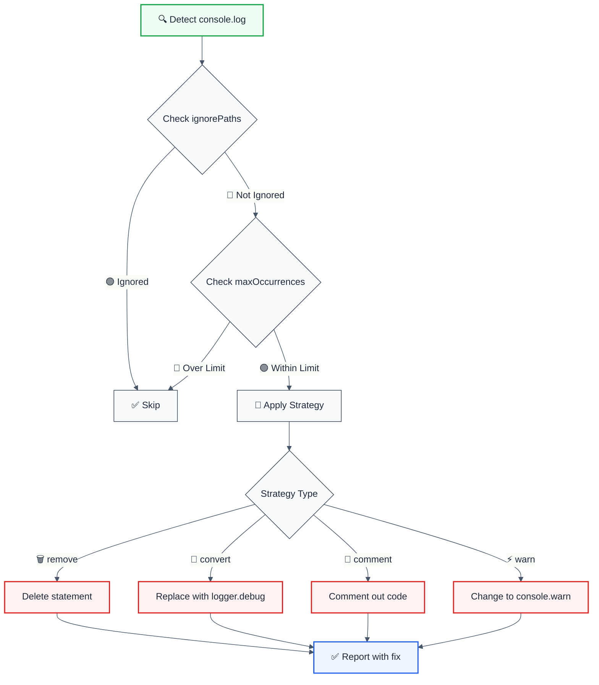
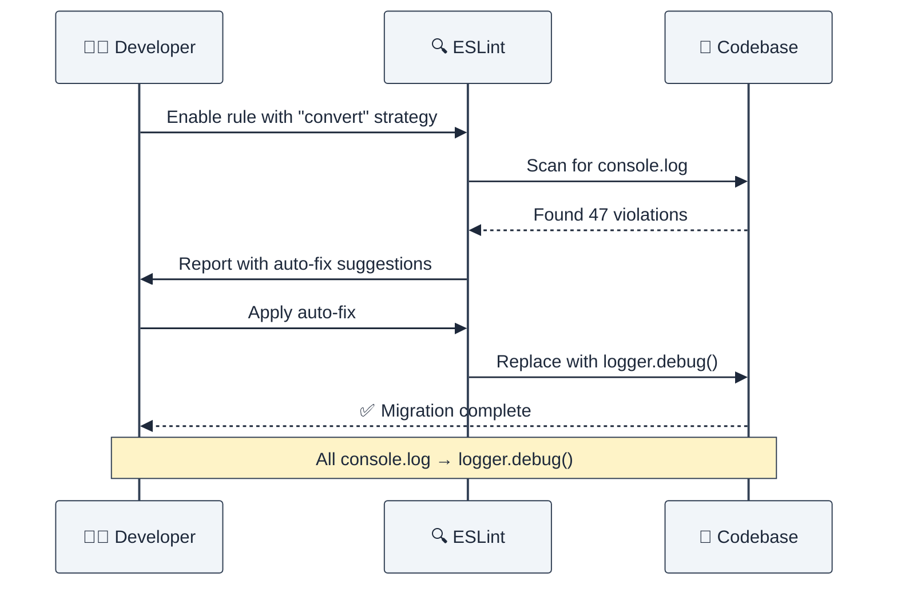

# no-console-log

Disallow `console.log` with configurable remediation strategies and LLM-optimized output.

## Rule Details



### Why This Matters

| Issue | Impact | Solution |
|-------|--------|----------|
| 🔒 **Security** | May leak sensitive data in production | Use structured logging |
| 🐛 **Debugging** | Clutters console, hard to filter | Environment-aware logging |
| ⚡ **Performance** | Uncontrolled logging impacts speed | Configurable log levels |
| 📊 **Observability** | Cannot aggregate or analyze logs | Centralized logging systems |

## Configuration

| Option | Type | Default | Description |
|--------|------|---------|-------------|
| `strategy` | `'remove' \| 'convert' \| 'comment' \| 'warn'` | `'remove'` | Remediation strategy |
| `ignorePaths` | `string[]` | `[]` | Paths/patterns to ignore |
| `customLogger` | `string` | `'logger'` | Logger name for convert strategy |
| `maxOccurrences` | `number` | `undefined` | Max violations to report |

### Strategy Comparison

| Strategy | Behavior | Use Case | Output |
|----------|----------|----------|--------|
| 🗑️ **remove** | Deletes statement | Production cleanup | `console.log("x")` → *(removed)* |
| 🔄 **convert** | Replace with logger | Migration to proper logging | `console.log("x")` → `logger.debug("x")` |
| 💬 **comment** | Comments out code | Temporary debugging | `console.log("x")` → `// console.log("x")` |
| ⚡ **warn** | Change to warning | Downgrade severity | `console.log("x")` → `console.warn("x")` |

## Examples

### ❌ Incorrect

```typescript
function processData(data: any) {
  console.log('Processing data:', data);
  return data.map(item => item * 2);
}

class UserService {
  getUser(id: string) {
    console.log('Fetching user:', id);
    return this.db.users.find(id);
  }
}
```

### ✅ Correct

```typescript
import { logger } from './logger';

function processData(data: any) {
  logger.debug('Processing data:', { data });
  return data.map(item => item * 2);
}

class UserService {
  getUser(id: string) {
    this.logger.debug('Fetching user', { userId: id });
    return this.db.users.find(id);
  }
}
```

## Configuration Examples

### Basic Usage (Default Strategy)

```javascript
// eslint.config.mjs
export default [
  {
    rules: {
      '@forge-js/no-console-log': 'error'
    }
  }
];
```

**Output Format:**
```
⚠️ console.log | src/app.ts:42 | Strategy: remove
```

### Strategy: Remove (Production Cleanup)

```javascript
{
  rules: {
    '@forge-js/no-console-log': ['error', {
      strategy: 'remove'
    }]
  }
}
```

```typescript
// Before
function calculate() {
  console.log("Calculating...");
  return 42;
}

// After (auto-fixed)
function calculate() {
  
  return 42;
}
```

### Strategy: Convert (Logger Migration)

```javascript
{
  rules: {
    '@forge-js/no-console-log': ['error', {
      strategy: 'convert',
      customLogger: 'winston'
    }]
  }
}
```

```typescript
// Before
console.log("User logged in", userId);

// After (auto-fixed)
winston.debug("User logged in", userId);
```

### Strategy: Comment (Temporary Disable)

```javascript
{
  rules: {
    '@forge-js/no-console-log': ['error', {
      strategy: 'comment'
    }]
  }
}
```

```typescript
// Before
console.log("Debug info", data);

// After (auto-fixed)
// console.log("Debug info", data);
```

### Strategy: Warn (Downgrade Severity)

```javascript
{
  rules: {
    '@forge-js/no-console-log': ['error', {
      strategy: 'warn'
    }]
  }
}
```

```typescript
// Before
console.log("Important notice");

// After (auto-fixed)
console.warn("Important notice");
```

### Ignore Specific Paths

```javascript
{
  rules: {
    '@forge-js/no-console-log': ['error', {
      strategy: 'remove',
      ignorePaths: [
        'test',           // Ignore test directories
        'scripts',        // Ignore scripts directory
        '*.test.ts',      // Ignore test files
        'src/debug.ts'    // Ignore specific file
      ]
    }]
  }
}
```

### Limit Reported Violations

```javascript
{
  rules: {
    '@forge-js/no-console-log': ['error', {
      maxOccurrences: 10  // Only report first 10 violations
    }]
  }
}
```

### Team-Specific Configurations

```javascript
// Development environment
{
  rules: {
    '@forge-js/no-console-log': ['warn', {
      strategy: 'comment',
      ignorePaths: ['test', 'scripts']
    }]
  }
}

// Production environment
{
  rules: {
    '@forge-js/no-console-log': ['error', {
      strategy: 'convert',
      customLogger: 'logger',
      maxOccurrences: 0  // Report all violations
    }]
  }
}
```

## LLM-Optimized Output

The rule provides minimal, actionable messages optimized for both humans and LLMs:

```
⚠️ console.log | src/services/auth.ts:127 | Strategy: convert
```

### Output Format Breakdown

| Component | Purpose | Example |
|-----------|---------|---------|
| `⚠️ console.log` | Issue type | Clear identification |
| `src/services/auth.ts:127` | Location | File path + line number |
| `Strategy: convert` | Action | Remediation method |

### Multi-Strategy Suggestions

When a violation is detected, all strategies are available as suggestions:

```
⚠️ console.log | src/app.ts:42 | Strategy: remove

Suggestions:
  🗑️ Remove console.log statement
  🔄 Convert to logger.debug()
  💬 Comment out console.log
  ⚡ Replace with console.warn()
```

## Migration Patterns

### From console.log to Structured Logging



### Step-by-Step Migration

| Phase | Configuration | Goal |
|-------|---------------|------|
| **1. Discovery** | `strategy: 'comment'` | Identify all occurrences |
| **2. Setup Logger** | Import logging library | Add infrastructure |
| **3. Convert** | `strategy: 'convert'` | Auto-migrate code |
| **4. Cleanup** | `strategy: 'remove'` | Remove debugging logs |

## Advanced Usage

### Monorepo Configuration

```javascript
// apps/web/eslint.config.mjs
{
  rules: {
    '@forge-js/no-console-log': ['error', {
      strategy: 'remove',
      ignorePaths: ['test']
    }]
  }
}

// apps/api/eslint.config.mjs
{
  rules: {
    '@forge-js/no-console-log': ['error', {
      strategy: 'convert',
      customLogger: 'winston',
      ignorePaths: ['scripts', 'migrations']
    }]
  }
}
```

### CI/CD Integration

```yaml
# .github/workflows/lint.yml
- name: Lint with auto-fix
  run: |
    npm run lint -- --fix
    git diff --exit-code || echo "Console.log violations auto-fixed"
```

## When Not To Use

| Scenario | Recommendation |
|----------|----------------|
| 🧪 Prototyping | Disable or use `warn` severity |
| 📚 Tutorials | Add to `ignorePaths` |
| 🔧 Build Scripts | Use `ignorePaths: ['scripts']` |
| 🧪 Test Files | Use `ignorePaths: ['*.test.ts']` |

## Comparison with Other Solutions

| Feature | @forge-js/no-console-log | eslint-plugin-no-console | eslint built-in |
|---------|-------------------------|--------------------------|-----------------|
| ✅ Auto-fix | ✅ 4 strategies | ❌ No | ❌ No |
| 🎯 Suggestions | ✅ All strategies | ❌ No | ❌ No |
| 📁 ignorePaths | ✅ Pattern matching | ❌ No | ⚠️ Limited |
| 🤖 LLM-optimized | ✅ Yes | ❌ No | ❌ No |
| 🔄 Logger migration | ✅ Configurable | ❌ No | ❌ No |

## Further Reading

- [ESLint Rules Documentation](https://eslint.org/docs/latest/rules/)
- [Best Practices for Logging in Node.js](https://blog.logrocket.com/best-practices-logging-node-js/)
- [Structured Logging with Winston](https://github.com/winstonjs/winston)
- [MDN: Console API](https://developer.mozilla.org/en-US/docs/Web/API/Console)

