# no-danger

> **Keywords:** React, dangerouslySetInnerHTML, XSS, security, sanitize, ESLint rule, HTML injection, LLM-optimized

Disallow `dangerouslySetInnerHTML` usage to prevent XSS vulnerabilities. This rule is part of [`@forge-js/eslint-plugin-llm-optimized`](https://www.npmjs.com/package/@forge-js/eslint-plugin-llm-optimized) and provides LLM-optimized error messages.

## Quick Summary

| Aspect         | Details                                                              |
| -------------- | -------------------------------------------------------------------- |
| **Severity**   | Error (security)                                                     |
| **Auto-Fix**   | ❌ No (requires manual review)                                       |
| **Category**   | React / Security                                                     |
| **CWE**        | CWE-79 (Cross-site Scripting)                                        |
| **ESLint MCP** | ✅ Optimized for ESLint MCP integration                              |
| **Best For**   | All React projects, especially security-critical applications        |

## Rule Details

```mermaid
%%{init: {
  'theme': 'base',
  'themeVariables': {
    'primaryColor': '#f8fafc',
    'primaryTextColor': '#1e293b',
    'primaryBorderColor': '#334155',
    'lineColor': '#475569',
    'c0': '#f8fafc',
    'c1': '#f1f5f9',
    'c2': '#e2e8f0',
    'c3': '#cbd5e1'
  }
}}%%
flowchart TD
    A[🔍 Detect JSX Attribute] --> B{dangerouslySetInnerHTML?}
    B -->|❌ No| C[✅ Pass]
    B -->|✅ Yes| D[🔒 Report: XSS Risk]
    
    classDef startNode fill:#f0fdf4,stroke:#16a34a,stroke-width:2px,color:#1f2937
    classDef errorNode fill:#fef2f2,stroke:#dc2626,stroke-width:2px,color:#1f2937
    classDef processNode fill:#eff6ff,stroke:#2563eb,stroke-width:2px,color:#1f2937
    
    class A startNode
    class D errorNode
    class C processNode
```



### Why This Matters

| Issue                     | Impact                          | Solution                  |
| ------------------------- | ------------------------------- | ------------------------- |
| 🔒 **XSS Attacks**        | Malicious script execution      | Use React elements        |
| 💉 **HTML Injection**     | Content manipulation            | Sanitize with DOMPurify   |
| 🔐 **Data Theft**         | Cookie/session stealing         | Avoid raw HTML            |
| 🎭 **Phishing**           | UI spoofing                     | Controlled rendering      |

## Configuration

This rule has no configuration options. It always reports `dangerouslySetInnerHTML` usage.

## Examples

### ❌ Incorrect

```tsx
// Direct HTML injection - XSS risk!
function Comment({ html }) {
  return <div dangerouslySetInnerHTML={{ __html: html }} />;
}

// Even with "trusted" content
function Article({ content }) {
  return <article dangerouslySetInnerHTML={{ __html: content }} />;
}

// In any element
<span dangerouslySetInnerHTML={{ __html: userInput }} />
```

### ✅ Correct

```tsx
// Use React elements instead
function Comment({ text }) {
  return <div>{text}</div>;
}

// Parse and render structured content
function Article({ paragraphs }) {
  return (
    <article>
      {paragraphs.map((p, i) => (
        <p key={i}>{p}</p>
      ))}
    </article>
  );
}

// Use markdown parser that returns React elements
import ReactMarkdown from 'react-markdown';

function Documentation({ markdown }) {
  return <ReactMarkdown>{markdown}</ReactMarkdown>;
}

// If HTML is truly necessary, sanitize first
import DOMPurify from 'dompurify';

function SanitizedContent({ html }) {
  const clean = DOMPurify.sanitize(html);
  return <div dangerouslySetInnerHTML={{ __html: clean }} />;
  // Note: Still triggers warning - consider eslint-disable with justification
}
```

## Configuration Examples

### Basic Usage

```javascript
{
  rules: {
    '@forge-js/no-danger': 'error'
  }
}
```

### With Inline Disable (When Necessary)

```tsx
// When sanitization is properly implemented
// eslint-disable-next-line @forge-js/no-danger -- HTML sanitized with DOMPurify
<div dangerouslySetInnerHTML={{ __html: DOMPurify.sanitize(content) }} />
```

## Safe Alternatives

### For Markdown Content

```tsx
import ReactMarkdown from 'react-markdown';
import remarkGfm from 'remark-gfm';

function MarkdownViewer({ content }) {
  return (
    <ReactMarkdown remarkPlugins={[remarkGfm]}>
      {content}
    </ReactMarkdown>
  );
}
```

### For Rich Text (WYSIWYG)

```tsx
import { EditorContent, useEditor } from '@tiptap/react';

function RichTextViewer({ content }) {
  const editor = useEditor({
    content,
    editable: false,
  });

  return <EditorContent editor={editor} />;
}
```

### For Sanitized HTML (When Unavoidable)

```tsx
import DOMPurify from 'dompurify';
import { useMemo } from 'react';

function SanitizedHTML({ html }) {
  const sanitizedHtml = useMemo(() => {
    return DOMPurify.sanitize(html, {
      ALLOWED_TAGS: ['b', 'i', 'em', 'strong', 'a', 'p', 'br'],
      ALLOWED_ATTR: ['href', 'target', 'rel'],
    });
  }, [html]);

  // eslint-disable-next-line @forge-js/no-danger -- Sanitized with DOMPurify
  return <div dangerouslySetInnerHTML={{ __html: sanitizedHtml }} />;
}
```

## When to Use eslint-disable

Only disable this rule when:

1. ✅ HTML is sanitized with a trusted library (DOMPurify)
2. ✅ Content comes from a trusted, controlled source
3. ✅ There's no alternative React-based solution
4. ✅ A comment explains the justification

```tsx
// ✅ Acceptable disable with justification
// eslint-disable-next-line @forge-js/no-danger -- CMS content sanitized server-side
<div dangerouslySetInnerHTML={{ __html: sanitizedCmsContent }} />

// ❌ Never do this
// eslint-disable-next-line @forge-js/no-danger
<div dangerouslySetInnerHTML={{ __html: userInput }} />
```

## Comparison with Alternatives

| Feature              | no-danger           | eslint-plugin-react | Manual review      |
| -------------------- | ------------------- | ------------------- | ------------------ |
| **XSS Detection**    | ✅ Yes              | ✅ Yes              | ⚠️ Manual          |
| **CWE Reference**    | ✅ CWE-79           | ❌ No               | ❌ No              |
| **LLM-Optimized**    | ✅ Yes              | ❌ No               | ❌ No              |
| **ESLint MCP**       | ✅ Optimized        | ❌ No               | ❌ No              |

## Related Rules

- [`no-unsanitized-html`](./no-unsanitized-html.md) - General HTML sanitization
- [`no-unescaped-url-parameter`](./no-unescaped-url-parameter.md) - URL parameter XSS

## Further Reading

- **[React dangerouslySetInnerHTML](https://react.dev/reference/react-dom/components/common#dangerously-setting-the-inner-html)** - Official React docs
- **[OWASP XSS Prevention](https://cheatsheetseries.owasp.org/cheatsheets/Cross_Site_Scripting_Prevention_Cheat_Sheet.html)** - XSS prevention guide
- **[DOMPurify](https://github.com/cure53/DOMPurify)** - HTML sanitization library
- **[CWE-79](https://cwe.mitre.org/data/definitions/79.html)** - Cross-site Scripting reference
- **[ESLint MCP Setup](https://eslint.org/docs/latest/use/mcp)** - Enable AI assistant integration

