# no-default-export

> **Keywords:** default export, named export, imports, tree-shaking, refactoring, ESLint rule, module system, LLM-optimized

Prevents default exports to encourage named exports for better refactoring and tree-shaking. This rule is part of [`@forge-js/eslint-plugin-llm-optimized`](https://www.npmjs.com/package/@forge-js/eslint-plugin-llm-optimized) and provides auto-fix capabilities.

## Quick Summary

| Aspect         | Details                                                              |
| -------------- | -------------------------------------------------------------------- |
| **Severity**   | Warning (architecture)                                               |
| **Auto-Fix**   | ✅ Yes (converts to named exports)                                   |
| **Category**   | Architecture                                                         |
| **ESLint MCP** | ✅ Optimized for ESLint MCP integration                              |
| **Best For**   | Libraries, large codebases, teams wanting consistent export style    |

## Rule Details

```mermaid
%%{init: {
  'theme': 'base',
  'themeVariables': {
    'primaryColor': '#f8fafc',
    'primaryTextColor': '#1e293b',
    'primaryBorderColor': '#334155',
    'lineColor': '#475569',
    'c0': '#f8fafc',
    'c1': '#f1f5f9',
    'c2': '#e2e8f0',
    'c3': '#cbd5e1'
  }
}}%%
flowchart TD
    A[🔍 Detect Export] --> B{Default Export?}
    B -->|❌ No| C[✅ Pass]
    B -->|✅ Yes| D{File Allowed?}
    
    D -->|✅ Yes| C
    D -->|❌ No| E[🔧 Auto-fix to Named]
    
    E --> F[⚠️ Report]
    
    classDef startNode fill:#f0fdf4,stroke:#16a34a,stroke-width:2px,color:#1f2937
    classDef errorNode fill:#fef2f2,stroke:#dc2626,stroke-width:2px,color:#1f2937
    classDef processNode fill:#eff6ff,stroke:#2563eb,stroke-width:2px,color:#1f2937
    
    class A startNode
    class F errorNode
    class C processNode
```



### Why This Matters

| Issue                   | Impact                          | Solution                  |
| ----------------------- | ------------------------------- | ------------------------- |
| 🔄 **Refactoring**      | Renaming imports is error-prone | Named exports auto-update |
| 🌳 **Tree-shaking**     | Harder to eliminate dead code   | Named exports optimize    |
| 📖 **Readability**      | Import names can vary           | Consistent naming         |
| 🔍 **IDE Support**      | Less auto-complete accuracy     | Better tooling support    |

## Configuration

| Option          | Type       | Default | Description                              |
| --------------- | ---------- | ------- | ---------------------------------------- |
| `allowInFiles`  | `string[]` | `[]`    | File patterns that allow default exports |
| `allowPatterns` | `string[]` | `[]`    | Patterns that allow default exports      |
| `suggestNamed`  | `boolean`  | `true`  | Suggest named export alternative         |

## Examples

### ❌ Incorrect

```typescript
// utils.ts
export default function formatDate(date: Date) {
  return date.toISOString();
}

// Can be imported as ANY name:
import format from './utils';        // ❌ Inconsistent
import dateFormatter from './utils'; // ❌ Different name
import foo from './utils';           // ❌ Meaningless
```

### ✅ Correct

```typescript
// utils.ts
export function formatDate(date: Date) {
  return date.toISOString();
}

// Always imported with the same name:
import { formatDate } from './utils'; // ✅ Consistent
```

## Configuration Examples

### Basic Usage

```javascript
{
  rules: {
    '@forge-js/no-default-export': 'error'
  }
}
```

### Allow for Next.js Pages

```javascript
{
  rules: {
    '@forge-js/no-default-export': ['error', {
      allowInFiles: [
        '**/pages/**',
        '**/app/**/page.tsx',
        '**/app/**/layout.tsx'
      ]
    }]
  }
}
```

### Allow for Storybook

```javascript
{
  rules: {
    '@forge-js/no-default-export': ['error', {
      allowPatterns: [
        '*.stories.tsx',
        '*.story.tsx'
      ]
    }]
  }
}
```

### Combined Exceptions

```javascript
{
  rules: {
    '@forge-js/no-default-export': ['error', {
      allowInFiles: [
        '**/pages/**',
        'next.config.js',
        'vite.config.ts'
      ],
      allowPatterns: [
        '*.stories.*',
        '*.config.*'
      ]
    }]
  }
}
```

## Auto-Fix Examples

### Function Export

```typescript
// Before
export default function MyComponent() { }

// After (auto-fixed)
export function MyComponent() { }
```

### Class Export

```typescript
// Before
export default class UserService { }

// After (auto-fixed)
export class UserService { }
```

### Re-export

```typescript
// Before
export { default } from './module';

// After (flagged, manual fix needed)
export { namedExport } from './module';
```

## When Not To Use

| Scenario                    | Recommendation                              |
| --------------------------- | ------------------------------------------- |
| ⚛️ **Next.js/Remix pages**  | Add to `allowInFiles`                       |
| 📖 **Storybook stories**    | Add to `allowPatterns`                      |
| ⚙️ **Config files**         | Add `*.config.*` to patterns                |
| 🎭 **Dynamic imports**      | Consider if default is required             |

## Comparison with Alternatives

| Feature              | no-default-export   | eslint-plugin-import | Manual enforcement |
| -------------------- | ------------------- | -------------------- | ------------------ |
| **Auto-fix**         | ✅ Yes              | ❌ No                | ❌ No              |
| **File patterns**    | ✅ Flexible         | ⚠️ Limited           | ❌ No              |
| **LLM-Optimized**    | ✅ Yes              | ❌ No                | ❌ No              |
| **ESLint MCP**       | ✅ Optimized        | ❌ No                | ❌ No              |

## Related Rules

- [`prefer-default-export`](./prefer-default-export.md) - Opposite: prefer default exports
- [`no-named-export`](./no-named-export.md) - Forbid named exports
- [`no-anonymous-default-export`](./no-anonymous-default-export.md) - Require named default exports

## Further Reading

- **[Named vs Default Exports](https://humanwhocodes.com/blog/2019/01/stop-using-default-exports-javascript-module/)** - Why named exports are better
- **[Tree Shaking](https://webpack.js.org/guides/tree-shaking/)** - Bundle optimization
- **[eslint-plugin-import no-default-export](https://github.com/import-js/eslint-plugin-import/blob/main/docs/rules/no-default-export.md)** - Import plugin docs
- **[ESLint MCP Setup](https://eslint.org/docs/latest/use/mcp)** - Enable AI assistant integration

