# no-exposed-sensitive-data

> **Keywords:** sensitive data, CWE-200, security, ESLint rule, PII, SSN, credit card, password, API key, data exposure, logging, LLM-optimized, code security

Detects exposure of sensitive data (SSN, credit card numbers, passwords, API keys) in logs or output. This rule is part of [`@forge-js/eslint-plugin-llm-optimized`](https://www.npmjs.com/package/@forge-js/eslint-plugin-llm-optimized) and provides LLM-optimized error messages that AI assistants can understand.

💼 This rule is set to **error** by default in the `recommended` config.

## Quick Summary

| Aspect            | Details                                                                          |
| ----------------- | -------------------------------------------------------------------------------- |
| **CWE Reference** | CWE-200 (Exposure of Sensitive Information to an Unauthorized Actor)          |
| **Severity**      | CRITICAL (security vulnerability)                                               |
| **Auto-Fix**      | ❌ No (requires manual review and masking)                                      |
| **Category**      | Security                                                                         |
| **ESLint MCP**    | ✅ Optimized for ESLint MCP integration                                          |
| **Best For**      | All applications logging user data, APIs, payment systems, authentication      |

## Detection Flow

```mermaid
%%{init: {
  'theme': 'base',
  'themeVariables': {
    'primaryColor': '#f8fafc',
    'primaryTextColor': '#1e293b',
    'primaryBorderColor': '#334155',
    'lineColor': '#475569'
  }
}}%%
flowchart TD
    A[🔍 Analyze Code] --> B{Is in Logging Context?}
    B -->|No| C[✅ Valid: Not logged]
    B -->|Yes| D{Contains Sensitive Pattern?}
    D -->|No| C
    D -->|Yes| E{Pattern Type}
    E --> F[SSN Pattern]
    E --> G[Credit Card]
    E --> H[Password]
    E --> I[API Key]
    F --> J[❌ Report: SSN in logs]
    G --> K[❌ Report: Credit card in logs]
    H --> L[❌ Report: Password in logs]
    I --> M[❌ Report: API key in logs]
    
    style C fill:#d1fae5,stroke:#059669,stroke-width:2px
    style J fill:#fee2e2,stroke:#dc2626,stroke-width:2px
    style K fill:#fee2e2,stroke:#dc2626,stroke-width:2px
    style L fill:#fee2e2,stroke:#dc2626,stroke-width:2px
    style M fill:#fee2e2,stroke:#dc2626,stroke-width:2px
```



## Why This Matters

| Issue                 | Impact                              | Solution                   |
| --------------------- | ----------------------------------- | -------------------------- |
| 🔒 **Data Breach**    | Sensitive data in logs              | Mask or remove from logs   |
| 🔐 **Compliance**     | Violates GDPR, HIPAA, PCI-DSS       | Never log sensitive data   |
| 🍪 **Identity Theft**| SSN, credit card exposure           | Use data masking           |
| 📊 **Best Practice**  | Never log PII or credentials      | Sanitize logs              |

## Detection Patterns

The rule detects:

- **SSN patterns**: `123-45-6789`, `123456789`
- **Credit card patterns**: `1234-5678-9012-3456`, `1234567890123456`
- **Password patterns**: Variables named `password`, `pwd`, `pass`
- **API key patterns**: Variables named `apiKey`, `apikey`, `secret`, `token`
- **Logging contexts**: `console.log`, `logger.info`, `winston.log`, etc.

## Examples

### ❌ Incorrect

```typescript
// Exposing sensitive data in logs
const ssn = "123-45-6789";
console.log("User SSN:", ssn); // ❌ SSN in logs

const creditCard = "1234-5678-9012-3456";
logger.info("Payment card:", creditCard); // ❌ Credit card in logs

const password = req.body.password;
console.log("Password:", password); // ❌ Password in logs

const apiKey = process.env.API_KEY;
winston.log("API Key:", apiKey); // ❌ API key in logs
```

### ✅ Correct

```typescript
// Masking sensitive data
const ssn = "123-45-6789";
console.log("User ID:", userId); // ✅ Log non-sensitive data

const creditCard = "1234-5678-9012-3456";
const masked = creditCard.replace(/\d(?=\d{4})/g, '*');
logger.info("Payment card:", masked); // ✅ Masked card number

const password = req.body.password;
// Don't log passwords at all
hashPassword(password); // ✅ Process without logging

const apiKey = process.env.API_KEY;
// Don't log API keys
useApiKey(apiKey); // ✅ Use without logging
```

## Configuration

### Default Configuration

```json
{
  "@forge-js/llm-optimized/security/no-exposed-sensitive-data": "error"
}
```

### Options

| Option             | Type       | Default                          | Description                        |
| ------------------ | ---------- | -------------------------------- | ----------------------------------- |
| `allowInTests`     | `boolean`  | `false`                          | Allow sensitive data in tests       |
| `sensitivePatterns`| `string[]` | `['ssn', 'creditCard', ...]`    | Sensitive data patterns             |
| `loggingPatterns`  | `string[]` | `['console', 'logger', ...]`    | Logging function patterns           |
| `ignorePatterns`   | `string[]` | `[]`                             | Additional patterns to ignore       |

### Example Configuration

```json
{
  "@forge-js/llm-optimized/security/no-exposed-sensitive-data": [
    "error",
    {
      "allowInTests": true,
      "sensitivePatterns": ["ssn", "creditCard", "password", "apiKey"],
      "loggingPatterns": ["console", "logger", "winston"],
      "ignorePatterns": ["/test/", "mock"]
    }
  ]
}
```

## Best Practices

1. **Never log sensitive data**: SSN, credit cards, passwords, API keys
2. **Use data masking**: Mask sensitive data if logging is necessary
3. **Sanitize logs**: Remove or redact sensitive information
4. **Environment variables**: Never log API keys or secrets
5. **Compliance**: Follow GDPR, HIPAA, PCI-DSS requirements

## Related Rules

- [`no-hardcoded-credentials`](./no-hardcoded-credentials.md) - Detects hardcoded credentials
- [`no-unencrypted-transmission`](./no-unencrypted-transmission.md) - Detects unencrypted data transmission

## Resources

- [CWE-200: Exposure of Sensitive Information](https://cwe.mitre.org/data/definitions/200.html)
- [OWASP: Sensitive Data Exposure](https://owasp.org/www-project-top-ten/)
- [PCI-DSS: Data Protection Requirements](https://www.pcisecuritystandards.org/)

