# no-insecure-cookie-settings

> **Keywords:** insecure cookie, CWE-614, security, ESLint rule, httpOnly, secure, sameSite, cookie security, session management, LLM-optimized, code security

Detects insecure cookie configurations (missing httpOnly, secure, sameSite flags). This rule is part of [`@forge-js/eslint-plugin-llm-optimized`](https://www.npmjs.com/package/@forge-js/eslint-plugin-llm-optimized) and provides LLM-optimized error messages that AI assistants can automatically fix.

💼 This rule is set to **error** by default in the `recommended` config.

## Quick Summary

| Aspect            | Details                                                                          |
| ----------------- | -------------------------------------------------------------------------------- |
| **CWE Reference** | CWE-614 (Sensitive Cookie in HTTPS Session Without 'Secure' Attribute)         |
| **Severity**      | HIGH (security vulnerability)                                                   |
| **Auto-Fix**      | ✅ Yes (adds missing flags automatically)                                      |
| **Category**      | Security                                                                         |
| **ESLint MCP**    | ✅ Optimized for ESLint MCP integration                                          |
| **Best For**      | All web applications using cookies, Express, Next.js, session management      |

## Detection Flow

```mermaid
%%{init: {
  'theme': 'base',
  'themeVariables': {
    'primaryColor': '#f8fafc',
    'primaryTextColor': '#1e293b',
    'primaryBorderColor': '#334155',
    'lineColor': '#475569'
  }
}}%%
flowchart TD
    A[🔍 Analyze Cookie Call] --> B{Is res.cookie or document.cookie?}
    B -->|res.cookie| C{Has Options Object?}
    B -->|document.cookie| D[❌ Report: Cannot set httpOnly]
    C -->|No| E[❌ Report: Missing options]
    C -->|Yes| F{Check Flags}
    F --> G{Has httpOnly?}
    F --> H{Has secure?}
    F --> I{Has sameSite?}
    G -->|No| J[❌ Report: Missing httpOnly]
    H -->|No| K[❌ Report: Missing secure]
    I -->|No| L[❌ Report: Missing sameSite]
    G -->|Yes| M[✅ Valid]
    H -->|Yes| M
    I -->|Yes| M
    
    style D fill:#fee2e2,stroke:#dc2626,stroke-width:2px
    style E fill:#fee2e2,stroke:#dc2626,stroke-width:2px
    style J fill:#fee2e2,stroke:#dc2626,stroke-width:2px
    style K fill:#fee2e2,stroke:#dc2626,stroke-width:2px
    style L fill:#fee2e2,stroke:#dc2626,stroke-width:2px
    style M fill:#d1fae5,stroke:#059669,stroke-width:2px
```



## Why This Matters

| Issue                 | Impact                              | Solution                   |
| --------------------- | ----------------------------------- | -------------------------- |
| 🔒 **XSS Attacks**   | Cookies accessible via JavaScript   | Set httpOnly: true         |
| 🔐 **Man-in-Middle**  | Cookies transmitted over HTTP       | Set secure: true           |
| 🍪 **CSRF Attacks**  | Cookies sent cross-site             | Set sameSite: "strict"     |
| 📊 **Best Practice**  | All cookies need security flags     | Use all three flags        |

## Detection Patterns

The rule detects:

- **Express cookie calls**: `res.cookie(name, value, options)`
- **Document.cookie assignments**: `document.cookie = "..."` (cannot set httpOnly)
- **Missing flags**: `httpOnly`, `secure`, `sameSite`
- **Cookie library patterns**: Configurable via `cookieLibraries` option

## Examples

### ❌ Incorrect

```typescript
// Missing all security flags
res.cookie("session", token); // ❌ No options object

res.cookie("session", token, {}); // ❌ Empty options

res.cookie("session", token, { secure: true }); // ❌ Missing httpOnly, sameSite

res.cookie("session", token, { 
  httpOnly: true 
}); // ❌ Missing secure, sameSite

// Cannot set httpOnly via document.cookie
document.cookie = "session=token"; // ❌ Cannot set httpOnly flag
```

### ✅ Correct

```typescript
// All security flags present
res.cookie("session", token, {
  httpOnly: true,
  secure: true,
  sameSite: "strict"
}); // ✅ All flags set

res.cookie("session", token, {
  httpOnly: true,
  secure: true,
  sameSite: "lax" // ✅ Also valid
}); // ✅ All flags set

res.cookie("session", token, {
  httpOnly: true,
  secure: true,
  sameSite: "none" // ✅ Valid with secure: true
}); // ✅ All flags set
```

## Configuration

### Default Configuration

```json
{
  "@forge-js/llm-optimized/security/no-insecure-cookie-settings": "error"
}
```

### Options

| Option            | Type       | Default | Description                        |
| ----------------- | ---------- | ------- | ----------------------------------- |
| `allowInTests`    | `boolean`  | `false` | Allow insecure cookies in tests     |
| `cookieLibraries` | `string[]` | `[]`    | Cookie library patterns to recognize |
| `ignorePatterns`  | `string[]` | `[]`    | Additional patterns to ignore       |

### Example Configuration

```json
{
  "@forge-js/llm-optimized/security/no-insecure-cookie-settings": [
    "error",
    {
      "allowInTests": true,
      "cookieLibraries": ["cookie", "js-cookie"],
      "ignorePatterns": ["/test/", "mock"]
    }
  ]
}
```

## Auto-Fix Behavior

The rule provides automatic fixes that:

- ✅ Add missing `httpOnly: true` flag
- ✅ Add missing `secure: true` flag
- ✅ Add missing `sameSite: "strict"` flag
- ✅ Preserve existing flags
- ✅ Handle empty objects by replacing with full config

### Auto-Fix Example

```typescript
// Before (triggers rule)
res.cookie("session", token, { secure: true });

// After (auto-fixed)
res.cookie("session", token, { secure: true, httpOnly: true, sameSite: "strict" });
```

## Best Practices

1. **Always use all three flags**: `httpOnly`, `secure`, `sameSite`
2. **Prefer `sameSite: "strict"`**: Most secure option
3. **Use `sameSite: "lax"`**: If cross-site cookies are needed
4. **Never use `document.cookie`**: Cannot set httpOnly flag
5. **Test file exceptions**: Use `allowInTests: true` for test files

## Related Rules

- [`no-missing-csrf-protection`](./no-missing-csrf-protection.md) - Detects missing CSRF protection
- [`no-exposed-sensitive-data`](./no-exposed-sensitive-data.md) - Detects sensitive data exposure

## Resources

- [CWE-614: Sensitive Cookie in HTTPS Session Without 'Secure' Attribute](https://cwe.mitre.org/data/definitions/614.html)
- [OWASP: HttpOnly](https://owasp.org/www-community/HttpOnly)
- [MDN: Set-Cookie](https://developer.mozilla.org/en-US/docs/Web/HTTP/Headers/Set-Cookie)

