# no-insufficient-random

🔒 **CWE-338** | **HIGH** | Detects weak random number generation (Math.random(), weak PRNG)

## Keywords

`security`, `random`, `prng`, `crypto`, `math.random`, `cwe-338`, `weak random`, `cryptographically weak`, `pseudo-random`, `random number generator`, `secure random`, `crypto.getRandomValues`, `crypto.randomBytes`

## Quick Summary

| Aspect            | Details                                                                          |
| ----------------- | -------------------------------------------------------------------------------- |
| **CWE Reference** | CWE-338 (Use of Cryptographically Weak Pseudo-Random Number Generator (PRNG)) |
| **Severity**      | HIGH (security vulnerability)                                                   |
| **Auto-Fix**      | ✅ Yes (suggests crypto.getRandomValues() or crypto.randomBytes())              |
| **Category**      | Security                                                                         |
| **ESLint MCP**    | ✅ Optimized for ESLint MCP integration                                         |
| **Best For**      | All applications requiring secure random number generation, cryptography, tokens, IDs |

## Rule Details

This rule detects the use of weak pseudo-random number generators (PRNGs) like `Math.random()`, which are not suitable for cryptographic purposes, security-sensitive operations, or any scenario requiring unpredictable randomness.

### Why This Matters

| Issue                 | Impact                                    | Solution                           |
| --------------------- | ----------------------------------------- | ---------------------------------- |
| 🔒 **Security**       | Predictable random values can be exploited | Use crypto.getRandomValues()       |
| 🎲 **Predictability** | Math.random() is deterministic and guessable | Use cryptographically secure PRNG |
| 🔐 **Token Generation** | Weak randomness compromises token security | Use crypto.randomBytes()           |
| 📊 **Compliance**     | Violates security best practices          | Follow OWASP guidelines            |

## Detection Patterns

The rule detects:

- **Math.random()**: JavaScript's built-in PRNG (not cryptographically secure)
- **Custom weak PRNGs**: Additional patterns can be configured via options
- **Standalone random() calls**: If configured in `additionalWeakPatterns`

### What Gets Flagged

```typescript
// ❌ Weak random number generation
const random = Math.random();
const id = Math.random().toString(36).substring(2);
const value = Math.random() * 100;
```

### What's Allowed

```typescript
// ✅ Cryptographically secure random
const random = crypto.getRandomValues(new Uint32Array(1))[0] / (0xFFFFFFFF + 1);
const bytes = crypto.randomBytes(16);
const secureId = crypto.randomBytes(8).toString('hex');
```

## Examples

### ❌ Incorrect

```typescript
// Weak random for ID generation
const id = Math.random().toString(36).substring(2);

// Weak random for selection
const randomIndex = Math.floor(Math.random() * array.length);

// Weak random for token
const token = Math.random().toString(36).substring(2, 15);

// Weak random in condition
if (Math.random() > 0.5) {
  console.log('heads');
}

// Weak random for sorting (Fisher-Yates shuffle)
const shuffled = array.sort(() => Math.random() - 0.5);
```

### ✅ Correct

```typescript
// Secure random for ID generation
const id = crypto.randomBytes(8).toString('hex');

// Secure random for selection
const randomIndex = crypto.getRandomValues(new Uint32Array(1))[0] % array.length;

// Secure random for token
const token = crypto.randomBytes(12).toString('base64url');

// Secure random in condition
const randomValue = crypto.getRandomValues(new Uint32Array(1))[0] / (0xFFFFFFFF + 1);
if (randomValue > 0.5) {
  console.log('heads');
}

// Secure random for sorting (Fisher-Yates shuffle)
const random = () => crypto.getRandomValues(new Uint32Array(1))[0] / (0xFFFFFFFF + 1);
const shuffled = array.sort(() => random() - 0.5);
```

## Configuration

### Basic Usage

```json
{
  "rules": {
    "@forge-js/llm-optimized/no-insufficient-random": "error"
  }
}
```

### With Options

```json
{
  "rules": {
    "@forge-js/llm-optimized/no-insufficient-random": [
      "error",
      {
        "allowInTests": false,
        "additionalWeakPatterns": ["weakRandom", "unsafeRandom"],
        "trustedLibraries": ["crypto"]
      }
    ]
  }
}
```

## Options

| Option                  | Type       | Default | Description                                                       |
| ----------------------- | ---------- | ------- | ----------------------------------------------------------------- |
| `allowInTests`          | `boolean`  | `false` | Allow Math.random() in test files (`.test.ts`, `.spec.ts`)        |
| `additionalWeakPatterns` | `string[]` | `[]`    | Additional weak PRNG patterns to detect (e.g., `['weakRandom']`)  |
| `trustedLibraries`     | `string[]` | `['crypto']` | Trusted random libraries (currently unused, reserved for future) |

### Ignoring Test Files

```json
{
  "rules": {
    "@forge-js/llm-optimized/no-insufficient-random": [
      "error",
      {
        "allowInTests": true
      }
    ]
  }
}
```

This allows `Math.random()` in test files:

```typescript
// ✅ Allowed in test.spec.ts when allowInTests: true
const mockRandom = Math.random();
```

## Rule Logic Flow

```mermaid
%%{init: {
  'theme': 'base',
  'themeVariables': {
    'primaryColor': '#f8fafc',
    'primaryTextColor': '#1e293b',
    'primaryBorderColor': '#334155',
    'lineColor': '#475569',
    'c0': '#f8fafc',
    'c1': '#f1f5f9',
    'c2': '#e2e8f0',
    'c3': '#cbd5e1'
  }
}}%%
flowchart TD
    A[🔍 Start: CallExpression] --> B{Is Test File?}
    B -->|Yes + allowInTests| C[✅ Skip]
    B -->|No| D{Is Math.random?}
    D -->|Yes| E[🔍 Check Pattern]
    D -->|No| F{Has additionalWeakPatterns?}
    F -->|Yes| G[🔍 Check Custom Patterns]
    F -->|No| C
    E --> H{Pattern Found?}
    G --> H
    H -->|Yes| I[⚠️ Report Error]
    H -->|No| C
    I --> J[💡 Suggest Fix]
    J --> K[crypto.getRandomValues]
    J --> L[crypto.randomBytes]

    classDef startNode fill:#f0fdf4,stroke:#16a34a,stroke-width:2px,color:#1f2937
    classDef errorNode fill:#fef2f2,stroke:#dc2626,stroke-width:2px,color:#1f2937
    classDef processNode fill:#eff6ff,stroke:#2563eb,stroke-width:2px,color:#1f2937
    classDef skipNode fill:#f1f5f9,stroke:#64748b,stroke-width:2px,color:#1f2937

    class A startNode
    class I errorNode
    class E,G,H,J processNode
    class C skipNode
```



## Best Practices

### 1. Use crypto.getRandomValues() for 0-1 Range

```typescript
// ✅ Good - Secure random in [0, 1) range
const random = crypto.getRandomValues(new Uint32Array(1))[0] / (0xFFFFFFFF + 1);
```

### 2. Use crypto.randomBytes() for Binary Data

```typescript
// ✅ Good - Secure random bytes
const token = crypto.randomBytes(16).toString('hex');
const id = crypto.randomBytes(8).toString('base64url');
```

### 3. Use crypto.getRandomValues() for Integer Ranges

```typescript
// ✅ Good - Secure random integer in range
const randomInt = (min: number, max: number) => {
  const range = max - min + 1;
  const random = crypto.getRandomValues(new Uint32Array(1))[0];
  return min + (random % range);
};
```

### 4. Never Use Math.random() for Security

```typescript
// ❌ Bad - Never use for tokens, IDs, or security
const sessionId = Math.random().toString(36);
const apiKey = Math.random().toString(36).substring(2, 15);
```

## Common Use Cases

### Generating Secure IDs

```typescript
// ❌ Weak
const id = Math.random().toString(36).substring(2);

// ✅ Secure
const id = crypto.randomBytes(8).toString('hex');
```

### Random Array Selection

```typescript
// ❌ Weak
const randomItem = array[Math.floor(Math.random() * array.length)];

// ✅ Secure
const randomIndex = crypto.getRandomValues(new Uint32Array(1))[0] % array.length;
const randomItem = array[randomIndex];
```

### Token Generation

```typescript
// ❌ Weak
const token = Math.random().toString(36).substring(2, 15);

// ✅ Secure
const token = crypto.randomBytes(12).toString('base64url');
```

### Shuffling Arrays

```typescript
// ❌ Weak (Fisher-Yates with Math.random)
const shuffled = array.sort(() => Math.random() - 0.5);

// ✅ Secure (Fisher-Yates with crypto)
const secureRandom = () => 
  crypto.getRandomValues(new Uint32Array(1))[0] / (0xFFFFFFFF + 1);
const shuffled = array.sort(() => secureRandom() - 0.5);
```

## Related Rules

- [`no-weak-crypto`](./no-weak-crypto.md) - Detects weak cryptography algorithms
- [`no-hardcoded-credentials`](./no-hardcoded-credentials.md) - Detects hardcoded secrets

## Resources

- **CWE-338**: https://cwe.mitre.org/data/definitions/338.html
- **OWASP**: https://owasp.org/www-community/vulnerabilities/Weak_Random_Number_Generation
- **MDN crypto.getRandomValues()**: https://developer.mozilla.org/en-US/docs/Web/API/Crypto/getRandomValues
- **Node.js crypto.randomBytes()**: https://nodejs.org/api/crypto.html#cryptorandombytessize-callback
- **NIST SP 800-90A**: https://csrc.nist.gov/publications/detail/sp/800-90a/rev-1/final

## Version History

- **1.0.0** - Initial release with Math.random() detection and crypto.getRandomValues() suggestions

