# no-internal-modules

Prevent importing from internal/deep module paths with configurable strategies and LLM-optimized output.

## Rule Details

```mermaid
%%{init: {
  'theme': 'base',
  'themeVariables': {
    'primaryColor': '#f8fafc',
    'primaryTextColor': '#1e293b',
    'primaryBorderColor': '#334155',
    'lineColor': '#475569',
    'c0': '#f8fafc',
    'c1': '#f1f5f9',
    'c2': '#e2e8f0',
    'c3': '#cbd5e1'
  }
}}%%
flowchart TD
    A[🔍 Detect Import] --> B{Calculate Depth}
    B -->|📦 Package Root| C{Check Patterns}
    B -->|📂 Deep Path| C

    C -->|🟢 Allowed| D[✅ Pass]
    C -->|🔴 Forbidden| E[❌ Report]
    C -->|⚠️ Exceeds maxDepth| E

    E --> F{Strategy}
    F -->|❌ error| G[Report Error]
    F -->|🔧 autofix| H[Auto-fix to Public API]
    F -->|💡 suggest| I[Provide Suggestions]
    F -->|⚠️ warn| J[Report Warning]

    classDef startNode fill:#f0fdf4,stroke:#16a34a,stroke-width:2px,color:#1f2937
    classDef errorNode fill:#fef2f2,stroke:#dc2626,stroke-width:2px,color:#1f2937
    classDef processNode fill:#eff6ff,stroke:#2563eb,stroke-width:2px,color:#1f2937

    class A startNode
    class E,G errorNode
    class H,I,J processNode
```



### Why This Matters

| Issue                    | Impact                        | Solution                |
| ------------------------ | ----------------------------- | ----------------------- |
| 🏗️ **Module Boundaries** | Internal structure exposed    | Enforce public APIs     |
| 🔄 **Refactoring**       | Changes break consumers       | Decouple from internals |
| 📦 **Tree Shaking**      | Larger bundle sizes           | Use barrel exports      |
| 🔒 **Encapsulation**     | Implementation details leaked | Public interface only   |

## Configuration

| Option        | Type                                          | Default   | Description                   |
| ------------- | --------------------------------------------- | --------- | ----------------------------- |
| `strategy`    | `'error' \| 'suggest' \| 'autofix' \| 'warn'` | `'error'` | Remediation strategy          |
| `maxDepth`    | `number`                                      | `1`       | Maximum allowed import depth  |
| `allow`       | `string[]`                                    | `[]`      | Explicitly allowed patterns   |
| `forbid`      | `string[]`                                    | `[]`      | Explicitly forbidden patterns |
| `ignorePaths` | `string[]`                                    | `[]`      | Paths/patterns to ignore      |

### Import Depth Calculation

| Import                          | Depth | Explanation             |
| ------------------------------- | ----- | ----------------------- |
| `lodash`                        | 0     | Package root            |
| `lodash/get`                    | 1     | One level deep          |
| `@company/ui`                   | 0     | Scoped package root     |
| `@company/ui/components`        | 1     | One level deep          |
| `@company/ui/components/Button` | 2     | Two levels deep         |
| `./utils`                       | 0     | Relative root           |
| `./utils/helpers`               | 1     | Relative one level deep |

### Strategy Comparison

| Strategy       | Behavior               | Use Case           | Output                  |
| -------------- | ---------------------- | ------------------ | ----------------------- |
| ❌ **error**   | Report as error        | Strict enforcement | Error only, no fix      |
| 🔧 **autofix** | Auto-fix to public API | Migration/cleanup  | `lodash/get` → `lodash` |
| 💡 **suggest** | Provide suggestions    | Review before fix  | Multiple suggestions    |
| ⚠️ **warn**    | Report as warning      | Gradual adoption   | Warning only            |

## Examples

### ❌ Incorrect

```typescript
// Deep imports from third-party libraries
import get from 'lodash/get';
import isEmpty from 'lodash/isEmpty';

// Internal component paths
import { Button } from '@company/ui/components/Button';
import { Input } from '@company/ui/components/forms/Input';

// Deep relative imports
import { formatDate } from './utils/helpers/date';
import { validateEmail } from '../utils/validators/email';
```

### ✅ Correct

```typescript
// Import from package root
import { get, isEmpty } from 'lodash';

// Import from public API
import { Button, Input } from '@company/ui';

// Import from barrel exports
import { formatDate, validateEmail } from './utils';
```

## Configuration Examples

### Basic Usage (Default)

```javascript
// eslint.config.mjs
export default [
  {
    rules: {
      '@forge-js/no-internal-modules': 'error',
    },
  },
];
```

**Output Format:**

```
🚫 Internal module import | lodash/get | Depth: 1 | Strategy: error
```

### Strategy: autofix (Migration)

```javascript
{
  rules: {
    '@forge-js/no-internal-modules': ['error', {
      strategy: 'autofix',
      maxDepth: 0
    }]
  }
}
```

```typescript
// Before
import get from 'lodash/get';
import { Button } from '@company/ui/components/Button';

// After (auto-fixed)
import get from 'lodash';
import { Button } from '@company/ui';
```

### Strategy: suggest (Review First)

```javascript
{
  rules: {
    '@forge-js/no-internal-modules': ['error', {
      strategy: 'suggest',
      maxDepth: 0
    }]
  }
}
```

Provides multiple suggestions:

- 📦 Import from public API: `lodash`
- 🗂️ Use barrel export: _(if depth > 1)_

### Flexible maxDepth

```javascript
{
  rules: {
    '@forge-js/no-internal-modules': ['error', {
      maxDepth: 0  // Only package root allowed
    }]
  }
}
```

```javascript
{
  rules: {
    '@forge-js/no-internal-modules': ['error', {
      maxDepth: 1  // One level deep allowed
    }]
  }
}
```

| maxDepth | Allowed                                          | Forbidden                                        |
| -------- | ------------------------------------------------ | ------------------------------------------------ |
| `0`      | `lodash`, `@company/ui`                          | `lodash/get`, `@company/ui/components`           |
| `1`      | `lodash/get`, `@company/ui/components`           | `lodash/fp/get`, `@company/ui/components/Button` |
| `2`      | `lodash/fp/get`, `@company/ui/components/Button` | Deeper paths                                     |

### Allow Specific Patterns

```javascript
{
  rules: {
    '@forge-js/no-internal-modules': ['error', {
      maxDepth: 0,
      allow: [
        'lodash/*',           // Allow all lodash internals
        '@company/ui/icons',  // Allow specific internal path
        'rxjs/operators'      // Allow rxjs operators
      ]
    }]
  }
}
```

```typescript
// ✅ Allowed (matches patterns)
import get from 'lodash/get';
import { CheckIcon } from '@company/ui/icons';
import { map, filter } from 'rxjs/operators';

// ❌ Forbidden (doesn't match)
import { Button } from '@company/ui/components';
```

### Forbid Specific Patterns

```javascript
{
  rules: {
    '@forge-js/no-internal-modules': ['error', {
      forbid: [
        '*/internal/*',        // Forbid anything in "internal" directories
        '@company/*/private',  // Forbid private paths
        'lodash/fp/*'         // Forbid functional programming variant
      ]
    }]
  }
}
```

```typescript
// ❌ Forbidden (matches patterns)
import { secret } from '@company/ui/internal/utils';
import { helper } from '@company/utils/private';
import map from 'lodash/fp/map';
```

### Ignore Test Files

```javascript
{
  rules: {
    '@forge-js/no-internal-modules': ['error', {
      ignorePaths: [
        '*.test.ts',
        '*.spec.ts',
        'test/*',
        '__tests__/*'
      ]
    }]
  }
}
```

### Monorepo Configuration

```javascript
// packages/shared/eslint.config.mjs
{
  rules: {
    '@forge-js/no-internal-modules': ['error', {
      maxDepth: 0,
      allow: [
        '@company/*/dist',  // Allow dist builds
      ]
    }]
  }
}

// packages/app/eslint.config.mjs
{
  rules: {
    '@forge-js/no-internal-modules': ['error', {
      maxDepth: 1,
      allow: [
        '@company/shared/*',  // Allow internal package imports
      ]
    }]
  }
}
```

## LLM-Optimized Output

The rule provides minimal, actionable messages:

```
🚫 Internal module import | @company/ui/components/Button | Depth: 2 | Strategy: autofix
```

### Output Format Breakdown

| Component                       | Purpose      | Example              |
| ------------------------------- | ------------ | -------------------- |
| `🚫 Internal module import`     | Issue type   | Clear identification |
| `@company/ui/components/Button` | Module path  | Offending import     |
| `Depth: 2`                      | Import depth | Severity indicator   |
| `Strategy: autofix`             | Action       | Remediation method   |

### Multi-Path Suggestions

```
🚫 Internal module import | @company/ui/components/Button | Depth: 2 | Strategy: suggest

Suggestions:
  📦 Import from public API: @company/ui
  🗂️ Use barrel export: @company/ui/components
```

## Migration Patterns

### Gradual Adoption Strategy

```mermaid
%%{init: {
  'theme': 'base',
  'themeVariables': {
    'primaryColor': '#f8fafc',
    'primaryTextColor': '#1e293b',
    'primaryBorderColor': '#334155',
    'lineColor': '#475569',
    'actorBkg': '#f1f5f9',
    'actorBorder': '#334155',
    'actorTextColor': '#1e293b',
    'activationBorderColor': '#2563eb',
    'activationBkgColor': '#dbeafe',
    'sequenceNumberColor': '#1e293b',
    'noteBorderColor': '#334155',
    'noteBkgColor': '#fef3c7',
    'noteTextColor': '#1e293b'
  }
}}%%
sequenceDiagram
    participant Team as 👥 Team
    participant Config as ⚙️ ESLint Config
    participant Code as 📝 Codebase

    Team->>Config: Enable with maxDepth=2 (warn)
    Config->>Code: Scan imports
    Code-->>Team: Report 153 warnings

    Team->>Config: Update to maxDepth=1 (warn)
    Code-->>Team: Report 89 warnings
    Team->>Code: Fix manually

    Team->>Config: Enable strategy=autofix, maxDepth=0
    Config->>Code: Auto-fix remaining
    Code-->>Team: ✅ All fixed

    Team->>Config: Set to error

    Note over Team,Code: Gradual enforcement complete
```



### Step-by-Step Migration

| Phase               | Configuration                      | Goal                    |
| ------------------- | ---------------------------------- | ----------------------- |
| **1. Discovery**    | `strategy: 'warn', maxDepth: 2`    | Identify all violations |
| **2. Reduce Depth** | `strategy: 'warn', maxDepth: 1`    | Fix deepest imports     |
| **3. Auto-Fix**     | `strategy: 'autofix', maxDepth: 0` | Migrate to public APIs  |
| **4. Enforce**      | `strategy: 'error', maxDepth: 0`   | Prevent regressions     |

## Real-World Examples

### Library Migration

```typescript
// ❌ Before: Direct internal imports
import debounce from 'lodash/debounce';
import throttle from 'lodash/throttle';
import get from 'lodash/get';
import map from 'lodash/map';

// ✅ After: Public API imports
import { debounce, throttle, get, map } from 'lodash';
```

**Benefits:**

- ✅ Better tree-shaking
- ✅ Smaller bundle size
- ✅ Future-proof against library refactoring

### Component Library

```typescript
// ❌ Before: Internal component paths
import { Button } from '@company/ui/src/components/Button';
import { Input } from '@company/ui/src/components/forms/Input';
import { Modal } from '@company/ui/src/components/overlays/Modal';

// ✅ After: Public API
import { Button, Input, Modal } from '@company/ui';
```

**Benefits:**

- ✅ Cleaner imports
- ✅ Library can reorganize internals
- ✅ Enforces public API contract

### Monorepo Internal Packages

```typescript
// ❌ Before: Deep internal imports
import { formatCurrency } from '@company/utils/dist/format/currency';
import { parseDate } from '@company/utils/dist/parse/date';

// ✅ After: Barrel exports
import { formatCurrency, parseDate } from '@company/utils';
```

## Advanced Usage

### Per-Library Configuration

```javascript
{
  rules: {
    '@forge-js/no-internal-modules': ['error', {
      maxDepth: 0,
      allow: [
        // Allow specific libraries that require deep imports
        'rxjs/operators',
        'rxjs/ajax',
        'date-fns/*',
        // Allow monorepo internal packages
        '@company/shared/*',
        '@company/utils/*'
      ],
      forbid: [
        // Explicitly forbid internal directories
        '*/internal/*',
        '*/private/*',
        '*/__internal__/*'
      ]
    }]
  }
}
```

### Environment-Specific Rules

```javascript
// Production
{
  rules: {
    '@forge-js/no-internal-modules': ['error', {
      strategy: 'error',
      maxDepth: 0
    }]
  }
}

// Development
{
  rules: {
    '@forge-js/no-internal-modules': ['warn', {
      strategy: 'suggest',
      maxDepth: 1,
      ignorePaths: ['test/*', '*.test.ts']
    }]
  }
}
```

### CI/CD Integration

```yaml
# .github/workflows/lint.yml
- name: Check internal imports
  run: npm run lint -- --rule '@forge-js/no-internal-modules: error'

- name: Auto-fix internal imports
  run: npm run lint -- --fix --rule '@forge-js/no-internal-modules: [error, { strategy: autofix }]'

- name: Report violations
  if: failure()
  run: |
    echo "Found internal module imports. Run 'npm run lint -- --fix' to auto-fix."
```

## When Not To Use

| Scenario              | Recommendation                          |
| --------------------- | --------------------------------------- |
| 🧪 Testing utilities  | Add to `ignorePaths: ['test/*']`        |
| 🔧 Build scripts      | Add to `ignorePaths: ['scripts/*']`     |
| 📚 Specific libraries | Use `allow: ['library/*']`              |
| 🏗️ Monorepo internals | Configure `allow` for internal packages |

## Comparison with Other Solutions

| Feature            | @forge-js/no-internal-modules | eslint-plugin-import | Custom solution |
| ------------------ | ----------------------------- | -------------------- | --------------- |
| ✅ Auto-fix        | ✅ Public API                 | ❌ No                | ⚠️ Manual       |
| 🎯 Suggestions     | ✅ Multiple                   | ⚠️ Limited           | ❌ No           |
| 📏 maxDepth        | ✅ Configurable               | ❌ No                | ⚠️ Manual       |
| 🎨 Patterns        | ✅ allow/forbid               | ⚠️ Limited           | ⚠️ Manual       |
| 🤖 LLM-optimized   | ✅ Yes                        | ❌ No                | ❌ No           |
| 📦 Scoped packages | ✅ Native support             | ✅ Yes               | ⚠️ Complex      |

## FAQ

### Q: What's the difference between `allow` and `ignorePaths`?

**A:**

- `allow`: Explicitly permits specific import patterns that would otherwise violate `maxDepth`
- `ignorePaths`: Skips checking entirely for matching patterns

```javascript
{
  allow: ['lodash/*'],        // Allow lodash deep imports (but still check depth)
  ignorePaths: ['test/*']     // Don't check test files at all
}
```

### Q: How does this work with barrel exports?

**A:** The rule encourages barrel exports (`index.ts`) by suggesting shallower import paths:

```typescript
// Internal structure
src / components / Button / Button.tsx;
index.ts; // export { Button } from './Button'
index.ts; // export * from './Button'
index.ts; // export * from './components'

// Enforced usage
import { Button } from './components'; // ✅ Using barrel export
```

### Q: Can I auto-fix all violations at once?

**A:** Yes, use the autofix strategy:

```bash
npx eslint . --fix --rule '@forge-js/no-internal-modules: [error, { strategy: autofix }]'
```

## Further Reading

- [Module Boundaries in TypeScript](https://www.typescriptlang.org/docs/handbook/modules.html)
- [Barrel Exports Pattern](https://basarat.gitbook.io/typescript/main-1/barrel)
- [Tree Shaking in Webpack](https://webpack.js.org/guides/tree-shaking/)
- [eslint-plugin-import documentation](https://github.com/import-js/eslint-plugin-import)
