# no-missing-cors-check

> **Keywords:** CORS, cross-origin resource sharing, CWE-346, security, ESLint rule, origin validation, wildcard CORS, Access-Control-Allow-Origin, auto-fix, LLM-optimized, code security

Detects missing CORS validation (wildcard CORS, missing origin check) that can allow unauthorized cross-origin requests. This rule is part of [`@forge-js/eslint-plugin-llm-optimized`](https://www.npmjs.com/package/@forge-js/eslint-plugin-llm-optimized) and provides LLM-optimized error messages that AI assistants can automatically fix.

⚠️ This rule **_warns_** by default in the `recommended` config.

## Quick Summary

| Aspect            | Details                                                                          |
| ----------------- | -------------------------------------------------------------------------------- |
| **CWE Reference** | CWE-346 (Origin Validation Error)                                               |
| **Severity**      | High (security vulnerability)                                                    |
| **Auto-Fix**      | ✅ Yes (suggests origin validation)                                              |
| **Category**      | Security                                                                         |
| **ESLint MCP**    | ✅ Optimized for ESLint MCP integration                                          |
| **Best For**      | All web APIs, REST services, microservices with cross-origin requests            |

## Rule Details

Missing CORS validation can allow unauthorized websites to make requests to your API, potentially leading to data theft or unauthorized actions. This rule detects wildcard CORS origins (`*`) and missing origin validation.

### Why This Matters

| Issue                 | Impact                              | Solution                   |
| --------------------- | ----------------------------------- | -------------------------- |
| 🔒 **Security**       | Unauthorized cross-origin requests  | Validate origin whitelist  |
| 🐛 **Data Theft**     | Malicious sites can access your API | Origin validation          |
| 🔐 **CSRF Attacks**   | Cross-site request forgery enabled  | Proper CORS configuration  |
| 📊 **Compliance**     | Violates security best practices     | Always validate origins    |

## Detection Patterns

The rule detects:

- **Wildcard CORS origin**: `origin: "*"` in CORS configuration
- **Wildcard CORS header**: `Access-Control-Allow-Origin: *` in response headers
- **Missing origin validation**: CORS middleware without origin checking

## Examples

### ❌ Incorrect

```typescript
// Wildcard CORS origin
app.use(cors({
  origin: "*", // ❌ Allows all origins
  credentials: true
}));

// Wildcard CORS header
app.use((req, res, next) => {
  res.setHeader("Access-Control-Allow-Origin", "*"); // ❌ Allows all origins
  next();
});

// Missing origin validation
app.use(cors({
  credentials: true // ❌ No origin specified
}));
```

### ✅ Correct

```typescript
// Origin validation with whitelist
const allowedOrigins = ['https://example.com', 'https://app.example.com'];

app.use(cors({
  origin: (origin, callback) => {
    if (!origin || allowedOrigins.includes(origin)) {
      callback(null, true);
    } else {
      callback(new Error('Not allowed by CORS'));
    }
  },
  credentials: true
}));

// Origin validation with array
app.use(cors({
  origin: allowedOrigins, // ✅ Only allows specified origins
  credentials: true
}));

// Origin validation in custom middleware
app.use((req, res, next) => {
  const origin = req.headers.origin;
  if (allowedOrigins.includes(origin)) {
    res.setHeader('Access-Control-Allow-Origin', origin); // ✅ Validated
    res.setHeader('Access-Control-Allow-Credentials', 'true');
  }
  next();
});

// Using trusted CORS library
import cors from 'cors';

app.use(cors({
  origin: process.env.ALLOWED_ORIGINS?.split(',') || [],
  credentials: true
}));
```

## Configuration

```javascript
{
  rules: {
    '@forge-js/llm-optimized/no-missing-cors-check': ['error', {
      allowInTests: false,                    // Allow in test files
      trustedLibraries: ['cors', '@koa/cors', 'express-cors'], // Trusted CORS libraries
      ignorePatterns: []                     // Additional safe patterns to ignore
    }]
  }
}
```

## Options

| Option              | Type       | Default                              | Description                                    |
| ------------------- | ---------- | ------------------------------------ | ---------------------------------------------- |
| `allowInTests`      | `boolean`  | `false`                              | Allow missing CORS checks in test files       |
| `trustedLibraries`  | `string[]` | `['cors', '@koa/cors', 'express-cors']` | Trusted CORS libraries to recognize             |
| `ignorePatterns`    | `string[]` | `[]`                                 | Additional safe patterns to ignore              |

## Rule Logic Flow

```mermaid
%%{init: {
  'theme': 'base',
  'themeVariables': {
    'primaryColor': '#f8fafc',
    'primaryTextColor': '#1e293b',
    'primaryBorderColor': '#334155',
    'lineColor': '#475569',
    'c0': '#f8fafc',
    'c1': '#f1f5f9',
    'c2': '#e2e8f0',
    'c3': '#cbd5e1'
  }
}}%%
flowchart TD
    A[🔍 Literal/CallExpression/MemberExpression Found] --> B{In Test File?}
    B -->|Yes & allowInTests| C[✅ Skip]
    B -->|No| D{Matches Ignore Pattern?}
    D -->|Yes| C
    D -->|No| E{Check Pattern}
    E --> F{Wildcard Origin?}
    F -->|Yes| G{Inside CORS Config?}
    F -->|No| H{Wildcard Header?}
    H -->|Yes| I{Access-Control-Allow-Origin?}
    H -->|No| C
    G -->|Yes| J[🚨 Report Error]
    G -->|No| C
    I -->|Yes| J
    I -->|No| C
    J --> K[💡 Suggest Fixes]
    K --> L[Use Origin Validation]
    K --> M[Use CORS Middleware]
    
    classDef startNode fill:#f0fdf4,stroke:#16a34a,stroke-width:2px,color:#1f2937
    classDef errorNode fill:#fef2f2,stroke:#dc2626,stroke-width:2px,color:#1f2937
    classDef processNode fill:#eff6ff,stroke:#2563eb,stroke-width:2px,color:#1f2937
    classDef skipNode fill:#f1f5f9,stroke:#64748b,stroke-width:2px,color:#1f2937
    
    class A startNode
    class J errorNode
    class E,F,G,H,I processNode
    class C skipNode
```



## Best Practices

### 1. Use Origin Whitelist

```typescript
// ✅ Good - Validate against whitelist
const allowedOrigins = [
  'https://example.com',
  'https://app.example.com',
  process.env.FRONTEND_URL
].filter(Boolean);

app.use(cors({
  origin: (origin, callback) => {
    if (!origin || allowedOrigins.includes(origin)) {
      callback(null, true);
    } else {
      callback(new Error('Not allowed by CORS'));
    }
  },
  credentials: true
}));
```

### 2. Use Environment Variables for Origins

```typescript
// ✅ Good - Configure via environment
const allowedOrigins = process.env.ALLOWED_ORIGINS?.split(',') || [];

app.use(cors({
  origin: allowedOrigins,
  credentials: true
}));
```

### 3. Validate Origin Before Setting Header

```typescript
// ✅ Good - Validate then set header
app.use((req, res, next) => {
  const origin = req.headers.origin;
  const allowedOrigins = ['https://example.com'];
  
  if (origin && allowedOrigins.includes(origin)) {
    res.setHeader('Access-Control-Allow-Origin', origin);
    res.setHeader('Access-Control-Allow-Credentials', 'true');
    res.setHeader('Access-Control-Allow-Methods', 'GET, POST, PUT, DELETE');
    res.setHeader('Access-Control-Allow-Headers', 'Content-Type, Authorization');
  }
  
  if (req.method === 'OPTIONS') {
    res.sendStatus(200);
  } else {
    next();
  }
});
```

### 4. Use CORS Library with Validation

```typescript
import cors from 'cors';

// ✅ Good - Use trusted library with validation
app.use(cors({
  origin: (origin, callback) => {
    const allowedOrigins = ['https://example.com'];
    if (!origin || allowedOrigins.includes(origin)) {
      callback(null, true);
    } else {
      callback(new Error('Not allowed by CORS'));
    }
  },
  credentials: true,
  methods: ['GET', 'POST', 'PUT', 'DELETE'],
  allowedHeaders: ['Content-Type', 'Authorization']
}));
```

### 5. Different Origins for Development and Production

```typescript
// ✅ Good - Environment-specific origins
const allowedOrigins = process.env.NODE_ENV === 'production'
  ? ['https://example.com']
  : ['http://localhost:3000', 'http://localhost:3001'];

app.use(cors({
  origin: allowedOrigins,
  credentials: true
}));
```

## Related Rules

- [`no-unvalidated-user-input`](./no-unvalidated-user-input.md) - Detects unvalidated user input
- [`no-unsanitized-html`](./no-unsanitized-html.md) - Detects unsanitized HTML injection
- [`no-unescaped-url-parameter`](./no-unescaped-url-parameter.md) - Detects unescaped URL parameters
- [`no-sql-injection`](./no-sql-injection.md) - Detects SQL injection vulnerabilities

## Resources

- [CWE-346: Origin Validation Error](https://cwe.mitre.org/data/definitions/346.html)
- [OWASP CORS Misconfiguration](https://owasp.org/www-community/attacks/CORS_Misconfiguration)
- [MDN: CORS](https://developer.mozilla.org/en-US/docs/Web/HTTP/CORS)
- [Express CORS Middleware](https://github.com/expressjs/cors)
- [CORS Best Practices](https://portswigger.net/web-security/cors)

